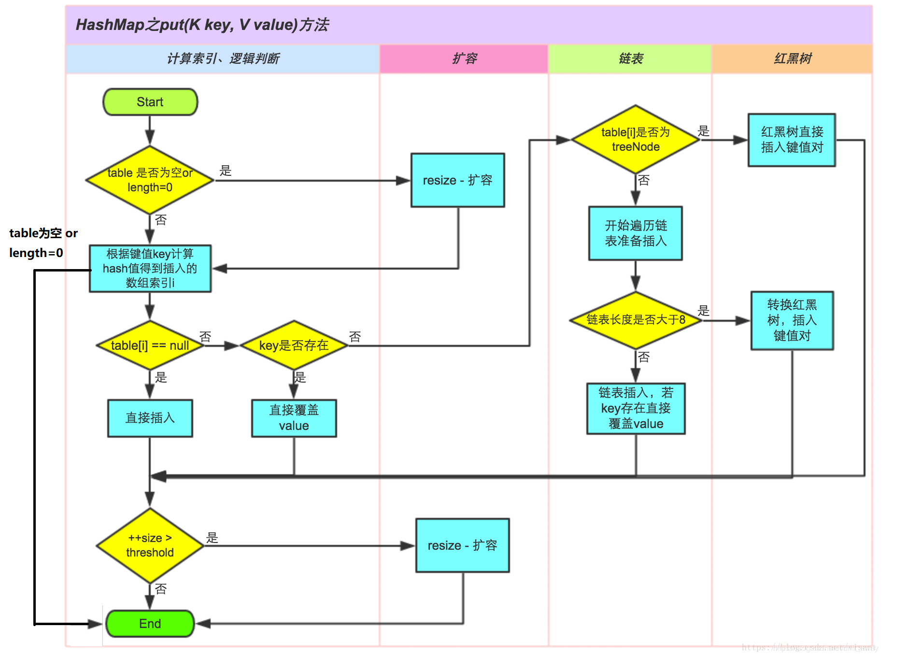

# HashMap

## 1. 底层数据结构

HashMap 主要用来存放`键值对`，它基于哈希表的Map接口实现，是常用的Java集合之一。

JDK1.8 之前 HashMap 由 数组+链表 组成的，`数组是 HashMap 的主体，链表则是主要为了解决哈希冲突而存在的`（“拉链法”解决冲突）.

<div align="center">  </div><br>

数组中的每个位置被当成一个桶，一个桶存放一个链表。

JDK1.8 以后在解决哈希冲突时有了较大的变化，当`链表长度`大于阈值（默认为 8）时，会先进行数组长度的判断，`如果当前数组的长度小于 64`，那么会选择先进行`数组扩容`。如果当前数组的长度大于64，且链表的长度大于8，则会转化为红黑树,具体可以参考 `treeifyBin`方法。

<div align="center">  </div><br>

知道了HashMap的底层结构，那HashMap怎么存放元素呢？

HashHashMap 会通过key的hashcode得到`散列值`，找到适当的位置插入（不是按照顺序直接插入，这样子很大程度`提高了查询的效率`）。具体的做法为： 通过 key 的 hashCode 经过`扰动函数`处理过后得到 hash 值，然后通过 (n - 1) & hash 【原理同hash % n】 判断当前元素`存放的位置`（这里的 n 指的是数组的长度），如果当前位置存在元素的话，就判断该元素与要存入的元素的 hash 值以及 key 是否相同，如果相同的话，`直接覆盖`，`不相同就通过拉链法解决冲突`。

所谓扰动函数指的就是 HashMap 的 hash 方法。使用扰动函数之后`可以减少碰撞`。JDK1.8 的扰动函数比 JDK1.7 更加简化。

JDK1.8

```java
    static final int hash(Object key) {
        int h;
        // key.hashCode()：返回散列值也就是hashcode
        // ^ ：按位异或
        // >>>:无符号右移，忽略符号位，空位都以0补齐
        return (key == null) ? 0 : (h = key.hashCode()) ^ (h >>> 16);
    }
```

这里有一个很有意思的地方，需要注意一下：`HashMap 允许插入键为 null 的键值对`。但是因为无法调用 null 的 hashCode() 方法，所以上面的代码指定了，`当key==null时，桶的下标为0`。

JDK1.7

```java
    static final int hash(Object key) {
        h ^= (h >>> 20) ^ (h >>> 12);
        return h ^ (h >>> 7) ^ (h >>> 4);
    }
```

## 2. 源码分析

### 2.1 类的属性

```java
public class HashMap<K,V> extends AbstractMap<K,V> implements Map<K,V>, Cloneable, Serializable {
    // 序列号
    private static final long serialVersionUID = 362498820763181265L;
    // 默认的初始容量是16
    static final int DEFAULT_INITIAL_CAPACITY = 1 << 4;
    // 最大容量
    static final int MAXIMUM_CAPACITY = 1 << 30;
    // 默认的填充因子
    static final float DEFAULT_LOAD_FACTOR = 0.75f;
    // 当桶(bucket)上的结点数大于这个值时会转成红黑树
    static final int TREEIFY_THRESHOLD = 8;
    // 当桶(bucket)上的结点数小于这个值时树转链表
    static final int UNTREEIFY_THRESHOLD = 6;
    // 桶中结构转化为红黑树对应的table的最小大小
    static final int MIN_TREEIFY_CAPACITY = 64;
    // 存储元素的数组，总是2的幂次倍
    transient Node<k,v>[] table;
    // 存放具体元素的集
    transient Set<map.entry<k,v>> entrySet;
    // 存放元素的个数，注意这个不等于数组的长度。
    transient int size;
    // 每次扩容和更改map结构的计数器
    transient int modCount;
    // 临界值 当实际大小(容量*填充因子)超过临界值时，会进行扩容
    int threshold;
    // 加载因子
    final float loadFactor;
```

### 2.2 put

对putVal方法添加元素的分析如下：

- 如果定位到的数组位置没有元素 就直接插入。
- 如果定位到的数组位置有元素就和要插入的key比较，如果key相同就直接覆盖，如果key不相同，就判断p是否是一个树节点，如果是就调用`e = ((TreeNode<K,V>)p).putTreeVal(this, tab, hash, key, value)`将元素添加进入。如果不是就遍历链表插入(插入的是链表尾部)。

```java
    public V put(K key, V value) {
        return putVal(hash(key), key, value, false, true);
    }

    final V putVal(int hash, K key, V value, boolean onlyIfAbsent,
                   boolean evict) {
        Node<K,V>[] tab;
        Node<K,V> p;
        int n, i;
        //先判断table是否存在，如果不存在，初始化扩容
        if ((tab = table) == null || (n = tab.length) == 0)
            n = (tab = resize()).length;
        //根据新增加的结点的哈希值，对应table所在位置，是否有结点，如果没有结点，直接放进去就可以
        //(n-1) & hash 同 hash % (n-1)的结果一样。但是这样子效率更高。但是，这个得保证（n-1）为全1
        if ((p = tab[i = (n - 1) & hash]) == null)
            tab[i] = newNode(hash, key, value, null);
        else {
            Node<K,V> e; K k;
            //如果有结点，判断该结点的key和新增加的key是否一样，如果一样，覆盖，如果不一样，继续遍历
            if (p.hash == hash &&
                ((k = p.key) == key || (key != null && key.equals(k))))
                e = p;
            //如果结点是TressNode，则按照红黑树的方式进行处理
            else if (p instanceof TreeNode)
                e = ((TreeNode<K,V>)p).putTreeVal(this, tab, hash, key, value);
            //否则，按照链表的方式进行处理
            else {
                //遍历链表
                for (int binCount = 0; ; ++binCount) {
                    //== null说明遍历到链表尾了，直接在链表尾插入结点
                    if ((e = p.next) == null) {
                        p.next = newNode(hash, key, value, null);
                        //判断临界值，需不需要将链表变成红黑树
                        if (binCount >= TREEIFY_THRESHOLD - 1) // -1 for 1st
                            treeifyBin(tab, hash);
                        break;
                    }
                    //如果在链表中遍历到了，p指向该结点，等待覆盖值
                    if (e.hash == hash &&
                        ((k = e.key) == key || (key != null && key.equals(k))))
                        break;
                    p = e;
                }
            }
            //覆盖值
            if (e != null) { // existing mapping for key
                V oldValue = e.value;
                if (!onlyIfAbsent || oldValue == null)
                    e.value = value;
                afterNodeAccess(e);
                return oldValue;
            }
        }
        ++modCount;
        if (++size > threshold)
            resize();
        afterNodeInsertion(evict);
        return null;
    }
```



这里额外提一下，jdk 1.7 使用链表的`头插法`，也就是新的键值对插在链表的头部，而不是链表的尾部。这和jdk1.8的不一样

### 2.3 resize

进行扩容，会伴随着一次`重新hash分配`，并且会遍历hash表中所有的元素，是`非常耗时`的。在编写程序中，要尽量避免resize。

**参数：**

和扩容相关的参数主要有：capacity、size、threshold 和 load_factor。

|    参数    |                                     含义                                      |
| :--------: | :---------------------------------------------------------------------------: |
|  capacity  |  table 的容量大小，默认为 16。需要注意的是 capacity 必须保证为 2 的 n 次方。  |
| loadFactor | 装载因子，table 能够使用的比例，**threshold = (int)(capacity* loadFactor)**。 |
| threshold  |    size 的临界值，当 **size** 大于等于 **threshold** 就必须进行扩容操作。     |
|    size    |                               **键值对数量。**                                |

**重点说一下loadFactor加载因子：**

loadFactor加载因子是控制数组存放数据的`疏密程度`，loadFactor`越趋近于1`，那么 `数组中存放的数据(entry)也就越多`，也就越密，也就是会让链表的长度增加，loadFactor越小，也就是`趋近于0`，`数组中存放的数据(entry)也就越少`，也就越稀疏。

loadFactor`太大导致查找元素效率低，太小导致数组的利用率低，`存放的数据会很分散。loadFactor的默认值为`0.75f`是官方给出的一个比较好的临界值。

给定的默认容量为 16，负载因子为 0.75。Map 在使用过程中不断的往里面存放数据，当数量达到了 16 * 0.75 = `12` 就需要将当前 16 的容量进行`扩容`，而扩容这个过程涉及到 rehash、复制数据等操作，所以`非常消耗性能`。

**源码分析：**

```java
    final Node<K,V>[] resize() {
        Node<K,V>[] oldTab = table;
        int oldCap = (oldTab == null) ? 0 : oldTab.length;
        int oldThr = threshold;
        int newCap, newThr = 0;
        if (oldCap > 0) {
            //如果超过最大值，就不再扩容了。发生碰撞也没有办法
            if (oldCap >= MAXIMUM_CAPACITY) {
                threshold = Integer.MAX_VALUE;
                return oldTab;
            }
            //如果没有超过最大值，newCap、newThr这两个值的大小应该为原来的2倍
            else if ((newCap = oldCap << 1) < MAXIMUM_CAPACITY &&
                     oldCap >= DEFAULT_INITIAL_CAPACITY)
                newThr = oldThr << 1; // double threshold
        }
        else if (oldThr > 0) // initial capacity was placed in threshold
            newCap = oldThr;
        else {               // zero initial threshold signifies using defaults
            //默认进行初始化
            newCap = DEFAULT_INITIAL_CAPACITY;
            newThr = (int)(DEFAULT_LOAD_FACTOR * DEFAULT_INITIAL_CAPACITY);
        }
        if (newThr == 0) {
            float ft = (float)newCap * loadFactor;
            newThr = (newCap < MAXIMUM_CAPACITY && ft < (float)MAXIMUM_CAPACITY ?
                      (int)ft : Integer.MAX_VALUE);
        }
        threshold = newThr;
        @SuppressWarnings({"rawtypes","unchecked"})
        Node<K,V>[] newTab = (Node<K,V>[])new Node[newCap];
        table = newTab;
        if (oldTab != null) {
            //扩容
            for (int j = 0; j < oldCap; ++j) {
                Node<K,V> e;
                if ((e = oldTab[j]) != null) {
                    oldTab[j] = null;
                    if (e.next == null)
                        //重新根据散列值计算位置
                        newTab[e.hash & (newCap - 1)] = e;
                    else if (e instanceof TreeNode)
                        //红黑树计算位置
                        ((TreeNode<K,V>)e).split(this, newTab, j, oldCap);
                    else { // preserve order
                        //链表计算位置
                        Node<K,V> loHead = null, loTail = null;
                        Node<K,V> hiHead = null, hiTail = null;
                        Node<K,V> next;
                        do {
                            next = e.next;
                            if ((e.hash & oldCap) == 0) {
                                if (loTail == null)
                                    loHead = e;
                                else
                                    loTail.next = e;
                                loTail = e;
                            }
                            else {
                                if (hiTail == null)
                                    hiHead = e;
                                else
                                    hiTail.next = e;
                                hiTail = e;
                            }
                        } while ((e = next) != null);
                        if (loTail != null) {
                            loTail.next = null;
                            newTab[j] = loHead;
                        }
                        if (hiTail != null) {
                            hiTail.next = null;
                            newTab[j + oldCap] = hiHead;
                        }
                    }
                }
            }
        }
        return newTab;
    }
```

**下标计算：**

在进行扩容时，需要把键值对`重新计算桶下标`，从而放到对应的桶上。在前面提到，HashMap 使用 `hash & capacity` 来确定桶下标。HashMap capacity 为 2 的 n 次方这一特点能够极大降低重新计算桶下标操作的复杂度。

假设原数组长度 capacity 为 16，扩容之后 new capacity 为 32：

```text
capacity     : 00010000
new capacity : 00100000
```

对于一个 Key，它的哈希值 hash 在第 5 位：

`为 0`，那么 hash%00010000 = hash & 00100000，`桶位置和原来一致`；
`为 1`，hash%00010000 = hash & 00100000 + 16，`桶位置是原位置 + 16`。

### 2.4 tableSizeFor

该函数是返回`大于输入参数且离该参数最近的2的整数次幂的数`。如参数为7，返回8；参数为12，返回16。

```java
    static final int tableSizeFor(int cap) {
        int n = cap - 1;
        n |= n >>> 1;
        n |= n >>> 2;
        n |= n >>> 4;
        n |= n >>> 8;
        n |= n >>> 16;
        return (n < 0) ? 1 : (n >= MAXIMUM_CAPACITY) ? MAXIMUM_CAPACITY : n + 1;
    }
```

先来分析有关n的位或（|=）操作部分：

先来假设n的二进制为01xxx...xxx（关注点：`最高位的1`）。  
接着对n右移1位：001xx...xxx，再位或：011xx...xxx  
对n右移2为：00011...xxx，再位或：01111...xxx  
此时前面已经有四个1了，再右移4位且位或可得8个1  
同理，有8个1，右移8位肯定会让后八位也为1。  
综上可得，该`算法让最高位的1后面的位全变为1`。  

最后再让结果n+1，即得到了2的整数次幂的值了。

现在再看`int n = cap - 1`:

让cap-1再赋值给n的目的是另找到的目标值大于或等于原值。例如二进制1000，十进制数值为8。如果不对它减1而直接操作，将得到答案10000，即16。显然不是结果。减1后二进制为111，再进行操作则会得到原来的数值1000，即8。

### 2.5 get

```java
    public V get(Object key) {
        Node<K,V> e;
        return (e = getNode(hash(key), key)) == null ? null : e.value;
    }

    final Node<K,V> getNode(int hash, Object key) {
        Node<K,V>[] tab; Node<K,V> first, e; int n; K k;
        //判断table是否为null,对应的位置的结点是否存在，不存在，直接返回null
        if ((tab = table) != null && (n = tab.length) > 0 &&
            (first = tab[(n - 1) & hash]) != null) {
            //判断第一个节点是不是需要找的值
            if (first.hash == hash && // always check first node
                ((k = first.key) == key || (key != null && key.equals(k))))
                return first;
            if ((e = first.next) != null) {
                //如果第一个节点不是要找的值，且节点为TreeNode
                if (first instanceof TreeNode)
                    return ((TreeNode<K,V>)first).getTreeNode(hash, key);
                //否则，按照链表方式进行处理
                do {
                    if (e.hash == hash &&
                        ((k = e.key) == key || (key != null && key.equals(k))))
                        return e;
                } while ((e = e.next) != null);
            }
        }
        return null;
    }
```

## 3. 测试用例

```java
    public static void main(String[] args) {

        Map<String, String> map = new HashMap<>();

        String v1 = map.put("李晨", "范冰冰");
        System.out.println("v1:" + v1);
        //print: v1:null【返回值为被替代的值】

        String v2 = map.put("李晨", "陈赫");
        System.out.println("v2:" + v2);
        //print: v2:范冰冰

        System.out.println(map);
        //print: {李晨=陈赫}

        String v3 = map.remove("李晨");
        System.out.println("v3:" + v3);
        //print: v3:陈赫

        String v4 = map.remove("李");
        System.out.println("v4:" + v4);
        //print: v4:null

        map.put("zz","yy");
        map.put("abc","xyz");
        System.out.println("get: " + map.get("z"));
        //print: get: null
        System.out.println("contains:"+ map.containsKey("zz"));
        //print: contains:true

        //遍历
        //keySet
        for (String key : map.keySet()) {
            System.out.println(key + "-->" + map.get(key));
        }
        //entrySet
        for (Map.Entry<String, String> entry : map.entrySet()) {
            System.out.println(entry.getKey()+"-->" + entry.getValue());
        }
        //直接输出
        System.out.println(map);

        //指定对象需重写hashCode和equal
        Person p1 = new Person("重地",20);
        Person p2 = new Person("重地",20);
        Person p3 = new Person("通话",20);
        System.out.println(p1.hashCode());
        System.out.println(p2.hashCode());
        System.out.println(p3.hashCode());
        //print:36562226【重地和通话的hashcode一样】
        //36562226
        //36562226

        HashMap<Person,String> personHashMap = new HashMap<>();
        personHashMap.put(p1,"重地");
        personHashMap.put(p2,"重地");
        personHashMap.put(p3,"重地");

        System.out.println(personHashMap);
        //print:{Person{name='重地', age=20}=重地, Person{name='通话', age=20}=重地}

        //key不允许重复，有序{a=d, c=c, b=b}
        LinkedHashMap<String,String> linkedHashMap = new LinkedHashMap<>();
        linkedHashMap.put("a","a");
        linkedHashMap.put("c","c");
        linkedHashMap.put("b","b");
        linkedHashMap.put("d","d");
        System.out.println(linkedHashMap);

    }
```

## 4. 参考资料

- HashMap源码（jdk 1.8）
- [Java 容器概览](https://cyc2018.github.io/CS-Notes/#/notes/Java%20%E5%AE%B9%E5%99%A8?id=%e4%b8%80%e3%80%81%e6%a6%82%e8%a7%88)
- [HashMap分析](https://snailclimb.gitee.io/javaguide/#/docs/java/collection/HashMap?id=resize%e6%96%b9%e6%b3%95)
- [HashMap的工作原理以及存取过程](https://blog.csdn.net/drift_away/article/details/84882491)