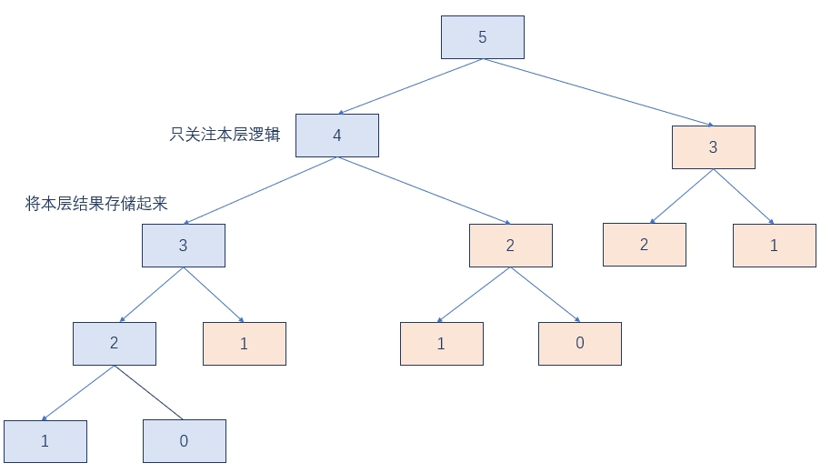
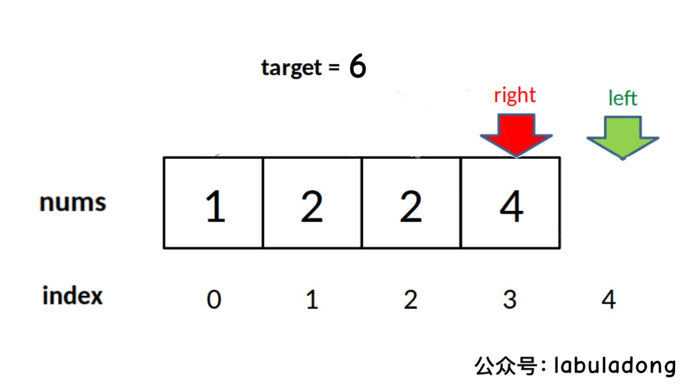

# 思考总结

## 误区

做算法的最大误区是只做一遍。

## 怎么做

1. 经典算法每道题至少做5遍
2. 做leetcode要更关注时间，而非内存
3. 做完题后要反馈（解题，国际站解题）

## 方法和经验总结✨

1. 升维：从一维到二维
2. 空间换时间

| 数据结构/算法 | 要点                                                                                                                                                                                                               |
| :-----------: | :----------------------------------------------------------------------------------------------------------------------------------------------------------------------------------------------------------------- |
|     数组      | 将数组`排序`<br><br>`双指针`:<br><br>`夹逼`定理，通过夹逼可以剪掉很多无意义的答案。<br><br>`二分法`                                                                                                                |
|     链表      | head创建一个新的结点，return head.next                                                                                                                                          / return head <br><br> head == cur |  | pre = node |
|     递归      | `模板`<br><br>决策的时候，可以从小问题推到大问题<br><br>`明白一个函数的作用并相信它能完成这个任务【递归进入下一层】`                                                                                               |
|      树       | 结果为返回值【全局变量】 recur另起函数写 （参数是对象还是值，对象注意添加用new，清理时需回退）<br><br> 根据参数确定终止条件<br><br>想想局部变量用不用判断<br><br>递归只关注本层                                    |
|      栈       | <br>处理的问题的`有最近相关性`时可以尝试用栈。（因为栈压入和弹出都是最近的元素）。`有洋葱结构时`(如括号匹配({[]}))<br><br>                                                                                         |
|    哈希表     | `key不能重复，通过key快速找到value。`                                                                                                                                                                              |
|     回溯      | 求最值。递归时，`直接遍历到树底`，然后回溯，选择另一个决策。【回溯的结果是`终点-叶子`，分治的结果是`树根`】                                                                                                        |
|   二分查找    | <br>1. 存在单调递增/递减<br> 2. 有上下界 <br> 3. 能够通过索引访问 <br><br>`排序后的数组[0 - length - 1]`                                                                                                                      |
|   动态规划    | 多阶段决策最优解<br><br>1. 这一阶段所做的决策<br>2. 状态：是原问题和子问题的变量【变化的东西】，得到状态转移<br>3. 最优解                                                                                          |

**在懵逼的时候**：

1. 尝试暴力解法。【`寻找重复的操作`】
2. 寻找重复的操作，因为程序底层就`只有循环(for，while)，判断(if)和递归`

面试中肯定可以找到重复子问题，代码一般在10~40行之间。

**寻找更优的解法：**

1. 去除重复子（动态规划）
2. 去点无意义的计算（递归的剪枝）
3. 升维，空间换时间

## 解题规范

面试的时候要注意切题四件套：

1. 创建返回值
2. 对传进来的参数进行判断
3. 如果有需要，对for进行判断
4. for的时候，如果不满足条件 continue
5. 警惕数组越界，栈等其他数据结构为空的时候

## 解题模板

### 1. 数组数组双指针

双指针同向遍历：

```java
//-1可以理解为减掉一个位置（个数）
for(int i = 0; i < nums.length - 1; i++){
    for(int j = i + 1; j < nums.length; j++){
        ·····
    }
}
```

双指针向中间聚拢

```java
int left = 0;
int right = nums.length - 1;
while(left < right){
    while(····){
        ·····
        left++;
    }
    while(····){
        ·····
        right++;
    }
}
```

双指针向两边扩散

```java
for(int i = 0; i < nums.length; i++){
    int left = i - 1;
    int right = i + 1;
    while(left >= 0 && ····){
        ·····
        left--;
    }
    while(right <= nums.length - 1 && ····){
        ·····
        right++;
    }
}
```

### 2. 递归

```java
返回值着手【全局变量void】 recur(处理对象（数组+index，多个下标）， 处理的结果【是对象还是值，对象注意添加用new，清理时需回退】){
    //终止条件
    if(终止条件){
        返回最小问题的结果； / 如果处理的结果是全局变量，看看是否取到最优值
    }
    if(mem[index] != 0){
        备忘录模式
    }

    //处理当前的逻辑
    判断 / 决策

    //下探到下一层
    //子问题的处理方式跟本层的一样
    if(如果需要剪枝，可以加判断){
        mem[index] = dfs(···);
    }
    if(){
        可以有多个递归。比如回溯，直接回溯到最底层，然后这里再进入另一条分支。【同树的的遍历】
    }

    //清理后面层的脏数据
    如果处理的结果是全局变量，则需要恢复成正确的全局变量。
}
```

### 3. 记忆化搜索



### 4. 多叉树、暴力法

如果不是二叉树，而是多叉树，或者是决策树（多个分支），将左右子树遍历替换为for遍历全部结点

```java
HashSet<Integer> visited;

void dfs(node){
    //终止条件
    if(visited.contains(node)){
        return;
    }

    visited.add(node)

    //正如之前递归说的，
    for(next_node : node.childern){
        if(!visited.contains(node)){
            dfs(next_node);
        }
    }
}
```

### 5. 二分查找

> 参考链接：<https://labuladong.gitbook.io/algo/suan-fa-si-wei-xi-lie/er-fen-cha-zhao-xiang-jie#ling-er-fen-cha-zhao-kuang-jia>

`终止条件为：left = right + 1;` ，即 left <= right

传统二分查找

```java
int binary_search(int[] nums, int target){
    int left = 0;
    //right固定写法，这样子确定了查找区间为[left, right]左闭右闭
    int right = nums.length - 1;

    //左闭右闭[left, right]决定left <= right
    while(left <= right){
        //固定写法
        int mid = left + (right - left) / 2;
        if(nums[mid] < target){
            left = mid + 1;
        }else if(nums[mid] > target){
            right = mid - 1;
        }else if(nums[mid] == target){
            //直接返回
            return mid;
        }
    }

    //直接返回
    return -1;
}
```

**寻找左侧边界的二分搜索:**

比如说给你有序数组 nums = [1,2,2,2,3]，target 为 2，此算法返回的索引是 2，没错。但是如果我想得到 target 的左侧边界，即索引 1

```java
int left_bound(int[] nums, int target){
    int left = 0;
    int right = nums.length - 1;

    while(left <= right){
        int mid = left + (right - left) / 2;
        if(nums[mid] < target){
            left = mid + 1;
        }else if(nums[mid] > target){
            right = mid - 1;
        }else if(nums[mid] == target){
            //别返回，收缩左侧边界，使得最后的right落在target的左边
            right = mid - 1;
        }
    }

    //最后检查left是否越界
    //如果不越界，right指向（最左边的）target的左边一个元素，left指向（最左边的）的target
    //注意，left >= nums.length
    if(left >= nums.length || nums[left] != target){
        return -1;
    }
    return left;
}
```

越界情况:



**寻找右侧边界的二分搜索:**

比如说给你有序数组 nums = [1,2,2,2,3]，target 为 2，此算法返回的索引是 2，没错。但是如果我想得到 target 的右侧边界，即索引 3

```java
int right_bound(int[] nums, int target){
    int left = 0;
    int right = nums.length - 1;
    while(left <= right){
        int mid = left + (right - left) / 2;
        if(nums[mid] < target){
            left = mid + 1;
        }else if(nums[mid] > target){
            right = mid - 1;
        }else if(nums[mid] == target){
            //别返回，收缩右侧边界
            left = mid + 1;
        }
    }

    //最后要检查right越界的情况
    if(right < 0 || nums[right] != target){
        return -1;
    }
    return right;
}
```

### 6. 链表

```java
//新将一个结点，这个结点的next指向原链表的头结点
Node res = new Node(-1);
res.next = head;
····
return res.next;

//cur != null 遍历链表
Node cur = res.next;
while(cur != null){
    ····
    //指向next
    cur = cur.next;
}

//如果有指向next.next，需要进行判断，如：
cur = (cur.next == null) ? null : cur.next.next;
```

### 7. 动态规划

思路：

`变化的变量` ==》  
【递归树，有没有重叠子】暴力 + 剪枝 ==》  
看当前层【`最终目标`】的情况下，能不能找到`状态转移方程` ==》  
利用dp,判断是正向遍历还是怎么遍历 ==》
写的时候注意“状态转移方程要写对” + “下标要注意下”

重叠子 + 最优子 + 状态转移方程

**注意，在写DP时，遍历是正向遍历呢，反向遍历呢，还是斜线遍历呢？取决于：**

1. 遍历的过程中，**所需的状态必须是已经计算出来的**【状态转移】
2. 遍历的**终点**必须是存储结果的那个位置

**记忆化：**

```java
private int recur(int index){
    //递归终止条件
    if(  ){
        return XX;
    }else if( ){
        //可能根据不同的条件 return不同的值
        return XX;
    }

    //记忆化返回
    if(mem[index] != 0){
        return mem[index];
    }

    //假设求的是最小值
    int min = Integer.MAX_VALUE;
    //递归树 的不同选择
    for(int coin : coins){
        if(  ){
            min = XX;
        }
    }
    //写入dp
    mem[index] = min == Integer.MAX_VALUE ? -1 : 0;

    //返回
    return mem[index]
}
```

**dp:**

```java
int[] dp = new int[XX + 1];
//初始化
Arrays.fill(dp, XX);
dp[0] = 0;

for(int i = 1; i < XX; i++){
    for(int coin : coins){
        if(  ){
            dp[i] = Math.min(XX);
        }
    }
}

return dp[XX];
```