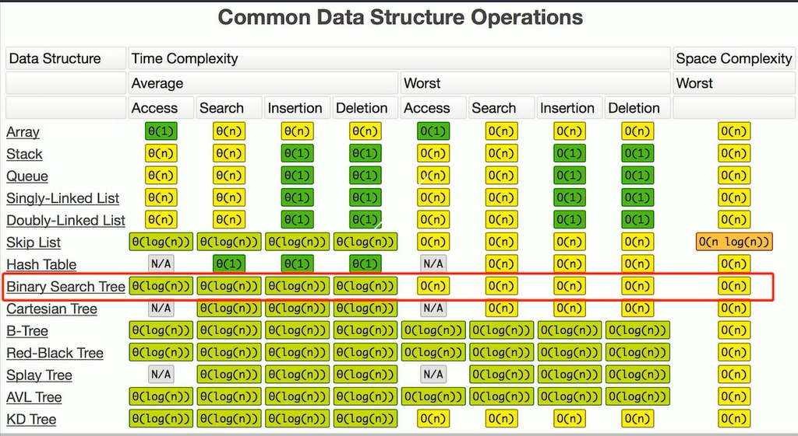

# 目录

- [总览](_source/算法/总览.md)  
- [数组](_source/算法/数组.md)
- [链表](_source/算法/链表.md)
- [栈](_source/算法/栈.md)
- [队列](_source/算法/队列.md)
- [哈希表](_source/算法/哈希表.md)
- [树](_source/算法/树.md)
- [递归](_source/算法/递归.md)
- [回溯算法思想](_source/算法/回溯思想.md)
- [贪心算法思想](_source/算法/贪心思想.md)

