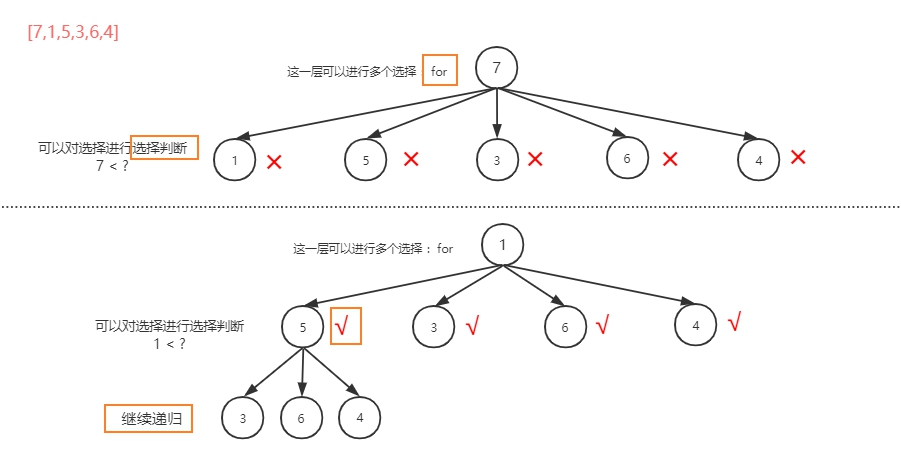

# 回溯算法思想

## 1. 简介

回溯思想，当一条路走不通，通过回溯的方法，回到之前的岔路口，选择另一条路。当然，这是一种暴力求法，时间复杂度特别高。

回溯思想应用非常广泛。深度优先搜索算法，软件开发场景中的正则表达式匹配，编译原理中的语法分析，数独、八皇后、0-1背包、图的着色、旅行商问题、全排列等等都用到了回溯算法思想。

笼统地讲，回溯算法很多时候都应用在“搜索”这类问题上。不过这里说的搜索，并不是狭义的指我们前面讲过的图的搜索算法，而是`在一组可能的解中，搜索满足期望的解`

## 2. 算法框架

解决一个回溯问题，实际上就是一个`决策树`的遍历过程。【使用递归的方法】

需要思考三个问题：

1. 路径：也就是已经做出的选择。【也将是`最终的结果`】
2. 选择列表：也就是你当前可以做的选择。【`在递归的这一层，你可以做出的选择 / 你有多少条路`】
3. 结束条件：也就是到达决策树底层，无法再做选择的条件。【添加结果】


回溯算法框架：

```java
result = [];
def backtrack(路径，选择列表);
    if 满足条件:
        result.add(路径)
        return

    for 选择 in 选择列表:
        做选择
        backtrack(路径，选择列表)
        撤销选择
```

`其核心思想，就是在for里面递归，在递归调用之前【做选择】，在递归调用之后【撤销选择】`

## 3. 案例

### 3.1 买卖股票的最佳时机

#### 题目链接

[122\. 买卖股票的最佳时机 II](https://leetcode-cn.com/problems/best-time-to-buy-and-sell-stock-ii/)

#### 题目描述

Difficulty: **简单**

给定一个数组，它的第 _i_ 个元素是一支给定股票第 _i_ 天的价格。

设计一个算法来计算你所能获取的最大利润。你可以尽可能地完成更多的交易（多次买卖一支股票）。

**注意：**你不能同时参与多笔交易（你必须在再次购买前出售掉之前的股票）。

**示例 1:**

```
输入: [7,1,5,3,6,4]
输出: 7
解释: 在第 2 天（股票价格 = 1）的时候买入，在第 3 天（股票价格 = 5）的时候卖出, 这笔交易所能获得利润 = 5-1 = 4 。
     随后，在第 4 天（股票价格 = 3）的时候买入，在第 5 天（股票价格 = 6）的时候卖出, 这笔交易所能获得利润 = 6-3 = 3 。
```

**示例 2:**

```
输入: [1,2,3,4,5]
输出: 4
解释: 在第 1 天（股票价格 = 1）的时候买入，在第 5 天 （股票价格 = 5）的时候卖出, 这笔交易所能获得利润 = 5-1 = 4 。
     注意你不能在第 1 天和第 2 天接连购买股票，之后再将它们卖出。
     因为这样属于同时参与了多笔交易，你必须在再次购买前出售掉之前的股票。
```

**示例 3:**

```
输入: [7,6,4,3,1]
输出: 0
解释: 在这种情况下, 没有交易完成, 所以最大利润为 0。
```

#### Solution

`注意，此题使用回溯法时间复杂度很高，会导致超时，只能说，可以通过此题看看如何利用回溯思想解决问题。`

更好的解法看：[122.买卖股票的最佳时机II](_source/算法/122.买卖股票的最佳时机II.md)

---

我们先来看看一种`加了剪枝`的回溯。



```java
class Solution {
    //最大利润，也即最终利润。因为函数已经命名为maxProfit了，故这里命名为finalProfit
    int finalProfit = 0;
    //递归选择的这条路径的利润
    int currentprofit = 0;

    public int maxProfit(int[] prices) {
        //特殊情况处理
        if(prices.length == 0) return 0;

        //调用递归
        dfs(prices, 0);
        //返回最终结果
        return finalProfit;
    }

    //路径结果：finalProfit和currentProfit的比较。因为这里的结果只有一个，所以递归的参数可以不用加上“路径结果”
    //选择列表：我这一层能做的选择，price[index]之后的数字是可以给这一层选择的
    void dfs(int[] prices, int index){
        //走到树底，判断是否是当前的最优解
        if(index == prices.length - 1){
            finalProfit = Math.max(currentprofit,finalProfit);
            return;
        }

        //选择条件,【在这一层，选择我想要的，可以有多个结果】，这里就决定了我可以尝试走所有的路了
        for(int i = index + 1; i < prices.length; i++){
            //条件判断，进行选择
            if(prices[i] > prices[index]){
                //走这一条路此时可以获得的利润
                int p = prices[i] - prices[index];
                currentprofit += p;
                //继续递归
                dfs(prices, i);
                //回溯
                currentprofit -= p;
            }
        }

        //可以从不同的起点开始
        dfs(prices, index + 1);
    }
}
```

我们再来看一种没有剪枝的回溯。`没有剪枝的回溯相当于深度优先遍历，是看着递归树写出的代码。`


```java
public class Solution {

    private int res;

    public int maxProfit(int[] prices) {
        int len = prices.length;
        if (len < 2) {
            return 0;
        }
        this.res = 0;
        dfs(prices, 0, len, 0, res);
        return this.res;
    }

    /**
     * @param prices 股价数组
     * @param index  当前是第几天，从 0 开始
     * @param status 0 表示不持有股票，1表示持有股票，
     * @param profit 当前收益
     */
    private void dfs(int[] prices, int index, int len, int status, int profit) {

        if (index == len) {
            this.res = Math.max(this.res, profit);
            return;
        }

        dfs(prices, index + 1, len, status, profit);

        if (status == 0) {
            // 可以尝试转向 1。假设输入[1,5]，这一层是-1，到下一层，因为status变成1，执行else,profit = -1 + 5 = 4;
            dfs(prices, index + 1, len, 1, profit - prices[index]);

        } else {
            // 此时 status == 1，可以尝试转向 0
            dfs(prices, index + 1, len, 0, profit + prices[index]);
        }
    }
}
```

### 3.1 八皇后问题

#### 题目描述

[51\. N皇后](https://leetcode-cn.com/problems/n-queens/)

#### 题目链接

Difficulty: **困难**

_n_皇后问题研究的是如何将_n_ 个皇后放置在 _n_×_n_ 的棋盘上，并且使皇后彼此之间不能相互攻击。


<small style="display: inline;">上图为 8 皇后问题的一种解法。</small>

给定一个整数 _n_，返回所有不同的 _n _皇后问题的解决方案。

每一种解法包含一个明确的 _n_ 皇后问题的棋子放置方案，该方案中 `'Q'` 和 `'.'` 分别代表了皇后和空位。

**示例:**

```text
输入: 4
输出: [
 [".Q..",  // 解法 1
  "...Q",
  "Q...",
  "..Q."],

 ["..Q.",  // 解法 2
  "Q...",
  "...Q",
  ".Q.."]
]
解释: 4 皇后问题存在两个不同的解法。
```

#### Solution

Language: **Java**

```java
​vector<vector<string>> res;

/* 输入棋盘边长 n，返回所有合法的放置 */
vector<vector<string>> solveNQueens(int n) {
    // '.' 表示空，'Q' 表示皇后，初始化空棋盘。
    //这是res的一种解法
    vector<string> board(n, string(n, '.'));
    //调用递归
    backtrack(board, 0);
    return res;
}

// 路径：board 中小于 row 的那些行都已经成功放置了皇后。
//      board: 因为此题可能有多种解法，所以需要将board作为参数传进去，如果解法成立，则res.add(board)
// 选择列表：第 row 行的所有列都是放置皇后的选择
// 结束条件：row 超过 board 的最后一行
void backtrack(vector<string>& board, int row) {
    // 触发结束条件
    if (row == board.size()) {
        //添加一种解法
        res.push_back(board);
        return;
    }

    int n = board[row].size();
    //选择
    for (int col = 0; col < n; col++) {
        // 排除不合法选择
        if (!isValid(board, row, col))
            continue;
        // 做选择
        board[row][col] = 'Q';
        // 进入下一行决策
        backtrack(board, row + 1);
        // 撤销选择
        board[row][col] = '.';
    }
}

/* 是否可以在 board[row][col] 放置皇后？ */
bool isValid(vector<string>& board, int row, int col) {
    int n = board.size();
    // 检查列是否有皇后互相冲突
    for (int i = 0; i < n; i++) {
        if (board[i][col] == 'Q')
            return false;
    }
    // 检查右上方是否有皇后互相冲突
    for (int i = row - 1, j = col + 1;
            i >= 0 && j < n; i--, j++) {
        if (board[i][j] == 'Q')
            return false;
    }
    // 检查左上方是否有皇后互相冲突
    for (int i = row - 1, j = col - 1;
            i >= 0 && j >= 0; i--, j--) {
        if (board[i][j] == 'Q')
            return false;
    }
    return true;
}
```

#### 复杂度

时间复杂度：O(N!). 放置第 1 个皇后有 N 种可能的方法，放置两个皇后的方法不超过 N (N - 2) ，放置 3 个皇后的方法不超过 N(N - 2)(N - 4) ，以此类推。总体上，时间复杂度为 O(N!) .

空间复杂度：O(N) . 需要保存对角线和行的信息。

## 4. 回溯算法思想的思考

某种程度上说，`动态规划的暴力求解阶段就是回溯算法`。只是有的问题具有重叠子问题性质，可以用 dp table 或者备忘录优化，将递归树大幅`剪枝`，这就变成了动态规划。而今天的两个问题，都没有重叠子问题，也就是回溯算法问题了，复杂度非常高是不可避免的。
