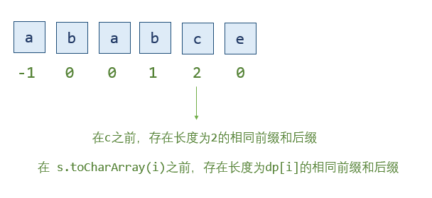
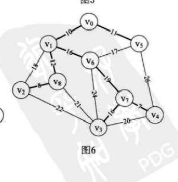
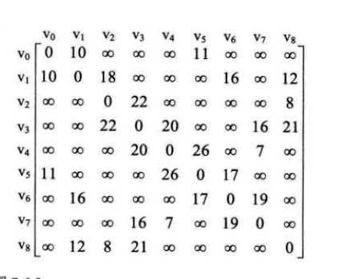
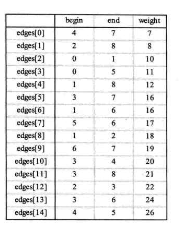
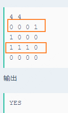
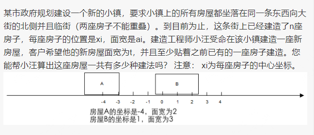
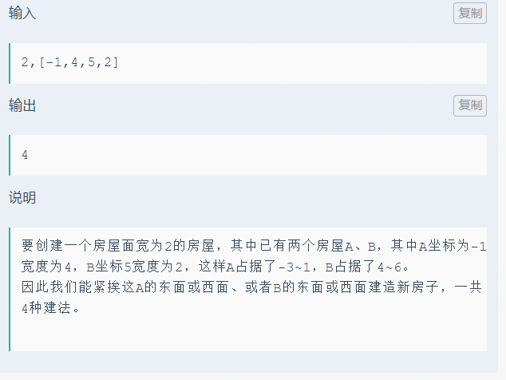
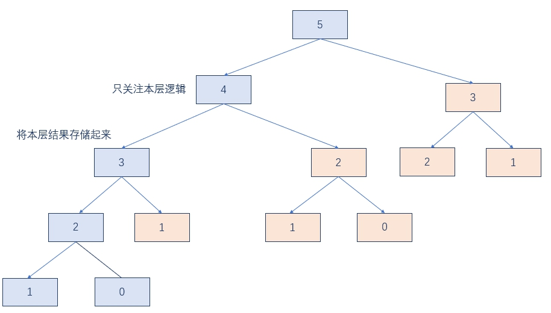
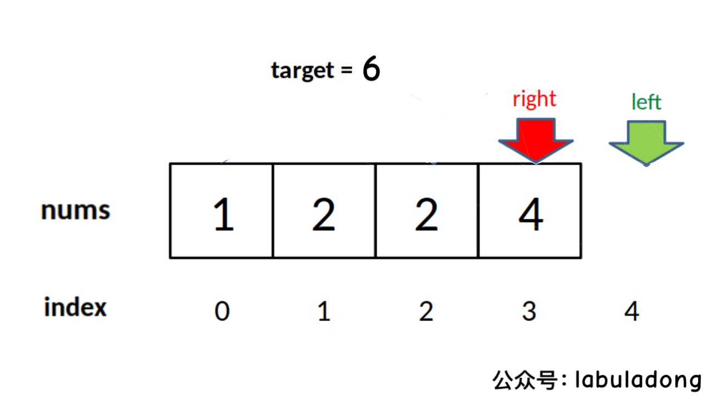
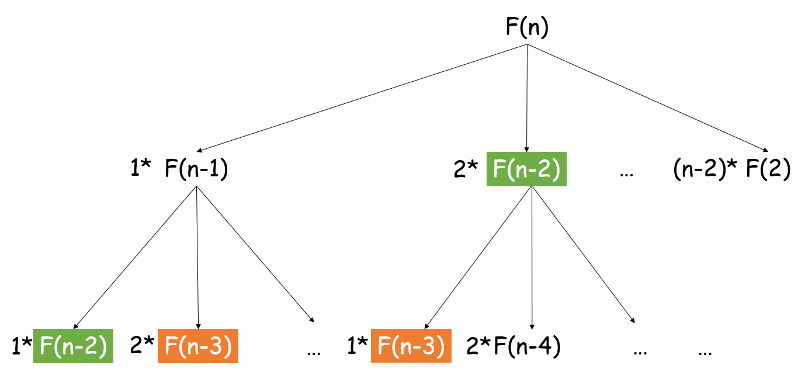

### 手撕代码容易犯错的点

需要内心宁静。

1. 一定要先画图！
2. 想着画的图，一步一步的写，写的时候，确定自己是不会写错
3. 加上必要的备注，我要注意哪些数据结构； 求max的时候，max要备注，`return max == Integer.MIN_VALUE ? 0 : max;`
4. 手撕代码的时候，要注意对象用 equals， 而不是 ==

---

1. 链表递归的时候，有的题在 if(node.left == null && node.right == null) 的时候就可以做判断了


### 思路


##### 全排列 +  组合

1. 联想递归树 + 递归树的每一层是 最终结果的第 i 个元素 + 后面的元素可选择的数，构成了 分支
2. 每一层 用`递归(以最终的结果去想)` + 可选择 使用 for （for 里面使用`剪枝`）。 `递归：肯定是有 recur的。想想本层的操作是在recur前，还是后。`


leetcode 39, 40, 46, 47, 78, 90

回溯，从根节点出发进行遍历。 

组合：根节点是[], 进行添加元素。 recur参数中需要保存 start ，作为 for的起始位置

子集：参数中用 start, sum

全排列：去重使用 visited[]

---

##### 给一堆（最多15）有价值的东西，均分给2个人，均分不了的，扔掉，求最小扔掉多少

1. 以 `东西（以已经存在的东西 作为树的高度，每一个东西都可以分给其他人）` 去角度去想

2. 一个东西，可以分给 第一个人，或者 分给 第二个人， 或者选择 丢掉

3. 也是类似全排列、组合的思想，利用 `回溯 + 剪枝`

   ```java
   // 核心的 回溯 + 剪枝
   
   // 目标值
   private int minRes = Integer.MAX_VALUE;
   // 剪枝， maxPoint = sum / 2;
   private int maxPoint = Integer.MIN_VALUE;
   
   private void recur(int[] nums, int floor, int sum1, int sum2, int sum3) {
           if (floor == nums.length) {
               if (sum1 == sum2) {
                   minRes = Math.min(minRes, sum3);
               }
               return;
           }
   
           // 一开始是写成 多个 for， 其实没有跟 i 扯上关系的话，直接多个递归就就可以了
           // for (int i = 1; i <= 3; i++) {
               // if (i == 1 && sum1 < maxPoint) {
               //     sum1 += nums[floor];
               //     recur(nums, floor + 1, sum1, sum2, sum3);
               //     sum1 -= nums[floor];
               // } else if (i == 2 && sum2 < maxPoint) {
               //     sum2 += nums[floor];
               //     recur(nums, floor + 1, sum1, sum2, sum3);
               //     sum2 -= nums[floor];
               // } else if (i == 3 && sum3 < maxPoint) {
               //     sum3 += nums[floor];
               //     recur(nums, floor + 1, sum1, sum2, sum3);
               //     sum3 -= nums[floor];
               // }
           // }
   
           // 剪枝
           if (sum1 < maxPoint) {
               recur(nums, floor + 1, sum1 + nums[floor], sum2, sum3);
           }
           if (sum2 < maxPoint) {
               recur(nums, floor + 1, sum1, sum2 + nums[floor], sum3);
           }
           if (sum3 < maxPoint) {
               recur(nums, floor + 1, sum1, sum2,sum3 + nums[floor]);
           }
       }
   ```


---

##### 鸡蛋掉落

1. 现在有 k个鸡蛋，n层楼，找到 f需要的最小移动次数。 f 此时是任意的值
2. 所以其实这道题有 三个状态。 (k, n)的状态转化 可以根据 碎/没碎 得到状态转换方程。 (k, n) = 碎(k - 1, n - 1), 不碎(k, floor - i)。 此时，我们还不知道从哪层楼丢下，所以 floor 是 遍历 n
3. 利用递归写代码

---


##### 水壶问题

1. 有一个 x升 y升的水壶，允许有三种操作， 装满，清空，倒水
2. 这三种操作分别代表了状态转移。使用AbstractMap.SimpleMap<Integer, Integer> entry 可以用来存放 两个水壶的水。
3. 利用 HashSet 去重
4. 每一个水壶 -> 可以进行状态转移，利用 广度优先搜索，使用数据结构 Queue

---


##### 地图分析

1. 0 是海洋，1是陆地，找到距离所有陆地 最远的海洋。
2. 广度优先搜索，因为找的是海洋，所以把所有的陆地加入队列
3. 目的是求 距离，因此我们可以稍微改一下原来的数组， 将 >1 设置为海洋， 数值代表距离。

---


##### 数组中的第k大元素

1. 用堆或者快排
2. 当 k > len / 2, 利用最大堆， 否则，使用最小堆

---


##### 合并 k 个有序的链表

1. 利用最小堆：将所有的链表的头加入堆，取得最小的值，最小的堆指向下一个元素

2. 利用归并：devide + merge

3. merge 中核心算法为  （不能使用 dummyHead ）

   ```java
   	if (node1.val < node2.val) {
           node1.next = merge(node1.next, node2);
           return node1;
       } else {
           node2.next = merge(node1, node2.next);
           return node2;
       }
   ```

---


##### 两个字符串相加

1. str1 和 str2 不包含前导零，不能使用 库函数
2. 转换成 chars,  尾部对齐相加，如果 index < 0， 则默认为 '0'

---


##### 用队列描述栈

1. 直接将 栈 描述成 队列
2. 当加入一个元素的时候，这个元素位于 队列的头，前面的元素都重新入队。这样，队列的 peek()，poll() 对应的就是栈的peek() poll()

---


##### 删除排序链表中重复的数组

1. point 指针指向的值 value, 查找下一个节点，和 value 的值不一样
2. 进行整体的移动

---


##### 最长回文子串

1. 回文子串 有着天然的动态转换方程。 `if (chars[i] == chars[j]) 判断boolean` 
2. 利用动态规划 判断是不是回文子串  -> 二维数组

---


##### 反转字符串中的单词

1. 指针 + swap

---


##### 两个数的交集

1. 如果重复数字都要算的话：HashMap + 结果用 ArrayList 进行存放
2. 如果重复数字只算一个的话： HashSet + 结果用 HashSet 进行存放

---


##### 使用 迭代 实现二叉树的后序遍历

1. 使用栈，后序遍历的递归顺序是 [.left, .right, .val]，`入栈的顺序需要反着来`，为 [.val, .right, .left]
2. 如果是 值输出的话，在值前面 加上一个 null

---


##### 二叉树的直径

1. 二叉树的直径是由边来决定的
2. `先递归，再进行处理`。

---


##### 找出 0 .. *n* 中没有出现在序列中的那个数

1. 利用 求和公式 - sum。 a1 * n + n * (n - 1)  * d / 2
2. 利用一个桶一个位置的思想
3. 二分

---


##### 最长连续序列

1. 利用 HashMap + 边界感染的思想

---


##### 最长上升子序

1. O(n logn)的解法：  动态规划 tail[]， tail长度为最长上升子序列的长度。
2. 使用二分法更新 tail[]数组

---


##### x的平方根

1. 利用二分查找
2. 如果题目需要 long 的话，记得不要写错

---


##### "hello" 中匹配 "ll" 出现的位置

1. kmp算法，对 "ll"求 next数组


- **相同的前缀和后缀**



```java
// getNext数组中

int j = -1, i = 0;
// 这里要记得是 len - 1，否则会数组越界
while (i < len - 1) {
    if (j == -1 || s.toCharArray(i) == s.toCharArray(j)) {
        // 如果s.toCharArray(i) = s.toCharArray(j)，那么next[i+1] = j+1，此时表示s.toCharArray(i + 1)之前的子串中，存在长度为j+1的相同前后缀
        i++;
        j++;
        next[i] = j;
    }
}
```


---


##### 两个数相加，这两个数用链表表示，返回的结果也是一个链表

1. 需要保留前面的，`从后面加起，所以利用栈`
2. 返回的结果也是需要链表，链表使用头插法

---


##### 无重复的最长子串

1. 利用滑窗，HashMap存放下标。
2. 利用 HashMap 存放下标的优势，进行一个加速

---


##### SHEIN：最小覆盖子串

1. 需要两个HashMap + match的时候，可以做下简化。 用 int[] map = new int[256], 对第二个字符串++， 遍历第一个的时候--， match 为 第二个字符串的长度。

   ```java
   public String minWindow(String s, String t) {
           if (s == null || t == null) return null;
           
           int[] map = new int[256];
           for (char c : t.toCharArray()) {
               map[c]++;
           }
           int match = t.length();
           int left = 0, minLen = Integer.MAX_VALUE, resLeft = 0;
           char[] chars = s.toCharArray();
           // map 驱动 match == 0 驱动 left, minLen, resLeft
           for (int right = 0; right < chars.length; right++) {
               char c = chars[right];
               map[c]--;
               if (map[c] >= 0) {
                   match--;
               }
               
               if (match == 0) {
                   while (map[chars[left]] < 0) {
                       map[chars[left]]++;
                       left++;
                   }
                   if (minLen > right - left + 1) {
                       minLen = right - left + 1;
                       resLeft = left;
                   }
                   map[chars[left]]++;
                   match++;
                   left++;
               }
           }
           return minLen == Integer.MAX_VALUE ? "" : s.substring(resLeft, resLeft + minLen);
       }
   ```

   

---

##### 最大连续1的个数 III

<https://leetcode-cn.com/problems/max-consecutive-ones-iii/>

利用滑动窗口，在这个窗口中，允许有多少个1

---


##### 盛最多水的容器

1. 双指针夹逼
2. 如果说 长缩小，则高一定要增大，利用这个进行 加速

---


##### 接雨水

1. 解法一：单调递减栈： 当 当前的元素不符合单调递减的时候，先把栈顶的元素先出栈，如果栈非空，且存在 height[stack.peek()] > height[curIndex]，说明存在凹坑。
2. 按列求，对于该列，找到 该列左边的最大列，右边的最大列，进行求值

---


##### 三数之和

1. 先进行排序
2. 确定一个数作为枢纽，然后利用双指针

---


##### 两数之和

1. 排序 + 双指针
2. HashMap + 一次遍历


##### 移动0

1. swap

---


##### 有效括号的嵌套深度

1. 将其分成两个不相交的有效括号字符串，`A` 和 `B`，并使这两个字符串的深度最小。
2. 利用贪心算法，相邻的 '(' 分配给不同的组

---


##### 爬楼梯

1. 动态规划

---


##### 有效的括号

1. 利用栈
2. 如果遍历到的是 '('，向栈加入 ')'，再判断 `stack.top() == c`

---


##### 最小栈

1. 两个栈

---


##### 柱状图中最大的矩形

1. 以列求，双指针扩散
2. 单调栈。`单调栈 pop() 出来的值，和 现在的 peek()的值息息相关，pop()作为高度，peek()作为长度`

---


##### 有效的字母异位词

1. 排序
2. HashMap， 一个 ++， 一个-- ，或者使用中间量 match

---


##### 有效的字母异位分组

1. `HashMap<String, ArrayList<String>()>`，key 为排序后的值。

---


##### 给定一个String，用String构造一个最长的回文子串

1. 统计个数
2. cnt = (entry.get(i) / 2 * 2);   if (entry.get(i) % 2 == 1 && cnt % 2 == 0) cnt++;

---


##### 零钱兑换

1. coins， amount，问最少能用多少个硬币凑成 amount？
2. coins 只能用来状态转换
3. 还有状态没有确定。 dp[i] 代表凑成 重量为 i，需要多少个硬币。
4. --- 分割线---
5. 另一种方式是，状态是 第 i 个硬币做决策

---

##### 拼凑硬币

给你六种面额1、5、10、20、50、100元的纸币，假设每种币值的数量都足够多，编写程序求组成N元（N为0-10000的非负整数）的不同组合的个数。


<https://www.nowcoder.com/questionTerminal/14cf13771cd840849a402b848b5c1c93>

状态的变化是”硬币的组合“，而不是硬币的个数

---


##### 分割等和子集

1. [1, 5, 11, 5]分隔成两个子集，是两个子集的元素相等
2. 递归，每一个元素，它可以分给 a, 也可以分给 b
3. ----分割线---
4. 动态规划：`dp[len][sum / 2 + 1]`。第 i 个元素决定要不要选

---


##### 编辑距离

1. 填充表格

---


##### 最长增长子序列的个数

1. dp：length[] 记录 到这个元素位置，最长的长度是多少。

2. dp：count[] 记录 到这个元素位置，最长的元素的个数是多少。

3. 在计算 length的时候，一起计算 dp

   ```java
   for (int i = 0; i < len; i++) {
       for (int j = 0; j < i; j++) {
           if (nums[i] > nums[j]) {
               // 以dp为底
               if (dp[j] + 1 > dp[i]) {
                   dp[i] = dp[j] + 1;
                   count[i] = count[j];
               } else if (dp[j] + 1 == dp[i]) {
                   count[i] += count[j];
               }
           }
           //print(dp, count);
       }
       //找出最长递增子序列的长度是多少
       max = Math.max(max, dp[i]);
   }
   ```

---

最长增长子序列，最小字典序

 1. end记录最长的子序列，和之前的思路一样
 2. count 记录arr的每个i，对应在end数组上的哪个位置。后面就要根据这个 end 来确定 res

给定数组arr，设长度为n，输出arr的最长递增子序列。（如果有多个答案，请输出其中字典序最小的）
```
示例1
输入
[2,1,5,3,6,4,8,9,7]
输出
[1,3,4,8,9]
示例2
输入
[1,2,8,6,4]
输出
[1,2,4]
说明
其最长递增子序列有3个，（1，2，8）、（1，2，6）、（1，2，4）其中第三个字典序最小，故答案为（1，2，4）
```

```java
    /**
    
    arr:     2  1  5  3  6  4  8  9  7
    count:   0  0  1  1  2  2  3  4  3
    end:     2
             1
             1  5
             1  3
             1  3  6
             1  3  4
             1  3  4  8
             1  3  4  8  9
             1  3  4  7  9
    
     * retrun the longest increasing subsequence
     * @param arr int整型一维数组 the array
     * @return int整型一维数组
     */
    public int[] LIS (int[] arr) {
        int len = arr.length;
        if (len == 0) return new int[0];
        
        // count, end, index
        // end记录最长的子序列，和之前的思路一样
        // 使用数组，不使用 ArrayList
        int[] end = new int[len];
        // count 记录arr的每个i，对应在end数组上的哪个位置。后面就要根据这个 end 来确定 res
        int[] count = new int[len];
        end[0] = arr[0];
        count[0] = 0;
        int index = 0;
        
        for (int i = 1; i < len; i++) {
            int val = arr[i];
            if (val > end[index]) {
                end[++index] = val;
                count[i] = index;
            } else {
                int left = 0, right = index;
                while (left <= right) {
                    int mid = (left + right) / 2;
                    if (end[mid] >= val) {
                        right = mid - 1;
                    } else {
                        left = mid + 1;
                    }
                }
                if (left <= index) {
                    end[left] = val;
                    count[i] = left;
                }
            }
        }
        
        int[] res = new int[index + 1];
        //index = res.length - 1;
        for (int i = count.length - 1; i >= 0; i--) {
            if (count[i] == index) {
                res[index] = arr[i];
                index--;
            }
        }
        return res;
    }

```

##### 最长回文子序列

1. 也是动态规划，也是 二维dp， `if (chars[i] == chars[j]) chars[i][j] ==chars[i + 1][j - 1]`得到长度，子串则是判断 `boolean`
2. 这种题也可以看看递归怎么写，应该挺有帮助的，[看看状态转移方程怎么写]([https://floatlig.gitee.io/javalearning/#/_source/%E7%AE%97%E6%B3%95/516.%E6%9C%80%E9%95%BF%E5%9B%9E%E6%96%87%E5%AD%90%E5%BA%8F%E5%88%97](https://floatlig.gitee.io/javalearning/#/_source/算法/516.最长回文子序列))

---


##### 买卖股票的最佳时机

1. 今天有股票： Math.max(昨天的股票，昨天没有股票 - 今天买进的股票)

---


##### 矩形重叠

1. 利用反证法

---


##### 生命游戏

1. 一种思路是：判断这个格子周围有多少个存货的细胞。另一种思路是，`我这个存活的细胞去影响其他人`
2. 如果要使用原地算法，则用`个位`表示细胞的存活，用`十位`表示周围细胞的存活状态。

---


##### LRU

1. `HashMap<String, DoubleList>`, DoubleList：`双向链表（方便通过HashMap进行快速删除节点），队头有cache（方便头插法）,队尾有tail（方便删除最后一个节点）`

---


##### 旋转矩阵

1. 进行二次翻转

---


##### 和为 S 的连续正数序列

1. 滑动窗口

---


##### 扑克牌顺序

1. 大王小王可以当成任意的数，看看抽到的5张牌是不是顺子
2. ----`转换`
3. 题目进行转换，抽到的5张不能连续，5张牌的最大值 最小值 之差不能超过5

---


##### 按身高重建队列

1. 按照身高从高到低排序，身高相同的按照第二个参数从小到大排序
2. 使用LinkedList，按照第二个参数的顺序进行插入

---


##### 和为s的两个数，求积最小的

1. 排序 + 双指针，找到第一个满足条件的两个数。【两个数相隔越远，积越小】

---


##### 将字符串转换成整数

1. sign 表示正负号，res 表示结果
2. 首先判断第一个字符是否是 '+'/'-'
3. 接着对接下来的每个数进行判断，在判断之前，需要判断是否会越界`res > Integer>MAX_VALUE / 10 || (res == Integer>MAX_VALUE / 10 && chars[index] > '7')`，然后根据 sign 看看返回 Integer.MAX_VALUE 还是 Integer.MIN_VALUE； 如果符合条件就`res * 10 + (chars[index] - '0')`


##### 返回String的全排列，但是String包含相同的元素，结果不能包含相同的元素

1. 使用HashSet作为最后的res， for 中两个HashMap 比对看看能否继续，使用 ArrayList存储路径，但是这样子时间复杂度很高
2. --分界线--
3. 先排序 + 判断是否访问过的数组 `used` + StringBuilder + ArrayList
4. 如果说遇到 `chars[i - 1] == chars[i] && !userd[i - 1]` 剪枝


##### 判断数组是不是二叉搜索树的后序遍历

1. 二叉搜索树是：左右中。 
2. 最后一个元素是二叉搜索树的根节点；找到第一个大于根节点的值，如果后面的值出现`小于`根节点的值，那么返回false。
3. 进行递归

---


##### 栈的压入顺序、弹出顺序

1. 利用一个栈，用 while 判断是否需要弹出

---


##### 贝壳：修改多少个元素可以变成回文子串

1. 用双指针 left, right ，如果 `chars[left] != chars[right]  res++`

---


##### 贝壳：M * N的网格涂颜色，相邻的网格的颜色不能一样，颜色的个数要相同，问需要多少个颜色

1. 还是想象不同的用例，看看解题关键点在哪里

2. 贪心，如果 两个数有一个是偶数，那么就是2，

   如果两个都是奇数，那么就找最小因子。（分隔到每一小块，颜色的个数还是相同的）
   比如9 7，输出 3，因为3*3=9
   如果是5 7，输出 5，
   如果是9 25，输出 3（3比5小）

---


##### 贝壳：找到一个区间，该区间的所有数`相与` 与 全部的数`相与`的结果target一样，求这个区间最小值范围

1. 利用 滑动窗口
2. left固定，看看 right 需要到达哪里才能获得 target的值，用 min 记录最小的值 
3. left++
4. 但是，当right == len的时候，还是不能和 target 相等，那么，后面就不用再看了，因为后面也不可能再相等了。(剪枝)

---


##### 最小生成树

1. 普里姆算法（Prim）：以某顶点为起点，逐步找各顶点上的最小权值的边来构造最小生成树的。

2. 维护一个 `lowcost数组` 和 `adjvex数组`， lowcost 代表 现有的生成树，和其他点的连接，最小需要花费多少cost。假设 adjvex[`3`] =`5`, lowcost[3] = `10`, 代表该生成树 如果想要将 3 纳入 生成树的范围，最小的边是 5 和 3 之间的边，最小花费是10

3. Prim算法，维护一个 lowcost数组 和 adjvex数组。`从 lowcost 中 找到花费最小的 边，纳入生成树的范围后，更新 lowcost 和 adjvex。`该过程维护 n - 1次，因为每一次能找到一个点纳入生成树中。`lowcost[i] == 0 代表 i 点是最小生成树中的点，直接跳过`

4. Prim 算法的时间复杂度是 O(n ^ 2)

   

   

   ```powershell
   控制台输入的参数：
   9 14
   0 1 10
   0 5 11
   1 2 18
   1 6 16
   1 8 12
   2 3 22
   2 8 8
   3 4 20
   3 7 16
   3 8 21
   4 5 26
   4 7 7
   5 6 17
   6 7 19
   ```

   ```java
   private void mimiSpanTree_Prim() {
       Scanner scanner = new Scanner(System.in);
       int n = scanner.nextInt();
       int[][] graph = new int[n][n];
       for (int i = 0; i < n; i++) {
           for (int j = 0; j < n; j++) {
               if (i == j) graph[i][j] = 0;
               else graph[i][j] = Integer.MAX_VALUE;
           }
       }
   
       int m = scanner.nextInt();
       for (int i = 0; i < m; i++) {
           int vertex1 = scanner.nextInt();
           int vertex2 = scanner.nextInt();
           int cost = scanner.nextInt();
           graph[vertex1][vertex2] = cost;
           graph[vertex2][vertex1] = cost;
       }
       int[] adjacentVertex = new int[n];
       int[] lowCost = new int[n];
       // 先把 第 0 点加入最小生成树
       for (int i = 0; i < n; i++) {
           lowCost[i] = graph[0][i];
       }
       // 置为0代表加入最小生成树
       lowCost[0] = 0;
   
       int res = 0;
       
       // i 只是控制次数，循环里面不会用到 i 的，不要写错了
       for (int i = 1; i < n; i++) {
           int min = Integer.MAX_VALUE;
           int point = 0;
   
           for (int j = 0; j < lowCost.length; j++) {
               // 注意里面都是 lowCost[j]，不要写成 i 了
               if (lowCost[j] != 0 && lowCost[j] < min) {
                   min = lowCost[j];
                   point = j;
               }
           }
           System.out.println("添加：" + "点" + adjacentVertex[i] + "和 点" + point + " 之间的边：" + min);
           res += min;
           // 更新 lowCost
           for (int j = 0; j < lowCost.length; j++) {
               if (lowCost[j] != 0 && lowCost[j] > graph[point][j]) {
                   lowCost[j] = graph[point][j];
                   adjacentVertex[j] = j;
               }
           }
       }
       System.out.println("最小生成树花费的cost为" + res);
   }
   ```


1. 克鲁斯卡尔（Kruskal）算法：将边按照权值从低到高排序。通过 `parent[]`判断有没有环，看看是否要将这个边加入到最小生成树中

2. 首先将 edge 按照 weight权重进行排序，再通过parent[] 判断是否要添加这条边（更新 parent[]）

   

   ```powershell
   控制台输入的参数：
   9 14
   0 1 10
   0 5 11
   1 2 18
   1 6 16
   1 8 12
   2 3 22
   2 8 8
   3 4 20
   3 7 16
   3 8 21
   4 5 26
   4 7 7
   5 6 17
   6 7 19
   ```

   ```java
   private void mimiSpanTree_Prim() {
           Scanner scanner = new Scanner(System.in);
           int n = scanner.nextInt();
           int[][] graph = new int[n][n];
           for (int i = 0; i < n; i++) {
               for (int j = 0; j < n; j++) {
                   if (i == j) graph[i][j] = 0;
                   else graph[i][j] = Integer.MAX_VALUE;
               }
           }
   
           int m = scanner.nextInt();
           Edge[] edges = new Edge[m];
           for (int i = 0; i < m; i++) {
               int vertex1 = scanner.nextInt();
               int vertex2 = scanner.nextInt();
               int cost = scanner.nextInt();
   
               Edge edge = new Edge(vertex1, vertex2, cost);
               edges[i] = edge;
           }
   
           Arrays.sort(edges, (o1, o2) -> o1.weight - o2.weight);
   
           int[] parent = new int[n];
           int res = 0;
           for (Edge edge : edges) {
               int p1 = find(parent, edge.begin);
               int p2 = find(parent, edge.end);
               // 如果父节点不相等，说明不在同一棵树里面，更新 parent[]
               // 如果相等，就什么都不做
               if (p1 != p2) {
                   res += edge.weight;
                   System.out.println("点" + edge.begin + " 点" + edge.end + " -> " + edge.weight);
                   parent[p1] = p2;
               }
           }
           System.out.println("最小生成树花费" + res);
       }
   
       private int find(int[] parent, int value) {
           // 等于0，这个点是父节点
           while (parents[node1] != node1) {
               // 这么写的效率高100倍
               parents[node1] = parents[parents[node1]];
               node1 = parents[node1];
           }
           return value;
    }
   ```
   
   

##### 下一个排序

1. 数组的值为：X X X **小** 大 中 小，找到这个**小**。
2. 下一个排序，将大于 **小**的最小值找出来交换位置， X X X **中** 大 **小** 小，
3. 反转 X X X **中** 小 **小** 大

---


##### 最长有效括号

1. leftBrackets, rightBrackets, length，当`rightBrackets > leftBrackets时，length 清空`，当`rightBrackets == leftBrackets时，更新length`。 向左遍历一遍，向右遍历一遍
2. --分割线--
3. 动态规划。dp[i] = 2 + dp[i - 1] + dp[i - dp[i - 1] - 1]


##### 计数质数

1. 利用 6，质数一定 `n % 6 == 1 || n % 6 == 5`
2. --分割线--
3. 填充表格，进行筛选，如果这个数是 3 的倍数，那么一定不可能是 质数...


##### 最大公因子

```java
// greatest common divisor  
// 辗转相除法
private int gcd(int a, int b)  {
    // b a b a b
    return b == 0 ? a : gcd(b, a % b);
}
```

##### 最小公倍数

```java
// least common multiple
private int lcm(int a, int b) {
    // a b a b
    return a * b / gcd(a, b);
}
```


##### 米哈游，模拟 分数加减乘除

1. 要多考虑测试用例的特殊情况，包括输出

```java
	private void solution() {
        Scanner scanner = new Scanner(System.in);
        String str = scanner.nextLine();
        String[] strs = str.split(" ");
        long n1 = Integer.parseInt(strs[0].split("/")[0]);
        long n2 = Integer.parseInt(strs[0].split("/")[1]);
        long n3 = Integer.parseInt(strs[2].split("/")[0]);
        long n4 = Integer.parseInt(strs[2].split("/")[1]);

        // 最小公倍数
        long parent = lcm(n2, n4);
        n1 = parent / n2 * n1;
        n3 = parent / n4 * n3;

        long son = 0;

        if ("+".equals(strs[1])) {
            son = n1 + n3;
        } else if ("-".equals(strs[1])) {
            son = n1 - n3;
        } else if ("*".equals(strs[1])) {
            son = n1 * n3;
            parent = parent * parent;
        }

        // 最大公因数
        long d = gcd(parent, son);
        parent /= d;
        son /= d;

        // ！！！！！注意测试的输出！！！！！
        if (parent == son) {
            // son / parent = 1
            System.out.println("1");
        } else if (parent == 1) {
            // son / parent = son
            System.out.println(son);
        }else {
            System.out.println(son + "/" + parent);
        }
    }

    private long lcm(long a, long b) {
        return a * b / gcd(a, b);
    }
    private long gcd(long a, long b) {
        return b == 0 ? a : gcd(b, a % b);
    }
```

##### 米哈游 取出多行，这多行的1能恰好能在每个位置都只有一个1



1. 第一行可以取或者不取

2. 注意数组的递归中不受其他递归层次的影响，需要重新开辟空间并赋值`System.arraycopy(nums, 0, temp, 0, nums.length)`

   ```java
   	private int m = 0;
       private int n = 0;
       private boolean flag = false;
       private void solution() {
           Scanner scanner = new Scanner(System.in);
           m = scanner.nextInt();
           n = scanner.nextInt();
           int[][] grid = new int[m][n];
           for (int i = 0; i < m; i++) {
               for (int j = 0; j < n; j++) {
                   grid[i][j] = scanner.nextInt();
               }
           }
           recur(grid, 0, new int[n]);
           System.out.println(flag);
       }
   
       private void recur(int[][] grid, int index, int[] nums) {
           if (flag) return;
           if (index == m) {
               // 遍历nums,如果全都为0，则为true,否则为false
               for (int i = 0; i < nums.length; i++) {
                   if (nums[i] == 0) break;
                   if (i == nums.length - 1) {
                       flag = true;
                       break;
                   }
               }
               return;
           }
   
           int[] temp = new int[nums.length];
           System.arraycopy(nums, 0, temp, 0, nums.length);
           boolean modify = false;
           // 选第i行
           for (int i = 0; i < n; i++) {
               if (grid[index][i] == 1 && temp[i] == 1) break;
               if (grid[index][i] == 1){
                   temp[i] = 1;
                   modify = true;
               }
               if (i == n - 1 && modify) {
                   recur(grid, index + 1, temp);
               }
           }
           // 不选
           int[] newTemp = new int[nums.length];
           System.arraycopy(nums, 0, newTemp, 0, nums.length);
           recur(grid, index + 1, newTemp );
       }
   ```


```java
    public static void main(String[] args) {
        Scanner scanner = new Scanner(System.in);
        String next = scanner.next();
        scanner.close();
        System.out.println(decode(next));
    }
  
    public static String decode(String words){
        while (words.contains("]")){
            int right = words.indexOf("]");
            int left = words.lastIndexOf("[", right);
            String repeatStr = words.substring(left+1, right);
            String[] split = repeatStr.split("\\|");
            words = words.replace("["+repeatStr+"]",
                    String.join("", Collections.nCopies(Integer.parseInt(split[0]), split[1])));
        }
        return words;
    }
```


##### 腾讯

输出描述:

```
输出一个字符串，代表解压后的字符串。
```

输入

```
HG[3|B[2|CA]]F
```

输出

```
HGBCACABCACABCACAF
```

说明

```
HG[3|B[2|CA]]F−>HG[3|BCACA]F−>HGBCACABCACABCACAF
```

```java
import java.util.*;

public class Main {

    public static void main(String[] args) {
        new Main().solution();
    }

    private void solution() {
        Scanner scanner = new Scanner(System.in);
        String words = scanner.nextLine();

        // 使用一个while
        while (words.contains("]")) {
            // 第一个 ]
            int right = words.indexOf(']');
            // ] 的前一个 [
            int left = words.lastIndexOf('[');
            String[] split = words.substring(left + 1, right).split("\\|");
            // replace 替换
            // Collenctions.nCopies 复制，结果是一个数组
            // String.join 是对数组的元素进行拼接， “” 代表直接拼接，如果是“-”，表示 a-a-a
            words = words.replace(words.substring(left, right + 1),
                    String.join("", Collections.nCopies(Integer.parseInt(split[0]), split[1]))));
        }
        System.out.println(words);
    }
}
```


小Q在周末的时候和他的小伙伴来到大城市逛街，一条步行街上有很多高楼，共有n座高楼排成一行。 

小Q从第一栋一直走到了最后一栋，小Q从来都没有见到这么多的楼，所以他想知道他在每栋楼的位置处能看到多少栋楼呢？（当前面的楼的高度大于等于后面的楼时，后面的楼将被挡住） 

<https://www.nowcoder.com/questionTerminal/35fac8d69f314e958a150c141894ef6a>

1. 使用多一个数组保存数据


##### LRU

1. ```java
   	// class是小写
      	public static class Node {
           int key;
           int value;
           Node next;
           Node pre;
      
           public Node(int key, int value) {
               this.key = key;
               this.value = value;
           }
       }
      
      	// Integer不能是 int
       private HashMap<Integer, Node> map = new HashMap<>();
       private Node head = new Node(-1, -1);
       private Node tail = new Node(-1, -1);
       private int capacity = 0;
      
       public Solution() {
           head.next = tail;
           tail.pre = head;
       }
   ```

2. 接下来需要写的函数

   ```java
   get(int key);
   set(int key, int value);
   
   moveToHead(); 		  // 调用addNode()
   addNode(Node node);   // map.put()
   removeLast();		  // map.remove()
   ```

   

##### 链表的反转。

1. 需要三个指针。next指针在while中

##### k组反转链表

1. 需要dummyHead指针， pre指针，end指针。 start指针，next指针在while中
2. reverse(start, end)。 其中，需要先设置 end.next = null;

##### 链表指定区间内反转

将一个链表 m m 位置到 n n 位置之间的区间反转，要求时间复杂度 ，空间复杂度 。
例如：
给出的链表为 1 ->  2  ->  3  ->  4  ->  5  ->  NULL, m = 2, n = 4  
返回 1 ->  4 ->  3 ->  2 ->  5 ->  NULL

```java
public class Solution {
    /**
     * 
     * @param head ListNode类 
     * @param m int整型 
     * @param n int整型 
     * @return ListNode类
     */
    public ListNode reverseBetween (ListNode head, int m, int n) {
        ListNode dummyHead = new ListNode(-1);
        dummyHead.next = head;
        ListNode pre = dummyHead;
        for (int i = 1; i <= m - 1; i++) {
            pre = pre.next;
        }
        
        // dummyHead, pre, start, 
        ListNode start = pre.next;
        // 直接进行反转，temp, cur也会到指定的位置
        ListNode temp = null;
        ListNode cur = start;
        for (int i = m; i <= n; i++) {
            ListNode next = cur.next;
            cur.next = temp;
            temp = cur;
            cur = next;
        }
        pre.next = temp;
        start.next = cur;
        return dummyHead.next;
    }
}
```

##### 数组中重复的数字

1. 桶的思想， for + 直接while + 交换出去

##### 复杂链表的复制

1. 链表不要交叉在一起，要一起分离

##### 重建二叉树

1. 对中序序列使用 HashMap

##### 树的子结构

1. 判断子结构时， 目标变为null就可以，本身可以不为null 


##### 链表

`whil(cur != null)`，不要 `cur.next`


##### 搜狗：分礼物

给三个数，为 a, b, c，假设为 4 4 2； 一个a,一个b,一个c可以换一个礼物。任意两个字母可以替换成另一个字母。问最多能换成多少个礼物。

4个a, 4个b, 2个c -> 2a 2b 2c 换两个礼物 ，剩下2a, 2b, 0c -> a, b换成 一个c -> a, b, c 换一个礼物，所以最多可以换3个礼物。

```java
// 二分，期望值是 mid,判断是否符合期望值，调整left, right
public int numberofprize (int a, int b, int c) {
        // write code here
        int left=min(a,b,c);
        int right=max(a,b,c);
        while (left<=right){
            int mid=left+(right-left)/2;
            if (check(mid,a,b,c)){
                left=mid+1;
            }else{
                right=mid-1;
            }
        }
        return right;
    }

    // 判断 期望值是mid， 能不能达成
    private boolean check(int mid, int a, int b, int c) {
        // left 是能剩下多少个
        long left=0;
        if (a>=mid){
            // left剩下的
            left+=(a-mid);
        }else {
            // 需要转换的
            left-=(2*(mid-a));
        }
        if (b>=mid){
            left+=(b-mid);
        }else {
            left-=(2*(mid-b));
        }
        if (c>mid){
            left+=(c-mid);
        }else {
            left-=(2*(mid-c));
        }
        // 如果left >= 0,说明可以凑成，否则，凑不成
        return left>=0;
    }

    private int min(int a, int b, int c) {
        return Math.min(Math.min(a,b),c);
    }
    private int max(int a, int b, int c) {
        return Math.max(Math.max(a,b),c);
    }

```

##### 搜狗：确定能建多少个房子





直接判断不同相邻两座房子的距离即可

```java
public int getHouses(int t, int[] xa) {
        // 左右两边一定可以
        int res = 2;

        for (int i = 0; i < xa.length; i = i + 2) {
            if (i + 2 < xa.length) {
                // 直接判断距离即可
                double len = (xa[i + 2] - xa[i + 3] / 2.0) - (xa[i] + xa[i + 1] / 2.0);
                // 如果距离恰好相等，则 +1， 否则，可以 + 2
                if (len == t) {
                    res += 1;
                } else if (len > t){
                    res += 2;
                }

            }
        }
        System.out.println(res);
        return res;
    }
```

##### 搜狗： 新密码

直接暴力搜索不行吗？！ 优化就是再加上记忆化搜索

最大值只有50，求求下次机灵点

<https://www.nowcoder.com/discuss/500351?type=post&order=time&pos=&page=1&channel=1009&source_id=search_post>


##### 美团：判断字符串是否合法

```java
private void solution() {
    Scanner scanner = new Scanner(System.in);
    int n = scanner.nextInt();
    String str = scanner.next();
    int m = str.indexOf('M');
    str = str.substring(m + 1);
    m = str.indexOf('T');
    str = str.substring(m + 1);
    m = str.lastIndexOf('T', str.length());
    str = str.substring(0, m);
    m = str.lastIndexOf('M', str.length());
    str = str.substring(0, m);
    System.out.println(str);
}}
```

##### 招银网络：判断图是否有环

深度遍历

```java
import java.util.*;

public class FirstTest {
    private ArrayList<ArrayList<Integer>> res = new ArrayList<>();

    public static void main(String[] args) {
        new FirstTest().solution();
    }

    public void solution() {
        Scanner scanner = new Scanner(System.in);
        int n = scanner.nextInt();
        int[][] grid = new int[n][n];
        int rows = grid.length;
        int cols = grid[0].length;
        for (int i = 0; i < rows; i++) {
            for (int j = 0; j < cols; j++) {
                grid[i][j] = scanner.nextInt();
            }
        }
        int target = scanner.nextInt();

        ArrayList<Integer> list = new ArrayList<>();
        list.add(target); // set.add(target)
        recur(grid, target, list, new HashSet<>());
        for (int i = 0; i < res.size(); i++) {
            ArrayList<Integer> ele = res.get(i);
            StringBuilder sb = new StringBuilder();
            for (int j = 0; j < ele.size(); j++) {
                sb.append(ele.get(j));
            }
            System.out.println(sb.toString());
        }
    }

    private void recur(int[][] grid, int target, ArrayList<Integer> path, HashSet<Integer> set) {
        //if (path.size() > 1 && path.) falg
        int val = path.get(path.size() - 1);
        for (int i = 0; i < grid[val].length; i++) {
            if (grid[val][i] == 1) {
                // 有环路,但是环路的点不是 target
                if (set.contains(i)) {
                    //------------------------------------------------手撕的时候这里写成 return，所以错了
                    continue;
                }
                // 有环路
                if (i == target) {
                    res.add(new ArrayList<>(path));
                } else {
                    path.add(i);
                    set.add(i);
                    recur(grid, target, path, set);
                    path.remove(path.size() - 1);
                    set.remove(i);
                }
            }
        }
    }

}
```


##### 三数之和

1. 以一个数固定，剩余的两个数用 双指针
2. 如果说， nums[i] > 0，则后面不用看了, nums[i - 1] == nums[i]，则可以跳过
3. 在这个过程中需要注意的点：用`int sum = nums[i] + nums[left] + nums[right]`，判断`sum == 0`，而不是 `int target = -nums[i]`
4. left移动的时候，相同的元素需要跳过，`while (nums[left + 1 < right && nums[left + 1] == nums[left]]) left++`


##### 买卖股票的最佳时机

1. 买入的时候，价格已经是定义成`负数`了，所有后面使用 ”+“ 


##### 只出现一次的两个数字

1. 相等的数 异或 -> 0
2. n & (-n) -> -n 是取反再加一， 最低位的1保留，其他都为0
3. 位运算的优先级比较低，最好加上括号


##### 最大正方形

给定一个由0和1组成的2维矩阵，返回该矩阵中最大的由1组成的正方形的面积

```
输入
[[1,0,1,0,0],[1,0,1,1,1],[1,1,1,1,1],[1,0,0,1,0]]
输出
4
```

```java
    /**
     * 最大正方形
     * @param matrix char字符型二维数组 
     * @return int整型
     */
    public int solve (char[][] matrix) {
        int cols = matrix.length;
        int rows = matrix[0].length;
        // dp
        int[][] dp = new int[cols][rows];
        for (int i = 0; i < cols; i++) {
            dp[i][0] = matrix[i][0] - '0';
        }
        for (int i = 0; i < rows; i++) {
            dp[0][i] = matrix[0][i] - '0';
        }
        
        int max = 0;
        for (int i = 1; i < cols; i++) {
            for (int j = 1; j < rows; j++) {
                if (matrix[i][j] == '1') {
                    dp[i][j] = Math.min(dp[i - 1][j], Math.min(dp[i][j - 1], dp[i - 1][j - 1])) + 1;
                    max = Math.max(max, dp[i][j]);
                }
            }
        }
        return max * max;
    }
```

##### 反转数字

将给出的整数x翻转。
例1:x=123，返回321
例2:x=-123，返回-321

你有思考过下面的这些问题么？
如果整数的最后一位是0，那么输出应该是什么？比如10,100
你注意到翻转后的整数可能溢出吗？假设输入是32位整数，则将翻转10000000003就会溢出，你该怎么处理这样的样例？抛出异常？这样做很好，但是如果不允许抛出异常呢？这样的话你必须重新设计函数（比如添加一个额外的参数）。

```
示例1
输入
-123
输出
-321
```

利用数字 * 10 再相加，得到反转后的数字。
```java
    /**
     * 
     * @param x int整型 
     * @return int整型
     */
    public int reverse (int x) {
        // 是否是大于0
        boolean flag = x >= 0 ? true : false;
        x = Math.abs(x);
        
        int res = 0;
        while (x != 0) {
            int v = x % 10;
            int temp = res;
            res = (res * 10) + v;
            // 判断是否溢出
            if ((res - v) / 10 != temp) return 0;
            x /= 10;
        }
        
        res = flag ? res : -res;
        return res;
    }
```

##### 子数组的最大乘机

题目描述
给定一个double类型的数组arr，其中的元素可正可负可0，返回子数组累乘的最大乘积。例如arr=[-2.5，4，0，3，0.5，8，-1]，子数组[3，0.5，8]累乘可以获得最大的乘积12，所以返回12。

因为有负数，所以需要保存 min, max

```java
    public double maxProduct(double[] arr) {
        int len = arr.length;
        // 注意返回的是 double
        if (len == 0) return 0.0;
        
        // 以这个点结尾的最大值，最小值
        double max = arr[0];
        double min = arr[0];
        double res = arr[0];
        for (int i = 1; i < len; i++) {
            double val = arr[i];
            double temp = max;
            max = Math.max(val, Math.max(val * min, val * max));
            min = Math.min(val, Math.min(val * min, val * temp));
            res = Math.max(res, max);
        }
        return res;
    }
```

##### 4.寻找两个正序数组的中位数

1. nums1 的长度要小于 nums2
2. right = len1，而不是 right = len1 - 1


## 有意思的代码


1. ````java
   // 要遍历 stack、set 时，转成 ArrayList
   Stack<String> stack = new Stack<>();
   HashSet<String> set = new HashSet<>();
   
   ArrayList<String> stackList = new ArrayList<>(stack);
   ArrayList<String> setList = new ArrayList<>(stack);
   
   List<Integer> list = Arrays.asList(1, 2, 3);
   ````


`最好不要在 while 中使用 ++，容易出事`


// 数组复制
   int temp = new int[nums.length];
   System.arraycopy(nums, 0, temp, 0, nums.length);


2. `StringBuilder` -> `length()`,  `append()`, `deleteCharAt()`

## 方法和经验总结✨

1. 升维：从一维到二维
2. 空间换时间

| 数据结构/算法 | 要点                                                         |
| :-----------: | :----------------------------------------------------------- |
|     数组      | 将数组`排序`<br><br>`双指针`:<br><br>`夹逼`定理，通过夹逼可以剪掉很多无意义的答案。<br><br>`二分法`<br />中心扩散<br />滑动窗口 |
|     链表      | head创建一个新的结点，return head.next                                                                                                                                          / return head <br><br> head == cur |
|     递归      | `模板`<br><br>决策的时候，可以从小问题推到大问题<br><br>`明白一个函数的作用并相信它能完成这个任务【递归进入下一层】` |
|      树       | 结果为返回值【全局变量】 recur另起函数写 （参数是对象还是值，对象注意添加用new，清理时需回退）<br><br> 根据参数确定终止条件<br><br>想想局部变量用不用判断<br><br>递归只关注本层 |
|      栈       | <br>处理的问题的`有最近相关性`时可以尝试用栈。（因为栈压入和弹出都是最近的元素）。`有洋葱结构时`(如括号匹配({[]}))<br><br>需要暂时保留数据，处理是先处理后面的数据。（单调栈，括号匹配）<br /><br /><br />单调栈 |
|    哈希表     | `key不能重复，通过key快速找到value。`                        |
|     回溯      | 求最值。递归时，`直接遍历到树底`，然后回溯，选择另一个决策。【回溯的结果是`终点-叶子`，分治的结果是`树根`】 |
|   二分查找    | <br>1. 存在单调递增/递减<br> 2. 有上下界 <br> 3. 能够通过索引访问 <br><br>`排序后的数组[0 - length - 1]` |
|   动态规划    | 多阶段决策最优解<br><br>1. 这一阶段所做的决策<br>2. 状态：是原问题和子问题的变量【变化的东西】，得到状态转移<br>3. 最优解 |
|     其他      | 1. 对象的值会传递，基本数据类型的值不会传递，如果想要让基础数据类型的值传递，需设置成全局<br> |

1. `二分法使用 labuladong 的模板`
2. `夹逼使用 weiwei 的 循环不变量`
3. `滑动窗口`：left闭，right开，外层while（right移动），内层while（left移动）
4. `栈`：需要暂时保留数据，处理是先处理后面的数据。（单调栈，括号匹配）

**在懵逼的时候**：

1. 尝试暴力解法。【`寻找重复的操作`】
2. 寻找重复的操作，因为程序底层就`只有循环(for，while)，判断(if)和递归`

面试中肯定可以找到重复子问题，代码一般在10~40行之间。

**寻找更优的解法：**

1. 去除重复子（动态规划）
2. 去点无意义的计算（递归的剪枝）
3. 升维，空间换时间

## 解题规范

面试的时候要注意切题四件套：

1. 创建返回值
2. 对传进来的参数进行判断
3. 如果有需要，对for进行判断
4. for的时候，如果不满足条件 continue
5. 警惕数组越界，栈等其他数据结构为空的时候

## 解题模板

### 1. 数组数组双指针

双指针同向遍历：

```java
//-1可以理解为减掉一个位置（个数）
for(int i = 0; i < nums.length - 1; i++){
    for(int j = i + 1; j < nums.length; j++){
        ·····
    }
}
```

双指针向中间聚拢

```java
int left = 0;
int right = nums.length - 1;
while(left < right){
    while(····){
        ·····
        left++;
    }
    while(····){
        ·····
        right++;
    }
}
```

双指针向两边扩散

```java
for(int i = 0; i < nums.length; i++){
    int left = i - 1;
    int right = i + 1;
    while(left >= 0 && ····){
        ·····
        left--;
    }
    while(right <= nums.length - 1 && ····){
        ·····
        right++;
    }
}
```

### 2. 递归

新的体会

**思考：**

1. 以递归的层次思考。（心中有递归树，类似于 树的遍历）
2. 以递归的路径思考。（这些参数通常带有 ArrayList）

**常见的参数：**

1. 0, len - 1 -> 二分，归并
2. ArrayList, HashMap

**常见的变量：**

1. max + num 值配合，作为 return
2. ArrayList, HashMap 增加元素 + 清除现场

```java
返回值着手【全局变量void】 recur(处理对象（数组+index，多个下标）， 处理的结果【是对象还是值，对象注意添加用new，清理时需回退】){
    //终止条件
    if(终止条件){
        返回最小问题的结果； / 如果处理的结果是全局变量，看看是否取到最优值
    }
    if(mem[index] != 0){
        备忘录模式
    }

    //处理当前的逻辑
    判断 / 决策

    //下探到下一层
    //子问题的处理方式跟本层的一样
    if(如果需要剪枝，可以加判断){
        mem[index] = dfs(···);
    }
    if(){
        可以有多个递归。比如回溯，直接回溯到最底层，然后这里再进入另一条分支。【同树的的遍历】
    }

    //清理后面层的脏数据
    如果处理的结果是全局变量，则需要恢复成正确的全局变量。
}
```

### 3. 记忆化搜索



### 4. 多叉树、暴力法

如果不是二叉树，而是多叉树，或者是决策树（多个分支），将左右子树遍历替换为for遍历全部结点

```java
HashSet<Integer> visited;

void dfs(node){
    //终止条件
    if(visited.contains(node)){
        return;
    }

    visited.add(node)

    //正如之前递归说的，
    for(next_node : node.childern){
        if(!visited.contains(node)){
            dfs(next_node);
        }
    }
}
```

### 5. 二分查找

> 参考链接：<https://labuladong.gitbook.io/algo/suan-fa-si-wei-xi-lie/er-fen-cha-zhao-xiang-jie#ling-er-fen-cha-zhao-kuang-jia>

`终止条件为：left = right + 1;` ，即 left <= right

传统二分查找

```java
int binary_search(int[] nums, int target){
    int left = 0;
    //right固定写法，这样子确定了查找区间为[left, right]左闭右闭
    int right = nums.length - 1;

    //左闭右闭[left, right]决定left <= right
    while(left <= right){
        //固定写法
        int mid = left + (right - left) / 2;
        if(nums[mid] < target){
            left = mid + 1;
        }else if(nums[mid] > target){
            right = mid - 1;
        }else if(nums[mid] == target){
            //直接返回
            return mid;
        }
    }

    //直接返回
    return -1;
}
```

**寻找左侧边界的二分搜索:**

比如说给你有序数组 nums = [1,2,2,2,3]，target 为 2，此算法返回的索引是 2，没错。但是如果我想得到 target 的左侧边界，即索引 1

```java
int left_bound(int[] nums, int target){
    int left = 0;
    int right = nums.length - 1;

    while(left <= right){
        int mid = left + (right - left) / 2;
        if(nums[mid] < target){
            left = mid + 1;
        }else if(nums[mid] > target){
            right = mid - 1;
        }else if(nums[mid] == target){
            //别返回，收缩左侧边界，使得最后的right落在target的左边
            right = mid - 1;
        }
    }

    //最后检查left是否越界
    //如果不越界，right指向（最左边的）target的左边一个元素，left指向（最左边的）的target
    //注意，left >= nums.length
    if(left >= nums.length || nums[left] != target){
        return -1;
    }
    return left;
}
```

越界情况:



**寻找右侧边界的二分搜索:**

比如说给你有序数组 nums = [1,2,2,2,3]，target 为 2，此算法返回的索引是 2，没错。但是如果我想得到 target 的右侧边界，即索引 3

```java
int right_bound(int[] nums, int target){
    int left = 0;
    int right = nums.length - 1;
    while(left <= right){
        int mid = left + (right - left) / 2;
        if(nums[mid] < target){
            left = mid + 1;
        }else if(nums[mid] > target){
            right = mid - 1;
        }else if(nums[mid] == target){
            //别返回，收缩右侧边界
            left = mid + 1;
        }
    }

    //最后要检查right越界的情况
    if(right < 0 || nums[right] != target){
        return -1;
    }
    return right;
}
```

### 6. 链表

```java
// 链表不要交叉在一起，要一起分离

//新将一个结点，这个结点的next指向原链表的头结点
Node res = new Node(-1);
res.next = head;
····
return res.next;

//cur != null 遍历链表
Node cur = res.next;
while(cur != null){
    ····
    //指向next
    cur = cur.next;
}

//如果有指向next.next，需要进行判断，如：
cur = (cur.next == null) ? null : cur.next.next;
```

### 7. 动态规划

**新的体会：**

1. 动态规划 `换另一种角度想状态`的方法，以最长回文子串为例子。最长回文子串目的是求最长回文子串，但是填表以`最长`挺难求出来的，可以退而求`是否是回文子串`，然后利用下标求`最长`。当然，你也可以以递归的方式想，`0  + len - 1 + max`

思路：

`变化的变量` ==》  
【递归树，有没有重叠子】暴力 + 剪枝 ==》  
看当前层【`最终目标`】的情况下，能不能找到`状态转移方程` ==》  
利用dp,判断是正向遍历还是怎么遍历 ==》
写的时候注意“状态转移方程要写对” + “下标要注意下”

> [剪绳子这道题值得回味](./面试题14-I.剪绳子.md)



重叠子 + 最优子 + 状态转移方程

**注意，在写DP时，遍历是正向遍历呢，反向遍历呢，还是斜线遍历呢？取决于：**

1. 遍历的过程中，**所需的状态必须是已经计算出来的**【状态转移】
2. 遍历的**终点**必须是存储结果的那个位置

**记忆化：**

```java
private int recur(int index){
    //递归终止条件
    if(  ){
        return XX;
    }else if( ){
        //可能根据不同的条件 return不同的值
        return XX;
    }

    //记忆化返回
    if(mem[index] != 0){
        return mem[index];
    }

    //假设求的是最小值
    int min = Integer.MAX_VALUE;
    //递归树 的不同选择
    for(int coin : coins){
        if(  ){
            min = XX;
        }
    }
    //写入dp
    mem[index] = min == Integer.MAX_VALUE ? -1 : 0;

    //返回
    return mem[index]
}
```

**dp:**

```java
int[] dp = new int[XX + 1];
//初始化
Arrays.fill(dp, XX);
dp[0] = 0;

for(int i = 1; i < XX; i++){
    for(int coin : coins){
        if(  ){
            dp[i] = Math.min(XX);
        }
    }
}

return dp[XX];
```

### 8. 夹逼--循环不变量

- [75. 颜色分类](_source/算法/75.颜色分类.md)


## 误区

做算法的最大误区是只做一遍。

## 怎么做

1. 经典算法每道题至少做5遍
2. 做leetcode要更关注时间，而非内存
3. 做完题后要反馈（解题，国际站解题）