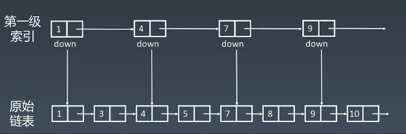
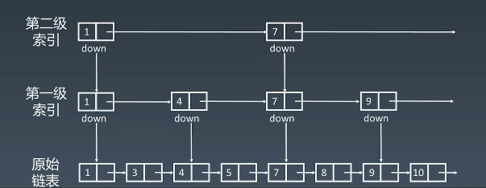
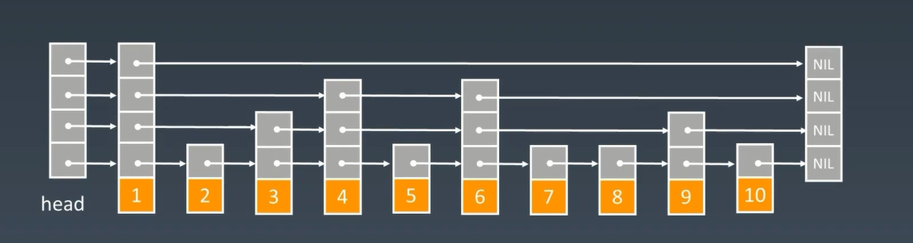

# 链表和跳表

## 链表

链表的底层结构：

  
 

其时间复杂度为：

|       操作        | 时间复杂度 |
| :---------------: | :--------: |
| prepend 首部插入  |    O(1)    |
|  append 尾部插入  |    O(1)    |
| `lookup 查找元素` |   `O(n)`   |
|  insert 插入元素  |    O(1)    |
|  delect 删除元素  |    O(1)    |

## 跳表

因为链表index查询的时间复杂度为O(n)。

那能不能提高链表线性查找的效率呢?

简单的优化，可以`添加头尾指针`。那如何再进一步进行优化。

我们可以利用`升维思想（空间换时间）`，利用`多个指针`进行index下标查找。

这样子，通过增加`log2n`级索引，能够大大提高查找index下标。Redis中就采用了跳表这种数据结构。`索引的高度`跟`树的高度`类似，为logn，因此，在跳表中查询任意数据的时间复杂度就是`O(logn)`。

当然，增加、删除也涉及到索引结点，增加、删除的时间复杂度也变为`O(logn)`。其空间复杂度变为O(n)

|      操作       | 时间复杂度 | 空间复杂度 |
| :-------------: | :--------: | :--------: |
| lookup 查找元素 | `O(logn)`  |    O(n)    |
| insert 插入元素 | `O(logn)`  |    O(n)    |
| delect 删除元素 | `O(logn)`  |    O(n)    |

