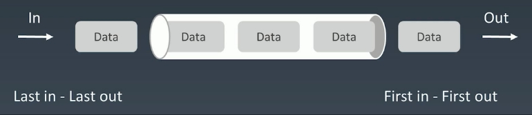
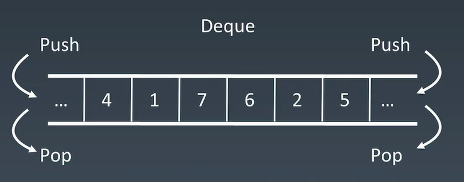

# 队列



双端队列：



简单理解：两端可以进出的Queue

Deque - double ended queue

插入和删除都是O(1)的操作

查询的话还是O(n)

```java
Deque<String> deque = new LinkedList<String>();

deque.push("a");
deque.push("b");
deque.push("c");
System.out.println(deque);

String str = deque.peek();
System.out.println(str);
System.out.println(deque);

while(deque.size() > 0){
    System.out.println(deque.pop());
}
System.out.println(deque);
```

## 优先队列

1. 插入操作：O(1)
2. 取出操作：O(logN) 按照元素的优先级取出
3. 底层具体实现的数据结构较为多样和复杂：heap、bst、treap【都是接口】