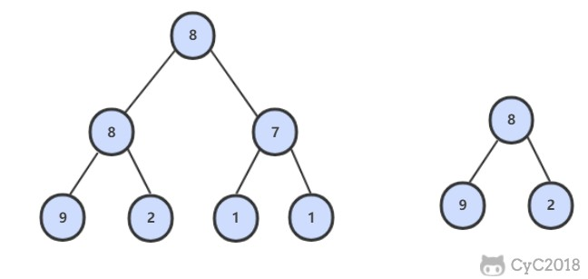

# 面试题26.树的子结构.md

## 题目链接

[面试题26\. 树的子结构](https://leetcode-cn.com/problems/shu-de-zi-jie-gou-lcof/)

## 题目描述

Difficulty: **中等**

输入两棵二叉树A和B，判断B是不是A的子结构。(约定空树不是任意一个树的子结构)

B是A的子结构， 即 A中有出现和B相同的结构和节点值。

例如:  
给定的树 A:

```
     3  
    / \  
   4   5  
  / \  
 1   2
```

给定的树 B：

```
   4
  /  
 1
```

返回 true，因为 B 与 A 的一个子树拥有相同的结构和节点值。

**示例 1：**

```
输入：A = [1,2,3], B = [3,1]
输出：false
```

**示例 2：**

```
输入：A = [3,4,5,1,2], B = [4,1]
输出：true
```

**限制：**

`0 <= 节点个数 <= 10000`

## Solution

Language: **Java**



```java
​/**
 * Definition for a binary tree node.
 * public class TreeNode {
 *     int val;
 *     TreeNode left;
 *     TreeNode right;
 *     TreeNode(int x) { val = x; }
 * }
 */
class Solution {
    public boolean isSubStructure(TreeNode A, TreeNode B) {
        //A为空的情况也要考虑进去！！
        if(A == null || B == null){
            return false;
        }
        //递归，只考虑本层的情况，本层可以分为，我这个结点是不是包含B的子结构，这个结点的左子树是不是包含B的子结构，右子树是不是包含B的子结构
        return (isTree(A, B) || isSubStructure(A.left, B) || isSubStructure(A.right, B));
    }

    private boolean isTree(TreeNode A, TreeNode B){
        //参数是TreeNode，终止条件判断TreeNode为null
        if(B == null){
            return true;
        }
        if(A == null){
            return false;
        }
        if(A.val != B.val){
            return false;
        }
        //A.left B.left 不是A.left B
        return (isTree(A.left, B.left) && isTree(A.right, B.right));
    }
}
```