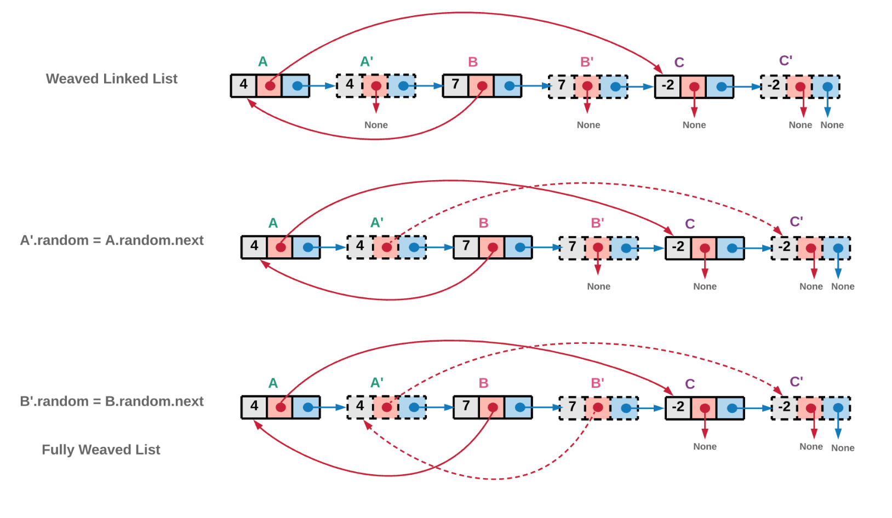
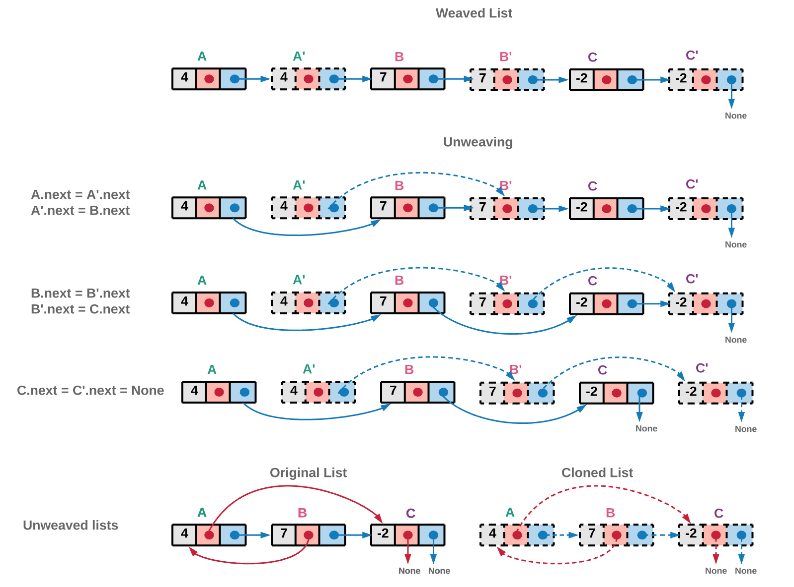

# 面试题35. 复杂链表的复制

## 题目链接

[面试题35\. 复杂链表的复制](https://leetcode-cn.com/problems/fu-za-lian-biao-de-fu-zhi-lcof/)

Difficulty: **中等**

请实现 `copyRandomList` 函数，复制一个复杂链表。在复杂链表中，每个节点除了有一个 `next` 指针指向下一个节点，还有一个 `random` 指针指向链表中的任意节点或者 `null`。

**示例 1：**


```
输入：head = [[7,null],[13,0],[11,4],[10,2],[1,0]]
输出：[[7,null],[13,0],[11,4],[10,2],[1,0]]
```

**示例 2：**


```
输入：head = [[1,1],[2,1]]
输出：[[1,1],[2,1]]
```

**示例 3：**

****

```
输入：head = [[3,null],[3,0],[3,null]]
输出：[[3,null],[3,0],[3,null]]
```

**示例 4：**

```
输入：head = []
输出：[]
解释：给定的链表为空（空指针），因此返回 null。
```

**提示：**

* `-10000 <= Node.val <= 10000`
* `Node.random` 为空（null）或指向链表中的节点。
* 节点数目不超过 1000 。

**注意：**本题与主站 138 题相同：

## Solution

### 使用HashMap

复制链表，即链接的所有结点都要复制，并且所有结点的next、random的指向都和原链表一样。

Language: **Java**

```java
​/*
// Definition for a Node.
class Node {
    int val;
    Node next;
    Node random;

    public Node(int val) {
        this.val = val;
        this.next = null;
        this.random = null;
    }
}
*/
class Solution {
    //复制链表，即链接的所有结点都要复制，并且所有结点的next、random的指向都和原链表一样。
    //利用HashMap存储结点（原结点、复制的结点）
    HashMap<Node, Node> visited = new HashMap<>();

    public Node copyRandomList(Node head) {
        if(head == null) return null;

        //遍历完整个链表后，链表就复制完毕
        Node oldNode = head;
        Node newNode = getCloneNode(oldNode);

        while(oldNode != null){
            newNode.next = getCloneNode(oldNode.next);
            newNode.random = getCloneNode(oldNode.random);

            oldNode = oldNode.next;
            newNode = newNode.next;
        }

        return visited.get(head);
    }

    //如果结点已经存在，则从HashMpa中取出来，如果不存在，则创建结点并存在HashMap中
    private Node getCloneNode(Node oldNode){
        if(oldNode == null) return null;

        //如果有结点还未复制，则创建结点，并存入HashMap中
        if(!visited.containsKey(oldNode)){
            visited.put(oldNode, new Node(oldNode.val));
        }

        //返回HashMap中的结点
        return visited.get(oldNode);
    }
}
```

### 扭曲原链表

与上面提到的维护一个旧节点和新节点对应的字典不同，我们通过扭曲原来的链表，并将每个拷贝节点都放在原来对应节点的旁边。这种旧节点和新节点交错的方法让我们可以在不需要额外空间的情况下解决这个问题。让我们看看这个算法如何工作

**算法：**

1. 遍历原来的链表并拷贝每一个节点，将拷贝节点放在原来节点的旁边，创造出一个旧节点和新节点交错的链表。


2. 迭代这个新旧节点交错的链表，并用旧节点的 random 指针去更新对应新节点的 random 指针。比方说， B 的 random 指针指向 A ，意味着 B' 的 random 指针指向 A' 



3. 现在 random 指针已经被赋值给正确的节点， next 指针也需要被正确赋值，以便将新的节点正确链接同时将旧节点重新正确链接



```java
/*
// Definition for a Node.
class Node {
    int val;
    Node next;
    Node random;

    public Node(int val) {
        this.val = val;
        this.next = null;
        this.random = null;
    }
}
*/
class Solution {
    public Node copyRandomList(Node head) {
        if(head == null) return null;

        Node oldNode = head;
        Node newNode;

        //复制结点
        while(oldNode != null){
            newNode = new Node(oldNode.val);
            //将复制的结点，放在原结点的后面
            newNode.next = oldNode.next;
            oldNode.next = newNode;
            
            oldNode = oldNode.next.next;
        }

        //更新random指向
        oldNode = head;
        newNode = head.next;
        while(oldNode != null){
            newNode.random = (oldNode.random == null) ? null : oldNode.random.next;
            oldNode = oldNode.next.next;
            newNode = (newNode.next == null) ? null : newNode.next.next;
        }

        //更新next
        oldNode = head;
        newNode = head.next;
        //从这里开始，oldNode和newNode分道扬镳，以后不会有任何的联系。所以需要在这里设res = 要返回的链表的头结点
        Node res = head.next;

        while(oldNode != null){
            oldNode.next = oldNode.next.next;
            newNode.next = (newNode.next == null) ? null : newNode.next.next;
            oldNode = oldNode.next;
            newNode = newNode.next;
        }

        return res;
    }
}
```

时间复杂度：O(N)
空间复杂度: O(1)