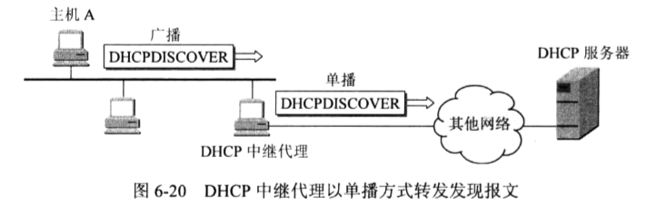
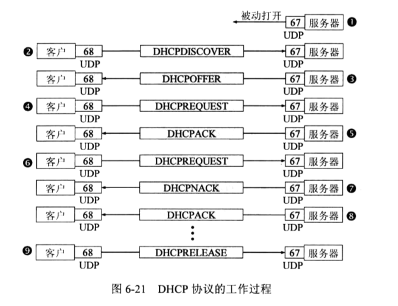
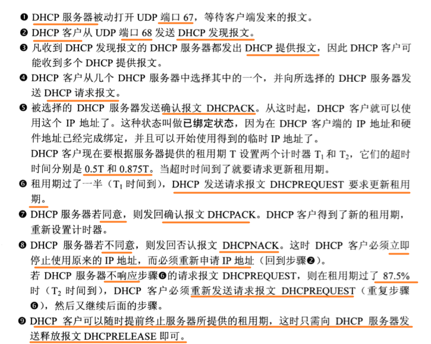

### 如何配置IP地址

使用ifconfig或ip addr。设置好后，用这两个命令，将网卡up一下，就可以开始工作了。

**使用net-tools:**

```bash
sudo ifconfig eth1 10.0.0.1/24
sudo ifconfig eth1 up
```

**使用iproute2:**

```bash
sudo ip addr add 10.0.0.1/24 dev eth1
sudo ip link set up eth1
```

但是，`IP地址不能随便配置，需要和网络号在同一个网段内`。

**假设，在192.168.1.0的网络号（网段）内，本机的IP地址却设置成16.158.23.6，这会发生什么呢？**

对于任何一个包，Linux首先会判断，要去的地址和我是同一个网段吗？只有在同一个网段内，它才会发送ARP请求，获取MAC地址。（`获取局域网的其他主机MAC地址`，很显然，IP地址设置成16.158.23.6，故Linux认为目的地址和自己不在同一个网段内，故Linux不会发ARP请求去查询局域网内其他主机的MAC地址）

如果不是在同一个网段内，Linux默认的逻辑是，`这是一个跨网段的IP，Linux企图将包发送到网关（路由器，这里要注意，如果是在局域网内，最多会经过Hub或Switch，而不会经过路由器）`。需要发送到网关，就需要获取网关的MAC地址，这个时候就需要我们`配置的网关`发挥作用了。因为本网络的网关是192.168.1.1，所以IP地址设置成16.158.23.6的主机需要将网关配置成192.168.1.1才能发送成功，但是，Linux是不会让一个IP地址为16.158.23.6的网关设置成192.168.1.1的，因为这不是在一个网段内。

所以，乱配置IP地址就会造成你的包发不出去。

`反过来想`，如果你的目的IP是16.158.23.6，路由器的路由选择怎么会找到192.168.1.0的网络号呢？在192.168.1.0的网络号（网段）内，本机的IP地址却设置成16.158.23.6，这也会导致其他的包发送不到16.158.23.6的主机上。

### 动态主机配置协议（DHCP）

为了减少IP地址配置错误而上不了网，或者`免去IP地址配置的麻烦`，我们需要一个`自动配置的协议`，也就是`动态主机配置协议`（Dynamic Host Configuration Protocol），简称`DHCP`。

DHCP提供了一种机制，成为即插即用联网（plug-and-play networking）。有了这个DHCP，不论是一台新的机器的接入，或者是一台机器断开连接，这都能自动化完成了。

当然，DHCP还会给运行的`服务器`软件固定一个计算机指派的永久指针，使服务器的IP地址`永久不变`。

**额外拓展：**

我们并不愿意在每一个网络上都设置一个DHCP服务器，因为这样子会让DHCP服务器的数量太多。因此现在是使每一个网络至少有一个`DHCP中继代理`（relay agent）,通常是一个`路由器`，它配置DHCP服务器的IP地址信息。

当计算机使用Windows操作系统时，点击“控制面板”的“网络”图标就可以找到某个连接中的“网络”。点进去，在下面的菜单，找到TCP/IP协议后点击其“属性”按钮，若选择“自动获得IP地址”和“自动获得DNS服务器地址”，就是表示使用DHCP协议。



#### 解析DHCP的工作方式

DHCP是怎么工作的呢？我们来看这么一个场景。

当一台机器加入一个新的网络时，这台机器什么都不知道，只知道自己的MAC地址，怎么办？

新来的机器用IP地址为0.0.0.0（默认为本机IP）发送了一个广播包,目的IP地址是`255.255.255.255（广播地址）`。广播包封装成了UDP，UDP封装成了BOOTP（DHCP是BOOTP的增强版），这个过程是`DHCP Discover`。(DHCP客户使用端口是`68`，而DHCP服务器使用的端口是`67`)


如果网络管理员（网管）配置了DHCP Server的话，他就能知道来了一个“新人”，需要租给它一个IP地址，这个过程称为`DHCP Offer`。同时，DHCP Server会为此客户保留为他提供的IP地址，从而不会为其他的DHCP客户分配此IP地址。


新来的机器很开心，这个网络愿意给他一个IP地址了，这意味着它以后能用这个IP地址收包、发包了。

如果有多个DHCP Server，这台机器会收到多个IP地址，但是这台机器一般会选择`最先到达的那个IP地址`（DHCP Offer）,这个时候它会向网络发送一个`DHCP Request`广播数据包，包中包含客户端的MAC地址，接收的租约中的IP地址、提供此租约的DHCP服务器地址等，并告诉所有的DHCP Server它将接收哪一台服务器提供的IP地址。


此时，由于还没有得到DHCP Server的最后确认，客户端仍然使用0.0.0.0为源IP地址、255.255.255.255为目标地址进行广播。在BOOTP里面，接受某个DHCP Server的分配的IP。

这时DHCP Server会广播返回客户机的一个`DHCP ACK`消息包，表明已经接收客户机的选择，并将这一IP地址的合法租用信息和其他的配置信息都放入广播包，发给客户机，欢迎它的加入。


最终租约达成，还是需要广播一下，让大家知道。

#### IP地址的收回和续约

DHCP服务器分配给DHCP客户的`IP地址是临时的`，因此DHCP客户只能在一段有限的时间内使用这个分配的IP的地址，即`租用期`。（租用期由DHCP服务器决定）

在`0.5个租用期`和`0.87个租用期`时，DHCP客户要请求更新租用期。

#### DHCP协议总结





### 预启动执行环境（PXE）

数据中心里面的管理员可能一下子就拿到几百台空的机器，一个个安装操作系统，会累死的。

所以管理员希望的不仅仅是自动分配IP地址，还要自动安装系统。装好系统之后自动分配IP地址，直接启动就能用了，这样当然最好了！

那这也需要用到DHCP！

其实，这个过程和操作系统启动的过程有点儿像。首先，启动BIOS。这是一个特别小的小系统，只能干特别小的一件事情。其实就是读取硬盘的MBR启动扇区，将GRUB启动起来；然后将权力交给GRUB，GRUB加载内核、加载作为根文件系统的initramfs文件；然后将权力交给内核；最后内核启动，初始化整个操作系统。

那我们安装操作系统的过程，只能插`在BIOS启动之后`了。因为没安装系统之前，连启动扇区都没有。因而这个过程叫做`预启动执行环境（Pre-boot Execution Environment），简称PXE`。


DHCP协议能给客户`推荐`“装修队”PXE，能够安装操作系统，这个在云计算领域大有用处。

【进入BIOS设置页面，有一项PXE Boot to LAN，若设置为Enabled则表示计算机从网络启动，从PXE服务端下载配置文件和操作系统内核进行启动；若设置为Disabled则表示从本地启动，启动动BIOS后，会去寻找启动扇区，如果没有安装操作系统，就会找不到启动扇区，这个时候就启动不起来。】
