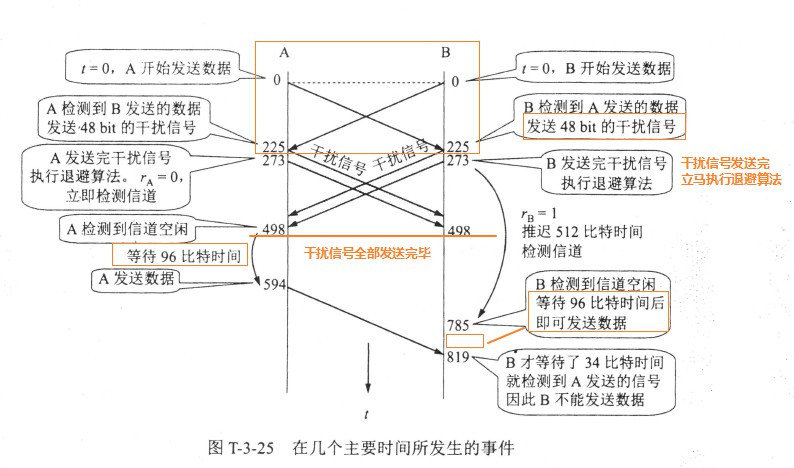
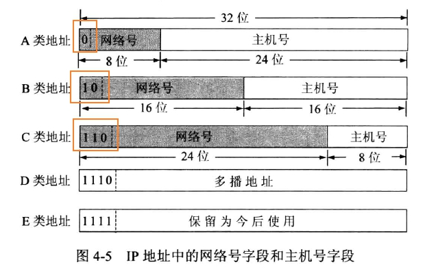
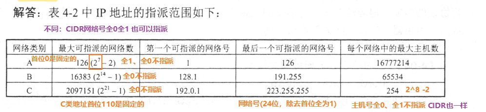
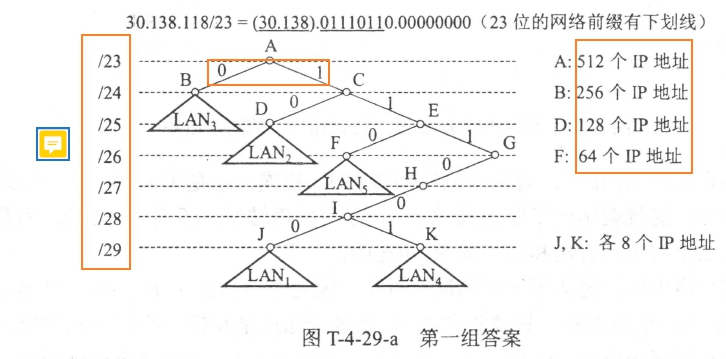
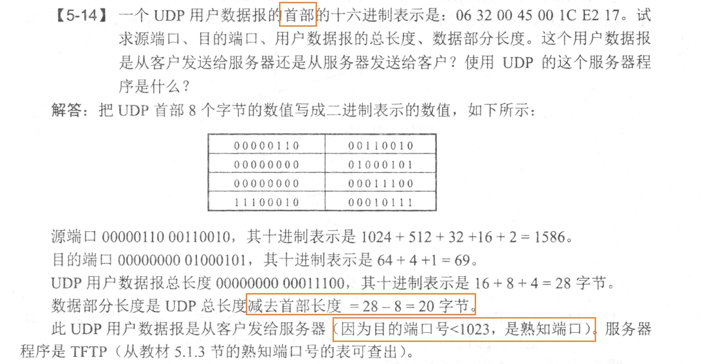
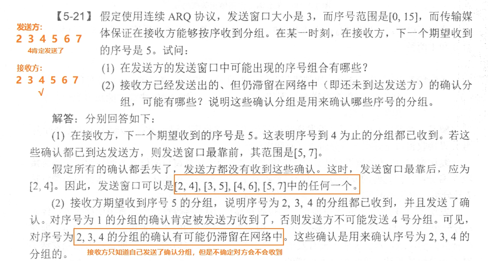
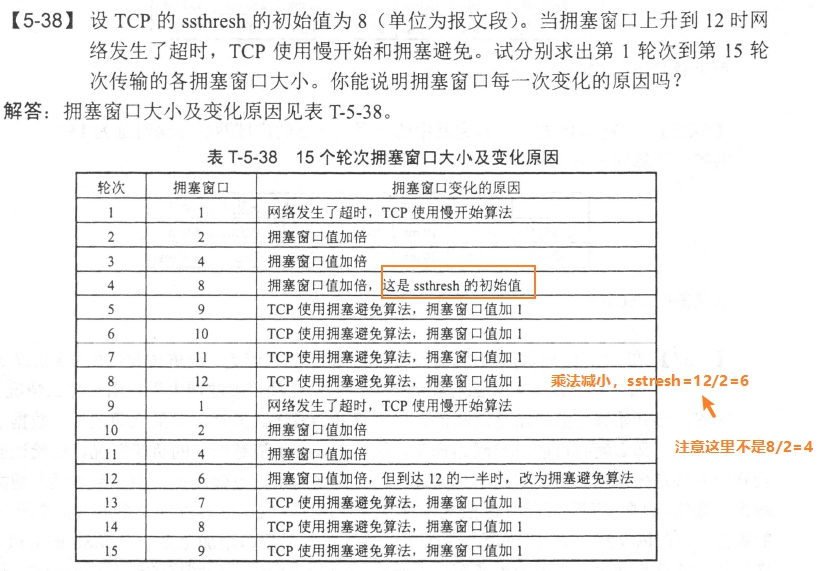

- 回答问题时，全面一点，比如说，题目问你为什么，`你可以先回答是什么，再从体系结构上层层分析`【多和其他层的联系起来】
- `写的时候一定要写全`

### 物理层

- 双绞线由两根具有绝缘保护层的铜导线按一定密度互相绞在一起组成，这样可以`降低信号的干扰程度`
- 物理层的主要任务可以描述为确定与传输媒体接口有关的一些特性：【机电功过】机械特性、电气特性、功能特性、过程特性

### 数据链路层

- 在做数据链路层的题目时，脑中需要有这一个图：
  

- 假定I km 长的CSMA/CD 网络的数据率为I Gbit/s 。设信号在网络上的传播速率为200 000 km/s 。求能够使用此协议的最短帧长。

?> (1) 要算最短帧长肯定和（线路上的）`传播时延`有关，更具体的来说，是2t（2倍端到端）,t是端到端传播时延。而知道线路的长度，线路的传播速度，就能够算出端到端的传播时延是多少。  
(2) I km 长的CSMA/CD 网络的端到端传播时延. = (I km)/ (200000 km/s) = 5μs  
(3) 而这里要注意，上面是t,要算的是2t.  
21=10μs, 在此时间内要发送(I Gbit/s) (10μs) = 10000 bit.  
(4) 只有经过这样一段时间后发送端才能收到碰撞的信息（如果发生碰撞的话），也才能检测到碰撞的发生。  
因此，最短帧长为I 0000 bit, 或1250 字节。

- 512比特时间是2t,不是t（t是指端到端需要的时间，2t是端到端`来回`的时间）
- `干扰信号`是48比特；退避算法是干扰信号发送完就立即执行；退避算法执行完(或者压根就没有执行退避算法)，还要`等待96比特时间`才能发送。
- 截断二进制指数退避，是在[0,2^n-1]中挑选一个【都是2的倍数】
- 交换机能隔离碰撞域，交换机能`同时连通许多对接口`，使每一对相互连通的主机都能像独占传输媒体那样，无碰撞地传输数据。

### 网络层

- 网络层向上层提供的服务有两种，一种是`面向连接`服务（即`虚电路`服务）和`无连接`服务（即`数据报`服务）
- 作为中间设备，转发器、网桥、路由器、网关有什么区别？
  - 物理层使用的中间设备叫做转发器
  - 数据链路层使用的中间设备是网桥或桥接器
  - 网络层使用的中间设备是路由器
  - 在网络层以上使用的中间设备是网关，网关在不兼容的系统需要在高层进行协议转换。现在，“路由器”和“网关”一般都值同一个东西。
- IP地址可以分为5类：
  - A类地址：网络号字段为1字节，最前面的1位是`0`
  - B类地址：网络号字段为2字节，最前面的2位是1`0`
  - C类地址：网络号字段为3字节，最前面的3位是11`0`
  - D类地址：用于多播，最前面的4位是111`0`
  - E类地址：保留今后使用，最前面的4位是1111
  - 
- 网络号：全0不指派，代表本网络；主机号：全0、全1不指派，全0代表本主机，全1代表本广播；
  - 
  - subnet-id是划分的A、B、C类IP地址`划分子网`,和CIDR不一样
- 子网掩码的1可以不连续，但是强烈`不推荐`这样子使用！
- 在CRDI中，全1和全0的`网络号`也可以使用
- 使用A、B、C类地址，路由表的内容是“`子网掩码`、下一跳”，而使用CIDR是“`网络前缀`、下一跳”【使用CIDR查找路由表是查找`最长前缀`！】【写CIDR的时候，`一定要写上斜杠“/”`】
- 在互联网中将IP数据报分片的数据报在`最后的目的主机`进行组装
- IP数据报由首部和数据部分组成；如果IP数据报需要分片的话，`首部 + 数据部分 = MTU，首部是固定的，数据部分需要拆成多个`，IP数据报的`偏移量`也仅仅是（数据部分/8，注意，`片偏移要累加`，如“片偏移字段的值分别是： 0, 185,370,555, 740 和925 (字节数除以8) ”），不包括首部
- 十六进制：16 = 2^4；所以十六进制用`4位`二进制表示！`多用二进制的角度思考`
- 分配子网时，推荐用图解：
  - 
- IPv6没有首部检验和，这样对首部的处理更加简单；因为在数据链路层上已经进行了首部检验了，在IP层出错的可能性很小；而且，在运输层(UDP、TCP)的伪首部也会检验IP的源地址和目的地址
- 在IPv6中，已经没有ARP协议了，但是APR协议的功能却是不可获取的，在IPv4中ARP协议所能完成的功能，在IPv6中已由邻居发现协议ND来完成了。
- 应用程序ping发出的是ICMP请求报文

### 运输层

- `端口是用来标志进程的`.运输层提供了进程的分用和复用功能。
  - 
- 如果用户要求`实时传送数据`，而且`不能忍受时延`，则要使用`UDP`
- UDP的用户数据报和IP数据报是两个不同的概念
- 发送方和接收方只能确定自己发送过了什么分组，但是不能确定自己发送过的分组能不能被对方接收
  - 
- TCP的序号只和`字节`有关【32位，故不适用重复的序号，最大容量可达4GB】
- 信道利用率的单位是Mbit/s
- cwnd会随着慢开始（或加法增大）而增大
- `乘法减小`是门限ssthress=cwnd/2；
- 如果发生快重传，ssthress=cwnd/2;cwnd=ssthress,这个时候拥塞避免，加法增大
  - 
- 注意一点:收到对a号字节的确认报文 `等于` ack = a+1
- 流量控制和拥塞控制的最主要的区别是什么？发送窗口的大小取决千流量控制还是拥塞控制？
  - 解答：简单地说，流量控制是在一条TCP 连接中的接收端采用的措施，用来限制对方（发送端）发送报文段的速率，以免在接收端来不及接收。流量控制只控制一个发送端。拥塞控制是用来控制TCP 连接中发送端发送报文段的速率，以免使互联网中的某处产生过载。拥塞控制可能会同时控制许多个发送端，限制它们的发送速率。不过每一个发送端只知道自己应当怎样调整发送速率，而不知道在互联网中还有哪些主机被限制了发送速率。
  - 我们知道，发送窗口的上限值是Min [ rwnd, cwnd], 即发送窗口的数值不能超过接收窗口和拥塞窗口中的较小的一个。接收窗口的大小体现了接收端对发送端施加的流量控制，而拥塞窗口的大小则是整个互联网的负载情况对发送端施加的拥塞控制。因此，当接收窗口小千拥塞窗口时，发送窗口的大小取决于流量控制，即取决千接收端的接收能力。但当拥塞窗口小千接收窗口时，则发送窗口的大小取决千拥塞控制，即取决千整个网络的拥塞状况。
