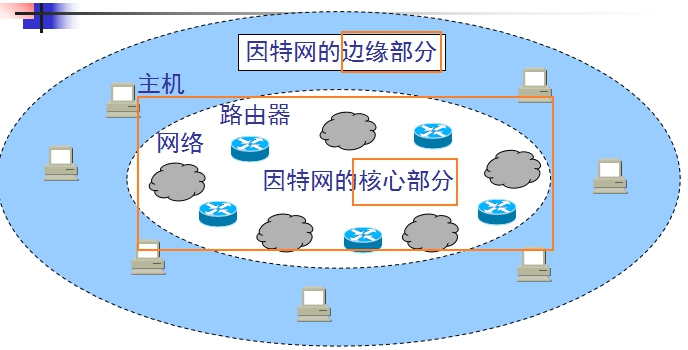
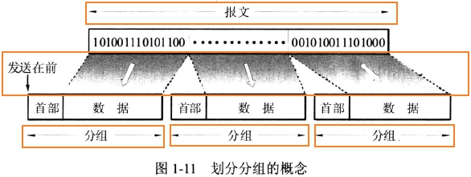
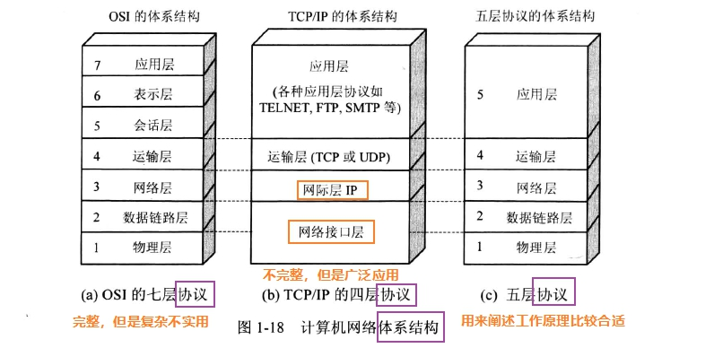
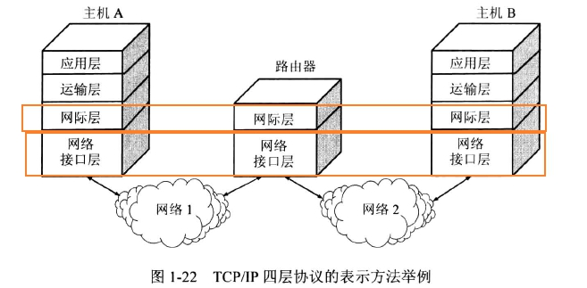
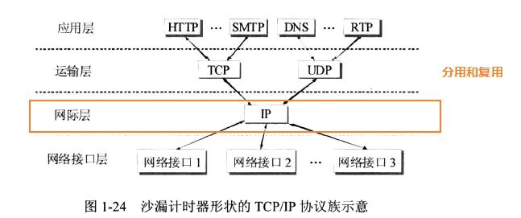

**三网，互联网两个基本特点：**

三网指的是“`电信网络、有线电视网络、计算机网络`”。按照起初的分工，电信网络向用户提供电话、电报及传真等服务；有线电视网络向用户传送各种电视节目；而计算机网络则使用户能够在计算机之间传送数据文件。现在，计算机网络也能向用户提供电话通信、视频通信以及传送视频节目等服务。

互联网有两个最重要的基本特点，即`连通性`和`共享性`。

现在我们常常看到一种新的提法，即“互联网+”，即“互联网+各个传统行业”，互联网+代表的是一种新的经济形态，其特点就是把互联网的创新成果融合在社会各领域之中。

**互联网组成及通信方式，数据交换及特点：**

以小写字母i开始的internet（互连网）是一个通用名词，它泛指由多个计算机网络互连而成的计算机网络。在这些网络之间的通信协议可以任意选择，不一定要使用TCP/IP协议。

以大写字母I开始的Internet（互联网）是一个专用名词，它指当前全球最大的、开放的、由众多相互连接而成的特定互连网，它采用TCP/IP协议族。

互联网服务提供者(商)ISP（Internet Service Provider）,中国移动、中国连通、中国电信等公司都是我国著名的ISP。所谓上网，就是通过某ISP获得IP地址接入互联网(当然，这里不包括专用网)。

互联网的拓扑结构可以简单划分为：`边缘部分`和`核心部分`。边缘部分是连接在互联网上的`主机`组成，边缘部分是用户直接使用的；核心部分是由大量`网络`和连接这些网络的`路由器`组成，核心部分是为边缘部分提供服务的。

我们常说的“主机A和主机B进行通信”，是指“主机A的某个进程和主机B上的另一个进程通信”，这种说法也通常简称为“计算机之间的通信”。

在端系统（主机）之间的通信可划分为两类：`客户-服务器方式（C/S方式，B/S方式是C/S方式的一种特例）和对等方式（peer-to-peer,P2P方式）`。

`对等方式本质上仍可以看成是客户-服务器方式`，只是对等连接中的每一台主机既是客户又同时是服务器。

在网络核心部分起特殊作用的是路由器（router），路由器实现的是分组交换（packet switching）的关键构件，其任务是转发收到的分组。

分组交换采用`存储转发`技术。我们先来看一下报文和分组的关系。

为什么叫存储转发呢？路由器收到一个分组，先暂时存储一下，检查其首部，查找转发表，按照首部的目的地址，找到合适的接口转发出去，把分组交给下一个路由器（`路由器不进行差错检查，差错检测已由数据链路层检测了`）

**- 计算机网络类别：**

- 按照网络的作用和范围分为：

1. 广域网WAN（wide area network）：范围是不同的国家
2. 城域网MAN（metropolitan area network）：范围是一个城市
3. 局域网LAN（local area network）：如校园网和企业网
4. 个人区域网PAN（personal area network）：也常称为无线个人区域网wireless PAN

- 按照网络的使用者进行分类

1. 公用网public network：所有愿意按电信公司的规定缴纳费用的都可以使用这种网络
2. 专用网private network：不向本单位外的人提供服务的

- 用来把用户接入到互联网的网络

1. 接入网是某个用户端系统到互联网中的第一个路由器。以前的接入是电话线拨号上网，现在有宽带接入等技术。

**计算机性能指标：**

通常有7个性能指标

1. 速率（数据率/比特率）：单位为bit/s（b/s,bps,bit per second"）
2. 带宽：在计算机网络中，表示单位时间内网络中的某信道所能通过的“`最高数据率`”，这种意义的带宽的单位是bit/s
3. 吞吐量：表示单位时间内通过某个网络（或信道、接口）的实际数据量
4. 时延：总时延 = 发送时延（主机或路由器发送数据帧所需要的时间） + 传播时延（信道长度/电磁波在信道的传播速度） + 处理时延 + 排队时延
5. (传播)时延带宽积 = 传播时延 * 带宽，这个的数值表示，在发送的第一个比特即将到达终点时，发送端已经发送了多少个bit了。故时延带宽积又称“以比特为单位的链路长度”
6. 往返时间RTT
7. 利用率：信道或网络的利用率过高会产生非常大的时延

**计算机网络分层结构：计算机网络协议、接口、服务等概念；OSI参考模型和TCP/IP模型：**

**时延计算（1-17）：**

**网络体系结构各层对应关系及各层功能（1-24）：**
