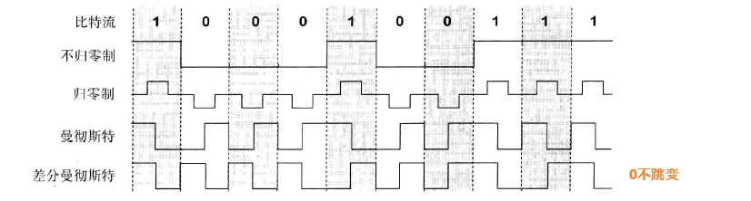

物理层考虑的是怎么样才能在连接各种计算机的传输媒体上`传输数据比特流`，而不是指具体的传输媒体。

物理层的作用是屏蔽掉传输媒体和通信手段的差异，只完成数据比特流的传输。

## 数据通信的基础知识

一个数据通信系统可划分成三大部分，即源系统（或发送端、发送方）、传输系统、目的系统（或接收端、接收方）

通信的目的是传送消息，如语言、文字等。数据是运送消息的实体。信号则是数据的电气或电磁表现。

从通信的双方信息交互的方式看，有`单工通信`（单向通信，只能有一个方向）、`半双工通信`（双向交替通信，两个方向都可以，但是不同同时发送）、`全双工通信`（双向同时通信，通信的双方可以同时发送消息）

来自信源的信号称为`基带信号`（即基本频带信号）

**常用的编码方式有：**

1. 不归零制
2. 归零制
3. 曼彻斯特码
4. 差分曼彻斯特码

**基本的带通调制方法：**

1. 调幅AM
2. 调频FM
3. 调相PM
4. 正交振幅调制QAM

**限制码元在信道上的传输速率的因素有以下两个：**

- 信道能够通过的频率范围

奈式准则提出：在任何信道中，码元传输的速率是有上限的，传输速率超过此上限，就会出现严重的码间串扰，使接收端对码元的判决（识别）成为不可能。

- 信噪比

信噪比（dB） = 10 log10(S/N)(dB)

香农定理指出信道的极限传输速率C = W log2(1+S/N) (bit/s),其中W为信道的带宽（以Hz为单位），S为信道内所传信号的平均功率；N为信道内部的高斯噪声功率。

香农公式表明：信道的带宽或信道的信噪比越大，信息的极限传输速率就越高

## 物理层下面的传输媒体

- 导引型传输媒体

1. 双绞线
2. 同轴电缆
3. 光缆

- 非导引型传输媒体

1. 微波接力通信（卫星）
2. 短波

## 信道复用技术

1. 频分复用FDM（frequency division multiplexing）
2. 时分复用TDM(time division multiplexing)
3. 波分复用WDM（wavelength division multiplexing），波分复用是光的频分复用。
4. 码分复用CDM（code division multiplexing），使用正交的伪随机码序列
