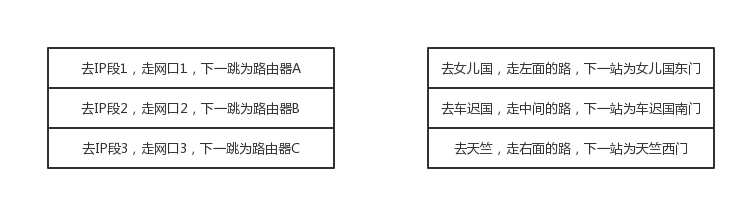

> 只有通过网络协议，才能使一大片机器`相互协作`，共同完成一件事。

### 从一个实例说起

这里，通过一个“双十一下单”的一个例子，看看互联网世界的运行过程中，都使用了哪些协议。

你先在浏览器里面输入 <https://www.jd.com/> ，这是一个`URL`。浏览器只知道`名字`是"www.jd.com" ,但是不知道具体的地点，所以不知道如何访问。

于是，它打开地址簿去查看。可以使用一般的地址簿协议`DNS`去查找，还可以使用另一种更加精确的地址簿`查找协议HTTPNDS`。无论用哪一种方法查找，最终都会找到这个`地址：183.232.41.1`。这个是`IP地址`，是互联网世界的“`门牌号`”。

知道了目标地址，浏览器就`开始打包它的请求`。对于普通浏览请求，往往使用`HTTP协议`；但是对于购物的请求，往往需要进行加密传输，因而会使用`HTTPS协议`。无论是什么协议，里面都会写明“你要买什么和买多少”

DNS、HTTP、HTTPS所在的层我们称为`应用层`。经过应用层封装后，浏览器会将应用层的包交给下一层去完成，通过`socket编程`来实现。

下一层是传输层。传输层有两种协议，一种是`无连接的协议UDP`，一种是`面向连接的协议TCP`。对于支付来说，往往使用的是TCP协议。所谓的面向连接就是，TCP会保证这一个包能够到达目的地。如果不能到达，就会重新发送，直至到达。

TCP协议里面有两个端口，一个是`浏览器监听的端口`，一个是`电商的服务器监听的端口`。操作系统往往通过端口来判断，它得到的包应该给哪个进程。

传输层封装完毕后，浏览器会将包交给操作系统的网络层。网络层的协议是`IP协议`。在IP协议里面会有`源IP地址`，即浏览器所在机器的IP地址和`目标IP地址`，也即电商所在服务器的IP地址。

操作系统既然知道了目标IP地址，就开始想如何根据这个门牌号找到目标机器。操作系统往往会判断，这个目标IP地址是本地人，还是外地人。如果是本地人，从门牌号就能看出来，但是显然电商网站不在本地，而在遥远的地方。

操作系统知道要离开本地去远方。虽然不知道远方在何处，但是可以这样类比一下：如果去国外要去海关，去外地就要去`网关`。而操作系统启动的时候，就会被`DHCP协议`配置IP地址，以及默认的`网关的IP地址192.168.1.1`。

操作系统如何将IP地址发给网关呢？`在本地通信基本靠吼`，于是操作系统大吼一声，谁是192.168.1.1啊？网关会回答它，我就是，我的本地地址在村东头。这个本地地址就是`MAC地址`，而大 吼的那一声是ARP协议。【数据链路层使用MAC地址】

于是操作系统将IP包交给了下一层，也就是和MAC层。网卡再将包发出去。由于这个包里面是由MAC地址，因而它能够到达网关。

网关收到包之后，会根据自己的知识，判断下一步要怎么走。网关往往是一个路由器，到某个IP地址应该怎么走，这个叫做`路由表`。

路由器有点像玄奘西行路过的一个个国家的一个个城关。每个城关都连着两个国家，每个国家相当于一 个局域网，在每个国家的内部，都可以使用本地的地址MAC进行通信。

一旦跨越城关，就需要拿出IP头来，里面写着贫僧来自东土大唐（就是源IP地址），欲往西天拜佛求经 （指的是目标IP地址）。路过宝地，借宿一晚，明日启行，请问接下来该怎么走啊？【`路由器有三层，最高一层为IP层`】

城关往往是知道这些“知识”的，因为城关和临近的城关也会经常沟通。到哪里应该怎么走，这种沟通的 协议称为路由协议，常用的有`OSPF`和`BGP`。

城关与城关之间是一个国家，当网络包知道了下一步去哪个城关，还是要使用国家内部的MAC地址， 通过下一个城关的MAC地址，找到下一个城关，然后再问下一步的路怎么走，一直到走出最后一个城关。

最后一个城关知道这个网络包要去的地方。于是，对着这个国家吼一声，谁是目标IP啊？目标服务器就 会回复一个`MAC地址`。网络包过关后，通过这个`MAC地址`就能`找到目标服务器`。

---

目标服务器发现MAC地址对上了，`取下MAC头来`，发送给操作系统的网络层。发现IP也对上了，`就取下IP头`。IP头里会写上一层封装的是TCP协议，然后将其交给传输层，即TCP层。【拆去头部】

在这一层里，对于收到的每个包，都会有一个回复的包`说明收到`【`ACK`】了。这个回复的包绝非这次下单请求的结果，例如购物是否成功，扣了多少钱等，而仅仅是`TCP层的一个说明`，即收到之后的回复。当然这个 回复，会沿着刚才来的方向走回去，报个平安。

如果过一段时间还是没到，发送端的`TCP层`会重新发送这个包，还是上面的过程，直到有一天收到平安 到达的回复。这个重试绝非你的浏览器重新将下单这个动作重新请求一次。对于浏览器来讲，`就发送了 一次下单请求`，`TCP层不断自己闷头重试`。除非TCP这一层出了问题，例如连接断了，才轮到浏览器的 应用层重新发送下单请求。

当网络包平安到达TCP层之后，`TCP头中有目标端口号`，通过这个端口号，可以找到电商网站的进程正在监听这个端口号，假设一个`Tomcat，将这个包发给电商网站`。

`电商网站的进程`得到HTTP请求的内容，知道了要买东西，买多少。往往一个电商网站最初接待请求的 这个Tomcat只是个接待员，负责统筹处理这个请求，而不是所有的事情都自己做。例如，这个接待员要告诉专门`管理订单的进程`，登记要买某个商品，买多少，要告诉`管理库存的进程`，库存要减少多少， 要告诉支付的进程，应该付多少钱，等等。

如何告诉相关的进程呢？往往通过`RPC调用`，即`远程过程调用`的方式来实现。远程过程调用就是当告诉管理订单进程的时候，接待员不用关心中间的网络互连问题，会由`RPC框架`统一处理。RPC框架有很多种，有基于HTTP协议放在HTTP的报文里面的，有直接封装在TCP报文里面的。

当接待员发现相应的部门都处理完毕，就`回复一个HTTPS的包`，告知下单成功。这个HTTPS的包，会像 来的时候一样，经过千难万险到达你的个人电脑，最终进入浏览器，显示支付成功。

### 拓展

- **有了mac地址为什么还要有ip地址?**

有了mac地址为什么还要有ip地址。举个例子，身份证号是你的唯一标识，不会重复，一落户就有（网卡一出厂就有mac）。现在我要和你通信（写信给你），地址用你的姓名+身份证，信能送到你手上吗?明显不能！身份证号前六位能定位你出生的县。mac地址前几位也可以定位生产厂家。但是你出生后会离开这个县（哪怕在这个县，也不能具体找到你）。所以一般写个人信息就要有出生地和现居地址了。

如果要维护一个超级大的MAC地址对应表，那寻址效率肯定爆炸，而维护IP地址就很简单，因为很大IPv4都被被分配了，当你连接一个局域网时，会为你自动分配一个IP地址。

- **有了IP地址，为什么还需要MAC地址？**

因为IP地址是实时变化的（DHCP自动分配），而MAC地址是固定的，网络送到对应的IP地址后，还需要核心真正的身份，才能做到精准送达。

- **MAC地址一定是不变的吗？**

网卡MAC码是由全球惟一的一个固定组织来分配的，未经认证和授权的厂家无权生产网卡。每块网卡都有一个固定的卡号，并且任何正规厂家生产的网卡上都直接标明了卡号，一般为一组12位的16进制数。其中前6位代表网卡的生产厂商。后面的位数是设备号。

当然在操作系统级别改Mac地址又是一种说法。网卡MAC是硬件的属性，我们要怎么看到MAC，要通过操作系统才能看到，于是我们可以通过修改Windows的注册表来修改MAC地址(修改MAC地址参考资料：<https://blog.csdn.net/shujun19941226/article/details/51042955>)