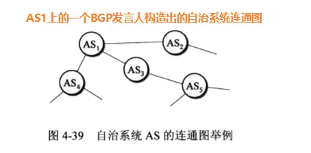

### 网络层要怎么设计

网络中有一个很重要的话题：`可靠交付`由谁来负责？网络才是端系统？

因为`计算机有着很强的差错处理能力`，互联网采用的设计思路和传统电话线完全不一样（传统电话线，需要运输的时候需要先建立连接，可以说，可靠交付由网络负责），互联网采用的思路是：`网络层向上只提供简单灵活的、无连接的、尽最大努力交付的数据报服务。`网络层不提供服务质量的承诺，可靠交给运输层负责；通过这样子，使得网络造价大大降低，运行方式灵活，能够适应多种应用。

这里`IP数据报`，又叫做`数据报`、`分组`。

### 网际协议IP

`网际协议IP`是TCP/IP体系中最主要的协议之一，与IP协议配套使用的还有：

- `网际控制报文协议ICMP`（Internet Control Message Protocol）
- `网际组管理协议IGMP`（Internet Group Management Protocol）
- `地址解析协议ARP`（Address Resolution Protocol）

#### 虚拟互联网络

一般来讲，使网络互联起来的设备有：

- 物理层：转发器（repeater）、集线器（hub）、中继器
- 数据链路层：网桥、桥接器（bridge）、交换机（switch）
- 网络层：路由器（router）、网关（gateway）

使用IP协议，使得互联后的网络看起来像是`一个统一的网络`（即使物理网络存在异构型）。

如果在覆盖全球的IP网的上层使用TCP协议，那么就是现在的互联网。互联网能提供大量丰富的服务：

#### 分类的IP地址

IP地址(由网络号和主机号组成)就是给互联网上的每一台主机（或路由器）的每一个接口分配一个在全世界范围内是唯一的32位标识符。

IP地址编址方法经历了三个历史阶段：

1. 分类的IP地址（A B C D E 五类）【成为历史】
2. 子网的划分【成为历史】
3. 构成超网（CIDR，Classless Inter-Domain Routing，无类别域间选路）【目前在用】 [参考链接](https://floatlig.github.io/computerNetwork_docsify/#/./_source/%E8%AE%B2%E8%AE%B2ifconfig?id=%e4%b8%80%e4%b8%aa%e5%ae%b9%e6%98%93%e7%8a%af%e9%94%99%e7%9a%84cidr)

在IP地址中，有 一些特殊的IP：

- 主机号`全1代表所有的主机`，`全0代表本主机`；
- 网络号全0、全1代表`本网络`；
- 127的网络号，非全0或全1的任何数（如`127.0.0.1`）代表本地软件`环回测试`。

IP地址，是分配给网卡，路由器的端口的

- 因此，一个网卡（网络适配器）有一个IP地址，一个电脑有多少个网卡，`可以`有多少个IP地址。
- 一个路由器一个端口对应一个IP地址，一台路由器有5个端口，`可以`有5个IP地址。

路由器的WAN口、LAN口、以及NAT转换：[参考链接](https://product.pconline.com.cn/itbk/wlbg/network/1802/10851136.html)

#### IP数据报的格式

`IP数据报能够说明IP协议有什么功能。`在TCP/IP的标准中，各种数据常常`以32位（即4字节）为单位`描述。

#### 划分子网和构造超网

IP地址分为A B C D　E五类，这样子的设计不够合理。

- IP地址空间`利用率有时很低`

有的单位申请到了一个B类的地址网络，但是所连接的主机数并不多，可以又不愿意申请一个C类地址。

- 给每一个物理网络分配一个网络号会使路由表变得太大而使网络性能变坏

每个路由器都应该能从路由表查出应怎么到达其他网络的下一跳路由器。因此，互联网的网络数足够多，路由器的路由表的项目也越多。

这样，即使我们拥有足够多的IP地址资源，但是也会导致路由器的路由表中的项目数过多，这不仅增加了路由器的成本（需要更多的存储空间），而且使查找路由时耗费更多的时间。

- 二级IP地址不够灵活

二级的IP地址必须到互联网管理机构去申请，如果一个单位需要增加一个新的网络，二级IP地址无法做到这一点。

为了解决上述问题，从1985年开始，又增加了一个“子网号字段”，使两级IP地址变为三级IP地址，能够较好的解决上述问题。这种做法称为划分子网（子网寻址或子网路由选择）

划分子网的基本思路如下：

1. 一个拥有许多物理网络的单位，可将所属的物理网络划分为若干个子网。划分子网纯属一个单位内部的事情。本单位外网络看不见这个网络是由多少个子网组成的，因为这个单位对外仍表现为一个网络。
2. 划分子网的方法是从主机号借用若干位作为子网号（subnet-id）,当然主机号也要减少同样的位数。
3. 外界发来的数据报，认识根据目的网络号找到找到连接在本单位网络上的路由器。当此路由器收到IP数据报后，再按目的网络号和子网号找到目的子网，把IP数据报交付目的主机。

##### 子网掩码

子网掩码是一个网络或一个子网的重要属性。

规定：路由器在和相邻路由器交换路由信息时，必须把自己所在网络（或子网）的子网掩码告诉相邻路由器。

##### 使用子网时分组的转发

在划分子网时，分组转发的算法必须做相应的改变。

在使用子网划分后，路由表必须包含以下三项内容：目的网络地址、子网掩码和下一跳地址。

在划分子网的情况下，路由器转发分组的算法如下：

#### 无分类域间路由选择（CIDR）（构造超网）

无分类域间路由选择CIDR（Classless Inter-Domain Routing, CIDR的读音是“sider”）

CIDR最主要的特点有两个：

1. CIDR消除了传统的A类、B类和C类地址以及划分子网的概念（突破了A B C类等），同时CIDR还使用“斜线记法”（slash notation）,或称为“CIDR记法”。
2. CIDR把网络前缀都相同的连续IP地址组成一个“CIDR地址块”。

由于一个CIDR地址块中有很多地址，所以在路由表中就利用CIDR地址块来查找目的网络。这种地址的聚合常称为路由聚合（route aggregation）。路由聚合有利于减少路由器之间的路由选择信息的交换，从而提高了整个互联网的性能。

#### IP地址和MAC地址

物理地址是数据链路层和物理层使用的地址，而IP地址是网络层和以上层使用的地址，是一种`逻辑地址`。

### 地址解析协议ARP

每一台主机都有一个`ARP高速缓存（ARP cache）`，用来存放IP地址到硬件地址的映射表，并且这个映射表还经常动态的更新（新增或超时删除）

ARP对保存在高速缓存中的每一个映射地址项目都设置`生存时间`（如10~20分钟），超过生存时间的项目就从高速缓存中删掉。

ARP的工作原理如下：

### 网际控制报文协议ICMP

为了更有效地转发IP数据报和提高交付成功的机会，在网际层使用了网际控制报文协议ICMP（Internet Control Message Protocol）。ICMP允许主机或路由器报告差错情况和提供有关异常情况的报告。

ICMP是报文是封装在IP数据报中，作为其中的数据部分，所以ICMP并不是高层协议。ICMP报文作为IP层数据报的数据，加上数据报的首部，组成IP数据报发送出去。ICMP报文格式如图所示：

ICMP报文的种类有两种，即ICMP差错报告报文和ICMP询问报文。

- 代码字段是为了进一步区分某种类型的几种不同的情况。
- 检验和是用来检验整个ICMP报文。因为IP数据报首部的检验和并不检验IP数据报的数据部分的内容，因此不能保证经过传输的ICMP报文不产生差错。

上图给出了ICMP差错报文的四种：

1. 终点不可达：当路由器或主机不能交付数据报是就向源终点发送中终点不可达报文。
2. 时间超过：当路由器收到生存时间为0的数据报时，除丢弃数据报外，还要向源终点发送时间超过报文。同时，当终点在预先规定的时间内不能收到一个数据报的全部数据报片时，就把已收到的数据报片都丢弃，并向源重点发送时间超过报文。
3. 参数问题：当路由器或目的主机收到的数据报的首部中有的字段的值不正确时，就丢弃该数据报，并向源终点发送参数问题报文。
4. 改变路由（重定向）：路由器把改变路由报文发送给主机，让主机知道下次应将数据报发送给另外的路由器（可通过更好的路由）

【这里注意：端口不可达的报文是UDP的，不是ICMP的，用“tracert”命令后，用抓包工具试一下吧】

所有的ICMP差错报告报文中的数据字段都具有同样的格式。【IMCP数据报部分 + IP数据报部分 + TCP/UDP数据报部分】

不应发送ICMP差错报告报文的几种情况：

1. 对ICMP差错报告报文，不再发送ICMP差错报告报文
2. 对第一个分片的数据报片的所有后续数据报片，都不发送ICMP差错报告报文
3. 对具有多播地址的数据报，都不发送ICMP差错报告报文
4. 对具有特殊地址（127.0.0.0或0.0.0.0）的数据报，不发送ICMP差错报告报文

常用的ICMP询问报文有两种：

1. 回送请求和回答：这种询问报文用来测试目的站是否可以以及了解其有关状态。
2. 时间戳请求和回答：时间戳请求与回答可用于时钟同步和时间测量。

#### ICMP的应用举例

ICMP的一个重要的应用就是ping，使用了ICMP回送请求与回送回答报文。

ping是应用层直接使用网络层ICMP的一个例子。它没有通过运输层的TCP或UDP（详看ICMP的报文的内容）

如何利用ping诊断网络问题：

1. ping 127.0.0.1；检查TCP/IP地址是否安装成功（127.0.0.1是环回地址，只会走到本机的网络层，不会走到本机的数据链路层）
2. ping 本机IP；检查本地IP地址是否设置正确（windows下可通过ipconfig查看本地IP地址）
3. ping 缺省网关；（Windows下可通过ipconfig -all查看缺省网关）
4. ping 远程网段的IP

### 互联网的路由选择

路由选择协议的核心就是路由算法；即需要何种协议算法来获得路由表中的各项目。

倘若从路由算法能否随网络的通信量或拓扑自适应地调整变化来划分，则只有两大类，即静态路由选择策略与动态路由选择策略。

- 静态路由选择也叫做非自适应路由选择，其特点是简单和开销小，但不能及时地适应网络的变换。静态路由需要手工一条一条的输入
- 动态路由选择也叫做自适应路由选择，其特点是能够很好地适应网络地状态的变化，但实现起来比较复杂，开销也比较大。因此，动态路由选择适应大网络。

**分层次的路由选择协议：**

互联网采用的路由选择协议主要是自适应的（动态的）、分布式路由选择协议。

- 把整个互联网划分成许多小的自治系统AS
- 在一个AS内，AS可以自己选择内部网关协议IGP（Interior Gateway Protocol）：RIP、OSPF
- AS之间，使用外部网关协议EGP(External Gateway Protocol)：BGP

#### 内部网关协议RIP

RIP是一种分布式的，基于距离向量的路由选择协议，其最大的特点就是简单。

RIP要求网络中每一个路由器都要维护从自己到其他每一个目的网络的距离记录（一组距离，即“距离向量”）。

这里的距离也称为“跳数”，每经历过一个路由器，条数距离+1。RIP认为最大的跳数是15，当跳数为16时，即为不可达。

**和哪些路由交换信息？怎么交换信息？在什么时候交换信息？**

1. 仅和相邻路由器交换信息。
2. 交换的信息是：当前本路由器所知道的全部信息，即自己的路由表
3. 按固定的时间间隔（例如每30秒）

##### RIP报文格式

RIP的优点和缺点：

**优点：**

1. 简单
2. 好消息传递的很快

**缺点：**

1. 坏消息传递得很慢
2. 需要交换整个路由表

#### 内部网关协议OSPF

OSPF实际中用的比RIP要多，更为重要。

OSPF（`开放最短路径优先`，Open Shortest Path First），OSPF最主要得特征是使用分布式的`链路状态协议`（link state protocol）,而不是像RIP那样的距离向量协议。

**和哪些路由交换信息？怎么交换信息？在什么时候交换信息？**

1. 向`本自治系统`中`所有的路由器`发送信息。这里使用的是`洪泛法（flooding）`，这就是路由器通过所有的输出端口向所有相邻的路由器发送信息。而每一个相邻的路由器又将该信息发送给其所有的相邻路由器(但不再发送给刚刚发来信息的路由器)，最终，整个区域中所有的路由器得到该信息的副本。
2. 发送的信息是：`与本路由器相邻的所有路由器的链路状态`。但这只是路由器所知道的部分信息。所谓“链路状态”就是说明本路由器都和哪些路由器相邻，以及该链路的“度量”。OSPF将“度量”用来表示费用、距离、时延、带宽等等。
3. 只有当链路状态`发生变化时`，路由器才向所有路由器用洪泛法发送信息。

由于各个路由器之间频繁的交换链路状态信息，因此所有的路由器最终都能建立一个链路状态数据库，这个数据库实际上就是全网的拓扑结构图。这个拓扑结构在全网的范围内是一致的。

为了使OSPF能够应用于规模很大的网路，OSPF再将一个`自治系统再划分为若干个更小的范围`，叫做`区域`。

划分区域的好处就是把利用洪泛法交换链路状态信息的范围局限于一个区域而不是整个自治系统，这就减少了网络上的通信量。

OSPF使用层次结构的区域划分。在上层的区域叫做`主干区域`（backbone area）,主干区域的标识符规定为0.0.0.0。主干区域的作用是用来连通其他在下层的区域。

从其他区域来的信息都由`区域边界路由器`（backbone router）进行概括。

##### OSPF数据报

> 这里额外注意一下：RIP是封装在UDP中，OSPF则是直接封装在IP数据报中，BGP是封装在TCP中，[点击查看原因](https://www.zhihu.com/question/19624173)

OSPF不用UDP而是直接用IP数据报传送（其IP数据报首部的协议字段值是89）。OSPF构成的数据报很短。这样子可以减少路由信息的通信量，同时可以不用分片。

##### OSPF的五种分组类型

1. 类型1：问候分组（hello），用来维持邻站的可达性
2. 类型2：数据库描述（Database Description）分组，向邻站给出自己的链路状态数据库中的所有链路状态项目的摘要信息
3. 类型3：链路状态请求（Link State Request）分组，向对方请求发送某些链路状态项目的详细信息
4. 类型4：链路状态更新（Link State Update）分组，用洪泛法对全网更新链路状态。
5. 类型5：链路状态确认（Link State Acknowledgement）分组，对链路更新分组的确认。

#### 边界网关协议BGP

不同的AS之间使用BGP的原因：

1. 互联网规模太大，使得自治系统之间的路由选择非常困难
2. 自治系统AS之间的路由选择需要考虑相关的政策（政治、安全和经济等等）

因此，BGP的目的是为了找出一条能够到达的目的网络且比较好的路由，而非要寻找一条最佳路由。

BGP采用了路径向量（path vector）路由选择协议。

在配置BGP时，需要选择一个“BGP发言人”。一般来说，两个BGP发言人都是通过一个共享网络连接在一起的，而BGP发言人往往就是BGP边界路由，但也可以不是BGP边界路由器。

一个BGP要和其他AS交换路由信息，首先要建立TCP连接（端口号为179）,然后在此连接上交换BGP报文已建立BGP会话（session）

各BGP发言人就根据所采用的策略从收到的路由信息中找到到达各自治系统的较好的路由。（它是树形结构，不存在回路）

### 路由器的构成

路由器是一种具有多个输入端口和多个输出端口的专用计算机，其任务是转发分组。

从路由器某个输入端口收到的分组，按照分组要去的目的地地址，把该分组从路由器的某个合适的端口转发给下一跳路由器。

### IPv6

IPv6仍支持无连接的传送，但将协议数据单元PDU称为分组。而不是IPv4的数据报。

IPv6的主要变化：

1. 更大的地址空间
2. 扩展的地址层次结构
3. 灵活的首部格式。把可选的选项放在有效负载中，这样子不但更加灵活，而且可以提高路由器的处理效率
4. 改进的选项：IPv6首部是确定的，选项放在有效载荷中
5. 允许协议继续扩充
6. 即插即用（自动配置）：因此IPv6不需要DHCP
7. 支持资源的预分配
8. IPv6首部改为8字节对齐：原本的IPv4首部是4字节对齐

IPv6数据报由两大部分组成：基本首部（base header）和后面的有效载荷（payload）。有效载荷也称为净负荷。有效载荷允许有零个或多个拓展首部（extension header）,再后面是数据部分。但是注意，所有的拓展首部并不属于IPv6数据报的首部。

1. 版本：占4位。对IPv6该字段是6
2. 通信量类：占8位。这是为了区分不同的IPv6数据报的类别或优先级。
3. 流标号：占20位。“流”就是互联网上从特定源点到特点终点（单播或多播）的一系列数据报（如实施音频或视频传输），而在这个“流”所经过的路径上的路由器都能保证指明的服务质量。
4. 有效载荷长度。占16位。它指明IPv6数据报除基本首部以外的字节数（所有的拓展首部都算在有效载荷之内）。这个字段的最大值是64KB。
5. 下一个首部：占8位。
6. 跳数限制：占8位
7. 源地址：`占128位`
8. 目的地址：占128位

IPv6使用冒号十六进制记法（同时允许零压缩、CIDR斜线记法，但是只允许压缩一次）：

- FF05:0:0:0:0:0:0:B3可压缩为FF05::B3
- 12AB:0000:0000:0000:CD30:0000:0000:0000:0000/60可写为12AB::CD30:0:0:0:0/60或12AB:0:0:CD30::/60

#### 从IPv4到IPv6的过渡

- 双栈协议
- 隧道技术

### 虚拟专用网VPN

IPv4中，有三个专用地址块“10.0.0.0到10.255.255.255”，“172.16.0.0到172.31.255.255”，“192.168.0.0到192.168.255.255”，用于内部通信。在互联网中所有路由器，对目的地址是专用地址的数据报一律不进行转发。

有时一个很大的机构的许多部门分布的范围很广（例如，在世界各地），这些部门经常要互相交换信息；此时，利用公用的互联网作为本机构各专用网之间的通信载体，这样的专用网称为虚拟专用网VPN（Virtual Private Network）。

### 网络地址转换NAT

网络地址转换NAT（Network Address Translation），可以将专用网内部的主机转化到公网的IP地址。这种方法需要在专用网连接到互联网的路由器上安装NAT软件。装有NAT软件的路由器叫做NAT路由器，它至少有一个有效的外部全球IP地址（WAN口）。

