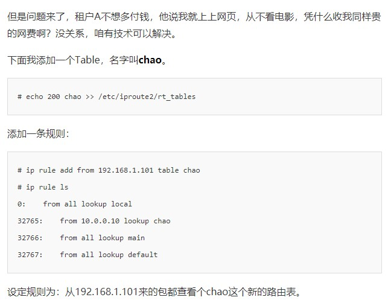
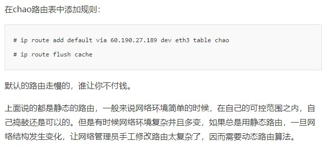

在宿舍用几台机器组了局域网打游戏，可是，不能上网啊！如果你想上网，有两个办法：

第一个办法，让你们宿舍长再买一张网卡。这个时候，你们宿舍长的电脑就有两张网卡了，就可以让宿舍长的`电脑充当路由器`了。

原先的网卡插到你们宿舍的交换机上，新的网卡插到校园网的的网口上。而且，这张新的网卡的IP地址要按照学校网管部门分配的配置，不然上不了网。这种情况下，如果你们宿舍的人要上网，就需要一直开着宿舍长的电脑。当然，win10是可以开热点的，原理也是如此。

第二个办法，买一个路由器，路由器有`内网网口`和`外网网口`。把外网网口的线插到校园网的网口上，将这个外网网口配置成和网管部的一样，内网的连上你们宿舍的所有电脑。这种情况下，如果你们宿舍的人要上网，就需要一直开着路由器。

当然，还得配置网关，不过DHCP能够帮我们做。

---

很多情况下，人们把网关叫做路由器，其实不完全正确。而另一种比喻会更加恰当：`路由器是一台设备，它有五个网口或网卡，相当于有5只手，分别连着5个局域网。每只手的IP地址都和局域网的IP地址相同的网段，每只手都是它握住的那个局域网的网关。`

### 静态路由

这个时候，有一个问题，一个IP数据报来到了网关，该选择哪只手发出去呢？IP头和MAC头加什么内容，哪些变，哪些不变。

这个问题可以分为静态路由和动态路由，我们先来说说静态路由。

静态路由，其实就是在路由器上，配置一条一条规则。这些规则包括：想访问BBS站（它肯定有个网段），从2号口出去，下一跳是IP2；想访问教学视频站（它也有个自己的网段），从3号口出去，下一跳是IP3，然后保存在路由器里。

如果你局域网是192.168.x.x,路由器还得是一个`NAT网关`（Network Address Translation），使用`NAPT`将你的主机IP变成公网的IP。

### 动态路由

静态路由的路由表是自己配置，但是网络世界是很复杂的，一旦出了网关，会面临很多路由器，有很多道路可以选择。

#### 在一个自治系统AS内（RIP，OSPF）

在一个`自治系统AS内`，路由的选择可以抽象为“`在图中寻找最短路径`”，在数据结构中，求最短路径有两种算法，一种是Bellman-Ford算法，一种是Dijkstra算法。在计算机网络中基本也是用这两种方法计算的。

- `RIP(称为距离矢量路由（distance vector routing）`，基于Bellman-Ford算法的)

但是，这个算法有问题，第一个问题是`好消息传得快，坏消息传得慢`。另一个问题是，每次发送的时候，`要发送整个全局路由表`。

- `OSPF（Open Shortest Path First，开放式最短路径优先`，是链路状态路由（link state routing）算法，基于Dijkstra算法）

#### 不同自治系统之间（BGP）

但是外网的路由协议，也即国家之间的，又有所不同。我们称为`外网路由协议（Border Gateway Protocol，简称BGP）`。

BGP又分为两类，`eBGP`和`iBGP`。`自治系统间`，`边界路由器之间使用eBGP广播路由`。`内部网络也需要访问其他的自治系统`。边界路由器如何将BGP学习到的路由导入到内部网络呢？`就是通过运行iBGP，使得内部的路由器能够找到到达外网目的地的最好的边界路由器。`

BGP协议使用的算法是`路径矢量路由协议（path-vector protocol）`。它是距离矢量路由协议的升级版。

前面说了距离矢量路由协议的缺点。其中一个是收敛慢。在BGP里面，除了下一跳hop之外，还包括了自治系统AS的路径，从而可以避免坏消息传的慢的问题，也即上面所描述的，B知道C原来能够到达A，是因为通过自己，一旦自己都到达不了A了，就不用假设C还能到达A了。

另外，`在路径中将一个自治系统看成一个整体`，不区分自治系统内部的路由器，这样自治系统的数目是非常有限的。就像大家都能记住出去玩，从中国出发先到韩国然后到日本，只要不计算细到具体哪一站，就算是`发送全局信息`，也是没有问题的。

### 策略路由

在真实的复杂的网络环境中，还可以`根据多个参数`来`配置路由`，比如你想限制某个IP地址的人`走某一条路由（可能是低速路由）`这个时候就可以用到策略路由。

策略路由的常用命令如下：

假设你们家路由器里的网段是这样子的：

