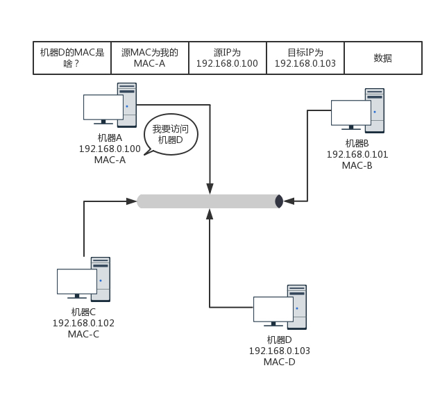

### 第一层（物理层）

在以前，宿舍有两台电脑，就能构成一个`最小的局域网`，也即`LAN`。可以玩联机游戏啦！

如果宿舍的第三个哥们也买了一台电脑，怎么把三台电脑连在一起呢？

有一个叫`Hub`的东西，也就是`集线器`。这种设备有多个口，可以将宿舍里的多台电脑连接起来。但是，和`交换机`不同，集线器没有大脑，它完全在物理层工作。它会将自己收到的每一个字节，都复制到其他端口上去。这是物理层联通的方案。

### 第二层（数据链路层）

`Hub采取的是广播的模式，这需要解决几个问题`：

1. 这个包是发给谁的？谁应该接收？
2. 如果发送的过程出现了错误，怎么办？
3. 大家都在发，会不会产生混乱？有没有谁先发，谁后发的规则？（多路访问）

`数据链路层（MAC层）需要解决上面的问题。`

**解决第一个问题：发给谁？谁接收？**

这里用到一个物理地址：链路层地址，即`MAC地址`。

让我们看一下第二层的网络包格式。

对于以太网，第二层的最开始，就是`目标的MAC地址`和`源的MAC地址`。这里的MAC地址能解决第一个问题。

---

但是，当源主机不知道目标的MAC地址的时候，怎么办？

一个广播广播里面接入了N台机器，怎么知道每个MAC地址是谁的？这就要靠`ARP协议`，也就是`已知IP地址，求MAC地址的协议`。

为了避免每次都用ARP请求，机器`本地`也会进行`ARP缓存`。当然机器会不断地上线下线，IP也可能会变，所以ARP的MAC地址缓存`过一段时间就会过期`。

---

回到第二层的网络包格式，接下来是`类型`(其实很像帧)，大部分的类型是IP数据包，然后IP里面包含TCP、UDP，以及HTTP等，这都是里程封装的事情。

**解决第二个问题：发送过程中出现了错误怎么办？**

对于以太网，第二层后面还有`CRC（循环冗余检查）`，通过一定的算法，来计算整个包在链路传输中，会不会出现`误码（二进制中，1变成0，或0变成1）`，如果出现乱码，就`丢弃这个包`。

---

这里我们额外拓展一下：帧的传输过程。

如果MAC地址正确，数据包在链路上广播，一个MAC的网卡发现这个包是给它的。`MAC的网卡把包收进来`，然后打开IP包，发现IP地址也是自己的，再打开TCP包，发现端口也是自己的，端口号是80（nginx的端口号是80）。

于是将请求提交给ngnix,nginx返回一个网页，将“网页需求”发回请求的机器，然后层层封装，最后到MAC层。因为来的时候有源MAC地址，返回的时候，源MAC地址变成目标MAC，再返回给请求的机器。

当然，`如果这个包不是给他的，他就会丢弃`。

---

**解决第三个问题：“大家都在发，会不会产生混乱？有没有谁先发，谁后发的规则？（多路访问）”：**

`MAC层（Medium Access Control，媒体访问控制）`，是控制在往媒体上发数据的时候，谁先发、谁后发的问题，防止产生混乱。

解决多路访问，有以下几种方式：

1. 分多个车道。每个车一个道，你走你的，我走我的。即`信道划分`。
2. 今天单号出行，明天双号出行，轮着来。即`轮流协议`。
3. 不管三七二十一，有事儿先出门，发现特堵，就回去。错过高峰再出。即`随机接入协议，以太网就是用这个方式`。

解决了第三个问题，就是解决了`媒体接入控制`的问题。局域网采用“CSMA/CD”协议。

### 交换机

这种组网的方法，对一个宿舍来说没有问题，但是因为Hub是`广播`的，机器一旦增多，问题就出现了————我自己的电脑，不需要接收的包（`有MAC地址`,数据链路层都是MAC地址），Hub都转发给我，效率降低，也很浪费。

所以如果Hub能智能点，记录这台机器是在该交换机的哪个口（哪一端），那该多好！`交换机`能做到！

交换机如何做到每个口的电脑的MAC地址呢？交换机是这么做的：

一台MAC1电脑将一个包发送给另一台MAC2电脑，当这个包`到达交换机(这个字眼很重要)`的时候，一开始交换机也不知道MAC2的电脑在哪个口，所以没办法，它只能将包转发给除了来的那个口之外的`其他所有的口`。但是，这个时候，交换机会干一件非常聪明的事情，`就是交换机会记住，MAC1是来自一个明确的口。以后有包的目的地址是MAC1的，直接发送到这个口就可以了`。

当交换机作为一个关卡一样，过了一段时间之后，就有了整个网络的一个结构了，这个时候，基本上不用广播了，全部可以准确转发。当然，每个机器的IP地址会变，所在的口也会变，因而交换机上的学习的结果，我们称为`转发表`，是有一个`过期时间`的。

### 总结

1. MAC层是用来解决多路访问的堵车问题；
2. ARP通过广播的方式寻找目标MAC地址，找到后记住一段时间，这个叫做缓存；
3. 交换机是有MAC地址学习能力的，学完之后会记住一段时间，知道谁在哪儿了，不用广播。
4. “缓存”，“一个端口发送信息，交换机记录这个端口的MAC地址，这种学习能力”强！
