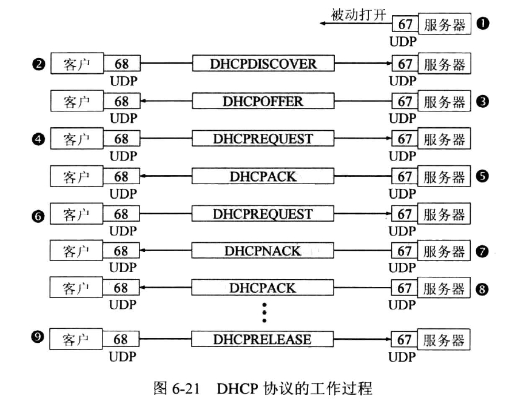
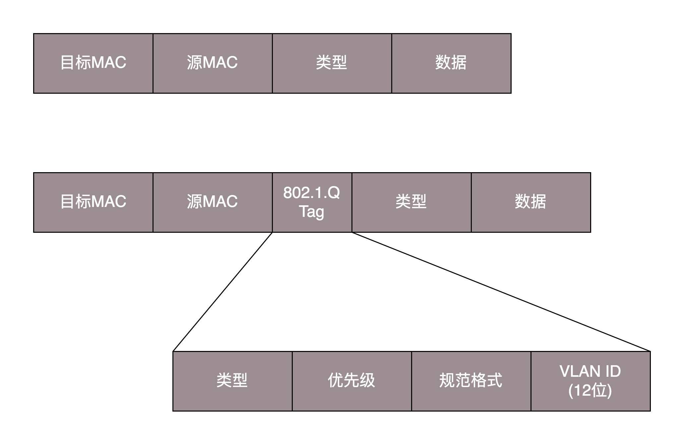

### 网络分层的真实含义是什么？

**TCP三次握手的时候，IP层和MAC层在做什么呢？**

TCP是上层协议。

不同的握手，IP层的目的IP和源IP是不一样；在一次握手中，目的MAC地址需要不断变化才能使得报文能够顺利的从源地址到目的地址。

**需要需要记录中转站的IP地址？**

不需要。一个报文在网络的传输过程中，源IP和目的IP是不会变的，当一个报文到达路由器的时候，会从路由表中找到下一跳的IP地址，然后根据ARP地址解析协议，将目的MAC地址记录在报文中。可以说，MAC地址就是中转站IP地址的体现。

**网络为什么要分层？**

复杂的程序都要分层。

不同的层之间是层层封装的，下层为上层提供服务。凡是在网络跑的包，都是完整的，可以有下层没有上层，但是不能有上层没有下层。

**网络包和网口？**

当一个网络包从网口经过的时候，你看到了，首先看看要不要请进来，处理一把。

有的网口配置了混杂模式，凡是有看到网络包，都要拿进来。

### ifconfig：最熟悉又陌生的命令行

**查看IP地址的命令：**

Windows用 ipconfig， Linux上用 ifconfig, ip addr。

```shell
root@test:~# ip addr
1: lo: <LOOPBACK,UP,LOWER_UP> mtu 65536 qdisc noqueue state UNKNOWN group default 
    link/loopback 00:00:00:00:00:00 brd 00:00:00:00:00:00
    inet 127.0.0.1/8 scope host lo
       valid_lft forever preferred_lft forever
    inet6 ::1/128 scope host 
       valid_lft forever preferred_lft forever
2: eth0: <BROADCAST,MULTICAST,UP,LOWER_UP> mtu 1500 qdisc pfifo_fast state UP group default qlen 1000
    link/ether fa:16:3e:c7:79:75 brd ff:ff:ff:ff:ff:ff
    inet 10.100.122.2/24 brd 10.100.122.255 scope global eth0
       valid_lft forever preferred_lft forever
    inet6 fe80::f816:3eff:fec7:7975/64 scope link 
       valid_lft forever preferred_lft forever
```

ip addr 这个命令可以显示这台机器上的所有网卡。

lo 全称为 loopback，又称为环回接口，一般为127.0.0.1

<BROADCAST,MULTICAST,UP,LOWER_UP> 这一字段为 net_device flags，网络设备的标识状态。  
BROADCAST 代表这个网卡有广播地址，可以发送广播包  
MULTICAST 代表这个网卡可以发送多播包  
UP 代表这个网卡处于启动状态  
LOWER_UP 代表L1启动，也即网线插着

MTU 1500 是MAC层的概念，表示 MAC头 + IP头 + TCP/UDP头 + 报文正文 的长度不能超过1500，如果超过则要分片

**常见的私有地址：**

| 类别  |          私有IP地址           |
| :---: | :---------------------------: |
|   A   |   10.0.0.0 ~ 10.255.255.255   |
|   B   |  172.16.0.0 ~ 172.32.255.255  |
|   C   | 192.168.0.0 ~ 192.168.255.255 |

一个小的局域网里（家庭，办公室，学校），这个局域网里的IP地址一般就用私有地址。但是这个小的局域网和外界沟通，就需要有一个公有IP。

### DHCP与PXE：IP是怎么来的，又是怎么没的？

**旁边的机器都是 192.168.1.x，我非得配置一个 16.158.23.6，会出现什么现象呢？**

**DHCP 动态主机配置协议如何工作：**

<div>
    
<div>

### 从物理层到MAC层：如何在宿舍里自己组网玩联机游戏？

MAC 层是用来解决多路访问堵车问题的。

这个包是发给谁的？谁应该接收？ MAC地址  
大家都在发，会不会产生混乱？有没有谁先发，谁后发的规则？ 信道划分，随机接入协议  
如果发送的时候出现了错误，怎么办？CRC冗余校验码

交换机作用在数据链路层，有`自学习`的功能。

### 交换机与VLAN：办公室太复杂，我要回学校

**如何解决交换机环路的问题？**

一个包，经过交换机的时候，交换机就会进行自学习。

如果在局域网中构成环路，那么报文会不断的在这个环路兜圈，交换机的自学习功能也派不上用场。而且，交换机每次发送出去的时候，会向`所有的端口`都发送一个包，久而久之，就会造成广播风暴。

使用生成树协议(STP协议)解决环路问题

**如何解决广播问题和安全问题？**

使用VLAN。

<div>
    
<div>

我们只需要在原来的二层的头上加一个TAG，里面有一个VALN ID，一共12位。

如果我们买的交换机是支持VLAN的，当这个交换机把二层的头取下来的时候，就能够识别这个VLAN ID。这样只有相同的VLAN的包，才会互相转发，不同的VLAN的包，是看不到的。这样广播问题和安全问题就能解决了.

有人会问交换机之间怎么连接呢？对于支持VLAN的交换机，有一种口叫做`Trunk口`。它可以转发属于任何VLAN的口。交换机之间可以通过这种口互相连接。