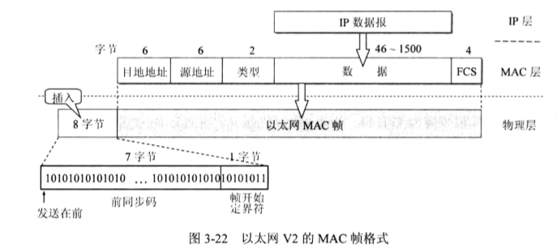

## 网络

### 基础

#### ★★★ 各层协议的作用，以及 TCP/IP 协议的特点

OSI协议的分层是理论性的，划分的很细，但是实际的应用意义不大。

TCP/IP体系结构不严格遵循OSI分层，但是能够应用广泛。

一般在学习理论的时候，会采取折中的办法，学习五层协议。五层协议具体内容如下：

应用层：是为各种`特定的应用程序`提供数据传输服务。例如HTTP协议，DNS协议等

传输层：是为进程提供`通用`的数据传输服务。因为应用层的协议很多，定义通用的数据协议就能够应对不断增多的应用层协议。传输层协议包括两种协议：传输控制协议TCP，提供面向连接的，可靠的数据传输服务，数据单位为报文段；用户数据报协议UDP，提供无连接的，尽最大努力的数据传输服务，单位为用户数据报。TCP 主要提供完整性服务，UDP 主要提供及时性服务。

网络层 ：为`主机`提供`数据传输服务`。而传输层协议是为主机中的进程提供数据传输服务。网络层把传输层传递下来的报文段或者用户数据报封装成`分组`。

数据链路层 ：网络层针对的还是主机之间的数据传输服务，而`主机之间可以有很多链路`，链路层协议就是为同一链路的主机提供数据传输服务。`数据链路层把网络层传下来的分组封装成帧`。

物理层 ：考虑的是怎样在`传输媒体上`传输数据比特流，而不是指具体的传输媒体。物理层的作用是尽可能屏蔽传输媒体和通信手段的差异，使数据链路层感觉不到这些差异。

#### ★★☆ 以太网的特点，以及帧结构

以太网（现在以太网几乎成了局域网的代名词）.因为局域网有很多主机，以太网采用的CSMA/CD协议（载波监听多点接入/动态检测）来防止同一个信道中传输多个信息。

在局域网中，硬件地址又称为物理地址或MAC地址。现在的MAC地址都是6个字节（48位）。

#### ★★☆ 集线器、交换机、路由器的作用，以及所属的网络层

#### ★★☆ IP 数据数据报常见字段的作用

#### ★☆☆ ARP 协议的作用，以及维护 ARP 缓存的过程

#### ★★☆ ICMP 报文种类以及作用；和 IP 数据报的关系；Ping 和 Traceroute 的具体原理

#### ★★★ UDP 与 TCP 比较，分析上层协议应该使用 UDP 还是 TCP

#### ★★★ 理解三次握手以及四次挥手具体过程，三次握手的原因、四次挥手原因、TIME_WAIT 的作用

#### ★★★ 可靠传输原理，并设计可靠 UDP 协议

#### ★★☆ TCP 拥塞控制的作用，理解具体原理

#### ★★☆ DNS 的端口号；TCP 还是 UDP；作为缓存、负载均衡

### HTTP

#### ★★★ GET 与 POST 比较：作用、参数、安全性、幂等性、可缓存

#### ★★☆ HTTP 状态码

#### ★★★ Cookie 作用、安全性问题、和 Session 的比较

#### ★★☆ 缓存 的Cache-Control 字段，特别是 Expires 和 max-age 的区别。ETag 验证原理

#### ★★★ 长连接与短连接原理以及使用场景，流水线

#### ★★★ HTTP 存在的安全性问题，以及 HTTPs 的加密、认证和完整性保护作用

#### ★★☆ HTTP/1.x 的缺陷，以及 HTTP/2 的特点

#### ★★★ HTTP/1.1 的特性

#### ★★☆ HTTP 与 FTP 的比较

### Socket

#### ★★☆ 五种 IO 模型的特点以及比较

#### ★★★ select、poll、epoll 的原理、比较、以及使用场景；epoll 的水平触发与边缘触发

