##### Java基础

1. finalize 垃圾回收的时候调用，一般用于资源的释放

2. catch, finally  相当于一个新的函数，如果达不到的位置，写了代码机会报错

3. stream流

   >  <https://www.jianshu.com/p/6fdc94ea577d>

   

   ```java
   // 携程 
   
   class WorkflowNode {
       String nodeId;
       int timeoutMillis;
       List<WorkflowNode> nextNodes;
       boolean initialised;
   
       public WorkflowNode(String nodeId) {
           this.nodeId = nodeId;
       }
   
       public static WorkflowNode load(String value) {
           // Create head node;
           Map<String, WorkflowNode> map = new HashMap<>();
           WorkflowNode head = new WorkflowNode("HEAD", 0, null);
           map.put(head.nodeId, head);
   
           for (String nodeValue : value.split("\\|")) {
               String[] properties = nodeValue.split("\\`");
               WorkflowNode node = map.get(properties[0]);
   
               node.timeoutMillis = Integer.parseInt(properties[1]);
               node.initialised = true;
   
               // Check next nodes
               if (properties[2].equals("END")) {
                   continue;
               }
               
               // nextNodes 结点
               // 利用stream流获取nextNodes结点
               node.nextNodes = Arrays.stream(properties[2].split(","))
                       .map(p -> map.containsKey(p) ? map.get(p) : new WorkflowNode(p, 0, null))
                       .collect(Collectors.toList());
   
               map.put(node.nodeId, node);
               //
           }
   
           return head;
       }
   
       public WorkflowNode(String nodeId, int timeoutMillis, List<WorkflowNode> nextNodes) {
           this.nodeId = nodeId;
           this.timeoutMillis = timeoutMillis;
           this.nextNodes = nextNodes;
       }
   }
   ```

   ```java
   // int[] 转 List<Integer>
   List<Integer> list = Arrays.stream(ints).boxed().collect(Collectors.toList());
   
   //int[] 转 Integer[]
   // Integer[]::new, 的new方法
   Integer[] integers = Arrays.stream(ints).boxed().toArray(Integer[]::new);
   
   // List<Integer> 转 int[]
   int[] ints = list.stream().mapToInt(Integer::valueOf).toArray();
   
   // Integer[] 转 int[]
   int[] ints = Arrays.stream(integers).mapToInt(Integer::valueOf).toArray();
   
   // Integer[] 转 List<Integer>
   List<Integer> list = Arrays.stream(integrs);
   
   // List<Integer> 转 Integer[]
   Integer[] integers = list.toArray(new Integer[list.size()]);
   ```

   


### 自我介绍

1. 应届生，参照了网上资料 秒杀系统，做了一些拓展。在前段时间的实习，做的项目主要是 持续集成，持续部署的开发。自己也喜欢将学习到的知识整理成博客。

### 反问

1. 自己回答不出来的问题
2. 部门的具体业务
3. 自己值得改进的地方
4. 职业规划

---


### 项目中用到的集合，源码

1. ArrayList从数据库取出多条数据，HashMap将这个数据放到HashMap中去，因为秒杀系统是热点数据，如果用户进行查找，直接从 HashMap中取出来，（手机名，iPhone 10）
2. ArrayList 底层是数组，add，扩容
3. HashMap，1.8，put，数组是否为空，初始化容量 16，key 扰动函数 hash, &(容量 n  - 1)， 判断有没有元素，没有元素，就插入，size++, threadhold比较。如果说有元素的话，判断 key相等，覆盖，不相等话，treeNode, 不是的话，遍历数组，8，64 转换成红黑树
4. resize , 初始化，size >= threadhold, 2倍的方式进行扩容

---


### 详细说说你的项目业务逻辑和使用的技术栈

1. 登录，@valid，注解进行数据验证，redis判断有没有这个对象（有预热），MySQL，查不到这个对象，查到 密码验证，cookie，tooken
2. 秒杀，秒杀地址进行验证，秒杀结束标志，redis预减库存，更新标志，消息队列中去，标记（客户端轮询），redis中是否用用户Id的订单，是否重复秒杀，MySQL减库存生成订单，更新标志。
3. `public class GlobalException extends RuntimeException`, 拦截器`extends HandlerInterceptorAdapter`

---


### 多线程怎么理解，怎么实现多线程

1. 程序调度基本单位，多线程，Java
2. 继承 Runnable， Callable,  继承Thread， Callable需要再封装成FutureTask，获取到运行的返回结果

### 动态代理、cglib

> <https://apppukyptrl1086.pc.xiaoe-tech.com/detail/v_5e0cba7b5f987_rEHvwPy7/3?from=p_5dd3ccd673073_9LnpmMju&type=6>

其实就是动态的创建一个代理类出来，创建这个代理类的实例对象，在这个里面引用你真正自己写的类，所有的方法的调用，都是先走代理类的对象，他负责做一些代码上的增强，再去调用你写的那个类

 

spring里使用aop，比如说你对一批类和他们的方法做了一个切面，定义好了要在这些类的方法里增强的代码，spring必然要对那些类生成动态代理，在动态代理中去执行你定义的一些增强代码

 

如果你的类是实现了某个接口的，spring aop会使用jdk动态代理，生成一个跟你实现同样接口的一个代理类，构造一个实例对象出来，jdk动态代理，他其实是在你的类有接口的时候，就会来使用

 

很多时候我们可能某个类是没有实现接口的，spring aop会改用cglib来生成动态代理，他是生成你的类的一个子类，他可以动态生成字节码，覆盖你的一些方法，在方法里加入增强的代码

 


---


#### 1. 代理机制的介绍

代理机制是JavaSE 1.3新增加的特性。利用代理机制可以`在运行时` 创建一个 `实现了一组给定接口的新类`。

spring的IoC是用了代理来实现`解耦【在编译期间减少类和类之间的依赖】`，AOP用代理来实现`方法的增强`，也可以在编译时无法确定（哪个实现类）需要实现某个接口时使用。

<!-- more -->

假设有一个`表示接口`的Class对象（有可能只包含一个接口 ）,它的`确切类型`在编译时无法知道。因为我不知道它的确切类型，所以要想构造一个实现这些接口的类（设为类A），不能简单的new出来。那能怎么做呢？利用反射！使用`newlnstance方法或反射找出这个类的构造器`。那要怎么执行类A的方法method()呢？因为Java`不能实例化一个接口`，需要在程序处于运行状态时`定义一个新类【即代理类】`，然后在这个新类【即代理类】的方法中执行A的方法method()。

代理类能够实现指定的接口。它具有下列方法：

- 指定接口所需要的全部方法。
- Object类中的全部方法，例如，toString, equals等

#### 2. 调用处理器

好，现在我们知道了代理类是为了什么而产生的了，那要怎么实现这个代理类呢？

要定义该代理类，`首先`要提供一个`调用处理器（invocation handler）`,调用处理器的作用是在代理类中调用类A的方法，以便能够在程序运行时，运行A的方法，当然，也可以对类A的方法进行增强。

`调用处理器`是实现了InvocationHandler接口的类对象。在这个接口中只有一个方法：

```java
Object invoke(Object proxy, Method method, Object[] args)
```

我们来解释一下invoke()方法怎么发挥代理的作用。调用代理对象任何的方法，调用处理器InvocationHandler的invoke方法会被调用执行。invoke方法表示：无论外界要执行什么方法，都必须经过invoke()方法，而外界的方法method保存在`Method对象`中，方法的参数保存在`Object args[]`中。

#### 3. 代理对象实例代码

我们先来看一下实现代理对象的实例代码，后面再解释代码。

```java
public class ProxyTest {
    public static void main(String[] args) {
        Object[] elements = new Object[1000];

        //每个代理对象的属性target赋值1~1000
        for (int i = 0; i < elements.length; i++) {
            Integer value = i + 1;
            //处理器，处理器你也可以写成匿名内部类
            InvocationHandler handler = new TraceHandler(value);
            Object proxy = Proxy.newProxyInstance(null, new Class[]{Comparable.class}, handler);
            //elements每个元素都是proxy
            elements[i] = proxy;
        }

        //随机函数获得一个key
        Integer key = new Random().nextInt(elements.length) + 1;

        //利用二分查找，打印出找key的过程
        int result = Arrays.binarySearch(elements, key);

        //打印出相匹配的结果
        if (result >= 0) {
            System.out.println(elements[result]);
        }
    }
}

/**
 * 调用处理器，先打印出方法和名字，然后再调用原来的方法
 */
class TraceHandler implements InvocationHandler {

    private Object target;

    public TraceHandler(Object t) {
        target = t;
    }

    public Object invoke(Object proxy, Method method, Object[] args) throws Throwable {
        //打印出查找的位置的target，二分查找，从中点开始查找，第一个数肯定是500
        System.out.print(target);
        //打印出调用方法的名字
        System.out.print(":" + method.getName() + "(");
        if (args != null) {
            for (int i = 0; i < args.length; i++) {
                //打印出参数，二分查找的参数是查找的“key”
                System.out.print(args[i]);
                if (i < args.length - 1) {
                    System.out.print(", ");
                }
            }
            System.out.println(")");
        }
        //调用原来的方法，即二分查找的compareTo()，对比方法
        return method.invoke(target, args);
    }
}
```

结果为：

```text
500:compareTo(708)
750:compareTo(708)
625:compareTo(708)
687:compareTo(708)
718:compareTo(708)
702:compareTo(708)
710:compareTo(708)
706:compareTo(708)
708:compareTo(708)
708:toString()
```

#### 3. 创建一个代理对象

创建一个代理对象,`调用处理器（invocation handler）`只是需要的一部分，现在我们来看看该`代理对象`是怎么实现的？

需要`使用Proxy类的newPmxylnstance方法`。这个方法冇三个参数：

- `类加载器(class loader)`。作为Java安全模型的一部分，对于系统类和从因特网上下载下来的类，可以使用不同的类加载器，后面我们再详细谈论类加载器。  
目前，用null表示使用默认的类加载器。  
- `Class对象数组`，每个Class对象都是类A需要实现的接口。
- 一个`调用处理器（invocation handler）`。

上面我们知道调用处理器的invoke()。那如何定义一个调用处理器(invocation handler)呢？能够用结果代理对象做些什么？当然， 这两个问题的答案取决于打算使用代理机制解决什么问题，使用代理可能出于很多原因，例如：

- 路由对远程服务器的方法调用
- 在程序运行期间，将用户接口事件与动作关联起来
- 为调试，跟踪方法调用

在下面的示例中，使用代理和调用处理器`跟踪方法调用`，并且定义了一个`TraceHander包装器类`存储包装的对象。其中的`invoke方法打印出被调用方法的名字和参`数【方法的增强】，随后用包装好的对象作为隐式参数调用这个方法.

```java
class TraceHandler implements InvocationHandler{
    private Object target;

    public TraceHandler(Object t){
        target t;
    }

    public Object invoke(Objact proxy, Method m, Object[] args) throws Thnotable
    {
        // print method name and parameters【方法的增强】
        ...
        // invoke actual method【调用原来的方法】
        return m.invoke{target, args);
    }

}
```

下面说明一下如何构造：用于`跟踪方法调用`的代理对象。

```java
Object value = ···;
// construct wrapper构造包装
InvocationHardler handler = new TraceHandler(value);
// cunstruct proxy for one or more interfaces
Class[] interfaces = new Class[] {Comparable.class};
//代理对象
Object proxy = Proxy.newProxyInstaiice(nul1, interfaces, handler);
```

现在，proxy成为代理对象。这时，无论何时用proxy调用哪个方法，这个方法的名字和参数就会打印出来，之后再用value调用它。

在下面的代码中，使用代理对象对二分査找进行跟踪。这里，首先将用1~1000整数的代理填充数组，然后调用Arrays类中的binarySearch方法在数组中査找一个随机整数e。最后，打印出与之匹配的元素。

```java
Object[] elements = new Object[1000];
// fill elements with proxies for the integers 1~1000  
for (int i =0; i < elownts.length; i++){
    Integtr value = i + 1；
    // proxy for value，elements成为代理对象，elements执行的任何方法都会首先执行invoke()方法;
    elenments[i] = Proxy.newlnstance(...); 
}

// construct a random integer
Integer key = new Rartdom().nextInt(elements.length) + 1;

// search for the key
int result = Arrays.birarySearch(elements, key);

// print natch if found
if (result >= 0) {
    System.out.prirvtln(elements[result]);
}
```

在上述代码中，Integer类实现了`Comparable接口`【数值比较】。代理对象属于在运行时定义的类（它有一个名字，如$Proxy0）。`这个代理类也实现了Compamble接口`。然而，它`的compareTo方法调用了代理对象处理器的invoke方法`。

> 注释：在Java SE 5.0中Integer类实际上实现了 Comparable[Integer]。然而，在运行时，所有的泛型类都被取消，代理将它们构造为原Comparable类的类对象。

binary Search方法按下面这种方式调用：

```java
if (elements[i].compareTo[key) < 0)...
```

由于数组中填充了代理对象，所以`compareTo调用了TraceHander类中的invoke方法`。这个方法打印出了方法名和参数，之后用包装好的Integer对象调用compareTo。

最后，在实例程序的结尾调用：

```java
System.out.println(elemenets[results]);
```

println方法调用代理对象的toString,这个调用也会被重定向到调用处理器上，下面是程序运行的全部跟踪结果：

```text
500:compareTo(708)
750:compareTo(708)
625:compareTo(708)
687:compareTo(708)
718:compareTo(708)
702:compareTo(708)
710:compareTo(708)
706:compareTo(708)
708:compareTo(708)
708:toString()
```

可以看出，二分査找算法査找关键字的过程，即每一步都将查找区间缩减一半。注意，即使不属于Comparable接口，toString方法也被代理。

#### 5. 代理类的特性

上面，我们看到了代理类的应用，接下来，我们来了解一下它们的一些特性。

需要记住，`代理类是在程序运行过程中创建的`。然后，`一旦被创建，就变成了常规类，与虚拟机中的任何其他类没有什么区别`。

所有的代理类都拓展于roxy类。`一个代理类只有一个实例域--调用处理器`，它定义在Proxy的超类中。为了履行代理对象的职责，`所需要的任何附加数据都必须存储在调用处理器中`。例如，在例6-7给出的程序中，代理Comparable对象时，`TranceHandler包装了实际的对象`。

所有的代理类都覆盖了Object类中的方法`toString、equals和hashCode`。如同所有的代理方法一样，这些方法仅仅`调用了处理器的invoke`。Object类中的其他方法（如`clone和getClass`）`没有被重新定义。`

没有定义代理类的名字，Sun虚拟机中的Proxy类将生成一个以字符串`$Proxy`开头的类名。

对于特定的类加载器和预设的一组接口来说，`只能有一个`代理`类`。也就是说，如果使用`同一个类加载器`和`接口`调用`两次newProxyInstance`方法的话，那么只能够得到`同一个类的两个对象`，也可以利用getProxyClass方法获得这个类。

```java
Class proxyClass = Proxy.getProxyClass(null,interfaces);
```

代理类一定是public和final。如果代理类实现的所有接口都是public，代理类就不属于某个特定的包；否则，所有非共有的接口都必须属于同一个包，同时，代理类也属于这个包。

可以通过调用Proxy类中的isProxyClass方法检测一个特定的Class对象是否代表一个代理类。

**代理对象的方法：**

```java
//返回指定接口的代理类
static Class getProxyClass(ClassLoader loader,Class[] interfaces)

//构造一个实现指定接口的代理类的实例。所有的方法都将调用给指定处理器对象的invoke方法
static object newProxyInstance(ClassLoader loader,Class[] interfaces, InvocationHandler handler)

//定义代理对象调用方法时希望执行的动作
Object invoke(Object proxy, Method method, Object[] args)

//如果c是一个代理类返回true
static boolean isProxyClass(Class c)
```


### ping, tracert

1. ICMP，ICMP的回送请求和回送回答报文。ping 是应用层直接使用 ICMP的一个例子，没有经过运输层
2. 向目的主机发送4个ICMP回送请求报文，目的主机收到后，返回回送回答报文，因为有时间戳，所以很容易计算出往返时间
3. tracert，ttl从1开始设置，然后逐渐增大，这样子就可以得到报文经过的路由器。tracert中封装的是无法交付的UDP用户数据报

---


### 内部类有哪些分类，有什么特点？


### 泛型和泛型擦除

### 泛型标记

1. E, N, T, K, V, ?

### 泛型限定

1. ? extends T, ? super T

---

### Java基础其他

向上转型+重载， 只有方法表现多态。 如果 `Parent parent = new Son();  parent.sum 是父类的`

---


son.join()

---


谈谈对synchronized的理解

---


对象头信息

---


monitor对象

---


单例模式，双重锁检测为什么要写 volatile，防止指令重排序

> <https://cloud.tencent.com/developer/article/1475758>
被volatile关键字修饰的对象作为类变量或者实例变量时，`其对象中携带的类变量和实例变量`也相当于被volatile关键字修饰

---


AQS

---


谈谈你对 ReentrantLock的理解

---


ConcurrentHashMap

---


创建线程的的方式，还有线程池（`Executors.newFixedThreadPool`）

---


OOM

---


垃圾收集器

ZGC：多重映射 染色指针，如果标志位更新了，那么就直接从重分配集中去查找。自愈

---


类的加载机制

双亲委派模型

---

### 计算机网络其他

DNS端口

HTTP端口

HTTPS端口

---


DNS原理和步骤？

顶级域名服务器、根据名服务器、权限域名服务器

---


### 消息队列的优点？

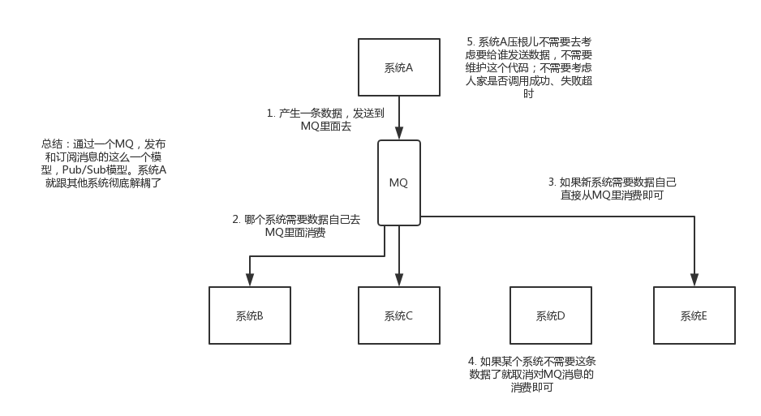

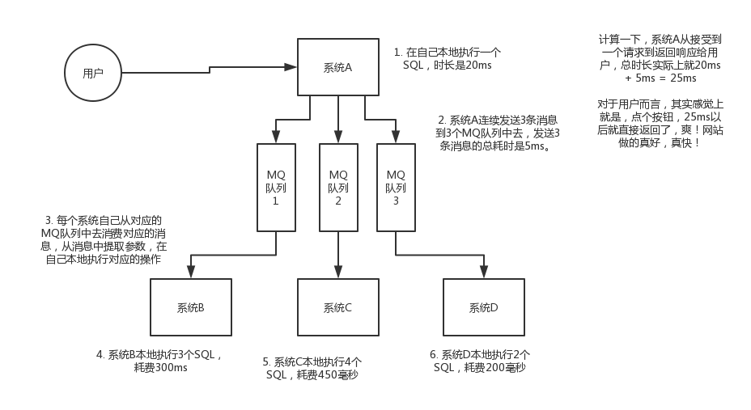

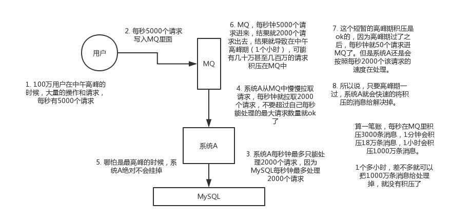

---

### HTTP1.1 和 HTTP2.0

HTTP 1.1: 长连接、流水线

HTTP 2.0: 二进制分层、首部压缩、服务端推送

---

### 解决哈希冲突

Hash的原理：链表、开放地址法

---

### 虚拟内存

虚拟内存，页面置换算法


```java
class Singleton {
    private static volatile Singleton instance;
    private Singleton() {}
    
    public static Singleton() {
        if (instance == null) {
            synchroniezd(Singleton.class) {
                if (instance == null) {
                    intance = new Singleton();
                }
            }
        }
        return instance;
    }
}
```

---

### NIO AIO BIO

BIO：同步阻塞

NIO：同步非阻塞

AIO：异步非阻塞

- A顾客去吃海底捞，就这样干坐着等了一小时，然后才开始吃火锅。(BIO)

- B顾客去吃海底捞，他一看要等挺久，于是去逛商场，每次逛一会就跑回来看有没有排到他。于是他最后既购了物，又吃上海底捞了。（NIO）

- C顾客去吃海底捞，由于他是高级会员，所以店长说，你去商场随便玩吧，等下有位置，我立马打电话给你。于是C顾客不用干坐着等，也不用每过一会儿就跑回来看有没有等到，最后也吃上了海底捞（AIO）

---

### Java线程和 操作系统线程的关系

大多数Java虚拟机采用的 1:1 线程模型（映射到核心级线程）

---

### 查看磁盘大小

du -ah 查看当前磁盘 （Disk Used）

df -h (Disk Free)

| -a  | 显示目录中所有文件大小 |
| --- | ---------------------- |
| -k  | 以KB为单位显示文件大小 |
| -m  | 以MB为单位显示文件大小 |
| -g  | 以GB为单位显示文件大小 |
| -h  | 以易读方式显示文件大小 |
| -s  | 仅显示总计             |

---

### IO多路复用

io多路复用：

1. 通过一种机制，让一个进程监听多个套接字(非阻塞异步)
2. 系统调用

---

### 项目的改良点1

> 记录防止忘记： 服务器的带宽很重要， 1Mbps 和 20Mbs  QPS差距很大
>
> 


### nginx:

nginx面试题：<https://juejin.im/post/6844904125784653837>

为什么使用nginx： http服务器， 反向代理负载均衡， 简单

反向代理和正向代理的区别：正向代理中，服务器不知道真正的客户端到底是谁，以为访问自己的就是真实的客户端。而在反向代理中，客户端不知道真正的服务器是谁，以为自己访问的就是真实的服务器。

正向代理和反向代理的作用和目的不同。正向代理主要是用来解决访问限制问题。而反向代理则是提供负载均衡、安全防护等作用。二者均能提高访问速度。

nginx高性能的原因：<https://blog.csdn.net/yin__ren/article/details/93619025> 1. io多路复用， 2. master-worker进程模型 3. 协程机制

负载均衡算法：轮询、加权轮询、最小连接数、加权最小连接、IP hash、 随机

```
upstream backserver { 
 server 192.168.0.12 weight=2; 
 server 192.168.0.13 weight=8; 
} 
```


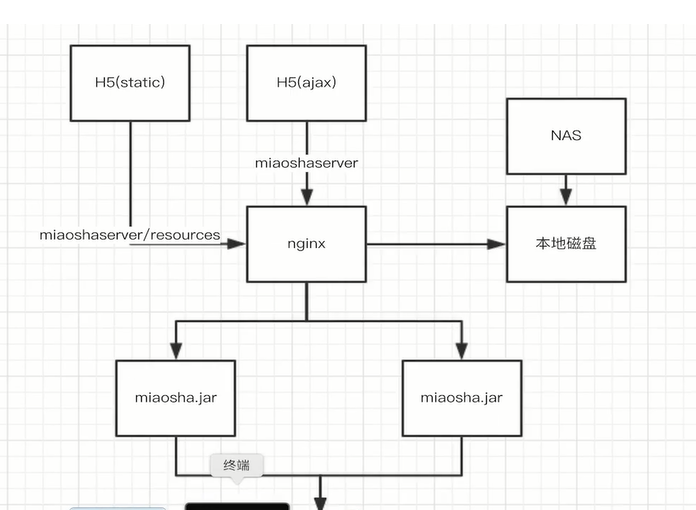

nginx做静态资源服务器

server模块下的location

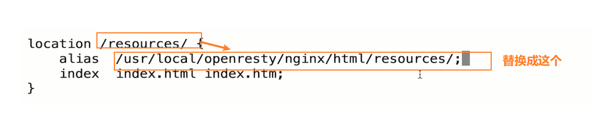

nginx负载均衡

配置`upstream`并选择负载均衡策略

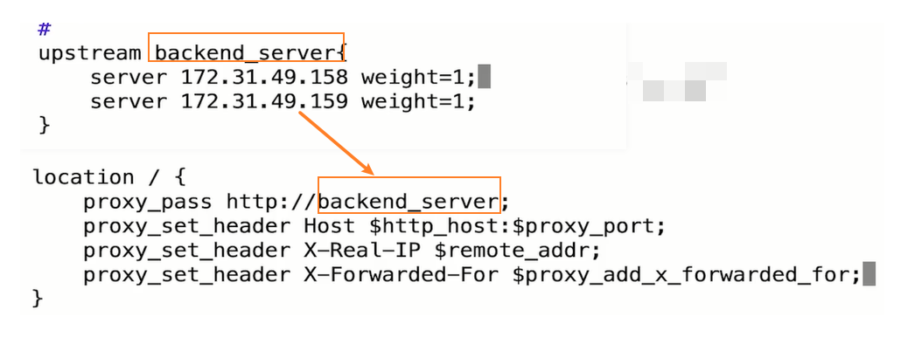

### 分布式session

**解决方案：**

- 使用cookie来完成（很明显这种不安全的操作并不可靠）
- 使用Nginx中的ip绑定策略，同一个ip只能在指定的同一个机器访问（不支持负载均衡）
- 利用数据库同步session（效率不高）
- 使用tomcat内置的session同步（同步可能会产生延迟）
- 使用token代替session
- **我们使用spring-session以及集成好的解决方案，存放在redis中**

作者：java高级架构41397
链接：<https://juejin.im/post/6844903740479160334>
来源：掘金
著作权归作者所有。商业转载请联系作者获得授权，非商业转载请注明出处。


### 架构

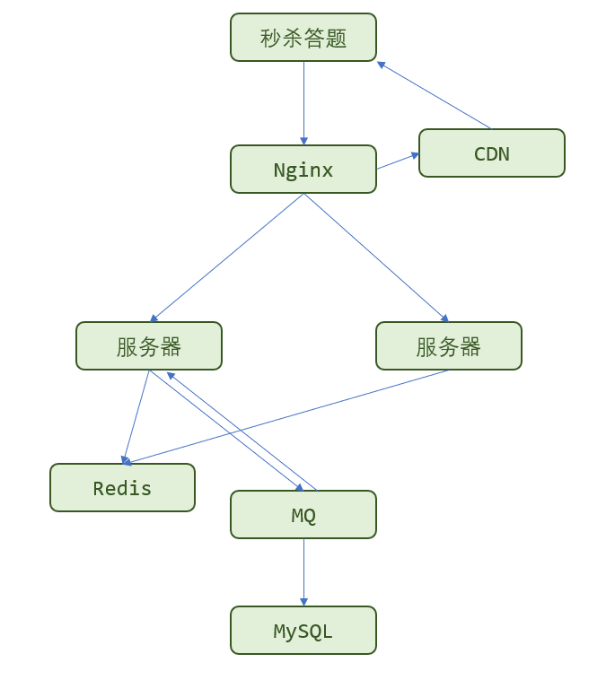

秒杀系统：

请求量从 1w/s 到 10 w/s，架构改造：

1. 将秒杀系统模块独立出来，对这个系统做针对性的优化
2. 服务器集群也独立出来，这样大流量不会影响到其他商品
3. 添加redis
4. 秒杀答题

请求量从10w/s 到 100w/s，架构改造：

1. 动静分离，使用CDN，把页面刷新页面传送的数据减少到最小


### 怎么保证缓存的数据和Mysql的数据的一致性。CAP理论

1. 在分布式系统中，C 一致性 A 可用性 P 分区容忍性（多个服务器的时候，通信延迟是存在）
2. P是通信延迟，一般来讲，这个是存在的，所以我们只能从 C 和 A中做出权衡
3. 选择了 C 一致性的话，修改的时候，多个服务器就要同时被锁定，失去了 A
4. 选择了 A 可用性的锁，多个服务器肯定不能被锁定，所以失去了 C

### BASE理论：

1. BA 基本可用性， S 软状态 E 最终一致性
2. BASE理论是 一致性 和 可用性做出的权衡，即，不强制存在强一致性，我们只保证最终一致性


秒杀系统就是有大量的读请求和写请求

1. 写请求的瓶颈一般是存储层，利用CAP利用，做出权衡
2. 读请求

### 热点数据：分为静态热点数据、动态热点数据。

1. 静态热点数据就是能够提前预测的数据，可以通过买家报名的方式，提前对热点数据打上标签。`做预热`
2. 动态热点数据就不能提前预测，比如抖音上突然某种产品火了，这里就只能做限流处理，进行保护。也需要发现动态热点数据。可以分析各个环节中间件的热点key，比如 Nginx的热点URL(<https://www.jianshu.com/p/537a0bddda94>)


### 削峰的本质是延迟对请求的处理，让服务器处理的更加平滑。有几种方式：

1. 无损操作（不会丢弃用户的请求）：
   1. 排队： 消息队列，线程池加锁等待，先进先出的内存排队算法，把请求序列话到文件中，然后再顺序的读取
   2. 答题：答题的图片也可以做成CDN
   3. 分层过滤：对读数据不做强一致校验，根据CAP，因为这样子会造成性能瓶颈。限流保护
2. 有损操作：限流


尽量将不影响性能的检查条件提前，如用户是否具有秒杀资格、商品状态是否正常、用户答题是否正确、秒杀是否已经结束、是否非法请求、营销等价物是否充足等；

### 检查的条件包括：

1. 用户是否存在
2. 秒杀答题对不对
3. 是否拿到了令牌
4. 秒杀是否已经结束
5. 秒杀的商品是否是否在内存中

### 如何提升QPS

服务器端的性能一般和QPS相关。

总 QPS =（1000ms / `响应时间`）× `线程数量`

对大部分的Web系统来说，响应时间一般是由CPU执行时间和等待时间（RPC、IO、Sleep、Wait）组成的。

在实际情况下，等待时间对QPS的影响不大，因为等待的时间，其他线程也会有CPU，这点就可以弥补。对QPS影响真正大的是，CPU的执行时间。

如果`减少CPU的执行时间`，就可以增加一倍的QPS。

在多线程的场景下，`线程数 = 2 * CPU核数 + 1`。当然，最好的办法是通过性能测试来发现最佳的线程数。


CPU的利用率不高，是否有太多的锁？


### 如何发现瓶颈， 并提升

1. 对服务器而言，出现瓶颈会有很多地方，IO、内存、CPU。在秒杀场景中，瓶颈更多是在CPU上。
2. 如何解决CPU瓶颈呢？ 利用CPU诊断工具发现CPU的消耗，最常用的有JProfiler 和 Yourkit 这两个工具。看看哪个函数执行时间最长，然后做定制优化。

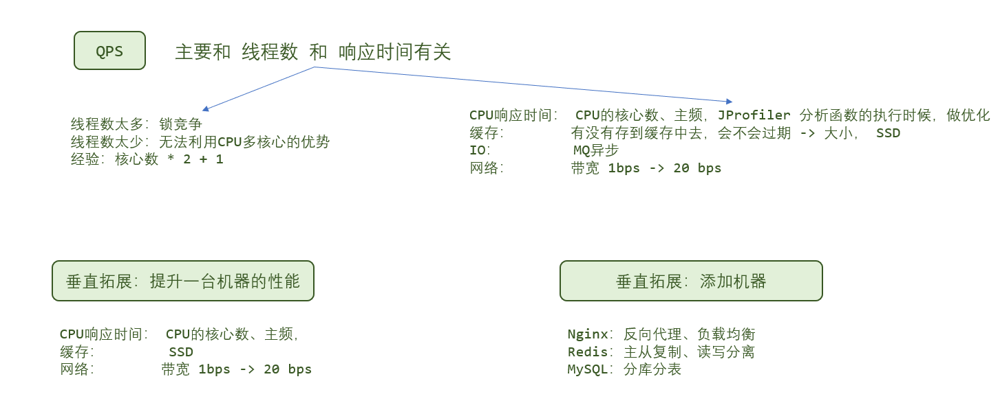

还可从考虑从以下方面进行调整：【垂直扩展】

1. 提升硬件条件：CPU核数、主频、内存、磁盘I/O、SSD、网卡等
2. JVM性能调优
3. 缓存


### 如果用户买后不付款，怎么确保不少买

1. 在Redis中，将订单id放到一个Set中
2. 30分钟后流量没有那么多了，每隔1分钟查一下Set的容量，根据Set容量重新设置库存


### 为什么要设置令牌的数量？

首先设置令牌是为了防止用户提前秒杀。

令牌只是redis中的一个值，秒杀开始后，这个值会生成。用户获取到令牌后，在redis中设置key为UUID，value为 “用户id＋秒杀的商品id”。并返回这个 UUID cookie。

用户下一次是真正的秒杀，会带上 UUID。

不减掉令牌后，直接秒杀的原因是：如果直接秒杀，假设用户在还剩５秒的时候发送请求，剩下０秒的时候到达服务器，这个时候令牌生成，就可直接秒杀了。和秒杀时间到了之后，　再进行秒杀有区别。

1. 是库存的3倍，或者5倍。因为太多后面也抢不到
2. 而且，如果说秒杀的商品有几万件，比如牛奶，那太多的令牌会占用服务端资源


预扣库存方案中如何确保十分钟后库存自动解冻？定时任务还是会有延迟吧？

自动解冻可以在应用程序中设置一个定时器来定时扫描数据库的下单时间，来比较是否已经超时延时一点问题也不大，因为超时时间也是人为主观设置的

定时器实现： while + sleep()

令牌桶：允许突发流量

令牌桶和漏桶对比： 令牌桶的主要目的是保护自身不被大流量冲垮，漏桶是对接的下游系统，像第三方系统（承受不了大流量）

```java
	@Override
    public String generateSecondKillToken(Integer promoId,Integer itemId,Integer userId) {

        //判断是否库存已售罄，若对应的售罄key存在，则直接返回下单失败
        if(redisTemplate.hasKey("promo_item_stock_invalid_"+itemId)){
            return null;
        }
        PromoDO promoDO = promoDOMapper.selectByPrimaryKey(promoId);

        //dataobject->model
        PromoModel promoModel = convertFromDataObject(promoDO);
        if(promoModel == null){
            return null;
        }

        //判断当前时间是否秒杀活动即将开始或正在进行
        if(promoModel.getStartDate().isAfterNow()){
            promoModel.setStatus(1);
        }else if(promoModel.getEndDate().isBeforeNow()){
            promoModel.setStatus(3);
        }else{
            promoModel.setStatus(2);
        }
        //判断活动是否正在进行
        if(promoModel.getStatus().intValue() != 2){
            return null;
        }
        //判断item信息是否存在
        ItemModel itemModel = itemService.getItemByIdInCache(itemId);
        if(itemModel == null){
            return null;
        }
        //判断用户信息是否存在
        UserModel userModel = userService.getUserByIdInCache(userId);
        if(userModel == null){
            return null;
        }

        //获取秒杀大闸的count数量
        long result = redisTemplate.opsForValue().increment("promo_door_count_"+promoId,-1);
        if(result < 0){
            return null;
        }
        //生成token并且存入redis内并给一个5分钟的有效期
        String token = UUID.randomUUID().toString().replace("-","");

        redisTemplate.opsForValue().set("promo_token_"+promoId+"_userid_"+userId+"_itemid_"+itemId,token);
        redisTemplate.expire("promo_token_"+promoId+"_userid_"+userId+"_itemid_"+itemId,5, TimeUnit.MINUTES);

        return token;
    }
```

```java
	@RequestMapping(value = "/createorder",method = {RequestMethod.POST},consumes={CONTENT_TYPE_FORMED})
    @ResponseBody
    public CommonReturnType createOrder(@RequestParam(name="itemId")Integer itemId,
                                        @RequestParam(name="amount")Integer amount,
                                        @RequestParam(name="promoId",required = false)Integer promoId,
                                        @RequestParam(name="promoToken",required = false)String promoToken) throws BusinessException {

        if(!orderCreateRateLimiter.tryAcquire()){
            throw new BusinessException(EmBusinessError.RATELIMIT);
        }

        String token = httpServletRequest.getParameterMap().get("token")[0];
        if(StringUtils.isEmpty(token)){
            throw new BusinessException(EmBusinessError.USER_NOT_LOGIN,"用户还未登陆，不能下单");
        }
        //获取用户的登陆信息
        UserModel userModel = (UserModel) redisTemplate.opsForValue().get(token);
        if(userModel == null){
            throw new BusinessException(EmBusinessError.USER_NOT_LOGIN,"用户还未登陆，不能下单");
        }
        //校验秒杀令牌是否正确
        if(promoId != null){
            String inRedisPromoToken = (String) redisTemplate.opsForValue().get("promo_token_"+promoId+"_userid_"+userModel.getId()+"_itemid_"+itemId);
            if(inRedisPromoToken == null){
                throw new BusinessException(EmBusinessError.PARAMETER_VALIDATION_ERROR,"秒杀令牌校验失败");
            }
            if(!org.apache.commons.lang3.StringUtils.equals(promoToken,inRedisPromoToken)){
                throw new BusinessException(EmBusinessError.PARAMETER_VALIDATION_ERROR,"秒杀令牌校验失败");
            }
        }

        //同步调用线程池的submit方法
        //拥塞窗口为20的等待队列，用来队列化泄洪
        Future<Object> future = executorService.submit(new Callable<Object>() {

            @Override
            public Object call() throws Exception {
                //加入库存流水init状态
                String stockLogId = itemService.initStockLog(itemId,amount);


                //再去完成对应的下单事务型消息机制
                if(!mqProducer.transactionAsyncReduceStock(userModel.getId(),itemId,promoId,amount,stockLogId)){
                    throw new BusinessException(EmBusinessError.UNKNOWN_ERROR,"下单失败");
                }
                return null;
            }
        });

        try {
            future.get();
        } catch (InterruptedException e) {
            throw new BusinessException(EmBusinessError.UNKNOWN_ERROR);
        } catch (ExecutionException e) {
            throw new BusinessException(EmBusinessError.UNKNOWN_ERROR);
        }

        return CommonReturnType.create(null);
    }
```

### 限流

RateLimiter <http://ifeve.com/guava-ratelimiter/>

获取不到的线程会阻塞。

有一点很重要，那就是请求的许可数从来不会影响到请求本身的限制（调用acquire(1) 和调用acquire(1000) 将得到相同的限制效果，如果存在这样的调用的话），但会影响下一次请求的限制，也就是说，如果一个高开销的任务抵达一个空闲的RateLimiter，它会被马上许可，但是下一个请求会经历额外的限制，从而来偿付高开销任务。注意：RateLimiter 并`不提供公平性`的保证。

```java
	private RateLimiter orderCreateRateLimiter;

    @PostConstruct
    public void init(){
        executorService = Executors.newFixedThreadPool(20);

        orderCreateRateLimiter = RateLimiter.create(300);

    }

		Future<Object> future = executorService.submit(new Callable<Object>() {

            @Override
            public Object call() throws Exception {
                //加入库存流水init状态
                String stockLogId = itemService.initStockLog(itemId,amount);


                //再去完成对应的下单事务型消息机制
                if(!mqProducer.transactionAsyncReduceStock(userModel.getId(),itemId,promoId,amount,stockLogId)){
                    throw new BusinessException(EmBusinessError.UNKNOWN_ERROR,"下单失败");
                }
                return null;
            }
        });
```


### 查看Linux的进程状态

```powershell
➜  ~ ps -auf
USER       PID %CPU %MEM    VSZ   RSS TTY      STAT START   TIME COMMAND
root      8232  0.0  0.0 140828  3700 pts/0    Ss   14:21   0:00 -zsh
root      9518  0.0  0.0 155472  1844 pts/0    R+   14:29   0:00  \_ ps -auf
root       682  0.0  0.0 110108   844 tty1     Ss+  Jun11   0:00 /sbin/agetty --noclear tty1 linux
root       681  0.0  0.0 110108   832 ttyS0    Ss+  Jun11   0:00 /sbin/agetty --keep-baud 115200,38400,9600 ttyS0 v
```

理论的进程状态有：

1. 准备状态
2. 就绪状态
3. 运行状态
4. 阻塞状态
5. 终止状态

### Linux中通过 ps -auf可以查看进程的状态。STAT显示的就是状态

1. R：running 正在运行或者是在队列的进程
2. S：sleep 处于休眠的状态
3. D：uninteruptible sleep 不可中断睡眠状态，必须等IO完成之后才能唤醒。
4. T：termite 终止状态
5. Z：僵死状态，进程已经终止，描述符还未被回收 (zombie   /'zɒmbɪ/) SIGCHLD信号

 <  高优先级
  N  低优先级
  L  有些页被锁进内存
  s  包含子进程
  \+  位于后台的进程组；
  l  多线程，克隆线程 multi-threaded (using CLONE_THREAD, like NPTL pthreads do)


### 进程的调度算法

实时进程


### 协程

1. 用户态线程。最大的特点就是资源开销小，一台服务器甚至可以支持上万协程。在网络编程中很有用。
2. 使用 关键字 go，来创建一个协程


### 多线程的通信方式

6个 信号量

kill -9 必杀命令

kill -15 一个比较优雅的终止命令。进程可以执行，也可以忽略（在等待IO时）


### JVM调优

1. 命令行 jstat 等
2. 工具 Jvisualvm


### 跳表

1. 在链表上还是用了索引
2. 插入、删除、查找的时间复杂度是O(log n)，为了防止插入太多数据跳表退化，Redis使用了随机函数来创建索引
3. Redis不使用红黑树的原因：跳表简单，跳表支持范围查询`zrange zset 0 -1`


### 计算机网络


ICMP差错报告报文和询问报文

应用层数据单位是报文

第一次访问 200
按F5刷新（第二次访问） 304
按Ctrl+F5强制刷新 200

206进行范围查询时，比如下载未完成的视频

---

### 深复制，浅复制

clone()的理解：

1. 会完成复制一个对象出来，但是如果这个对象里面有引用，那么它复制的也只是一个引用而已

   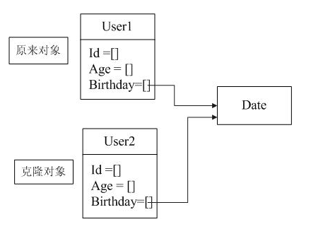

2. 如果想要深复制，则继承Clonable方法：

   ```java
   
   class User implements Cloneable
   {
        public Object clone() throws CloneNotSupportedException
        {
         	User cloned = User super.clone();
            cloned.birthday = (Data) hireDay.clone();
            return cloned;
        }
   }
   ```

   

---

### join()

son.join(); 在哪里调用在哪里睡眠

execption finally就类似于新的函数调用，但是要注意一个点，如果不可能达到的位置，如果写了代码，则会报错

```java
	// 不报错
	private static void test() {
        try {
            System.out.println("try");
            // 不能显示捕获
            int a = 10 / 0;
        }catch (Exception e) {
            System.out.println("catch");
            return;
        }finally {
            System.out.println("finally");
        }
        System.out.println("end");
    }

	// 报错
	private static void test() {
        try {
            System.out.println("try");
            // 显示
            throw new Exception();
        }catch (Exception e) {
            System.out.println("catch");
            return;
        }finally {
            System.out.println("finally");
        }
        // 提示删除，因为这一行不能达到
        System.out.println("end");
    }
```

### 线程池

线程池 Demo

```java
public class Demo {

    public static class MyTask implements Runnable {

        private String name;

        public MyTask(String name) {
            this.name = name;
        }

        @Override
        public void run() {
            System.out.println(name);
        }
    }

    public static void main(String[] args) throws InterruptedException {
        ExecutorService pool = new ThreadPoolExecutor(5, 5, 60, TimeUnit.SECONDS,
                new ArrayBlockingQueue<Runnable>(3), new ThreadPoolExecutor.DiscardPolicy());

        MyTask myTask1 = new MyTask("MyTask1");
        pool.execute(myTask1);
        pool.shutdown();
    }
}
```


---

### 数据库

全库逻辑备份

两段锁协议

innodb lock wait time

memory 可以使用 哈希索引

行锁 外键 MVCC  事务  

自适应哈希

超大分页如何处理

最长公共**子串**和最长公共**子序列**


### top

top:

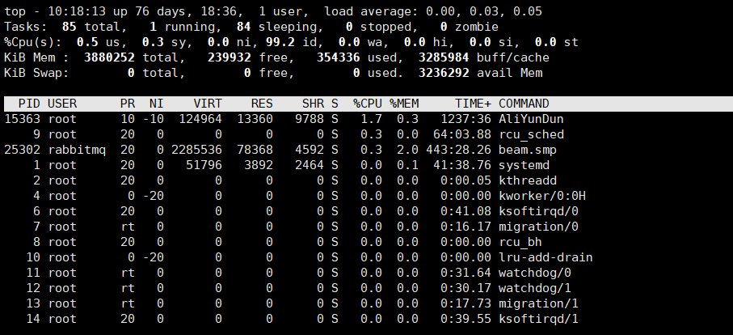

<https://www.cnblogs.com/ggjucheng/archive/2012/01/08/2316399.html>

total 进程总数
running 正在运行的进程数
sleeping 睡眠的进程数
stopped 停止的进程数
zombie 僵尸进程数
Cpu(s): 
0.3% us 用户空间占用CPU百分比
1.0% sy 内核空间占用CPU百分比
0.0% ni 用户进程空间内改变过优先级的进程占用CPU百分比
98.7% id 空闲CPU百分比
0.0% wa 等待输入输出的CPU时间百分比
0.0%hi：硬件CPU中断占用百分比
0.0%si：软中断占用百分比
0.0%st：虚拟机占用百分比

```
序号  列名    含义
a    PID     进程id
b    PPID    父进程id
c    RUSER   Real user name
d    UID     进程所有者的用户id
e    USER    进程所有者的用户名
f    GROUP   进程所有者的组名
g    TTY     启动进程的终端名。不是从终端启动的进程则显示为 ?
h    PR      优先级
i    NI      nice值。负值表示高优先级，正值表示低优先级
j    P       最后使用的CPU，仅在多CPU环境下有意义
k    %CPU    上次更新到现在的CPU时间占用百分比
l    TIME    进程使用的CPU时间总计，单位秒
m    TIME+   进程使用的CPU时间总计，单位1/100秒
n    %MEM    进程使用的物理内存百分比
o    VIRT    进程使用的虚拟内存总量，单位kb。VIRT=SWAP+RES
p    SWAP    进程使用的虚拟内存中，被换出的大小，单位kb。
q    RES     进程使用的、未被换出的物理内存大小，单位kb。RES=CODE+DATA
r    CODE    可执行代码占用的物理内存大小，单位kb
s    DATA    可执行代码以外的部分(数据段+栈)占用的物理内存大小，单位kb
t    SHR     共享内存大小，单位kb
u    nFLT    页面错误次数
v    nDRT    最后一次写入到现在，被修改过的页面数。
w    S       进程状态(D=不可中断的睡眠状态,R=运行,S=睡眠,T=跟踪/停止,Z=僵尸进程)
x    COMMAND 命令名/命令行
y    WCHAN   若该进程在睡眠，则显示睡眠中的系统函数名
z    Flags   任务标志，参考 sched.h
```

### linux常用命令

ps -aux 线程所有的进程 利用管道 | grep  grep 命令用于查找文件里符合条件的字符串。


ifconfig

inet是 IP地址

ether是 MAC地址

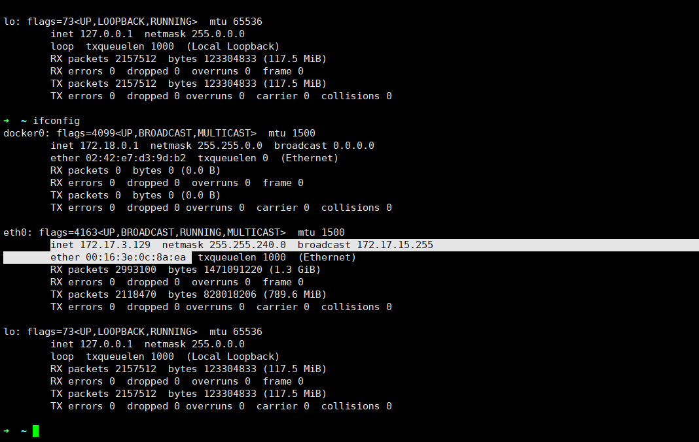


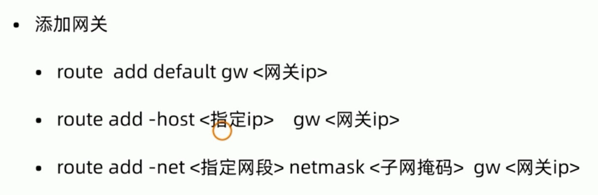

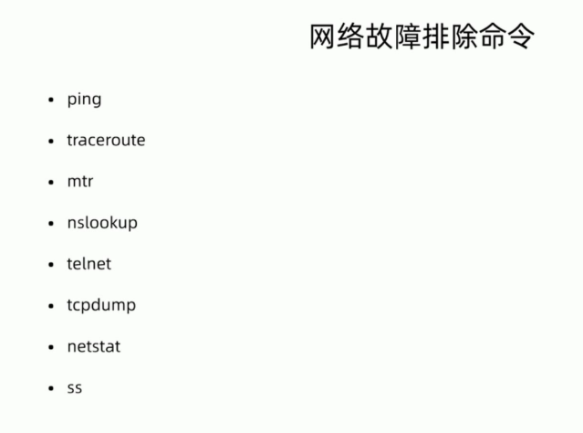

ifconfig ：查看网卡

route : 配置路由

ping 看看能不能ping通

traceroute： 看经过的路由

nslookup：将域名解析成IP `nslookup www.baidu.com`

telnet:  查看端口`telnet www.baidu.com 80` 

tcpdump：抓包工具 `-i any` 抓取任意端口， `-w 保存` 和wireshark 配合

netstat -ntpl ： -n 以IP显示， t tcp, p进程， l 监听。 服务的监听地址

---

数据库：show processlist, 查看当前数据库的连接数

---

### 计算机网络

三次握手

连接报文 确认报文

④不是两次的原因是为了避免无效的连接请求突然发送到服务端，而此时客户端已关闭，服务端误以为客户端将要发送数据会白白浪费资源。⑤不是四次的原因是将服务端的SYN和ACK报文拆分成两次发送和一次的效果是相同的，没有意义。

---


出现大量的 CLOSE_WAIT：数据库出错了没有回滚，数据库没有关闭连接。（客户端如果等太久，超时会发送FIN）

<https://juejin.im/post/6844903734300901390>

出现大量的TIME_WAIT：使用长连接。打开特定的参数。

<https://zhuanlan.zhihu.com/p/41197705>

SYN FLOOD攻击：如果一个客户端发送了SYN报文，那么服务端会发回一个SYN报文。如果客户端没有响应的话，就会超时重传。默认重传5次，每次的时间为 1s, 2s, 4s, 8s, 16s ,第5次发出还要等32秒才知道超不超时。这样子就浪费了 1 + 2 + 4 + 8 + 16 + 32 = 63秒。TCP才会断开连接。

DDOS攻击：如果是有人恶意发送了很多SYN报文，那么会占用很多连接资源。Linux下给了一个叫tcp_syncookies的参数来应对这个事——当SYN队列满了后，TCP会通过源地址端口、目标地址端口和时间戳打造出一个特别的Sequence Number发回去（又叫cookie），如果是攻击者则不会有响应，如果是正常连接，则会把这个 SYN Cookie发回来，然后服务端可以通过cookie建连接（即使你不在SYN队列中）

netstat

tcpdump

---


TCP是面向连接的，提供可靠的数据传输，除了基本的数据传输功能外，还提供超时重传、流量控制、拥塞控制等功能

UDP是无连接的，提供尽最大努力的数据传输服务。传输的单位是用户数据包。


---


### 浏览器输入到输出

1. 浏览器的套接字发送了HTTP请求
2. 网络层 源IP ： DHCP   DHCP请求报文  源端口 68 目的端口67， ACK的响应报文
3. 目的IP DNS
4. 目的 MAC地址 ARC查询报文

### OSI 七层模型

1. 从下往上
2. 应用层

### 拥塞控制

1. 背景，如果说网络出现了拥塞 目的主机
2. 每个主机都有拥塞窗口，有四种算法来实现

### DNS使用TCP还是UDP

DNS的端口号是53， 默认使用的是UDP，但是如果 响应的报文长度超过了512字节，使用的TCP

### cookie 和 session

cookie 是服务器放在浏览器的一些信息，当下一次发情请求的时候，会携带上cookie的值。用途： 会话管理（登录、购物车的状态），个性化设置、用户行为分析

session的话是存储在服务器端的，也可以将session放在redis里。

cookie 的生命周期 ： setMaxAge()

cookie 的共享范围： 不指定domain 和 path 的话，当前的域名可以使用。如果说使用了 domain 的话，子域名也可以使用。 如果说指定了 path的话， 子路径也可以使用。

cookie 和 session的选择： cookie是ASCII字符，session可以存储任意类型的数据，如果说数据比较复杂，则首选 session。 cookie是不安全的。 但是如果全部用session，开销很大。

cookie不安全： XSS跨站请求攻击（使用脚本操作cookie，HttpOnly），跨站请求伪造 CSRF （使用其他的页面，调用系统的接口，增加短信验证）

### HTTP

请求报文（请求行、请求头、实体主体）、响应报文（状态行、响应头、实体主体）

请求方法：get  post  head  put  delete  patch  options  connect  trace

HTTP状态码： 100  200  204  206  301 302 303  307  304  400  401  403   404  500  503

HTTP1.1 （默认使用长连接、支持流水线、增加了新的状态码100）
HTTP2.0 （二进制分层、首部压缩、服务端推送）

### HTTPS

过程、对称加密、非对称加密


### 进程和线程

资源分配 + 现在的操作系统中，比如 Java，+ 所以，创建销毁进程，需要设计到 内存、IO，所以开销很大，而线程只需要记录它本身的状态，开销会小。

### 进程的状态

```powershell
➜  ~ ps -auf
USER       PID %CPU %MEM    VSZ   RSS TTY      STAT START   TIME COMMAND
root      8232  0.0  0.0 140828  3700 pts/0    Ss   14:21   0:00 -zsh
root      9518  0.0  0.0 155472  1844 pts/0    R+   14:29   0:00  \_ ps -auf
root       682  0.0  0.0 110108   844 tty1     Ss+  Jun11   0:00 /sbin/agetty --noclear tty1 linux
root       681  0.0  0.0 110108   832 ttyS0    Ss+  Jun11   0:00 /sbin/agetty --keep-baud 115200,38400,9600 ttyS0 v
```

理论的进程状态有：

1. 准备状态
2. 就绪状态
3. 运行状态
4. 阻塞状态
5. 终止状态

### Linux中通过 ps -auf可以查看进程的状态。STAT显示的就是状态

1. R：running 正在运行或者是在队列的进程
2. S：sleep 处于休眠的状态
3. D：uninteruptible sleep 不可中断睡眠状态，必须等IO完成之后才能唤醒。
4. T：termite 终止状态
5. Z：僵死状态，进程已经终止，描述符还未被回收 (zombie   /'zɒmbɪ/)

 <  高优先级
  N  低优先级
  L  有些页被锁进内存
  s  包含子进程
  \+  位于后台的进程组；
  l  多线程，克隆线程 multi-threaded (using CLONE_THREAD, like NPTL pthreads do)

### 进程的调度算法以及使用的场景

1. 实时进程、非实时进程
2. 实时进程：FIFO先来先服务、RR时间片轮转法、deadline
3. 非实时进程： normal， batch, idle 完全公平算法
4. 除了Linux中，还有短作业优先、最短剩余时间优先、多级队列，多级队列反馈，

### 进程通信

1. 管道
2. FIFO，有名管道
3. 信号量：是一个计数器（mutex），为多个进程提供对共享数据的访问。
4. 共享存储：由于不需要复制，是最快一种方式，需要信号量来提供对共享存储的一个访问
5. 消息队列：读进程可以有选择的接受
6. 套接字：不同机器之间的进程通信

这个消息队列是在内核里的，我们可以通过msgget创建一个新的队列，msgsnd将消息发送到消息队列，而消息接收方可以使用msgrcv从队列中取消息。

当两个项目组需要交互的信息比较大的时候，可以使用共享内存的方式，也即两个项目组共享一个会议室（这样数据就不需要拷贝来拷贝去）。大家都到这个会议室来，就可以完成沟通了。这时候，我们可以通过shmget创建一个共享内存块，通过shmat将共享内存映射到自己的内存空间，然后就可以读写了。

### 死锁的必要条件、死锁的恢复

1. 互斥，资源如果被一个进程占有了，其他的线程不能占有这个资源。。。。

死锁的恢复

1. 鸵鸟策略
2. 死锁的检测与恢复：深度遍历，恢复：能够抢占
3. 死锁的预防：破化互斥条件，假脱机打印技术，破化占有且申请，获得全部的资源，破化环路，添加编号
4. 死锁的避免：银行家算法

### 虚拟内存

为了让应用程序不再受物理内存的制约。 + 逻辑的内存，内存的大小跟机器的位数有关。

具体实现，分块 分页

页面置换算法

### 分段

用户希望把自己的程序按照逻辑关系组织，即划分成若干段。例如，有主程序段MAIN 、子程序段P 、数据段D和栈段S 等.

- 分段和分页的区别：
大小是否可以改变：页的大小不可变，段的大小可以动态改变。

出现的原因：分页主要用于实现虚拟内存，从而获得更大的地址空间；分段主要是为了使程序和数据可以被划分为逻辑上独立的地址空间并且有助于共享和保护。

- 段页式
这样既拥有分段系统的共享和保护，又拥有分页系统的虚拟内存功能。

进程的将自己的用户空间划分多个Segment（Segment不是段）:

Text Segment：用来存放二进制可执行代码
Data Segment：存放静态常量
BSS Segment：存放未初始化的静态常量 【上面三个结构的数据是从ELF得到的】
Heap堆：堆是高地址增长的，用来动态分配内存区域
Memory Mapping Segment：这块区域用来把文件映射进内存，如果二进制执行文件依赖某个动态链接库，就是在这个区域将so文件映射进来
Stack栈：主线程的函数调用栈就是在这里

### 静态链接，动态链接

1. 我们写的代码，使用了库函数，静态链接的话，就是将库函数的代码合并我现在的代码中


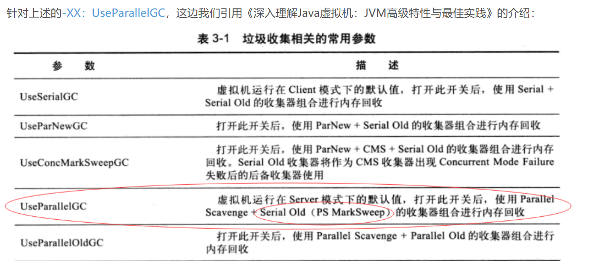

<https://blog.csdn.net/qq9808/article/details/80933396>


### 实习的公司主要是干嘛的

公司主要是干嘛的

toB  为其他公司提供 CI CD，将传统的组件部署到kubernetes上 的服务,    
会通过开发一些工具，编写特制的流水线， 当程序员提交代码的时候，自动测试，如果是k8s的话，自动生成docker容器，定制化修改，部署到k8s上

CI CD 的理解：快速的开发，快速的部署，快速的将软件交付给用户。人工操作带来的错误，

### 多种限流算法

限流算法：（阿里技术）

1. 简单窗口，在一个时间内维护一个计数器。达到阈值后，其他的请求就被丢弃，临界突变的问题，下游就要承受更高的流量
2. 滑动窗口：将大窗口切分成粒度更小的子窗口，每个子窗口都会维护相应的计数器。严格来说，还是会有平滑度的问题
3. 漏桶算法
4. 令牌桶算法，请求不会被丢弃，而是阻塞：一下子塞给下游
5. 滑动日志，精确的控制

分布式限流：nginx的限流，类似于漏桶算法

redis，

RateLimiter设置的大小，800，QPS是多少


什么场景使用不同的算法：

1. 漏桶算法：保护调用者，如果调用者没有保护机制
2. 令牌桶：保护自己


### HTTP和HTTPS的区别：

1. 超文本传输协议，浏览器与服务器之间主要通过HTTP来进行通信，但是HTTP是不安全，如果说有攻击者在中间获取HTTP报文，那么攻击者就能轻易获取里面的数据。HTTPS解决了HTTP这个缺陷，HTTPS在HTTP的基础上加上了SSL／TLS。依靠证书来确保服务器的身份，为浏览器和服务端的通信进行加密。

### 计算机网络

FIN-WAIT-1

ARP请求报文

利用递归的方式中序打印: if(temp.left != null) 才可以继续, null不能用来混淆

寻找两个正整数的中位数, while (left <= right), left == right的时候,i, j 数据还可以进行更新.   right的初始值应该为 len1;

利用二分查找一个值的 **范围** 时, left, right 需要归位

sychronized owner　　
轻量级的锁：对象头里面的指针，指向的位置为 "锁记录"

"abbac" 删除相邻重复的元素,使用栈.


---

### 消息队列

消息队列:rabbit MQ模型

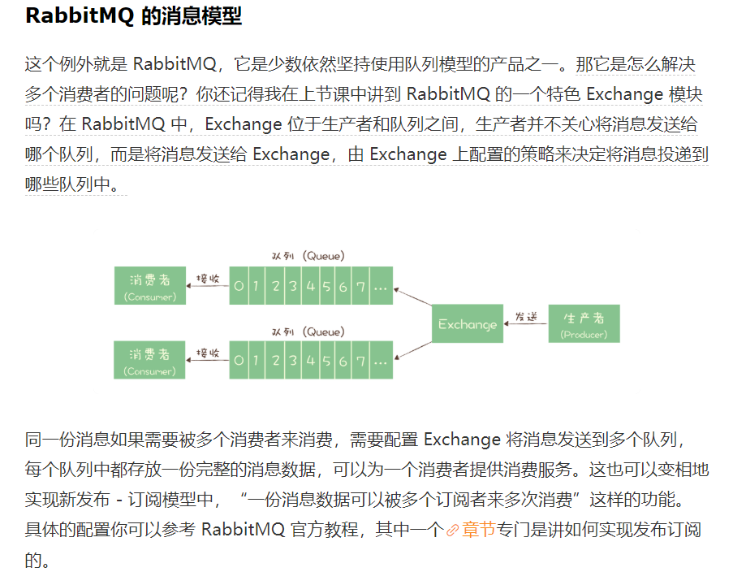

<https://time.geekbang.org/column/article/110459>

有哪些机制保证消息传输正确性:  ACK 存储

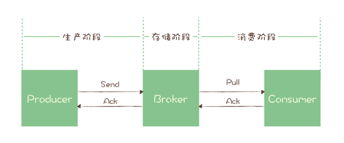


### 库存和数据库一致性

如何保证库存和数据库的一致性：

1. Rerdis中"库存"这个数据，不去保证一致性的。
2. Redis在这个场景下的主要作用是：挡住大量的流量，只让少数的流量可以去访问Mysql，数据的正确性是通过MySQL去保证的。
3. 这么做也是根据CAP理论，在分布式系统下，C和A是不可兼得的。
4. 那如果说是一般的数据，如个人信息，更新数据库的方式是 cache aside。更新数据的时候，先更新数据库，再删除缓存。

缓存与数据库的读写问题：

1. 使用 cache aside模式：
2. 查询命中，直接从缓存中返回数据
3. 查询不命中，从数据库中获取数据，并更新到缓存中
4. 更新数据的话，先更新数据库，再删除缓存。
5. 不进行更新缓存的原因是因为：这个数据可能是写多读少，等到用的时候才去查。

为什么时候cache aside:

1. 不更新缓存，而删除缓存的原因是：可能这个数据是写多读少的。
2. 不先删除缓存的原因是，可能会有脏读。

其他的方式：

1. 先更新数据库，再更新缓存
2. 先更新缓存，再更新数据库
3. 先删除缓存，再更新数据库：这个缓存删了，但是立马又有查询，将患处重新置上了。使用cache aside，可以避免脏读。
4. 先更新数据库，再删除缓存：也是会有问题，比如说缓存中的数据恰好失效，但是这种概率会小一点，只能设置过期时间。

QPS哪里提升最大？

加了负载均衡和Redis之后提升最大

---

### 职业规划：

1. 如果我能入职的话，我希望前两年内是一个纯粹的coder，在工作中拓展自己的技术深度和广度。在认真完成工作的基础上，我希望能够去研究技术的底层原理
2. 五年内呢，我希望前几年的积累能够帮助我在技术上独当一面并且看清未来的发展方向，希望从coder走向系统分析师或者是架构师。


### swap分区

swap分区是磁盘的一块空间，可以认为是虚拟内存。

当实际的物理内存空间不足的时候，将内存中不常用的数据存储到磁盘上。

### 为什么线程切换比进程快？

一个程序运行的时候，需要代码、数据和堆栈。代码放在物理内存中，虚拟内存通过页表和物理内存联系。为了加快搜索，使用TLB快表。数据的话，会放在寄存器中，比如有数据寄存器、指针寄存器、状态寄存器等。同时还需要堆栈。内核也会维护一些数据结构，比如打开的文件。

线程切换不会设计到逻辑内存的切换，所以没有 TLB失效，请求缺页，重新打开内核的一些数据结构这些开销。


## 面试回顾

1. 访问权限修饰符： protected 其他包下子类也可以访问

2. 继承和多态的区别： 都是面向对象的三大特征之一

3. 线程生命周期：初始状态，就绪状态，运行状态，time-waiting, waiting, blocking, terminated

4. Java各种状态的转换， wait(), notify(), notifyAll(), join(),  sleep(), 锁， yield()

5. 多线程的数据同步： volatile， 锁（synchronized）， juc包下面的类（lock, atomic, 线程池，队列等）

6. synchronized

7. Java的引用类型： 软引用是内存空间不足时（下一次垃圾回收时）会被回收，弱引用是当垃圾收集器的线程扫描到时就会被回收

8. 垃圾收集器是守护线程，垃圾收集器工作的时间为：在空闲的时候也会进行扫描， 内存不足时进行扫描，System.gc()去建议系统进行full GC()

9. Java的集合类： Collection， Map

10. Redis各种数据结构，以及它们的使用场景，利用位数组统计用户访问数（setbit myBit 100 1  将100位设置为1）

11. Redis数据倾斜：重新rehash，数据迁移

12. Redis字典底层数据结构的实现

    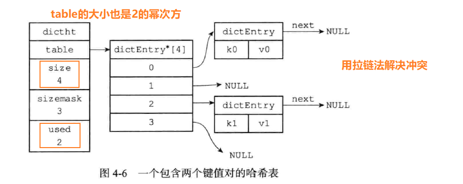

13. Hashmap和 Array的区别在哪里？ HashMap的底层是用了数组+链表，通过hash函数快速获取到对应的桶，同时也是利用了数据随机访问的特性

14. 主键索引。 MySQL的主键，对应的底层。

15. 聚簇索引和非聚簇索引，它们插入和查询的区别： 非聚簇索引查询如果没有覆盖索引，那么需要回表查询。插入的话，主键索引最好设置为自增主键，否则如果说出现页分裂，那么维护的代价很高，因为数据行的数据远远比主键的数据要多。

16. MySQL加锁： （MySQL实战45讲 -> 21讲，30讲）
    
    - 加锁，锁的是索引
    - 看 有没有 desc
    - select id 会覆盖索引，不会锁住主键索引（访问到的对象才会加锁）
    - 基本单位是 next-key-lock
    - 唯一索引(c) + 等值查询(==)   next-key-lock退化为行锁
    - 非唯一索引(d) + 等值查询（==） next-key-lock退化为间隙锁
    - 范围查询，查到下一个不满足条件的第一个值为止

17. MySQL怎么保证事务同时成功或者同时失败：commit, rollback, redo log, bin log, undo log

18. 秒杀接口是公开的吗？ 是公开的，但是通过令牌的方式防止用户提前秒杀，具体的做法

19. 类加载
    - 加载：通过一个类的全限定类名来获取定义此类的二进制字节流，将类的静态存储结构转化为方法区的运行时数据，在内存中生成一个 java.lang.Class对象，作为方法区这个类各种数据的访问入口
    - 验证：保证类中的代码不会危害虚拟机
    - 准备：为静态变量分配内存并初始化，初始值为0
    - 解析：将常量池内的符号引用替换为直接引用的过程
    - 初始化：初始化静态变量。（包括执行静态语句块的内容）

20. 反射，3种方法，反射很慢（底层的编译器无法进行优化），可以使用第三发包工具，直接对字节码进行优化，提高反射的创建速度。

21. 动态代理, AOP，简化开发

22. 线程池共有5种状态：Running， Shutdown（不再接受新的任务，继续处理当前未完成的任务），Stop（不再接受新的任务，不处理已经提交的任务，正在处理的任务也不处理了），Tidying（任务数量为0，执行terminated()方法进入 Terminated状态）， Terminated。

23. SynchronousQueue 并不是一个真正的队列，它不会维护任务，所以当添加一个任务之后，那么就创建出一个新的线程进行处理

24. 并发三要素：原子性、可见性、有序性

25. 分页：LIMIT 10,5，从编号10开始，查询后面5条记录。即查找11，12，13，14，15条数据。 sql分页，sublist, 产品的角度， 缓存

26. maven的生命周期：验证、编译、测试、打包、安装、部署。 package, install, deploy

27. 排序：快排、归并、堆、冒泡、插入、选择（不稳定）、希尔、计数

28. ArrayList 和 LinkedList哪个占用的空间大？ArrayList的底层是数组，且会自动扩容，LinkedList的底层是有Node节点，除了值之外还有pre， next。假设只有一个节点的话，因为ArrayList的初始容量是10，所以ArrayList比较占空间， 如果容量是10的话，LinkedList比较占空间。如果说是序列化的话（序列化成字节流，在网络中传输），ArrayList的数组对象用transient修饰，只会序列化真正size个元素（结合writeObject这个方法）<https://www.cnblogs.com/yeya/p/13430797.html>

29. sql语句
    ```sql
        // 建表语句 not null, default, auto_increment
        CREATE TABLE mytable (
            id INT NOT NULL ATUO_INCREMENT,
            col1 INT NOT NULL DEFAULT 1,
            col2 VARCHAR(45) NULL,
            col3 DATE NULL,
            PRIMARY KEY ('id')
        );

        创建索引
        ALTER TABLE 'table_name' ADD INDEX index_sid('sid');
        ALTER TABLE 'table_name' ADD UNIQUE ('sid');
    ```

30. maximumPoolSize只会在队列已满之后才会创建

31. HashMap转成红黑树的长度为8， 根据泊松分布，转成红黑树的概率为百万分之一，同时，长度为8， 链表平均查找时间复杂为 3/4；红黑树平均查找次数也是3/4； 同时红黑树需要变成6才转成链表，防止添加删除一个元素，造成链表红黑树的频繁转换。

32. Redis hash的底层实现:
    - dict
      - type: 为不同的字典设置不同的类型函数
      - privdata：私有数据，特定类型的可选参数
      - rehashinx：rehash的进度，如果没有进行rehash就是-1
      - dictht[2]： 字典数组，一个正常使用的字典，一个是rehash字典
        - ht[0]正常使用的字典
          - size 总的个数（2的幂次方）
          - used 已经使用的个数
          - 掩码（个数- 1）
          - table[] 数组，通过拉链解决冲突
            - k, v, next

33. rehash：如果没有执行BGSAVE的话，负载因子是1， 如果有BGSAVE，负载因子就是5。used * 2，ht[0], ht[1]进行交换。

34. Redis 如果是单机的话，是CP，分布式的话是 AP

35. select，poll(pollfd)， epoll

36. b+树（16kb, 磁盘io次数更少了）

37. TCP的保活定时器。2个小时后，没有报文，每个75秒发送一个报文，发送10次，如果没有响应，就断开连接。会发送RST包，用于异常关闭

38. volatile 修饰引用，只会保证引用的可见性。如果想要保证属性的可见性，用CAS（AtomicReference）

39. 频繁GC：调用了System.gc(), 创建大量的对象

40. spring的controller是单例，所以不是线程安全的，如果为了线程安全，可以将其设置为 多例，或者使用threadlocal

41. 对项目做一个介绍，Redis在哪里用，项目中遇到哪些问题，怎么解决的

42. String为什么是不可变的，Java 9 有什么优化。
    - Java 9 底层String是采用 byte[] value，value有一个名为coder的编码标记

43. ArrayList 扩容机制

44. 实现动态代理的方式

45. 粘包

46. HTTPS非对称加密在数据传输中使用

47. Git常用命令

48. myisam支不支持事务隔离级别：不支持，InnoDB不支持事务
49. 联合索引不使用最左前缀会失效，为什么：b+树
50. where a == 1 and b == 1 ， a 和 b 是单个索引，会使用到什么索引。两个单列索引，优化器会进行优化判断，有可能执行a索引，或者是b索引，或者是对a索引，b索引求交集。
51. 幻读：在可重复读隔离级别下，普通索引是快照读，是不会看到别的事务插入的数据的。因此，幻读在“当前读”下才会出现。 select 快照读， update, delete, insert 当前读。 通过next-key-lock防止幻读
52. MVCC底层原理
53. redo log 和 undo log
54. mvcc完全解决幻读问题， 快照读有没有解决 √， 一致性视图， MVCC相当于无锁的
55. bin log  不同的格式， bin log 日志
56. redis内存淘汰机制。 redis是字典实现的，key为键，value包括了值，时间戳。一开始是随机选取5个值，淘汰时间戳最小的，后面改进了算法，有一个poll大小为10， 这个poll是按照lru实现的，只有时间戳小的才可以加入，如果满了之后，删掉最大的
57. aof日志量过大，redis怎么做
58. aof重写
59. 项目中遇到不太合理的需求怎么做
60. 怎么学习一个东西，对一个工程师最重要是什么
61. 有发现极客时间专栏中有没有错的
62. 开发项目中两个人都会crud，但是如果知道原理，就能预测到风险。
63. 学会了一个东西，不仅写到博客，还要复述出来，比如做一个风险。
64. 令牌是怎么生成的，uuid增加随机性其实没有必要，可以在redis set中 添加uid，然后判断一下就可以了。怎么获取 uid，用户密码登录，有一个cookie和 session，session存放这个用户对象，里面存在着session（怕cookie不安全，再保存电脑手机这些设备的信息）
65. 令牌的数量，估值
66. Guaua限流怎么做，有了限流为什么还需要令牌
67. 令牌需不需要限流，redis做哨兵模式   
68. 把redis打死？ redis本身就是为了应对大流量的，被打死的概率会更低，支持10w访问量，首先要先把后端系统做好。redis做哨兵+ 读写分离 + 持久化
69. redis存储热点数据，怎么做
70. MQ怎么做？
71. 数据库怎么回到我的主程序中。mysql成功的结果返回到程序中。 事务：减库存（事务），upate 更新的行数，if 行数== 0， 返回值为 false，就不再进行rabbitMQ操作
72. MQ削峰也需要及时返回信息？ 
73. docker的原理。虚拟机和 docker区别。docker轻在哪里。跟物理机虚拟机相比，优势劣势
74. 进程和线程的区别， 进程比线程的开销要小
75. 并行多核加速程序，多进程和多线程的优势和劣势

---

1. 秒杀系统主要为了提升什么
2. 从一个大的思路上，怎么提升QPS。 （面试官提示说冷热分离这个角度， 我从 动静分离、缓存、限流说，面试官一直说要从宏观角度说。。。）
3. 登录怎么做。判断用户是否登录。怎么判断以前是否登陆过的。sessionId是什么。sessionId什么时候生成的。
4. content-type了解吗
5. 如何在贴吧上制造cfrf攻击，如何在贴吧制造 xss攻击
6. 实现一个 排他锁。 lock() 的返回值。lock() 返回值是 void，怎么做到排他。
   ```java
        // 下面的两种思路，如何实现

        // 阻塞获取锁
        void lock()

        // 尝试获取锁
        void tryLock()

        void unlock()
   ```
    多线程情况下安全吗？操作是不是原子操作？  
    wait() 的使用条件。代码中不能用 wait()
7. ArrayList扩容。  
   
   扩容后的引用地址是不是改变。  

   ArrayList下标访问的时间复杂度。为什么数组就是O(1)。  

   弱类型语言，像python，php，如何做到O(1)的时间复杂度
8. gc日志的报警，怎么设置报警规则  
9. MySQL 有一个表 user表，有两个字段 userid, userdata。 ( userdata是json格式，有很多数据，包括name, age等等)
    设计一个接口，传入一个id， 和任意类型的数据，比如age，name，然后对特定的数据进行修改。  SQL怎么写  

    两个设备下，一个设备修改age，另一个设备修改name，同时修改，但是最后发现age修改成功了，name没有修改成功，为什么？  

    加了事务还是会，怎么解决  

    除了 select... for update 还有什么思路吗
10. 10.101.102.103是公网IP还是内网IP，如何区分公网内网。  

    设计一个算法，将一个IP转成一个int。 

11. 从理论上讲，有多少个设备可以访问 Google，从客户端角度思考。（思考角度包括IP地址个数，公网私网，NAT，APR，MAC）  

12. 算法题，实现 一个IP地址（10.101.102.103）转成int类型数据。 （IP地址是32个比特，int也是32个比特）
    ```
        // 代码还需要考虑 转义，否则得不到结果
        str.split("\\.");
    ```