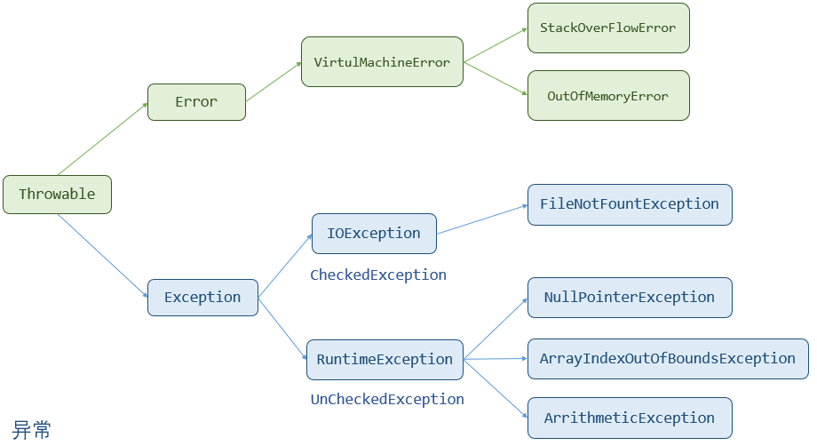
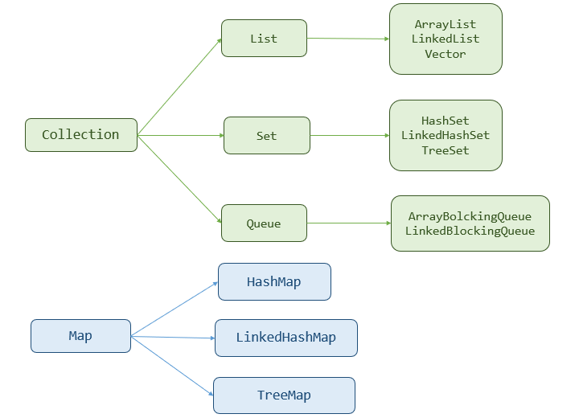
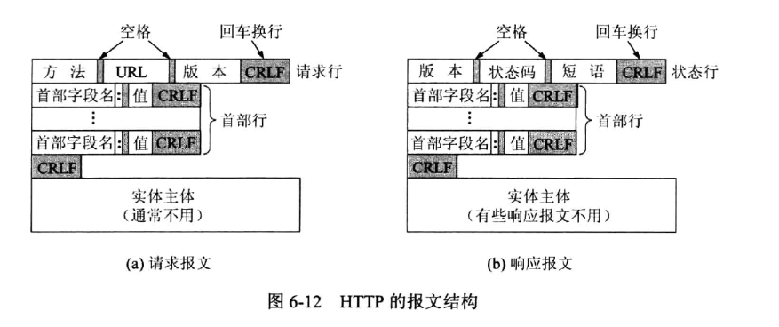
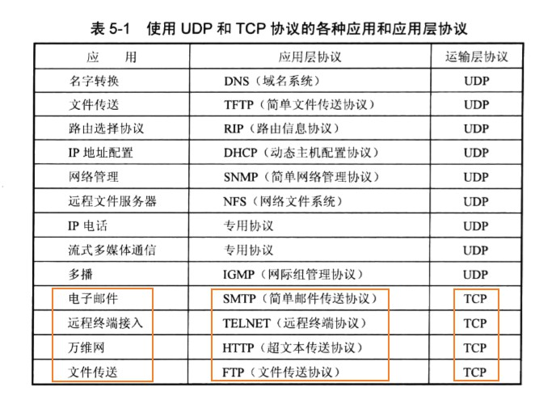
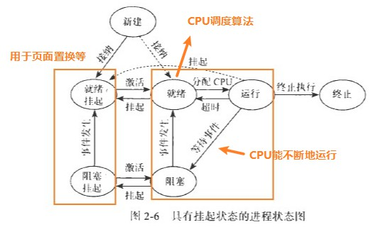
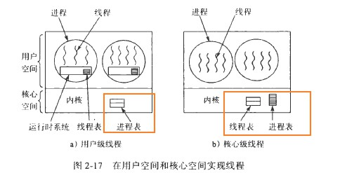
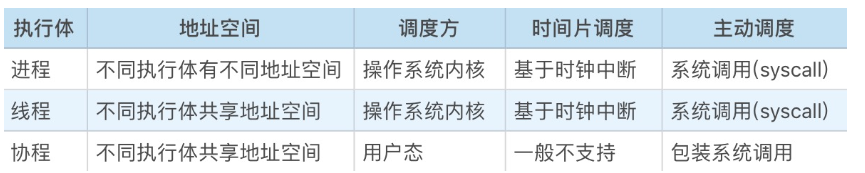

JavaSE 88

## 基础语法 9

### Q1：简单说说Java有哪些数据类型

- 分为两类：6个基本类型，引用类型(`类，接口，数组等`)

- 占用的字节大小

  | 占用字节数 |                           数据类型                           |
  | :--------: | :----------------------------------------------------------: |
  |  1个字节   |                             byte                             |
  |  2个字节   |                         short, char                          |
  |  4个字节   |                          int, float                          |
  |  8个字节   |                         long, double                         |
  |   不确定   | 因为Java虚拟机没有提供boolean值的专门的指令，<br>所以单个boolean可以为4个字节【底层使用int】<br>boolean数组是1一个字节【底层使用byte】<br>但是Java虚拟机没有明确说boolean的大小，所以虚拟机可以自己指定 |

---

答：①分为基本数据类型和引用数据类型。②基本数据类型包括：数值型（byte、short、int、long、float、double），字符型（char）以及布尔型（boolean）。除了基本类型外，其他数据类型都属于引用类型（对象类型），`常见的引用类型`包括类、接口、数组等。

### Q2：float number=3.4;有没有问题？为什么？

答：有问题，因为3.4 是双精度数，将双精度型（double）赋值给浮点型（float）属于向下转型，可能会造成精度损失，所以必须进行强制类型转换，正确的写法是float number =(float)3.4;/ float number =3.4F;。

### Q3：字符串拼接的方式以及效率？

答：①使用+直接拼接，String 是final对象，不会被修改，每次使用 +进行拼接都会创建新的对象，而不是改变原来的对象，效率低，是线程安全的。②使用StringBuffer可变字符串，效率较高，是线程安全的（StringBuffer的方法使用了synchronized关键字进行修饰）。③使用StringBuilder可变字符串，效率最高，但是线程不安全。

### Q4：简述final，finally和finalize区别

答：①final可以修饰类，方法和变量，被final修饰的类不可继承，被final修饰的方法`不可重写`（**`但是可以重载`**），被final修饰的变量引用不可更改，引用的内容可以更改。②finally用于try-catch代码块中，`无论是否发生异常最后都将执行`，作用是`释放资源`。③finalize是`Object类的方法`，在对象被垃圾回收之前将调用一次，`一般用于资源的释放`。

### Q5：==和equals有什么区别？equals和hashCode有什么联系？

- 基本类型：== 值相等
- 引用类型：equals()是Object的方法：`return (this == obj)`，任何对象都可以重写equals()。
- 重写equals必须重写hashcode的原因是：equals()后 两个对象是相同的，如果两个对象相同，他们的hashcode()也应该是相同的，因为在HashMap()也有用到hashcode()；equals的判断代码`if (this == o) return true;`

---

答：①如果是引用类型，==比较的是两个对象的引用是否完全相同，如果是基本类型，比较的是两个基本类型的数值是否相同。②如果没有重写的话，equals默认按照==进行比较，如果重写了equals()方法，则按照对应的比较规则比较。③两个对象如果相等，那么它们的hashCode值必须相等，但两个对象的hashCode值相等时，它们不一定相同。

### Q6：Array和ArrayList的区别？

- 长度
- 操作数据方法

---

答：①Array`长度`在定义之后就不运行改变了，而ArrayList是长度可变的，可以自动扩容。②Array只能存储相同类型的数据，ArrayList可以存储不同类型的数据。③ArrayList提供了`更多操作数据的方法`。比如：addAll()，removeAll()，iterator()等等 ④Array可以存储基本类型，但是ArrayList通过自动装箱的方式，存储的是引用类型

### Q7：&和&&的区别？

答：①&具有按位与和逻辑与两个功能。②&&作为逻辑与具有短路的特点，当前面的条件表达式为false时就不会进行后面条件表达式的判断，可以用来避免空指针异常。

### Q8：简述JDK8的新特性

- lambda表达式。  `new Thread(() -> {});` 和 `Collections.sort((o1, o2) -> (o1 - o2))`
- stream流 `strings.stream().filter(string -> string.isEmpty()).count();`   [菜鸟教程](https://www.runoob.com/java/java8-streams.html) 常用的方法有：string(), filter(), limit(), foreach(), count(), map(); 能够用来遍历数组
- 增加了时间相关的API：Local
- 接口添加了默认方法，默认方法可以`内容`

---

答：①接口中可以添加default修饰的非抽象方法，可以有方法体和内容。②可以使用lambda表达式，减少代码冗余。③函数式接口，使用@FunctionalInterface注解标明，该接口有且仅有一个抽象方法。④方法引用，可以直接引用已有Java类或对象的方法或构造器，进一步简化lambda表达式。⑤stream流，用于解决已有集合/数组类库的弊端，简化其操作，有foreach遍历、filter过滤、map映射、concat合并等功能。⑥增加日期相关的API。

### Q9：Stream流了解吗？

答：①Stream流是JDK1.8的新特性，用于解决已有集合/数组类库的弊端，简化集合/数组的操作。②stream流的获取：集合：直接调用`stream()`方法获取；数组：使用静态方法Stream.of()/Arrays.stream()获取。③常用方法：forEach() 遍历；`count() 统计个数`；`filter() 按条件过滤`；`limit() 取前面n个元素`；`skip() 跳过前面n个元素`；map() 映射加工；concat() 合并stream流。④终结方法：foreach/count 调用终结方法后流不能继续使用；非终结方法：每次调用完返回一个新的stream对象，可以继续使用，支持链式编程。⑤收集stream流：把流转为Set集合 collect(Collections.toSet())；把流转为List集合 collect(Collections.toList())；把流转为Collection集合 collect(Collections.toCollection())；把流转为数组 toArray()。

### Q10:  JDK、JRE、JVM是什么，区别

- JVM Java虚拟机，能够运行Java字节码文件，即.class文件。通过Java虚拟机，能够实现一次编译、到处运行
- JRE Java运行环境，能够运行已经编译好的Java程序，包括JVM、Java库等
- JDK Java Development Kit， 是功能最齐全的Java SDK，包括JRE，还有编译器javac等。

### Q11: Java和C++的区别

- 相同点：面向对象 -> 支持封装、继承、多态
- 不同点：
  - Java是单继承的、C++多继承，Java的接口
  - Java没有指针，使程序内存更加安全
  - Java有自动内存管理，不用主动释放内存

### Q12: 构造器Constructor是否可以被override

- 不能被override重写，但是可以overload重载，可以看到一个类中有多个构造器


## 面向对象 10

### Q1：简述面向对象的特性

- 封装的话，面试对象的`思想`，属性私有化，通过提供方法给外界访问
- 继承：子类继承父类  子类拥有父类的私有属性，但是不能自己使用父类的私有属性
- 多态：同一个类型的对象执行相同的行为，在不同的状态下表现出不同的特征。编译时的多态--重载；运行的多态[需要三个条件：继承、**重写**、向上转型]，比如`List<Integer> list = new ArrayList<>();`

---

答：①封装：建议成员变量私有，然后提供公有的getter/setter方法来获取值/赋值，封装的核心思想是合理隐藏，合理暴露，可以提高安全性，实现代码的组件化。②继承：一种子类到父类的关系，是“is a”关系，可以提高代码的复用性，相同代码可写到父类，子类的功能更加强大，不仅得到了父类的功能，还有自己的功能。③多态：同一个类型的对象执行相同的行为，在不同的状态下表现出不同的特征。多态可以降低类之间的耦合度，右边对象可以实现组件化切换，业务功能随之改变，便于扩展和维护。

### Q2：类和对象有什么区别？

- 类是抽象的概念，和对象关系
- 实例，跟类的关系

---

答：类是一个抽象的概念，是具有相同特征的事物的描述，是`对象的模板`。对象是一个个具体的存在，是类的实例。

### Q3：列举Object类的方法

- equals()：说出有什么用
- hashcode()
- toString()
- wait()  一般用于synchronized中，否则会抛出异常
- notify() / notifyall()
- clone()
- finalize() 当垃圾回收器回收对象时，需要调用
- getClass()

---

答：①equals(Object obj)：判断其他对象是否与当前对象相等。②toString()：打印当前对象的字符串表示。③wait()：导致当前线程等待，等待其他线程唤醒，会释放锁。④notify()/notifyAll()：随机唤醒一个/全部线程。⑤hashCode()：返回当前对象的hashCode值。⑥finalize()：当垃圾回收器要回收对象前调用。⑦clone()：创建并返回对象的一个副本。

### Q4：方法重载和方法重写的区别？

- 重载的话，就是方法名相同，参数不同。参数不同：个数、参数的类型、顺序。
- (要完整的描述一个方法，需要方法名跟参数， 不能方法名相同、参数相同，但是返回类型不同)
- 重写的话 子类继承父类，重写父类的方法。方法名、参数必须相同。
- 重写返回值必须 返回值范围小于等于父类、抛出异常范围小于等于父类，访问修饰符大于等于父类。  <br>【好像不恰当】`List<Integer> list = new ArrayList<>()` list.add()。

---

答：①方法重载是同一个类中具有不同参数列表的同名方法（无关返回值类型），方法重写是子类中具有和父类相同参数列表的同名方法，会覆盖父类原有的方法。②重载的返回值类型和权限修饰符，异常抛出类型没有要求，重写方法的返回值类型小于等于父类被重写方法的返回值类型，修饰符权限大于等于父类被重写方法权限修饰符，抛出的异常类型小于等于父类被重写方法抛出的异常类型。

### Q5：接口和抽象类有什么区别？

- 继承：接口可以多实现，抽象类只能单继承
- 属性：接口中只能默认是public static final修饰的常量，抽象类可以定义普通变量
- 构造器：他们都不能实例化，但是接口没有构造器，抽象类有构造器
- 方法：接口在JDK1.8之后能用default定义默认方法，抽象类没有限制

---

答：①接口中只能定义public staic final修饰的常量，抽象类中可以定义普通变量。②接口和抽象类都不能实例化，但接口没有构造器，抽象类有构造器。③接口可以多实现，抽象类只能单继承。④接口在JDK1.8之前只能定义public abstract修饰的方法，JDK1.8开始可以定义默认方法和静态方法，JDK1.9开始可以定义私有方法，抽象类中的方法没有限制。

### Q6：什么时候应该使用接口，什么时候应该使用抽象类？

- 如果方法描述的是行为模式，那么应该使用接口
- 如果是模板，那么应该使用抽象类

---

答：①如果知道某个类应该成为基类，那么第一选择应该是让它成为一个接口，只有在必须要有方法定义和成员变量的时候，才应该选择抽象类。②在接口和抽象类的选择上，必须遵守这样一个原则：行为模型应该总是通过接口而不是抽象类定义。通过抽象类建立行为模型会出现的问题：如果有一个抽象类Moblie，有两个继承它的类Mobile1和Moblie2，分别有自己的功能1和功能2，如果出现一个既有功能1又有功能2的新产品需求，由于Java不允许多继承就出现了问题，而如果是接口的话只需要同时实现两个接口即可。

### Q7：内部类有什么作用？有哪些分类？

- [博客园- 内部类](https://www.cnblogs.com/chenssy/p/3388487.html)
- 内部类可以使用外部类的私有属性，同时，内部类可以独立继承接口或者抽象类
- 静态内部类[`OuterClass.InnerClass inner = new OuterClass.InnerClass();`]，方法内部类[推荐使用`getInstance()`获取方法内部类]，局部内部类，匿名内部类

---

答：①内部类有更好的封装性，有更多的权限修饰符，封装性可以得到更多的控制。②静态内部类：由static修饰，属于类本身，只加载一次。类可以定义的成分静态内部类都可以定义，可以访问外部类的静态变量和方法，通过new 外部类.静态内部类构造器来创建对象。③成员内部类：属于外部类的每个对象，随对象一起加载。不可以定义静态成员和方法，可以访问外部类的所有内容，通过new 外部类构造器.new 成员内部类构造器来创建对象。④局部内部类：定义在方法、构造器、代码块、循环中。只能定义实例成员变量和实例方法，作用范围仅在局部代码块中。⑤匿名内部类：没有名字的局部内部类，可以简化代码，匿名内部类会立即创建一个匿名内部类的对象返回，对象类型相当于当前new的类的子类类型。

### Q8：泛型和泛型擦除是什么？

- 泛型的本质就是`参数化类型`。比如ArrayList，传进的参数可以有很多，但是我们不能每个都写，这个时候泛型是一个很好的选择。【当然，参数也可以用Object，但是使用Object的话，有一些方法强制转换会发生错误】
- 泛型会在编译阶段替换成特定的类型，即泛型擦除

---

**Java核心技术卷**：ArrayList就是一个泛型类。以前的泛型是通过继承实现的：参数为Object，然后在使用的时候进行类型转换。但是这样子不好，很有可能出现异常。`类型化参数`是一个更好的选择。

如果对类型有限制，那么就可以加入`通配符`。

泛型的位置：修饰符(public static)后面， 返回类型前面

```java
//类
public class ArrayList<E> extends AbstractList<E>{}

//方法--> Integer extents Comparable
public static <T extents Comparable> T getMiddle(T[] a){}
```


答：①泛型的本质是参数化类型，泛型提供了编译时类型的安全检测机制，该机制允许程序在编译时检测非法的类型。②在编译阶段采用泛型时加上的类型参数，会被编译器在编译时去掉，这个过程就被称为类型擦除，因此泛型主要用于编译阶段，在编译后生成的Java字节代码文件中不包含泛型中的类型信息。

### Q9：泛型标记的规范了解吗？

答：①E：值Element，在集合中使用，表示在`集合`中存放的元素。②T：【任意类型】指Type，表示Java类，包括基本的类以及自定义类。③K：指Key，表示键，例如Map集合中的Key。④V：指Value，表示值，例如Map集合中的Value。⑤N：指Number，表示数值类型。⑥？：表示不确定的Java类型。

### Q10：泛型限定是什么？

- 为了限定传入类型的范围。

答：①类型通配符使用？表示所有具体的参数类型，在使用泛型的时候，如果希望将类的继承关系加入泛型应用中就需要对泛型做限定，具体的泛型限定有对泛型上限的限定以及对泛型下限的限定。②对泛型上限的限定使用<? extends T>，它表示该通配符所代表的类型是T类的子类型或T接口的子接口。③对泛型下限的限定使用<? super T>，它表示该通配符所代表的类型是T类的父类型或T接口的父接口。

## 异常 2

### Q1：异常有哪些分类？出现的原因是什么？

- 

  

- Throwable是所有异常和错误的父类。

  - Error是系统内部的异常。
  - Exception运行时异常，分为RuntimeException（UnCheckedException）和CheckedException。
    - UncheckedException可以抛出，即RuntimeException
    - CheckedException必须用try-catch捕获，有IOException、SQLException

---

答：①Throwable是所有错误和异常的父类，Throwable分为Error和Exception。②Error指Java程序运行错误，出现Error通常是因为系统的内部错误或资源耗尽，Error不能在运行过程中被动态处理，如果程序运行中出现Error，系统只能记录错误的原因和安全终止。③Exception指Java程序运行异常，即运行中发生了不期望的情况，分为RuntimeException和CheckedException。RuntimeException指在Java虚拟机正常运行期间抛出的异常，可以被捕获并处理，例如空指针异常，数组越界等。CheckedException指编译阶段强制要求捕获并处理的异常，例如IO异常，SQL异常等。

### Q2：有哪些异常处理方式？

- 抛出异常 throws 作用在方法上，将异常抛给上一层

- throw在方法中抛出异常 

  ```java
  if (nStr == null) {
      //用trow关键字抛出异常，当异常被抛出时，程序会跳出该方法
      throw new Exception("输入的字符不能为空！");
  }
  ```

  

- try catch finally

  - [finally中影响return的值](https://www.nowcoder.com/profile/333170563/note/detail/509248)
  - finally不会执行的情况： 1. 线程死亡 2. 关闭CPU 3. 前面代码中用了System.exit(int) 4. finally语句块发生异常

---

答：①抛出异常：遇到异常不进行具体处理，而是将异常抛出给调用者，由调用者根据情况处理。抛出异常有2种形式，一种是throws，作用在方法上，一种是throw，作用在方法内。②使用try/catch进行异常的捕获处理，try中发生的异常会被catch代码块捕获，根据情况进行处理，如果有finally代码块无论是否发生异常都会执行，一般用于释放资源，JDK1.7开始可以将资源定义在try代码块中自动释放减少代码。

### 多线程

> [JavaGuide]([https://snailclimb.gitee.io/javaguide-interview/#/./docs/b-3Java%E5%A4%9A%E7%BA%BF%E7%A8%8B?id=_23-%e5%a4%9a%e7%ba%bf%e7%a8%8b](https://snailclimb.gitee.io/javaguide-interview/#/./docs/b-3Java多线程?id=_23-多线程))
>
> 中华石杉面试第三季

##### 什么是进程和线程

- 进程 资源分配
- 线程 程序调度的基本单位
- 现在的操作系统中  进程 有多个 线程
- 在Java中，线程共享进程的堆和方法区

##### 说一说并发和并行的区别

##### 为什么要使用多线程

##### 线程的生命周期

- 

##### 什么是线程的死锁？如何避免死锁

- 一些线程持有资源，但是这些线程又再等待其他线程释放资源

- 资源：互斥、不可抢占资源； 线程：占用且申请、构成环路

- 不理睬，一次性全部申请[ 需要什么资源，一开始可能不确定 ]，银行家算法，环路的检测与解锁

  ```
  恢复的策略：
  - 利用抢占恢复
  - 利用回滚恢复
  - 杀死进程
  ```

  

##### sleep()和wait(), yield(), join方法

- sleep() 睡眠多少秒，进入TIME-WAITING，不会释放锁
- wait() 阻塞，进入WAITING，只能等其他线程notify()
- yield()让出时间片，进入RUNNING，重新竞争
- join() 一个线程调用另一个线程的join()，当前线程阻塞，其他线程结束时，当前线程才能状态就绪态。底层是wait()

##### 调用start()后为什么还要调用run()方法

- start()进入就绪状态，run()方法的话，就进入运行状态

##### synchronized关键字

- 同步机制，为`对象、方法、代码块`加锁。属于悲观锁、可重入锁。
- 在早期版本中，线程会被阻塞和唤醒，对应到操作系统中不断进入内核态，频繁上下文切换，是重量级锁
- JDK1.6做了大量优化，性能也挺好的

##### 说说自己如何使用synchronized

##### synchronized三种用法

- 给对象加锁，类锁 / 对象锁
- 普通方法：对象锁
- 静态方法：类锁
- 代码块

##### synchronized底层原理

- 代码块：底层是lock  unlock，封装成 monitorenter  monitorexit
- 修饰方法：ACC_SYNCHRONIZED

##### 谈一下锁优化

- 参考资料： 深入理解Java虚拟机，[美团--不可不说的锁事](https://tech.meituan.com/2018/11/15/java-lock.html), [CSDN--Synchronized关键字和锁升级](https://blog.csdn.net/tongdanping/article/details/79647337), [CSDN--对于锁的个人理解]((https://blog.csdn.net/choukekai/article/details/63688332))

- 锁的变化  + 对象头的信息

##### 谈一下volatile

- 轻量级的同步机制
- 可见性和有序性
- 如何保证可见性呢？lock指令，线程执行到了lock，读数据，必须得从主内存，写数据，必须写回到主内存。
- 有序性通过内存屏障实现的

##### 单例模式

- [菜鸟教程- --单例模式](https://www.runoob.com/design-pattern/singleton-pattern.html)
- 双重校验要添加volatile

##### 了解ReenterantLock吗

> [美团技术团队- AQS](https://tech.meituan.com/2019/12/05/aqs-theory-and-apply.html)

- 内部类Syn --> FailSyn / NonFailSyn
- 相比于synchronized，多了更多功能 --> 等待可中断、公平锁、`用Condition绑定多个条件`

##### 了解线程池吗

- 线程池代码：https://my.oschina.net/u/169390/blog/97415

- 线程池是一种池化技术，线程池维护着多个线程。线程执行完任务之后呢，线程不会被销毁，而是返回到队列中去【因为线程是处理run()任务的嘛】
- **好处：**通过使用线程池 + 降低创建销毁线程造成的开销 + 提高资源的利用率

##### 线程池底层的工作原理可以说一下吗

- 线程 + 任务队列 + 线程消费任务队列里的任务
- 
- 在我们使用线程池的时候会使用几个关键的参数

##### 那你再说说线程池的核心配置参数都是干什么的？我们应该怎么用？

- corePoolSize：一般情况 + 最多

- maximumPoolSize：任务队列满了之后 + 线程池最多可以执行线程的数量

- workQueue：可以使用ArrayBlockingQueue,任务队列，如果线程数量达到corePoolSize，就存放在任务队列哩

- keepAliveTime：空闲时间。大于corePoolSize + 没有额外的任务【当一个线程没有任务可执行】 + 达到keepAliveTime + 销毁

- unit：keepAliveTime的单位

- ~~threadFactory： executor创建新线程时会用到~~,可以使用默认工厂模式

- handle：RejectedExecutionHandler饱和策略

  - [多种饱和策略的测试代码](https://blog.csdn.net/lixwjava/article/details/51813032)

  - ```java
    new ThreadPoolExecutor.DiscardOldestPolicy()
    ```

  - 【默认】ThreadPoolExecutor.AbortPolicy() -> 抛出异常

  - ThreadPoolExecutor.DiscardPolicy() -> 直接丢弃

  - ThreadPoolExecutor.DiscardOldestPolicy() -> 丢弃最老未处理

  - ThreadPoolExecutor.CallerRunsPolicy() -> 将任务回退到调用者

  - 使用自己创建的异常处理器 implements RejectedExecutionHandler，可以尝试持久化到硬盘。如果线程在使用无界阻塞队列会发生什么问题？

- [不用回答，但是这里记录一下防止忘记]：`pool.execute(runnable);` 或者 `pool.submit(runnable).var` 执行任务

##### 如果在线程中使用无界阻塞队列会发生什么问题？

- 如果任务实在过多，且处理的线程很少，则可能发生OOM

##### 如果线程池队列满了之后，会发生什么事吗？

- 看上面的图

##### 如果线上机器突然宕机，线程池的阻塞队列中的请求怎么办？

- 现在数据库插入任务的信息，更新状态：未提交、已提交

##### Runnable接口和Callable接口

- [Cyc](https://cyc2018.github.io/CS-Notes/#/notes/Java%20%E5%B9%B6%E5%8F%91)

- Runnable不可以抛出异常，但是Callable是可以抛出异常的

##### 执行execute()方法和submit()方法的区别是什么呢

- execute()是没有返回值的
- submit()是会返回一个Future对象，可以通过Future()的get()方法获取返回值

##### Atomic原子类

- [JavaGuide](https://snailclimb.gitee.io/javaguide-interview/#/./docs/b-3Java%E5%A4%9A%E7%BA%BF%E7%A8%8B?id=_2315-atomic-%e5%8e%9f%e5%ad%90%e7%b1%bb)

### 锁

>  [美团--不得不说的锁事](https://tech.meituan.com/2018/11/15/java-lock.html)

##### 乐观锁和悲观锁

- 概念，悲观锁是比较悲观，认为共享资源一定会有多个线程来竞争。
- 实例：悲观锁synchronized / Lock，乐观锁常用的算法是CAS，Java原子类AtomicInteger的递增操作就是乐观锁 【底层通过unsafe】

##### CAS

- compare and swap
- 三个变量：读写变量的内存地址V，进行比较的值A，要写入的值B
- 可能会存在ABA。不会影响正确性，一定不能改变的话，可以加上版本号。AtomicStampedReference类
- 只能保证一个变量进行原子操作：AtomicReferece可以把多个变量放在一个对象里，进行CAS操作

##### 自旋锁和自适应锁

- 解释自旋锁：当一个线程获取不到锁的时候，这个线程就自旋等待一下，这么做的原因是，就是假设说这个共享变量被其他线程占用的时间不是很多，那么自旋就能够避免阻塞唤醒而导致的频繁上下文切换
- 自适应锁是自旋锁的升级。线程概念

##### 锁升级

- 对象头 Mark Word 内容 + 线程过来后，锁如何升级的

- | 锁状态   | 存储内容                                                | 存储内容 |
  | :------- | :------------------------------------------------------ | :------- |
  | 无锁     | 对象的hashCode、对象分代年龄、是否是偏向锁（0）         | 01       |
  | 偏向锁   | 偏向线程ID、偏向时间戳、对象分代年龄、是否是偏向锁（1） | 01       |
  | 轻量级锁 | 指向栈中锁记录的指针                                    | 00       |
  | 重量级锁 | 指向互斥量（重量级锁）的指针                            | 10       |

##### 公平锁和非公平锁

- 公平锁是公平锁，是按照线程申请锁的顺序分配锁的。线程会进入队列中排队。好处：不会饿死
- 非公平锁的，线程直接看能不能获取锁，如果不能的话，才加入队列。好处：可以不用阻塞
- ReentrantLock内部有一个Sync，继承了AQS。Sync又有两个子类FailSyn和NonFailSyn，源码来说，公平锁比非公平锁多一个条件`hasQueuedPredecessors()`，判断是否位于队列的第一个

##### 可重入锁和非重入锁

- 避免死锁
- 底层原理是AQS的state。获取锁，先判断一下该线程是否占用占用锁，如果占用就state + 1。释放锁的时候，只有state == 0才会真正释放锁。

##### 读享锁和共享锁

- 

- ReentrantReadWirteLock有两个锁，readLock和writeLock。只有读锁完全释放后，才能使用写锁

##### **HashMap是线程安全的吗？**

>  [美团Java 8系列之重新认识HashMap](https://tech.meituan.com/2016/06/24/java-hashmap.html)

- HashMap在多个线程同时修改同一个位置得数据时[ `hashMap.put("key", hashMap.get("hashMap") + 1)`]，会出现覆盖写
- 相比来说，ConcurentHashMap的并发度是更高的。在JDK1.8时，他是对每个Node使用CAS+synchronized，锁的粒度更小了，同时JDK1.6之后，对synchronized进行的大量优化。
- [ 底层结构仍然是数组+链表+红黑树，]，[ 在JDK1.7的时候, concurentHashMap采用的是segment分段锁机制。]

**HashSet是如何去重的？**

- 源码为：`map.put(e, PRESENT)==null;`，HashSet的key的不重复性，就能做到HashSet的元素不重复性。

- key如何做到不重复呢？如果重复的话，就覆盖值。如果判断key是否相等？如果是基本类型的比较值，如果是引用类型的话，源码为：

  ```java
  public boolean equals(Object o) {
      //先判断对象是否相同
      if (this == o) return true;
      if (o == null || getClass() != o.getClass()) return false;
      ThreadTask that = (ThreadTask) o;
      return Objects.equals(key, that.key);
  }
  ```

##### **HashMap的底层是怎么实现的？**

- JDK1.7 数组 + 链表；JDK1.8 数组 +链表 + 红黑树； 在链表的长度小于8的时候，是链表，如果大于8同时**数组的长度大于64**，那么将会转成红黑树，提高查询效率。

##### HashMap扩容

- 1. 添加第一个元素的时候，扩容为16. 16是默认的大小，这个值可以自己定义，但是底层他一定会生成2的幂次方的数组
  2. threshold  [/'θrɛʃhold/] > size() 会扩容成2倍。 capacity * loadFactor
  3. 链表长度大于8 同时数组长度小于64，那么不会转成红黑树而是扩容
  4. 数组的大小为什么是2的幂次方：1. HashMap加入元素，判断元素是在数组的哪个位置，这个判断过程不是求模，而是通过与运算实现的（& (n - 1)），但是要执行这个与运算，就要确保说长度一定是2的幂次方
- 

##### HashMap 1.8为什么要使用尾插法

- HashMap 1.7的时候，扩容后 进行rehash()，因为 1.7 是使用头插法，会改变链表顺序，在并发的情形下，会造成链表的循环。所以 1.8后就使用了尾插法。
- 但是这个在并发的情形下才会发生的。CPU 100% 。
- 但是，HashMap 1.8采用尾插法，没有了链表循环的问题，但是仍然是线程不安全的。仍然会造成数据读写不一致。并发下，应该使用ConcurentHashMap

##### **Queue接口中的add()/offer()、remove()/poll()、element()/peek()方法有什么区别?**

| 方法      | 区别                               |
| --------- | ---------------------------------- |
| add()     | 队列尾插入数据。超出界限 抛出错误  |
| offer()   | 队列尾插入数据。超出界限 返回false |
| remove()  | 队列头删除数据。队列为空 抛出异常  |
| poll()    | 队列头删除数据。队列为空 返回null  |
| element() | 返回队列头数据。队列为空 抛出异常  |
| peek()    | 返回队列头数据。队列为空 返回null  |

##### **有哪些线程安全的集合类？**

- vector：数组、Collections.SynchronizedList
- ConcurentHashMap：Map
- 直接用synchronized修饰

##### 创建线程有哪几种实现方式

- 继承Thread类，简单，但是是单继承
- 继承Runnable接口，并把实现类作为参数传进Thread里面，可以多继承
- 继承Callable接口，并包装Future Task对象。实现类作为参数闯进Thread里面，可以获取返回值。
- 线程池

##### **什么是线程安全问题，如何解决？**

- 用synchronized加锁
- 用java.util.concurrent包下的类，如ConcurentHashMap, ReentrantLock
- 

##### **多线程不可见问题的原因和解决方式？**

- 多线程 从主内存 存取数据到 工作内存，线程对自己工作内存数据的修改，别的线程看不到
- volatile，加锁

##### **说一说volatile关键字的作用**

- 最轻量级的同步机制
- 底层会生成lock指令，强制将工作区的数据写回到主内存  -->  可见性，有序性
- 没有加锁，不会阻塞
- [什么时候使用volatile](https://blog.csdn.net/jinfeiteng2008/article/details/53423858)：状态标志，例如完成初始化或请求停机。[boolean]，其他线程可以立马可见，定期发布观察结果供内部使用。

##### 谈一谈synchronized

- 同步机制，会为类对象、实例对象加锁,属于悲观锁、可重入锁。[为对象、方法、代码块加锁。]
- 在早期版本中，线程会被阻塞和唤醒，对应到操作系统中不断进入内核态，频繁上下文切换，是重量级锁
- JDK1.6做了大量优化，有一个锁升级的过程，性能也挺好的

##### **volatile和synchronized的区别？**

- volatile不能修饰方法 、代码块
- volatile不能保证原子性
- volatile不会阻塞

##### **讲一讲ReentrantLock**

- Sync  -> FailSync, NonFailSync
- 相比于Synchronized.  等待可中断、公平锁、**锁**可以通过绑定多个Condition对象来绑定**多个条件**
- 

## 集合 10

### Q1：简述一下集合主要有哪些类和接口，各自有什么特点



答：①主要有两个接口Collection和Map，其中Collection又包括List、Set和Queue。②List是有序的，主要包括
ArrayList，LinkedList和Vector，ArrayList底层通过数组实现，线程不安全，Vector是线程安全的ArrayList，但效率较低，LinkedList底层通过双向链表实现，与ArrayList相比增删快查询慢。③Set是唯一且无序的，主要包括HashSet，LinkedHashSet和TreeSet。HashSet底层其实就是HashMap，利用了key来保证元素的唯一性。LinkedHashSet可以按照key的操作顺序排序，TreeSet支持按照默认或指定的排序规则排序。④Queue是队列结构，主要有ArrayBlockingQueue基于数组的阻塞队列、LinkedBlockingQueue基于链表的阻塞队列等。⑤Map以key-value键值对的形式存储元素，主要包括HashMap、LinkedHashMap和TreeMap。HashMap底层通过数组+链表/红黑树实现，LinkedHashMap可以按照key的操作顺序对集合排序，TreeMap可以按照默认或指定的排序规则对集合排序。

### Q2：HashMap是线程安全的吗？

答：①HashMap是线程不安全的，可以使用ConcurrentHashMap保证线程安全。②ConcurrentHashMap基于减小锁粒度的思想，通过使用分段锁来实现线程安全，内部细分为很多Segment数据段，默认情况下为16个，对每个Segment的数据都单独进行加锁操作，Segment的个数为锁的并发度。ConcurrentHashMap是由Segment数组和HashEntry数组组成的，Segment继承了可重入锁，HashEntry用来存储键值对数据。③Segment的结构和HashMap类似，是数组和链表结构，每个Segment里面都包含一个HashEntry数组，每个HashEntry都是一个链表结构的数据要对其进行i修改必须先获得对应的Segment锁。④多线程下只要加入的数据hashCode映射的数据段不一样就可以做到并行的线程安全。

### Q3：List、Set、Map有什么区别？

答：①List是有序、可重复、有索引的集合，继承了Collection集合全部功能 除了Collection的三种遍历方式外，可用索引遍历。②Set是无序，不可重复的集合，Set的实现类LinkedHashSet和TreeSet是有序的，LinkedHashSet可以按照元素插入的顺序排序，也可以按照元素操作的时间排序，TreeSet可以按照默认的比较规则或者自定义的比较规则排序。③Map是无序、以key-value的键值对形式存储元素的集合，键不可重复，值无要求，重复的键对应的值会覆盖之前的值。

### Q4：HashSet是如何去重的？

答：①对于基本类型的包装类，可以直接按值进行比较。②对于引用数据类型，会先比较hashCode()返回值是否相同，如果不同则代表不是同一个对象，如果相同则继续比较equals()方法返回值是否相同，都相同说明是同一个对象。③如果希望内容相同
的对象就代表对象相同，那么除了重写equals()方法还要重写hashCode()方法，因为内容相同的对象hashCode()值不一定
相同，因为只有hashCode()和equals()都相同才说明是同一个对象。

### Q5：HashMap和HashSet的底层是怎么实现的？

答：①JDK1.8之前，HashMap的底层是数组加链表实现。数组中的每个元素都是一个单链表，链表中的每个元素都是Entry的实现类Node的一个实例，Node包括4个属性：key、value、hash值和用于指向单链表下一个元素的next。②HashMap在查找数据时，根据hash值可以快速定位到数组的具体下标，然后对链表进行遍历查找数据的时间复杂度为O(n)。JDK1.8起对HashMap进行了优化，底层改为数组+链表或红黑树，当链表中的元素超过8个之后，HashMap会将链表结构转换未红黑树以提高查询效率，时间复杂度为O(logn)。②HashSet的底层是基于HashMap实现的，HashSet中的元素只是存放在了底层HashMap的key上， 而value使用一个static final的Object对象标识。因此HashSet 的实现比较简单，相关操作基本上都是直接调用底层HashMap的相关方法来完成的。

### Q6：Collection和Collections有什么区别？

答：①Collection是一个集合接口，它包括List有序集合、Set无序集合、Queue队列等。②Collections则是Collection
的一个工具类，为Collection类型的对象提供了很多方便的方法，例如addAll可以直接对Collection集合批量添加元素，shuffle可以随机打乱List集合的元素顺序，sort可以对List集合进行默认或按比较器进行排序。

### Q7：迭代器是什么？

答：①迭代器实现了Iterator接口，是用于遍历Collection集合元素的一个指针。②主要有三个方法：通过iterator()获得集合的迭代器；通过hasNext()判断集合当中是否还有元素，如果有返回true，没有则返回false，初始时迭代器位于第一个元素之前；通过next()获取集合的下一个元素，并向后移动一个元素的单位。

### Q8：在使用foreach循环遍历集合元素时能否添加或删除元素？

答：使用foreach循环遍历元素集合时不能修改或删除元素，通过java -c查看字节码可以发现foreach循环实际上是用Iterator迭代器实现的，如果进行添加或删除元素会抛出ConcurrentModificationException异常，因为添加或删除元素会改变modCount的值，modCount是集合类的一个成员变量，代表集合的修改次数，当modCount的值和预期的exceptedModCount值不一致时就会抛出ConcurrentModificationException异常。

### Q9：Queue接口中的add()/offer()、remove()/poll()、element()/peek()方法有什么区别?

答：①add()和offer()都是向队列尾部插入一个元素，区别是当超出队列界限时，add方法会抛出异常，而offer()会返回false。②remove()和poll()都是从队列头部移除一个元素并返回，区别是队列为空时remove()方法会抛出异常，poll()方法则是返回null值。③element()和 peek() 都是用于查询队列头部的元素，区别时队列为空时， element() 抛出一个异常，而 peek() 返回 null。

### Q10：有哪些线程安全的集合类？

答：①Vector，是线程安全的ArrayList，底层用数组实现，通过synchronized修饰方法保证线程安全。②HashTable，是线程安全的HashMap，继承自Dictionary，通过synchronized修饰方法保证线程安全，性能较差。③ConcurentHashMap，线程安全的HashMap，通过分段锁实现线程安全，性能较好。

## 多线程 34

> [关于内存屏障](https://www.jianshu.com/p/2ab5e3d7e510)

### Q1：创建线程有哪几种实现方式?分别有什么优缺点？

答：①继承Thread类，重写run()方法即可。优点是编码简单，缺点是不能继承其他类，功能单一。②实现Runnable接口，重写run()方法，并将该实现类作为参数传入Thread构造器。优点是可以继承其他类，避免了单继承的局限性；适合多个相同程序代码的线程共享一个资源（同一个线程任务对象可被包装成多个线程对象），实现解耦操作，代码和线程独立。缺点是实现相对复杂。③实现Callable接口，重写call()方法，并包装成FutureTask对象，再作为参数传入Thread构造器。优点是相比方式二可以获取返回值，缺点是实现复杂。④可以通过线程池创建。

### Q2：线程有哪些状态？

答：①New：用new操作创建一个新线程，此时程序还未开始运行线程中的代码。②Runnable：调用start()方法后进入可运行状态。③Blocked：阻塞状态，内部锁（不是juc中的锁）获取失败时进入阻塞状态。④Waiting：等待其他线程唤醒时进入等待状态。⑤Timed Waiting：计时等待，带超时参数的方法，例如sleep(long time)。⑥Terminated：终止状态，线程正常运行完毕或被未捕获异常终止。

### Q3：什么是线程安全问题，如何解决？

答：当多个线程对同一个共享变量进行操作时可能会产生的问题。解决方法：①使用内部锁synchronized，可以使用同步代码块，如果是实例方法可用this作为锁对象，如果是静态方法，可以用类.class作为锁，或者使用同步方法底层和同步代码块一样，如果是实例方法默认用this作为锁，如果是静态方法默认使用类.class。②使用java.util.concurrent包中的锁，例如ReentrantLock。

### Q4：多线程不可见问题的原因和解决方式？

答：①不可见的原因是每个线程有自己的工作内存，线程都是从主内存拷贝共享变量的副本值。每个线程都是在自己的工作内存操作共享变量的。②解决方式：加锁：获得锁后线程会清空工作内存，从主内存拷贝共享变量最新的值成为副本，修改后刷新回主内存，再释放锁；使用volatile关键字：被volatile修饰的变量会通知其他线程之前读取到的值已失效，线程会加载最新值到自己的工作内存。

### Q5：说一说volatile关键字的作用

答：①保证被修饰的变量对所有线程可见，在一个线程修改了变量的值后，新的值对于其他线程是可以立即获取的。②禁止指令重排序，被修饰的变量不会被缓存在寄存器中或者对其他处理器不可见的地方，因此在读取volatile修饰的变量时总是会返回最新写入的值。③不会执行加锁操作，不会导致线程阻塞，主要适用于一个变量被多个线程共享，多个线程均可对这个变量执行赋值或读取的操作。④volatile可以严格保证变量的单次读写操作的原子性，但并不能保证像i++这种操作的原子性，因为i++在本质上是读、写两次操作。

### Q6：说一说synchronized关键字的作用

答：①用于为Java对象、方法、代码块提供线程安全的操作，属于排它的悲观锁，也属于可重入锁。②被synchronized修饰的方法和代码块在同一时刻只能有一个线程访问，其他线程只有等待当前线程释放锁资源后才能访问。③Java中的每个对象都有一个monitor监视器对象，加锁就是在竞争monitor，对代码块加锁是通过在前后分别加上monitorenter和monitorexit指令实现的，对方是否加锁是通过一个标记位来判断的。

### Q7：synchronized的内部都包括哪些区域？

答：synchronized内部包括6个不同的区域，每个区域的数据都代表锁的不同状态。①ContentionList：锁竞争队列，所有请求锁的线程都被放在竞争队列中。②EntryList：竞争候选列表，在锁竞争队列中有资格成为候选者来竞争锁资源的线程被移动到候选列表中。③WaitSet：等待集合，调用wait方法后阻塞的线程将被放在WaitSet。④OnDeck：竞争候选者，在同一时刻最多只有一个线程在竞争锁资源，该线程的状态被称为OnDeck。⑤Owner：竞争到锁资源的线程状态。⑥!Owner：释放锁后的状态。

### Q8：简述synchronized的实现原理

答：①收到新的锁请求时首先自旋，如果通过自旋也没有获取锁资源，被放入ContentionList（该做法对于已经进入队列的线程是不公平的，体现了synchronized的不公平性）。②为了防止ContentionList尾部的元素被大量线程进行CAS访问影响性能，Owner线程会在是释放锁时将ContentionList的部分线程移动到EntryList并指定某个线程（一般是最先进入的）为OnDeck线程。Owner并没有将锁直接传递给OnDeck线程而是把锁竞争的权利交给他，该行为叫做竞争切换，牺牲了公平性但提高了性能。③获取到锁的OnDeck线程会变为Owner线程，未获取到的仍停留在EntryList中。④Owner线程在被wait阻塞后会进入WaitSet，直到某个时刻被唤醒再次进入EntryList。⑤ContentionList、EntryList、WaitSet中的线程均为阻塞状态。⑥当Owner线程执行完毕后会释放锁资源并变为!Owner状态。

### Q9：JDK对synchronized做了哪些优化？

答：JDK1.6中引入了适应自旋、锁消除、锁粗化、轻量级锁以及偏向锁等以提高锁的效率。锁可以从偏向锁升级到轻量级锁，再升级到重量级锁，这种过程叫做锁膨胀。JDK1.6中默认开启了偏向锁和轻量级锁，可以通过-XX:UseBiasedLocking禁用偏向锁。

### Q10：volatile和synchronized的区别？

答：①volatile只能修饰实例变量和类变量,而synchronized可以修饰方法以及代码块。②
volatile只能保证数据的可见性，但是不保证原子性，synchronized是一种排它机制，可以保证原子性。只有在特殊情况下才适合取代synchronized：对变量的写操作不依赖于当前值（例如i++），或者是单纯的变量赋值；该变量没有被包含在具有其他变量的不等式中，不同的volatile变量不能互相依赖，只有在状态真正独立于程序内的其它内容时才能使用volatile。③volatile是一种轻量级的同步机制，在访问volatile修饰的变量时并不会执行加锁操作，线程不会阻塞，使用synchronized加锁会阻塞线程。

### Q11：讲一讲ReentrantLock

答：①ReentrantLock是Lock接口的实现类，是一个可重入式的独占锁，通过AQS实现。②支持公平锁与非公平锁，还提供了
可响应中断锁（线程在等待锁的过程中可以根据需要取消对锁的请求，通过interrupt方法中断）、可轮询锁（通过tryLock获取锁，如果有可用锁返回true否则立即返回false）、定时锁（通过带long时间参数的tryLock方法获取锁，如果在给定时间内获取到可用锁且当前线程未被中断返回true，如果超过指定时间则返回false，如果获取锁时被终断则抛出异常并清除已终止状态）等避免死锁的方法。③通过lock和unlock方法显式地加锁和释放锁。

### Q12：synchronized和ReentrantLock有哪些区别？

答：①synchronized是隐式锁，ReentrantLock是显式锁，使用时必须在finally代码块中进行释放锁的操作。②synchronized是非公平锁，ReentrantLock可以实现公平锁。③ReentrantLock可响应中断，可轮回，为处理锁提高了更多灵活性。④synchronized是一个关键字，是JVM级别，ReentrantLock是一个接口，是API级别。⑤synchronized采用悲观并发策略，ReentrantLock采用的是乐观并发策略，会先尝试以CAS方式获取锁。

### Q13：Lock接口有哪些方法？

答：①lock()：给对象加锁。②tryLock()/tryLock(long time,TimeUnit unit)：尝试给对象加锁，成功返回true，可以无参也可以指定等待时间。③unlock()：释放锁，锁只能由持有者释放否则抛出异常。④newCondition()：创建条件对象，使用条件对象管理那些已经获得锁但不满足有效条件的线程，调用await()方法把线程进入等待集，调用sign()/signAll()解除阻塞。⑤lockInterruptibly()：如果当前线程未被中断则获取该锁。

### Q14：Java中的锁有什么作用？有哪些分类？

答：①Java中的锁主要用于保障多并发情况下数据的一致性，线程必须先获取锁才能进行操作，可以保证数据的安全。②从乐观和悲观的角度可以分为乐观锁和悲观锁。③从获取资源的公平性可以分为公平锁和非公平锁。④从是否共享资源的角度可以分为共享锁和排它锁。⑤从锁的状态角度可分为偏向锁、轻量级锁和重量级锁。同时在JVM中还设计了自旋锁以更快地使用CPU资源。

### Q15：讲一讲乐观锁和悲观锁

答：①乐观锁采用乐观的思想处理数据，在每次读取数据时都认为别人不会修改该数据，所以不会上锁。但在更新时会判断在此期间别人有没有更新该数据，通常采用在写时先读出当前版本号然后加锁的方法，具体过程为：比较当前版本号与上一次的版本号，如果一致则更新，否则重复进行读、比较、写操作。Java中的乐观锁是基于CAS操作实现的，CAS是一种原子性操作，在对数据更新之前先比较当前值和传入的值是否一样，一样则更新否则直接返回失败状态。②悲观锁采用悲观的思想处理数据，每次读取数据时都认为别人会修改数据，所以每次都会上锁，其他线程将被阻塞。Java中的悲观锁基于AQS实现，该框架下的锁会先
尝试以CAS乐观锁去获取锁，如果获取不到则会转为悲观锁。

### Q16：讲一讲自旋锁

答：①自旋锁认为如果持有锁的线程能在很短的时间内释放锁资源，那么那些等待竞争锁的线程就不需要做内核态和用户态之间的切换进入阻塞、挂起状态，只需等待小段时间，在等待持有锁的线程释放锁后即可立即获取锁，这样就避免了用户线程在内核态的切换上导致锁时间消耗。②优点：减少CPU的上下文切换，对于占用锁时间非常短或锁竞争不激烈的代码块来说性能很高。③缺点：在持有锁的线程长时间占用锁或竞争过于激烈时，线程会长时间自旋浪费CPU资源，有复杂锁依赖的情况不适合使用自旋锁。

### Q17：讲一讲公平锁与非公平锁

答：①公平锁指在分配锁前检查是否有线程在排队等待获取该锁，优先将锁分配给排队时间最长的线程。②非公平锁指在分配锁时不考虑线程排队等待的情况，直接尝试获取锁，获取不到锁就在排到队尾等待。③因为公平锁需要在多核情况下维护一个锁线程等待队列，基于该队列进行锁的分配，因此效率比非公平锁低很多。synchronized是非公平锁，ReentrantLock默认的lock方法也是非公平锁。

### Q18：讲一讲读写锁

答：①Lock接口提供的锁是普通锁，为了提高性能Java提供了读写锁，读写锁分为读锁和写锁，读锁之间不互斥，读锁与写锁，写锁之间都互斥。②如果系统要求共享数据可以同时支持很多线程并发读，但不能支持很多线程并发写，那么读锁能大大提高效率。如果系统要求共享数据在同一时刻只能有一个线程在写，且写的过程中不能读，则需要使用写锁。③提高juc的locks包中ReadWriteLock的实现类ReentrantReadWriteLock的readLock()和writeLock()来分别获取读锁和写锁。

### Q19：讲一讲共享锁与排它锁

答：①共享锁：允许多个线程同时获取该锁，并发访问共享资源，ReentrantReadWriteLock的读锁为共享锁的实现。②排它锁：也叫互斥锁 ，每次只允许有一个线程独占该锁，ReentrantLock为排它锁的实现。③排它锁是一种悲观的加锁策略，同一时刻只允许一个线程读取锁资源，限制了读操作的并发性，因为并发读线程并不会影响数据的一致性，因此共享锁采用了乐观的加锁策略，允许多个执行读操作的线程同时访问共享资源。

### Q20：锁有哪些状态？

答：①无锁，偏向锁，轻量级锁和重量级锁。②重量级锁是基于操作系统互斥量实现的，会导致进程在用户态和内核态之间来回切换，开销较大，synchronized内部基于监视器实现，监视器基于底层操作系统实现，因此属于重量级锁，运行效率不高。JDK1.6后为了减少获取锁和释放锁带来的性能消耗提高性能，引入了轻量级锁和偏向锁。③轻量级锁是相对于重量级锁而言的，核心设计实在没有多线程竞争的前提下，减少重量级锁的使用来提高性能。适用于线程交替执行同步代码块的情况，如果同一时刻有多线程访问同一个锁，会导致轻量级锁膨胀成重量级锁。④偏向锁用于在某个线程获取某个锁后，消除这个线程锁重入的开销，看起来似乎是这个线程得到了锁的偏袒。偏向锁的主要目的是在同一个线程多次获取某个所的情况下尽量减少轻量级锁的执行路径，因为轻量级锁需要多次CAS操作，而偏向锁只需要切换ThreadID时执行一次CAS操作，提高效率。出现多线程竞争锁时，JVM会自动撤销偏向锁。偏向锁是进一步提高轻量级锁性能的。⑤随着锁竞争越来越严重，锁可能从偏向锁升级到轻量级锁再到重量级锁，但在Java中只会单向升级不会降级。

### Q21：如何进行锁优化？

答：①减少锁持有的时间：只在有线程安全要求的程序上加锁来尽量减少同步代码块对锁的持有时间。②减小锁粒度：将单个耗时较多的锁操作拆分为多个耗时较少的锁操作来增加锁的并行度，减少同一个锁上的竞争。在减少锁的竞争后，偏向锁、轻量级锁的使用率才会提高，例如ConcurrentHashMap中的分段锁。③读分离：指根据不同的应用场景将锁的功能进行分离以应对不同的变化，最常见的锁分离思想就是读写锁，这样既保证了线程安全又提高了性能。④锁粗化：指为了保障性能，会要求尽可能将锁的操作细化以减少线程持有锁的时间，但如果锁分的太细反而会影响性能提升，这种情况下建议将关联性强的锁操作集中处理。⑤锁消除：注意代码规范，消除不必要的锁来提高性能。

### Q22：线程池是什么？为什么需要线程池？

答：①在生产中为每一个任务创建一个线程存在一些缺陷，如果无限制地大量创建线程会消耗很多资源，影响系统稳定性和性能，产生内存溢出等问题。②线程池是管理一组同构工作线程的资源池，线程池与工作队列密切相关，工作队列中保存了所有需要等待执行的任务。工作线程的任务很简单，从工作队列获取任务，执行任务，返回线程池并等待下一次任务。③线程池通过重用现有的线程，可以在处理多个请求时分摊线程在创建和撤销过程中的开销，另一个好处是当请求到达时工作线程通常已经存在，不会出现等待线程而延迟的任务的执行，提高了响应性。通过调整线程池的大小，可以创建足够多的线程保持处理器处于忙碌状态，同时还可以防止线程过多导致内存资源耗尽。

### Q23：创建线程池时，ThreadPoolExecutor构造器中都有哪些参数，有什么含义？

答：①corePoolSize： 线程池核心大小，即在没有任务执行时线程池的大小，并且只有在工作队列满了的情况下才会创建超出这个数量的线程。②maximumPoolSize： 线程池最大大小，表示可同时活动的线程数量的上限。③keepAliveTime：存活时间，如果某个线程的空闲时间超过了存活时间，那么将被标记为可回收的，并且当线程池的当前大小超过基本大小时，这个线程将被终止。④unit： 存活时间的单位，可选的参数为TimeUnit枚举中的几个静态变量： NANOSECONDS、MICROSECONDS、MILLISECONDS、SECONDS。⑤workQueue： 线程池所使用的阻塞队列。⑥thread factory：线程池使用的创建线程工厂方
法，可省略，将使用默认工厂。⑦handler：所用的拒绝执行处理策略，可省略，将使用默认拒绝执行策略。

### Q24：线程池的阻塞队列有哪些选择？

答：①ArrayBlockingQueue：基于数组的有界阻塞队列。②LinkedBlockingQueue：基于链表的有界阻塞队列。
③PriorityBlockingQueue：支持优先级排序的无界阻塞队列。④DelayedWorkQueue：基于优先级队列的无界阻塞队
列。⑤SynchronousQueue：队列内部仅允许容纳一个元素，用于控制互斥的阻塞队列。

### Q25：线程池的拒绝执行策略有哪些选择?

答：①AbortPolicy()： 线程池默认的拒绝策略，抛出RejectedExecutionException异常。②CallerRunsPolicy(): 重试添加当前的任务，他会自动重复调用execute()方法。③DiscardOldestPolicy(): 抛弃旧的任务，加入新的任务。④DiscardPolicy(): 直接抛弃当前的任务。

### Q26：创建线程池的方法有哪些？

答：可以通过Executors的静态工厂方法创建线程池，内部通过重载ThreadExecutorPool不同的构造器创建线程池。①newFixedThreadPool，创建一个固定长度的线程池，每当提交一个任务就创建一个线程，直到达到线程池的最大数量，这时线程池的规模将不再变化(如果某个线程由于发生了未预期的异常而结束，那么线程池会补充一个新的线程)。将线程池的核心大小和最大大小都设置为参数中指定的值，创建的线程不会超时，使用LinkedBlockingQueue。②newCachedThreadPool，创
建一个可缓存的线程池，如果线程池的当前规模超过了处理器需求，那么将回收空闲的线程，而当需求增加时，可以添加新的线程，线程池的规模不存在任何限制。将线程池的最大大小设置为Integer.MAX_VALUE，而将核心大小设置为0，并将超时设为1分钟，使用SynchronousQueue，这种方法创建出的线程池可被无限扩展，并当需求降低时自动收缩。
③newSingleThreadExecutor，一个单线程的Executor，创建单个工作者线程来执行任务，如果这个线程异常结束，会创建另一个线程来代替。确保依照任务在队列中的顺序来串行执行。将核心线程和最大线程数都设置为1，使用LinkedBlockingQueue。④newScheduledThreadPool，创建一个固定长度的线程池，而且以延迟或定时的方式来执行任务，类似于Timer，使用
DelayedWorkQueue。

### Q27：线程池的工作原理？

答：①线程池刚创建时，里面没有一个线程。任务队列是作为参数传进来的。即使队列里面有任务，线程池也不会马上执行它们。②通过 execute(Runnable command)方法被添加到线程池，任务就是一个 Runnable类型的对象，任务的执行方法就是Runnable类型对象的run()方法。③如果workerCount<corePoolSize，那么创建并启动一个线程执行新提交的任务。如果workerCount>=corePoolSize，且线程池内的阻塞队列未满，那么将这个任务放入队列。如果workerCount>=corePoolSize，且阻塞队列已满，若满足workerCount<maximumPoolSize,那么还是要创建并启动一个线程执行新提交的任务。若阻塞队列已满，并且workerCount>=maximumPoolSize，则根据 handler所指定的策略来处理此任务，默认的处理方式直接抛出异常。也就是处理任务的优先级为： 核心线程corePoolSize、任务队列workQueue、最大线程maximumPoolSize，如果三者都满
了，使用handler处理被拒绝的任务。④当一个线程完成任务时，它会从队列中取下一个任务来执行。⑤当一个线程没有任务可执行，超过一定的时间（keepAliveTime）时，线程池会判断，如果当前运行的线程数大于corePoolSize时，那么这个线程会被停用掉，所以线程池的所有任务完成后，它最终会收缩到corePoolSize的大小。

### Q28：简述ExecutorService的生命周期

答：①ExecutorService的生命周期有3种状态：运行、关闭和已终止。②ExecutorService在初始创建时处于运行状态。③shutdown方法将执行平缓的关闭过程：不再接受新的任务，同时等待已经提交的任务执行完成——包括那些还未开始执行的任务。shutdownNow方法将执行粗暴的关闭过程：它将尝试取消所有运行中的任务，并且不再启动队列中尚未开始执行的任务。在ExecutorService关闭后提交的任务将有“拒绝执行处理器REH”来处理，它会抛弃任务，或者使得execute方法抛出一个未检查的RejectedExecutionException。④等所有任务都完成后，ExecutorService将转入终止状态。可以调用awaitTermination来等待ExecutorService到达终止状态，或者通过调用isTerminated来轮询ExecutorService是否已终止。通常在调用awaitTermination后会理解调用shutdown，从而产生同步地关闭ExecutorService的效果。

### Q29：什么是CAS？

答：①CAS指Compare And Swap，比较并交换。CAS(V,E,N)算法包括三个参数，V表示要更新的变量的值，E表示预期的值，N表示新值。在且仅在V的值和E相等时才会将V的值设置为N，如果不同则说明已经有其他线程做了更改，当前线程就什么也不做。最后CAS返回当前V的真实值。②CAS操作采用了乐观锁的思想，有多个线程同时使用CAS操作一个共享变量时只有一个线程会成功，失败的线程不会被挂起仅会被告知失败，并且允许再次尝试，或者放弃操作。基于这样的原理虽然CAS没有使用锁，也可以及时发现其他线程的操作进行适当地并发处理。

### Q30：CAS有什么问题？（什么是ABA问题？）如何解决？

答：①CAS算法地实现有一个重要前提：需要取出内存中某时刻的数据，然后在下一刻进行比较、替换，但在这个时间差内数据可能已经发生了变化，导致ABA问题。②ABA问题指线程1从内存V位置取出A，这时线程2也从内存中取出A，并将其首先修改为B，接着又修改为A，这时线程1在进行CAS操作时会发现内存中数据仍是A，然后线程1操作成功。尽管从操作角度来说线程1成功了，但是在该过程中实际上数据已发生了变化但并未被感知到，某些应用场景下可能会出现数据不一致的问题。③乐观锁通过版本号来解决ABA问题，具体的操作是每次执行数据修改操作时都会带上一个版本号，如果预期版本号和数据版本号一致就进行操作，并将版本号加1，否则执行失败。

### Q31：讲一讲wait、sleep、yield、join方法的区别

答：①wait是Object类的方法，调用wait方法的线程会进入WAITING状态，只有等待其他线程的通知或被中断后才会解除阻塞，调用wait方法会释放锁资源。②sleep是Thread类的方法，调用sleep方法会导致当前线程进入休眠状态，与wait不同的是该方法不会释放锁资源，进入的是TIMED-WAITING状态。③yiled方法会使当前线程让出CPU时间片给优先级相同或更高的线程，回到RUNNABLE状态，与其他线程一起重新竞争CPU时间片。④join方法用于等待其他线程运行终止，如果当前线程调用了另一个线程的join方法，则当前线程进入阻塞状态，当另一个线程结束时当前线程才能从阻塞状态转为就绪态，等待获取CPU时间片。底层使用的是wait，也会释放锁。

### Q32：讲一讲线程中断

答：①interrupt方法用于向线程发送一个终止信号，会影响该线程内部的中断标识位，这个线程本身不会因为调用了interrupt方法而改变状态，状态的具体变化需要等待接收到中断标识的程序的处理结果判定。②调用interrupt方法不会中断一个正在运行的线程，只会改变内部的中断标识位的值为true。③当调用sleep方法使线程处于TIMED-WAITING状态使，调用interrupt方法会抛出InterruptedException，使线程提前结束TIMED-WAITING状态。在抛出该异常前将清除中断标识位，所以在抛出异常后调用isInterrupted方法返回的值是false。④中断状态是线程固有的一个标识位，可以通过此标识位安全终止线程。比如想终止某个线程时，先调用interrupt方法然后在run方法中根据该线程isInterrupted方法的返回值安全终止线程。

### Q33：什么是守护线程？

答：①守护线程是运行在后台的一种特殊线程，独立于控制终端并且周期性地执行某种任务或等待处理某些已发生的事件。守护线程不依赖于终端，但是依赖于JVM，当JVM中仅剩下守护线程时，JVM就会退出。②通过setDaemon方法定义一个守护线程，守护线程的优先级较低，将一个用户线程设置为守护线程必须要在启动守护线程之前。

### Q34：start和run方法的区别？

答：①start方法用于启动线程，真正实现了多线程，调用了start方法后，会在后台创建一个新的线程来执行，不需要等待run方法执行完毕就可以继续执行其他代码。调用start方法时，该线程处于就绪状态，并没有开始运行。②run方法也叫做线程体，包含了要执行的线程的逻辑代码，在调用run方法并没有创建新的线程，而是直接运行run方法中的代码。

## JVM 15

> [轻松永远记住经典jvm参数](https://zhuanlan.zhihu.com/p/127352212)
>
> [Java8 JVM参数解读](https://www.jianshu.com/p/4ae227a86d68)


> 链接：https://www.nowcoder.com/questionTerminal/82d119e2fcba4acdb356f894e7c88331
> 来源：牛客网
>
> 内存屏障主要有：读屏障、写屏障、通用屏障、优化屏障、几种。<不再去想底层怎么实现了，效果就是这样>
>  以**读屏障**为例，它用于保证读操作有序。屏障之前的读操作一定会先于屏障之后的读操作完成，写操作不受影响，同属于屏障的某一侧的读操作也不受影响。
>
> 类似的，**写屏障**用于限制写操作。
>
> 而**通用屏障**则对读写操作都有作用。
>
> 而**优化屏障**则用于限制编译器的指令重排，不区分读写。前三种屏障都隐含了优化屏障的功能。

### Q1：简述JVM的内存区域

- 线程私有有：程序计数器、Java虚拟机栈、本地方法栈
- 程序计数器：虚拟机字节码的`地址`，代表线程执行到哪里（如果执行的是本地方法则为空）
- Java虚拟机栈：一个方法的执行代表着入栈和出栈。一个栈帧用于储存`[局部]变量表`、操作数栈和`常量池引用`等信息。
- 本地方法栈：服务于本地方法的。
- 线程共享：堆和方法区
- 堆：对象都在这里分配，同时也是垃圾回收的主要区域
- 方法区：存放已被加载的`类信息`、静态变量、常量池等。方法区是JVM的规范，永久代和元空间都是实现方式。JDK1.8，使用永久代，但是容易会造成OOM，所以JDK1.8之后，讲运行时常量池、静态变量放在堆中，类型信息就放在元空间（元空间位于本地内存）
- 直接内存：不是虚拟机运行时数据的一部分。这是NIO，通过堆的NativeByteBuffer对象来进行操作。

---

> [自己以前的笔记](./JavaBasics/Java虚拟机.md)

答：JVM的内存区域分为线程私有区域（程序计数器、虚拟机栈、本地方法区）、线程共享区域（堆、方法区）和直接内存。①程序计数器是一块很小的内存空间，用于存储当前线程执行字节码文件的行号指示器。②虚拟机栈是描述Java方法执行过程的内存模型，帧栈中存储了局部变量表，操作数栈，动态链接，方法出口等信息。③本地方法栈，和虚拟机栈作用类似，区别是虚拟机栈为Java方法服务，本地方法栈为Native方法服务。④JVM运行过程中创建的对象和生成的数据都存储在堆中，堆是被线程共享的内存区域，也是垃圾回收最主要的内存区域。⑤方法区用来存储常量，静态变量、类信息、即时编译器编译后的机器码、运行时常量池等数据。

### Q1-1：分代收集理论下堆的分配

-  是新生代，  是老年代
-  的新生代下又分为：2 *  Survivor区 +  Eden区

### Q1-2：对象的内存布局和对象的访问定位

- 对象是在堆中，有对象头、实例数据、对齐填充
- ①句柄 ②直接指针

### Q1-3：OOM分析与解决

- 堆的OOM  -->  确定内存中导致OOM的对象，是内存溢出还是内存泄漏。如果说是内存泄漏的话，通过工具查看对象到GC Roots的引用链，看看是为什么垃圾回收期无法回收。内存溢出的话，则看看能不能调大堆的大小
- 方法区和常量池溢出：JDK1.7 永久代，存放字符串常量过多。
- 虚拟机栈和本地方法栈的溢出  --> 通常是抛出StackOverFlowError

### Q2：谈谈JVM的运行时内存

- 同上


- 下面答案不准确，详见上面的Q3

---

答：JVM的运行时内存也叫做JVM堆，从GC角度更将其分为新生代，老年代和永久代。
其中新生代默认占1/3堆空间，老年代默认占2/3堆空间，永久代占非常少的堆空间。
新生代又分为Eden区、ServivorFrom区和ServivorTo区，Eden区默认占8/10新生代空间，ServivorFrom区和ServivorTo区默认分别占1/10新生代空间。

### Q3：如何确定对象是否是垃圾？对象已死?

- 有两种方式，引用计数算法，可达性分析算法 【一个对象真正死亡，要至少经历两次标记过程】
- 引用计数法：每个对象都会有一个引用计数器，如果说这个对象被别人引用了，那么计数器+1，如果别人不再引用，则减1。如果计数器为0，代表可以被垃圾回收。但是有问题，如果对象存在相互引用`o1.reference = o2; o2.reference  = o1; o1 = null; o2 = null`，则会导致内存泄漏。
- 可达性分析算法：从GC Roots开始，根据引用向下搜索。如果一个对象没有被搜索到，就说明这个对象是不可达的，则被当成垃圾。 `GC Roots`可为`虚拟机栈`（栈帧中的本地变量表）中`引用的对象`，`本地方法栈`中引用的对象，方法区中类`静态属性`引用的对象，`常量`引用的对象，`虚拟机的内部引用`（系统类加载器、异常对象）, 被同步锁持有的对象
- 回收方法区： 
  - 常量的话，如果说一个String常量不再被引用，则会被系统清理出常量池	
  - 类的卸载的条件比较苛刻： 该类的所有实例都被回收了 + 该类的类加载器被回收了（这个比较难） + 该类的Class对象没有在任何地方被引用

---

答：①Java采用引用计数法和可达性分析来确定对象是否应该被回收。引用计数法容易产生循环引用的问题，可达性分析通过根搜索算法实现。根搜索算法以一系列GC Roots的点作为起点向下搜索，在一个对象到任何GC Roots都没有引用链相连时，说明其已经死亡。根搜索算法主要针对栈中的引用、方法区的静态引用和JNI中的引用展开分析。②引用计数法：在Java中如果要操作对象，就必须先获取该对象的引用，因此可以通过引用计数法来判断一个对象是否可以被回收。在为对象添加一个引用时，引用计数加1；在为对象删除一个引用时，引用计数减1；如果一个对象的引用计数为0，则表示此刻该对象没有被引用，可以被回收。引用计数法容易产生循环引用问题，循环引用指两个对象相互引用，导致它们的引用一直存在，而不能被回收。③可达性分析：为了解决引用计数法的循环引用问题，Java还采用了可达性分析来判断对象是否可以被回收。具体做法是首先定义一些GC Roots对象，然后以这些GC Roots对象作为起点向下搜索，如果在GC Roots和一个对象之间没有可达路径，则称该对象是不可达的。不可达对象要经过至少两次标记才能判断其是否可被回收，如果两次标记后该对象仍然不可达，则将被垃圾回收器回收。

### Q3-1：Java有哪些引用

- 4种引用：强引用，软引用，弱引用，虚引用 -----[深入理解Java虚拟机]
- 强引用：常见的引用赋值，`Object obj = new Object();`
- 软引用：内存不紧张，对象不会被清理，如果内存紧张的话，则会被清理
- 弱引用：下一次垃圾回收一定会被清理
- 虚引用：对什么时候清理没有影响，只是说对象在被清理的时候会收到系统通知

### Q4：分代收集理论？

- 分代收集理论建立在三个假说（经验）之上的
- 1. 绝大多数对象都是朝生夕灭
  2. 熬过越多次垃圾收集之后，对象就越难消亡。[所有就分了新生代 和 老年代]
  3. 跨代引用是极少数的，因为相互引用，就都不会消亡，就都有可能进入老年代。 [扫描新生代就不用扫描老年代的全部GC Roots，只用把老年代划分为若干个内存块，如果这一块内存块有**跨代引用**，则在新生代的“**记忆集**”加入老年代的这一块。]

### Q5：有哪些GC算法？分别有什么特点？

- 有三个，标记-复制算法 + 标记-清除 + 标记-整理算法
- 标记-复制算法：一个内存块满了之后，就把存活的对象复制到另一个内存块上面去，这样子不会产生碎片，同时，在下一次分配空间的时候，移动指针，按顺序分配就可以。
  - 这种算法常用在新生代，一个Eden区 + Survivor区存活的对象，就复制另一个Survivor区上面去
  - 如果一个Survivor放不下，那么就用老年代担保，放到老年代中去
- 标志-清除算法：内存满了之后，就把不可达的对象给删掉。这样子做会产生碎片，在下一次分配空间时会比较复杂（大对象分配不了）。删除时会快，分配时会慢
- 标志-整理算法：让存活的对象都移动到另一边，下一次再分配内存时会块，但是在移动的时候，必须暂停用户程序才能运行，删除时会慢。
- 上面两种一般用于老年代。**强调吞吐量的Parallel Scavenge收集器**使用“**标记-整理算法**”， **关注延迟**的“CMS收集器”则用**“标记-清除算法” + “标记-整理算法”**

---

答：①标记清除算法：标记出所有需要回收的对象，然后清除可回收的对象。效率较低，并且因为在清除后没有重新整理可用的内存空间，如果内存中可被回收的小对象居多，会引起内存碎片化问题。②复制算法：将可用内存分为区域1和区域2，将新生成的对象放在区域1，在区域1满后对区域1进行一次标记，将标记后仍然存活的对象复制到区域2，然后清除区域1。效率较高并且易于实现，解决了内存碎片化的问题，缺点是浪费了大量内存，同时在系统中存在长生命周期对象时会在两区域间来回复制影响系统效率。③标记清除算法：结合了标记清除算法和复制算法的优点，标记过程和标记清除算法一样，标记后将存活的对象移动到一端，清理另一端。④分代收集算法：根据对象不同类型把内存划分为不同区域，把堆划分为新生代和老年代。由于新生代的对象生命周期较短，主要采用复制算法。将新生代划分为一块较大的Eden区和两块较小的Survivor区，Servivor区又分为ServivorTo和ServivorFrom区。JVM在运行过程中主要使用Eden和SurvivorFrom区，进行垃圾回收时将这个两个区域存活的对象复制到SurvivorTo区并清除这两个区域。老年代主要存储长生命周期的大对象，因此采用标记清除或标记整理算法。

### Q6：谈谈新生代是怎么分区的

-  的新生代下又分为：2 *  Survivor区 +  Eden区
- [大对象直接进入老年代]

---

答：①JVM新创建的对象（除了大对象外）会被存放在新生代，默认占1/3堆内存空间。由于JVM会频繁创建对象，所以新生代会频繁触发MinorGC进行垃圾回收。②新生代又分为Eden区，ServivorFrom区和ServivorTo区。③Eden区：Java新创建的对象首先会被存放在Eden区，如果新创建的对象属于大对象，则直接将其分配到老年代。`大对象的定义和具体的JVM版本、堆大小和垃圾回收策略有关，一般为2KB~128KB，可通过-XX:PretenureSizeThreshold设置其大小`。在Eden区的内存空间不足时会触发MinorGC，对新生代进行一次垃圾回收。②ServivorTo区：保留上一次MinorGC时的幸存者。③ServivorFrom区：将上一次MinorGC时的幸存者作为这一次MinorGC的被扫描者。

### Q7：谈谈新生代的垃圾回收机制

- Mirror GC 使用复制算法

---

答：新生代的GC过程叫做MinorGC，采用复制算法实现，具体过程如下：
①把在Eden区和ServivorFrom区中存活的对象复制到ServivorTo区，如果某对象的年龄达到老年代的标准，则将其复制到老年代，同时把这些对象的年龄加1。如果ServivorTo区的内存空间不够，则也直接将其复制到老年代。如果对象属于大对象，则也直接复制到老年代。②清空Eden区和ServivorFrom区中的对象。③将ServivorFrom区和ServivorTo区互换，原来的ServivorTo区成为下一次GC时的ServivorFrom区。

### Q8：谈谈老年代的垃圾回收机制

- 存放生命周期长，大对象 Major GC 
- 不同的垃圾收集器有不同的算法：大多从 标记清除 + 标记整理中取舍

---

答：①老年代主要存放有长生命周期的对象和大对象，老年代的GC叫MajorGC。②在老年代，对象比较稳定，MajorGC不会频繁触发。在进行MajorGC前，JVM会进行一次MinorGC，过后仍然出现老年代空间不足或无法找到足够大的连续内存空间分配给新创建的大对象时，会触发MajorGC进行垃圾回收，释放JVM的内存空间。③MajorGC采用标记清除算法，该算法首先会扫描所有对象并标记存活的对象，然后回收未被标记的对象，并释放内存空间。因为要先扫描老年代的所有对象再回收，所以MajorGC的时间较长。容易产生内存碎片，在老年代没有内存空间可分配时，会出现内存溢出异常。

### Q9：谈一谈永久代

- 以前主要是方法区作为永久代。 存放Class的信息, `比如Tomcat引用jar文件过多导致JVM内存不足而无法启动`
- 现在已经没有永久代了，Class信息放在元空间（本地内存中）

---

答：①永久代指内存的永久保存区域，主要存放Class和Meta（元数据）的信息。Class在类加载时被放入永久代。②永久代和老年代、新生代不同，GC不会在程序运行期间对永久代的内存进行清理，这也导致了永久代的内存会随着加载的Class文件的增加而增加，在加载的Class文件过多时会出现内存溢出异常，`比如Tomcat引用jar文件过多导致JVM内存不足而无法启动`。③在JDK1.8中， 永久代已经被元数据区取代。元数据区的作用和永久代类似，二者最大的区别在于：元数据区并没有使用虚拟机的内存，而是直接使用操作系统的本地内存。因此元空间的大小不受JVM内存的限制，只和操作系统的内存有关。④在JDK1.8中，JVM将类的元数据放入本地内存中，将常量池和类的静态常量放入Java堆中，这样JVM能够加载多少元数据信息就不再由JVM的最大可用内存空间决定，而由操作系统的实际可用内存空间决定。

### Q13：有哪些垃圾回收器？各自有什么特点?

- 经典的垃圾回收器：Serial  /'sɪrɪəl/：单线程，新生代，标记-复制；单线程 -> 复制时，使其他线程暂停工作stop the world。  但是，如果作为客户端，堆的内存没有很大，停顿的时间会比较少，而且简单高效

- 经典的垃圾回收器：ParNew，是Serial的多线程版本。标记-复制算法，新生代。它能够跟CMS配合

- 经典的垃圾回收器：Parallel Scavenge，标记复制算法，多线程。注重高吞吐量。【如果说为了低停顿，那么堆的空间就不能很大，吞吐量就没有很高】

- 经典的垃圾回收器：Serial Old。老年代，复制-整理算法，单线程的

- 经典的垃圾回收器：Parallel Old。跟Parallel Scavenge配合，达到高吞吐量

- 经典的垃圾回收器：CMS收集器

  - 目的是为了最短回收停顿时间
  - 步骤：初始标记  并发标记  最终标记(修正并发期间，一些标志的变动)  并发清除
  - 缺点：资源敏感，浮动垃圾导致Concurrent Mode Failure，导致Full GC，碎片

- G1：多个Resion（每个Resion -> 新生代、老年代，Humongous Resion存放大对象）

  - [关于最终标记的疑惑](https://www.zhihu.com/question/37028283)
  - G1 通过每次只回收部分`Region`而不是全堆，`改善了大堆下的停顿时间`（G1 保证“每次GC停顿时间不会过长”的方式，是“每次只清理一部分而不是全部的Region”的增量式清理。）

  - 回收：衡量那个内存块的垃圾回收效益最高，建立一个`优先级`
  - 如何解决跨代引用：`每个Resion都一个记忆集`，记录我指向谁，谁指向我。【占用空间很大，堆容量的10% ~ 20%】
  - 并发标记阶段如何保证收集线程与用户线程互不干扰呢？G1设计了TAMS(Top at Mark Start)指针，用户线程产生的对象就放在这里面
  - 如何建立**停顿预测模型**？分析Resion最近的平均状态，然后来预测
  - 四个步骤： 初始标记（GC Roots） 并发标记（对象图） 最终标记 （修正一些更改） 筛选回收（将Resion存活的对象复制到另一个Resion）
  - 不再追求一次性全部清理完，而是说收集的速度能赶得上回收的速度

- 低延迟垃圾收集器 Shenandoah   [,ʃenən'dəuə]

  - `相比G1，做到了绝大部分并发`
  - 非官方，收到排挤
  - 像是G1的继承者
  - 记忆集 -> `连接矩阵`； `没有实现分代`
  - 步骤：初始标记-> 并发标记-> 最终标记-> 并发清理（清理没有存活对象的Resion）-> 并发回收（通过读屏障和Brooks Pointers指针）-> 初始引用更新（确保上个阶段完成工作）-> 并发引用更新（线性搜索出引用类型，更改旧制），最终引用更新（修正GC Roots引用）-> 并发清理
  - 核心是：并发回收的是通过Brooks Pointer。 并发的话，就是通过CAS

- 低延迟垃圾收集器 ZGC
  
  - 相比Shenandoah，使用了染色指针，大大减少了内存屏障数量
  - [JDK11的ZGC的回收过程](https://juejin.im/post/5d9825e56fb9a04e343d4c6e)
  - 基于Region内存布局，不设置分代，采用的算法是标记-整理算法。
  - 是以低延迟为目标的垃圾收集器（低于10ms），同时，最重要的是ZGC通过使用染色指针，读屏障，内存多重映射等技术实现可并发的标记-整理算法。
  - `Resion(又称Page,ZPage)具有动态性`。
    - 小型Resion：容量为2MB，用于放置小于256kb的小对象
    - 中型Resion：容量为32MB，用于放置256kb ~ 4MB的对象
    - 大型Resion：容量大于4MB，且是2MB的整数倍，用于放置一个大对象
  - 核心是并发的整理算法：采用染色指针技术（从46位指针中抽出4位作为标志，所以最大内存大小为4TB，并能在32位机上运行，不能支持压缩指针）
  - 染色指针通过  **多重映射**（多个虚拟内存对应到一个物理内存） 来判断要不要使用读屏障（自愈）
  - 重要步骤：`并发标记`（**更新染色指针的标志位**）+ `并发预备重分配`（扫描全部的Resion，找出要`重分配集`（有对象存活）的Resion，组成`重分配集`，这样子就能够不用维护记忆集了）+  `并发重分配`（将`重分配集`的Resion`复制`到新的Resion上，并维护`转发表`，如果这个时候有并发线程来访问这个对象，那么将会在**重分配集**中看到有这个对象，然后自愈）+ `并发重映射`  （要修正这个堆中的重分配集中的旧对象的引用。但是有自愈的存在，所以这不是一个“迫切”的任务，可以合并到下一次垃圾收集的`并发标记`阶段）
  - 自愈：如果用户线程访问了`重分配集`中的对象，会被`内存屏障`截获，根据Region上`转发表`的记录重定位到新的位置上，并同时在主内存中`修正该引用的值`，使其直接指向新对象。（这样子做的好处是，只有第一次会使用转发表进行转发，后面就再次访问就不用转发了，这比Brooks Pointer好）
  - ZGC没有使用记忆集，所以不需要写屏障
  - 染色指针优势：1. 一旦一个某个Resion存活对象移走之后，这个Resion能立马重用。2. 大大减少内存屏障的数量，没有使用任何写屏障 3. 染色指针可拓展，日后可以进一步提高性能
  - ZGC的缺点也有：对象的分配速率不会很高。因为ZGC对一个很大堆做一次完整的并发收集，需要的时间很长（停顿时间短而已），如果分配速率很高的话，就会产生大量的浮动垃圾。回收的内存空间持续小于期间并发产生的浮动垃圾，那么剩下空间就越来越小了。【如果说引入分代之后，就能不用扫描整个堆了】

---

答：①Serial：单线程，基于复制算法，JVM运行在Client时默认的新生代垃圾收集器。②ParNew：Serial的多线程实现，基于复制算法，JVM运行在Server时默认 的新生代垃圾收集器。③Paraller Scavenge：多线程，基于复制算法，以吞吐量最大化为目标，允许较长时间的STW换取吞吐量。④Serial Old：单线程，基于标记整理算法，是JVM运行在Client模式下默认的老年代垃圾回收器，可和Serial搭配使用。⑤Parall Old：多线程，基于标记整理算法，优先考虑系统的吞吐量。⑥CMS：多线程，基于标记清除算法，为老年代设计，追求最短停顿时间。主要有四个步骤：初始标记、并发标记、重新标记、并发清除。⑥G1：将堆内存分为几个大小固定的独立区域，在后台维护了一个优先列表，根据允许的收集时间回收垃圾收集价值最大的区域。相比CMS不会产生内存碎片，并且可精确控制停顿时间。分为四个阶段：初始标记、并发标记、最终标记、筛选回收。

### Q15：JVM有哪些内存回收与回收策略？

- 在经典的分代设计下
- 对象优先在Eden中分配（-Xms20M (size), -Xmx20M (max), -Xmn20M (new)）
- 大对象直接进入老年代（-XX:PretenureSizeThreshold=3145728（不能直接写3M））
- 长期存活的对象进入老年代（默认Age是15，可以通过-XX:MaxTenuringThreshold=1改变）
- 动态年龄判断：如果Survivor空间中相同年龄所有对象大小的总和大于Survivor的一半，年龄大于等于该年龄的对象就可以直接进入老年代
- 空间分配担保：在进行MinorGC，( 因为有可能Survivor放不下存活的所有对象 )， 老年代看看自己最大可用的连续空间是否大于新生代所有对象总空间。如果大于，则MinorGC是安全的。否则，则要看是否开启了担保选项，如果开启了，进行一次冒险MinorGC，如果没有开启或者冒险GC失败，则要进行一次Full GC

---

答：①对象优先在Eden区分配：大多数情况下对象在新生代Eden区分配，当Eden区没有足够空间时，虚拟机将发起一次MinorGC。②大对象直接进入老年代：大对象是指需要大量连续内存空间的Java对象，如很长的字符串及数组。虚拟机提供了一个参数-XX:PretenureSizeThreshold，大于该值的对象会直接进入老年代，防止它在新生代之间来回复制。③长期存活的对象进入老年代：虚拟机给每个对象定义了一个年龄计数器，若对象在Eden区出生、经过第一次MinorGC后仍存活且能被Survivor容纳，将被移到Survivor区并且对象年龄设为1。每经过一次MinorGC，年龄就加1。默认在年龄增加到15时晋升到老年代，可通过-XX:MaxTenuringThreshold设置晋升老年代的年龄阈值。④动态对象年龄判定：如果在Survivor空间中相同年龄所有对象大小超过了该空间的一半，大于等于该年龄的对象就可以直接进入老年代而不用等到达到阈值。⑤空间分配担保：发生MinorGC前，先判断老年代最大可用连续空间是否大于新生代所有对象的总空间，如果成立那么MinorGC是安全的。如果不成立会查看HandlePromotionFailure是否允许担保，如果允许会冒险进行MinorGC，否则改为一次FullGC。

### Q4：哪些情况下类不会初始化？

- 常量，编译时就把常量放进常量池了
- 子类应用父类的静态变量时，子类不会被初始化
- 定义对象数组时，不会初始化

---

答：①**常量**在编译时会存放在使用该常量的类的常量池，该过程不要调用常量所在的类，不会初始化。②**子类引用父类的静态变量时**，子类不会初始化，只有父类会初始化。③定义对象**数组**，不会触发该类的初始化。④在使用类名获取Class对象时不会触发类的初始化。⑤在使用Class.forName()加载指定的类时，可以通过initialize参数设置是否需要初始化。⑥在使用ClassLoader默认的loadClass方法加载类时不会触发该类的初始化。

### Q5：哪些情况下类会初始化？

- 使用new关键字创建类实例 + 调用一个类的静态属性和静态方法，如果这个还没有被加载，那么就会加载这个类
- 使用java.lang.reflect反射创建一个对象。如果····
- 我们写的main()方法，main()所在的类
- 我这个类有父类
- 有接口

---

答：①创建类的实例。②访问某个类或接口的静态变量，或对该静态变量赋值。③调用类的静态方法。④初始化一个类的子类时（初始化子类，父类必须先初始化）。⑤JVM启动时被标为启动类的类。⑥使用反射进行方法调用时。

### Q1：类的加载机制是什么?

- 加载：
  - 从哪里加载（zip压缩包-->jar、war包， 网络中加载， 运行时加载-->动态代理）
  - 加载完成三件事：1. 通过类的完全限定名称获取类的二进制字节流，2. 将这个二进制字节流表示的静态方法转换成方法区的运行时的存储结构， 3. 在堆中生成java.lang.Class对象，作为方法区这个类的各种数据的入口

- 验证
- 准备：将静态变量初始零值
- 解析
- 初始化：执行类构造器<clinit>()。<clinit>()方法是javac编译器自动产生的。<clinit>()对静态变量赋值

---

答：类加载到内存中主要有5个阶段，分别为①加载：将Class文件读取到运行时数据区的方法区内，在堆中创建Class对象，并封装类在方法区的数据结构的过程。②验证：主要用于确保Class文件符合当前虚拟机的要求，保障虚拟机自身的安全，只有通过验证的Class文件才能被JVM加载。③准备：主要工作是在方法区中为类变量分配内存空间并设置类中变量的初始值。④解析：将常量池中的符号引用替换为直接引用。⑤初始化：主要通过执行类构造器的<client>方法为类进行初始化，该方法是在编译阶段由编译器自动收集类中静态语句块和变量的赋值操作组成的。JVM规定，只有在父类的<client>方法都执行成功后，子类的方法才可以被执行。在一个类中既没有静态变量赋值操作也没有静态语句块时，编译器不会为该类生成<client>方法。

### Q2：有哪些类加载器，类加载器的加载模型是什么，有什么好处？

- 双亲委派模型的工作过程：如果一个类加载器收到了类加载的请求，它不会自己尝试去加载这个类，而是把这个请求委派父类加载器去完成，因此所有的类加载请求最终都会传到最顶层的启动类加载器中。只有父类加载器无法加载这个请求，子加载器才会去尝试自己加载。
- 类加载器有：启动类加载器（加载<JAVA_HOME>/lib下） -> 拓展类加载器（加载<JAVA_HOME>/ext下） -> 应用程序类加载器（加载用户路径下所有的类库，也称为系统类加载器）
- 这么做的好处是：Java中的类随着它的类加载器一起具备了一种带优先级的层次结构。比如定义了很多Object类，最终加载起来也是只有一个类

答：①主要有启动类加载器，负责加载JAVA_HOME/lib中的类库；扩展类加载器，负责加载JAVA_HOME/lib/ext中的类库；应用程序类加载器，也称系统类加载器，负责加载用户类路径上指定的类库；也可以自定义类加载器。②类加载器之间的层次关系叫做双亲委派模型，要求除了顶层的启动类加载器外其余的类加载器都应当有自己的父类加载器。一个类收到类加载请求后会层层找父类加载器去尝试加载，因此所有的加载请求最终都会被传送到顶层的启动类加载器，只有当父类加载器反馈自己无法完成加载时子加载器才会尝试自己去加载。③双亲委派模型的好处是保障类加载的唯一性和安全性，例如加载rt.jar包中的java.lang.Object，无论哪一个类加载最终都会委托给启动类加载器，这样就保证了类加载的唯一性。如果存在包名和类名都相同的两个类，那么该类就无法被加载。

## 反射与注解 3

### Q1：简述反射的基本概念，优缺点和使用场景。

答：①在运行状态中，对于任意一个类，都能够知道这个类的所有属性和方法，对于任意一个对象，都能够调用它的任意一个方法和属性；这种动态获取的信息以及动态调用对象的方法的功能称为Java的反射机制。② 优点是运行时动态获取类的全部信息，缺点是破坏了类的封装性，泛型的约束性。③是框架的核心灵魂，动态代理设计模式采用了反射机制，还有 Spring、Hibernate 等框架也大量使用到了反射机制。

### Q2：获取Class对象有哪几种方式？能通过Class对象获取类的哪些信息？

答：①通过类名.class②通过对象.getClass()③通过Class.forName(类的全限名);④可以通过Class对象获取类的成员变量，方法或构造器。带declared的获取方法可以获取到类的一个或全部成员变量，方法，构造器，不带declared的方法只能获取到类的public修饰的成员变量、方法或构造器，包括父类public修饰的成员变量、方法或构造器。

### Q3：注解是什么，元注解是什么，有什么作用？

答：①注解是一种标记，可以使类或接口附加额外的信息，是帮助编译器和JVM完成一些特定功能的。②元注解就是自定义注解的注解，包括@Target：用来约束注解的位置，值是ElementType枚举类，包括METHOD方法、VARIABLE变量、TYPE类/接口、PARAMETER方法参数、CONSTRUCTORS构造器和LOACL_VARIABLE局部变量；@Rentention：用来约束注解的生命周期，值是RetentionPolicy枚举类，包括：SOURCE源码、CLASS字节码和RUNTIME运行时；@Documented：表明这个注解应该被javadoc工具记录；@Inherited：表面某个被标注的类型是被继承的。

## IO流 5

### Q1：简单说说File对象表示的是什么？File类有哪些常用方法?

答：①File对象表示的是操作系统上的文件或目录。②获取：getAbsolutePath() 获取绝对路径；getPath() 获取文件定义时使用的路径；getName() 获取文件名，带后缀；length() 返回文件长度，单位是字节。③判断：exists() 判断File对象表示的文件或目录是否存在；isDirectory() 判断是否是目录； isFile() 判断是否是文件。④创建和删除：createNewFile() 不存在时创建新文件；delete() 删除文件，目录（非空目录不能删除）；mkdir() 创建一级目录；mkdirs() 创建多级目录，推荐使用；⑤遍历：list 获取当前目录下所有一级文件名称到一个字符串数组并返回；listFiles 获取当前目录下所有一级File对象到File数组返回。

### Q2：英文、数字和中文字符在文件中分别占多大的空间？

答：①英文和数字在任何编码中都占1个字节。②中文字符在GBK编码下占2个字节，在UTF-8编码下占3个字节。

### Q3：简述传统IO有哪些分类？

答：①按流的方向：输出流：把内存中的数据写出到磁盘文件或网络介质中；输入流：把磁盘文件或网络介质中的数据读取到内存中。②按流的内容：字节流：流中数据的最小单位是字节；字符流：流中数据的最小单位是字符（针对文本内容）。顶层的抽象类包括InputStream、OutputStream、Reader、Writer，它们都实现了Closeable接口。③缓冲流（BufferedInputStream/BufferedOutputStream/BufferedReader/BufferedWriter）：自带一个8KB大小的缓冲池，可以将字节/字符流为缓冲字节/缓冲字符流。④字符转换流（InputStreamReader/OutputStreamWriter）：可以将对应的字节流转换为字符流。⑤打印流：PrintStream，方便快速打印数据，参数是什么就打印什么。

### Q4：简述BIO、NIO、AIO的区别和原理

答：①BIO是同步阻塞的，数据的读写会阻塞在一个线程中，适用于连接数目比较小且固定的架构，对服务器资源要求高，JDK1.4前的唯一选择。②NIO是同步非阻塞的，通过Selector监听Channel上事件的变化，在Channel上有数据发生变化时通知该线程进行读写操作。适用于连接数目比较多且连接比较短的架构，如聊天服务器，从 JDK1.4开始支持。③AIO是异步非阻塞的，异步是指服务端线程接收到客户端管道后就交给底层处理IO通信，自己可以做其他事情。适用于连接数目比较多且连接比较长的架构，从JDK1.7开始支持。

### Q5：序列化和反序列化是什么，有什么要求？

答：①Java在JVM运行时被创建、更新和消耗，当JVM退出时，对象也会随之销毁。可以通过Java序列化实现持久化存储，保存对象及其状态信息到字节数组中。②反序列化就是再将字节数组中存储的信息转换回Java对象。③要求类必须实现序列化接口，并且序列化和反序列化必须保持序列化的ID一致。④静态变量和被transient修饰的变量不会被序列化。

## JavaWeb 19



### ★★★ GET 与 POST 比较：作用、参数、安全性、幂等性、可缓存。


★★☆ HTTP 状态码。

★★★ Cookie 作用、安全性问题、和 Session 的比较。

★★☆ 缓存 的Cache-Control 字段，特别是 Expires 和 max-age 的区别。ETag 验证原理。

★★★ 长连接与短连接原理以及使用场景，流水线。

★★★ HTTP 存在的安全性问题，以及 HTTPs 的加密、认证和完整性保护作用。

★★☆ HTTP/1.x 的缺陷，以及 HTTP/2 的特点。

★★★ HTTP/1.1 的特性。

★★☆ HTTP 与 FTP 的比较。

### Q1：HTTP有哪些特点

答：①HTTP是基于TCP/IP协议的。②HTTP使用的默认端口号是80。③HTTP是基于请求/响应模型的，一次请求对应一次响应。④HTTP是无状态的，每次请求之间相互独立，不能交互数据。⑤HTTP1.0每一次请求响应都会建立新的连接，HTTP1.1会复用连接。

### Q2：HTTP请求数据的数据格式是什么？

答：①请求行，包括了请求方式、请求url、请求协议/版本。HTTP协议有7种请求方式，常用的有2种。GET方式，请求参数在请求行中，在url后、 请求的url长度有限制的、不太安全；POST方式，请求参数在请求体中、请求的url长度没有限制的、相对安全。②请求头，是客户端浏览器告诉服务器的一些信息，常见的请求头例如User-Agent，告诉服务器使用的浏览器版本信息，可以在服务器端获取该头的信息，解决浏览器的兼容性问题。Referer，可以告诉服务器，当前请求从哪里来，可以防盗链或者进行统计数据。③请求空行，用于分割POST请求的请求头和请求体的。④请求体(正文)，封装POST请求消息的请求参数的。

### Q3：转发和重定向的区别？

答：①转发的特点： 转发地址栏路径不变、 转发只能访问当前服务器下的资源、转发是一次请求，可以使用request对象
来共享数据。②重定向的特点：地址栏发生变化、重定向可以访问其他站点(服务器)的资源、重定向是两次请求，不能使用request对象来共享数据。

### Q4：讲一讲Cookie

答：①Cookie是客户端会话技术，将数据保存到客户端。②创建Cookie对象，绑定数据：new Cookie(String name, String value)；发送Cookie对象：response.addCookie(Cookie cookie)，一次可以发送多个Cookie；获取Cookie，拿到数据：request.getCookies()。③浏览器对于单个cookie 的大小有限制(4kb) 以及对同一个域名下的总cookie数量也有限制
(20个)，cookie一般用于存出少量的不太敏感的数据，在不登录的情况下，完成服务器对客户端的身份识别。

### Q5：Cookie的生命周期？

答：①默认情况下，当浏览器关闭后，Cookie数据被销毁。②如果想要持久化存储，可以使用setMaxAge(int seconds)。正数：将Cookie数据写到硬盘的文件中，持久化存储，并指定cookie存活时间，时间到后，cookie文件自动失效。负数：默认值。零：删除cookie信息。

### Q6：Cookie可以存储中文数据吗？

答：①在tomcat 8 之前cookie中不能直接存储中文数据，需要将中文数据转码—一般采用URL编码(%E3)。②在tomcat 8 之后，cookie支持中文数据，特殊字符还是不支持，建议使用URL编码存储，URL解码解析。

### Q7：Cookie的共享范围是什么？

答：①假设在一个tomcat服务器中，部署了多个web项目，那么在这些web项目中cookie默认情况下不能共享。通过setPath(String path)设置cookie的获取范围，默认情况下，设置为当前的虚拟目录，如果要共享，则可以将path设置为/。②不同的tomcat服务器间cookie共享问题：通过setDomain(String path)设置一级域名，如果一级域名相同，那么多个服务器之间cookie可以共享。例如setDomain(".baidu.com")，那么tieba.baidu.com和news.baidu.com中cookie可以共享。

### Q8：讲一讲Session

答：①Session是服务器端会话技术，在一次会话的多次请求间共享数据，将数据保存在服务器端的对象中。②获取HttpSession对象：request.getSession()；使用HttpSession对象：Object getAttribute(String name)、void setAttribute
(String name, Object value)、void removeAttribute(String name)。③Session的实现是依赖于Cookie的，服务器是通过cookie中的JESSIONID判断session是否是同一个的。

### Q9：Session的生命周期？当客户端关闭后，服务器不关闭，两次获取session是否为同一个？客户端不关闭，服务器关闭

后，两次获取的session是同一个吗？
答：①服务器关闭、session对象调用invalidate() 时销毁，session默认失效时间 30分钟。②在默认情况下，当客户端关闭服务端不关闭时，两次获取session值不是同一个。③如果需要相同，则可以创建Cookie，键为JSESSIONID，设置最大存活时间，让cookie持久化保存。④客户端不关闭，服务端关闭，两次获取的session值也不是同一个。但是要确保数据不丢失。tomcat自动完成以下工作。session的钝化： 在服务器正常关闭之前，将session对象序列化到硬盘上。session的活化： 在服务器启动后，将session文件转化为内存中的session对象即可。但是IDEA不支持这种操作，因为每次用IDEA重启tomcat时会自动删除catalina_base中work目录（程序动态生成的文件），这样在关闭tomcat时生成的session序列化文件也会被删除。

### Q10：Session的特点，和Cookie有什么区别？

答：①Session用于存储一次会话的多次请求的数据，存在服务器端。session可以存储任意类型，任意大小的数据。②Session存储数据在服务器端，Cookie存储数据在客户端。
Session没有存储数据的大小限制，Cookie有数据大小限制。Session存储数据是安全的，使用Cookie存储数据相对于使用Session来说不安全。

### Q11：EL是什么？

答：①EL指Expression Language 表达式语言。②EL表达式的作用是替换和简化jsp页面中java代码的编写。③EL表达式的语法是：${表达式}。④JSP默认支持EL表达式，如果要忽略EL表达式，设置JSP中page指令中的isELIgnored="true"忽略当前jsp页面中所有的el表达式，也可以通过\${表达式} 忽略当前这个EL表达式。

### Q12：JSTL是什么？

答：①JSTL指JavaServer Pages Tag Library JSP标准标签库，是由Apache组织提供的开源的免费的JSP标签。②JSTL的作用是简化和替换jsp页面上的Java代码。③使用时首先需要导入JSTL相关jar包，并引入标签库： <%@ taglib prefix="c" uri="<http://java.sun.com/jsp/jstl/core"> %>。

### Q13：JSP定义Java代码有哪些方式？

答：①<% 代码 %>是JSP页面中Java代码片段的容器，将页面转换为servlet类时，会将内容插入到servlet类的jspService()方法中，同时从JSP生成servlet。②<%! 代码 %>用于为JSP页面声明全局的方法和变量。在JSP文件中，必须先声明这些变量和方法然后才能使用它们。在页面转换中，声明的方法和变量成为JSP页面的servlet类中的类成员声明。语法③<%= 代码 %>用于将转换为String的Java表达式的值插入到返回给客户端的响应中。

### Q14：JSP的内置对象有哪些？

答：①pageContext，真实类型是PageContext，可以在当前页面共享数据，还可以获取其他八个内置对象。②page，真实类型是Object，指当前页面(Servlet)的对象this。③request，真实类型是HttpServletRequest，封装客户端的请求。
④response，真实类型是HttpServletResponse，封装服务端对客户端的响应。⑤session，真实类型是HttpSession，封装会话数据信息。⑥out，真实类型是JspWriter，字符输出流对象，可以将数据输出到页面上，和response.getWriter()类似。response.getWriter()和out的区别：在tomcat服务器真正给客户端做出响应之前，会先找response缓冲区数据，再找out缓冲区数据。response.getWriter().write()数据输出永远在out.write()之前。⑦config，真实类型是ServletConfig，是Servlet的配置对象。⑧exception，真实类型是Throwable，封装页面抛出异常的对象。⑨application，真实类型是ServletContext，封装服务器运行环境的对象。

### Q15：过滤器是什么？如何使用？

答：①当访问服务器的资源时，过滤器可以将请求拦截下来，完成一些特殊的功能。②需要实现Filter接口，使用注解方式可以在类名上加上注解@WebFilter("拦截路径")，使用XML的方式可以配置web.xml中的filter和filter-mapping标签，设置过滤器类和拦截路径。

### Q16：过滤器的执行流程和生命周期是什么？

答：①执行流程：执行过滤器，执行放行后的资源，回来执行过滤器放行代码下边的代码。②生命周期：init：在服务器启动后，会创建Filter对象，然后调用init方法。只执行一次，一般用于加载资源。doFilter：在每一次请求被拦截资源时执行，会执行多次。destroy：在服务器关闭后，Filter对象被销毁，如果服务器是正常关闭，则会执行destroy方法。只执行一次。一般用于释放资源。

### Q17：过滤器拦截路径都有哪些方式？

答：①具体资源路径：，例如/index.jsp ，只有访问index.jsp资源时，过滤器才会被执行。②拦截目录：例如/user/*，当访问/user下的所有资源时，过滤器都会被执行。③通过后缀名拦截：例如*.jsp， 当访问所有后缀名为jsp资源时，过滤器都会被执行。④拦截所有资源：使用/*，访问所有资源时过滤器都会执行。

### Q18：AJAX是什么？

答：①Ajax 是一种在无需重新加载整个网页的情况下，能够更新部分网页的技术。②通过在后台与服务器进行少量数据交换，Ajax 可以使网页实现异步更新。这意味着可以在不重新加载整个网页的情况下，对网页的某部分进行更新。③传统的网页（不使用 Ajax）如果需要更新内容，必须重载整个网页页面，使用Ajax技术可以提升用户的体验。

### Q19：JSON是什么？如何把Java对象转为JSON？如何把JSON转回Java对象？

答：①JSON指JavaScript Object Notation JavaScript对象表示法。②JSON现在多用于存储和交换文本信息的语法，进行数据的传输。③JSON的优势是想比XML来说占用空间更小、操作数据更快，更易解析。④将Java对象转为JSON时，需要先导入jackson的相关jar包，创建Jackson核心对象 ObjectMapper，之后调用ObjectMapper的writeValue(参数，obj)进行转换，如果参数是File类型，可以将obj对象转换为JSON字符串，并保存到指定的文件中；如果参数是Writer类型，可以将obj对象转换为JSON字符串，并将json数据填充到字符输出流中；如果参数是OutputStream类型，可以将obj对象转换为JSON字符串，并将JSON数据填充到字节输出流中。⑤将JSON转会Java对象时使用readValue的方法，参数为要转回的Java对象的Class字节码对象。

## JavaEE 29

## Spring 7

### Q1：Spring的IOC和DI是什么？

- 是什么，做了什么，有什么用

- IOC 反转控制，就是说把对象的控制权委托给spring框架，作用就是能够解耦
- DI 依赖注入。因为对象的控制权委托给了spring框架嘛，那么当我需要使用这个对象的时候，spring就会为我创建这个对象，或者将已有的对象传给我

---

答：①IOC即控制反转，简单来说就是把对象的控制权委托给spring框架，作用是降低代码的耦合度。②DI即依赖注入，是IOC的一种具体实现方式。假设一个Car类需要Engine的对象，那么一般需要new一个Engine，利用IOC就是只需要定义一个私有的Engine引用变量，容器会在运行时创建一个Engine的实例对象并将引用自动注入给变量。

### Q2：简述Spring中bean对象的生命周期

- 如果是单例的话，这个对象第一次使用时，就出生了，直到容器销毁时，这个对象才会死亡（ApplicationContex）
- 多例的话，如果说长时间不用，那么就会被Java的垃圾回收器回收

---

答：①Spring对bean进行实例化。②Spring将值和bean的引用注入到其对应的属性中。③调用BeanNameAware的setBeanName方法。④调用BeanFactoryAware的setBeanFactory方法。⑤调用AppicationContxtAware的setApplicationContext方法。⑥调用BeanPostProcessor的post-ProcessBeforeInitialization方法。⑦调用InitializingBean的after-PropertiesSet方法。如果bean使用init-method声明了自定义初始化方法，该方法也会被调用。⑧调用BeanPostProcessor的post-ProcessAfterInitialization方法。⑨使用bean。⑩调用DisposableBean的destroy方法，如果bean使用destroy-method声明了自定义销毁方法，该方法也会被调用。

### Q3：简述bean的作用范围

- singleton：单例，每次**容器**返回的是同一个对象
- prototype：多例
- request：HTTP请求
- session：不同的session使用不用的对象，相同的session使用同一个对象
- global session：所有session使用同一个对象

---

答：通过scope指定bean的作用范围，有①singleton：单例的，每次容器返回的对象是同一个。②prototype :多例的，每次返回的对象是新创建的实例。③request：仅作用于HttpRequest，每次Http请求都会创建一个新的bean。④session：
仅作用于HttpSession，不同的Session使用不同的实例，相同的Session使用同一个实例。⑤global session ：仅作用于HttpSession，所有的Session使用同一个实例。

### Q4：BeanFactory和FactoryBean，ApplicationContext的区别？

答：①BeanFactory是一个Factory接口，是用来管理bean的IOC容器或对象工厂，较为古老，不支持spring的一些插件。BeanFactory使用了延迟加载，适合多例模式。②FactoryBean是一个Bean接口，是一个可以生产或者装饰对象的工厂Bean，可以通过实现该接口自定义的实例化Bean的逻辑。③ApplicationConext是BeanFactory的子接口，扩展了其功能，ApplicationContext是立即加载，适合单例模式。一般推荐使用ApplicationContext。

### Q5：使用XML配置有哪些创建Bean对象的方式？

答：①通过默认无参构造器。使用bean标签，只使用id和class属性，如果没有无参构造器会报错。②使用静态工厂，通过bean标签中的class指明静态工厂，factory-method指明静态工厂方法。③使用实例工厂，通过bean标签中的factory-bean指明实例工厂，factory-method指明实例工厂方法。

### Q6：依赖注入可以注入哪些数据类型？有哪些注入方式？

答：①可以注入的数据类型有基本数据类型、String、Bean、以及集合等复杂数据类型。②有三种注入方式，第一种是通过构造器注入，通过constructor-arg标签实现，缺点是即使不需要该属性也必须注入；第二种是通过Set方法注入，通过property标签实现，优点是创建对象时没有明确限制，缺点是某个成员变量必须有值，在获取对象时set方法可能还没有执行；第三种是通过注解注入，利用@Autowired自动按类型注入，如果有多个匹配则按照指定bean的id查找，查找不到会报错；@Qualifier在
自动按照类型注入的基础之上，再按照 Bean 的 id 注入，给成员变量注入时必须搭配@Autowired，给方法注入时可单独使用；@Resource直接按照 Bean 的 id 注入；@Value用于注入基本数据类型和String。

### Q7：有哪些配置Bean的注解，各有什么区别？

答：①@Component，把当前类对象存入spring容器中，相当于在 xml 中配置一个 bean。value属性指定 bean 的 id，如果不指定 value 属性，默认 id 是当前类的类名，首字母小写。②@Service，一般用于业务层。③@Controller：一般用于表现层。④@Repository：一般用于持久层。⑤@Controller @Service @Repository都是针对@Component的衍生注解，作用及属性都是一模一样的，只是提供了更加明确的语义化。

## Spring Aop 4

### Q1：Spring Aop的基本原理是什么？

- AOP就是面向切面编程，就是说把代码重复的部分抽取出来。然后在需要执行的时候就使用动态代理机制，对原有的方法进行增强。优点是能够减少冗余，提高开发效率。

---

答：Aop即面向切面编程，简单地说就是将代码中重复的部分抽取出来，在需要执行的时候使用动态代理的技术，在不修改源码的基础上对方法进行增强。优点是可以减少代码的冗余，提高开发效率，维护方便。Spring会根据类是否实现了接口来判断动态代理的方式，如果实现了接口会使用JDK的动态代理，核心是InvocationHandler接口和Proxy类，如果没有实现接口会使用cglib的动态代理，cglib是在运行时动态生成某个类的子类，如果某一个类被标记为final，是不能使用cglib动态代理的。

### Q2：简单解释一下AOP的相关术语


答：①Joinpoint(连接点):指那些被拦截到的点，在 spring 中这些点指的是方法，因为 spring 只支持方法类型的连接点。例如业务层实现类中的方法都是连接点。②Pointcut(切入点):指我们要对哪些 Joinpoint 进行拦截的定义。例如业务层实现类中被增强的方法都是切入点，切入点一定是连接点，但连接点不一定是切入点。③Advice(通知/增强):指拦截到 Joinpoint 之后所要做的事情。④Introduction(引介):引介是一种特殊的通知，在不修改类代码的前提下可以在运行期为类动态地添加一些方法或 Field。⑤Weaving(织入):是指把增强应用到目标对象来创建新的代理对象的过程。spring 采用动态代理织入，而 AspectJ 采用编译期织入和类装载期织入。⑥Proxy（代理）:一个类被 AOP 织入增强后，就产生一个结果代理类。⑦Target(目标):代理的目标对象。⑧Aspect(切面):是切入点和通知（引介）的结合。

### Q3：Spring Aop有哪些相关注解？

答：@Before前置通知，@AfterThrowing异常通知，@AfterReturning后置通知，@After最终通知，@Around环绕通知。最终通知会在后置通知之前执行，为解决此问题一般使用环绕通知。

### Q4：如何使用XML方式配置AOP？

答：①aop:config用于声明开始 aop 的配置。②aop:aspect用于配置切面。属性：id给切面提供一个唯一标识。ref引用配置好的通知类 bean 的 id。③aop:pointcut用于配置切入点表达式，就是指定对哪些类的哪些方法进行增强。属性：expression用于定义切入点表达式，id用于给切入点表达式提供一个唯一标识。④aop:before用于配置前置通知，在切入点方法执行之前执行；aop:after-returning用于配置后置通知，在切入点方法正常执行之后执行，它和异常通知只能有一个执行；aop:after-throwing用于配置异常通知，在切入点方法执行产生异常后执行；aop:after用于配置最终通知，无论切入点方法执行时是否有异常，它都会在其后面执行。

### Q5： 事务的传播行为

- REQUIRED：如果当前没有事务，就新建一个事务，如果已经存在一个事务中，就加入到这个事务中。一般选择，默认值。
- SUPPORTS：支持当前事务，如果当前没有事务，就以非事务方式执行（没有事务）
- MANDATORY：使用当前的事务，如果当前没有事务，就抛出异常
- REQUERS_NEW：新建事务，如果当前在事务中，把当前事务挂起
- NOT_SUPPORTED：以非事务方式执行操作，如果当前存在事务，就把当前事务挂起
- NEVER：以非事务方式运行，如果当前存在事务，抛出异常
- NESTED：如果当前存在事务，则在嵌套事务内执行。如果当前没有事务，则执行REQUIRED类似的操作

## Spring MVC 15

### Q1：SpringMVC的作用是什么？MVC的含义分别是什么？

答：①springMVC是一种基于Java实现的mvc设计模型的请求驱动类型的轻量级Web层框架，作用包括：参数绑定（获取请求参数）、调用业务层 、进行请求响应。②mvc全名是model view controller模型视图控制器，model指数据模型，JavaBean的类，用来封装数据；view指jsp，html等用来展示数据给用户的界面；controller是整个流程的控制器，用来接收用户请求以及进行数据校验等功能。

### Q2：要搭建一个最基础的SpringMVC环境，你是如何配置的？

答：①在pom.xml中导入以下jar包：org.springframework下的spring-context）、spring-web、spring-webmvc、javax.servlet下的servlet-api、javax.servlet.jsp下的jsp-api以及测试用的junit包。②创建一个springmvc.xml的springconfig配置文件，开启包扫描，注册视图解析器，配置视图的前缀和后缀。③在web.xml中配置核心控制器，servlet和servlet-mapping的映射等。

### Q3：SpringMVC的基础响应流程是怎样的？


- request请求 -> DispatcherServlet前端控制器 -> 处理器映射器，根据URI，匹配RequestMapping -> 

---

答：①浏览器发送请求，被 DispatherServlet 捕获，该 Servlet 并不处理请求，而是把请求转发出去（控制器类），转发的路径是根据请求 URL，匹配@RequestMapping 中的内容②根据执行方法的返回值和视图解析器
（InternalResourceViewResolver），去指定的目录下查找指定名称的视图文件，Tomcat服务器渲染页面，做出响应。

### Q4：SpringMVC响应流程中会涉及到哪些组件？

答：①DispatcherServlet：前端控制器，用户请求到达前端控制器，它就相当于 mvc 模式中的 c，dispatcherServlet 是整个流程控制的中心，由它调用其它组件处理用户的请求，dispatcherServlet 的存在降低了组件之间的耦合性。②HandlerMapping：处理器映射器，负责根据用户请求找到 Handler 即处理器，SpringMVC 提供了不同的映射器实现不同的映射方式，例如：配置文件方式，实现接口方式，注解方式等。③Handler：处理器，它就是我们开发中要编写的具体业务控制器。由 DispatcherServlet 把用户请求转发到 Handler。由Handler 对具体的用户请求进行处理。④HandlAdapter：处理器适配器，
通过 HandlerAdapter 对处理器进行执行，这是适配器模式的应用，通过扩展适配器可以对更多类型的处理器进行执行⑤View Resolver：视图解析器，负责将处理结果生成 View 视图，View Resolver 首先根据逻辑视图名解析成物理视图名，即具体的页面地址，再生成 View 视图对象，最后对 View 进行渲染将处理结果通过页面展示给用户。⑥View：视图，SpringMVC 提供了很多 View 视图类型的支持，包括：jstlView、freemarkerView、pdfView等。最常用的视图就是 jsp。一般情况下需要通过页面标签或页面模版技术将模型数据通过页面展示给用户，需要由程序员根据业务需求开发具体的页面。

### Q5：讲一讲@RequestMapping注解

答：①作用：建立请求url和处理方法之间的对应关系。②作用位置：类，请求url的第一级访问目录，如果不写相当于根目录，需要以/开头；方法，请求url的第二级访问目录，可以不以/开头。③属性：value/path，绑定路径，支持多个路径，一般只配置一个路径；method 指定访问方式，可配置多个允许的访问方式，默认任何方法都支持，例如POST、GET等。

### Q6：SpringMVC的参数绑定支持哪些类型，分别有哪些要求？

答：①基本数据类型和String，要求请求参数的参数名必须和控制器中方法的形参名一致，例如请求参数为name，控制器方法的形参也必须为name。②可以是Java对象，要求请求属性必须和对应的Java类中的成员变量名一致，例如input标签的name属性值为id，类中也必须有id这一个成员变量。也可以是Java对象中的List或Map集合。

### Q7：如何解决请求参数中文乱码问题？

答：在web.xml中配置一个过滤器，配置一个filter标签，使用org.springframework.web.filter包下的CharacterEncodingFilter类实现，将<init-param>中的<param-name>设置为encoding，对应的<param-value>设置为UTF-8即可。然后配置对应的fiter-mapping标签，fiter-name和之前的一样，<url-pattern>设置为/*，表示对所有视图都进行编码过滤。

### Q8：SpringMVC支持哪些Servlet对象作为控制器方法的参数？

答：一共有9个，包括①HttpServletRequest，指客户端的请求。②HttpServletResponse，指服务器端的响应。
③HttpSession，Java平台对session机制的实现规范。④Principal，此接口表示主体的抽象概念，它可以用来表示任何实体，例如，个人、公司或登录id。⑤Locale，用于国际化操作的类。⑥InputStream，字节输入流。⑦OutputStream，字节输出流。⑧Reader，字符输入流。⑨Writer，字符输出流。

### Q9：SpringMVC的常用注解有哪些？

答：①@RequestParam：作用是将请求参数和控制器中方法形参绑定(请求参数名和形参名不再要求相同)。属性包括：
name/value，当和请求参数名一致可省略；required指定请求参数是否必填项；defaultValue是未提供请求参数时的默
认值。②@RequestBody：作用是用于获取请求体的内容，直接使用得到的是key=value形式的字符串，把获取的json数据转
换成pojo对象(get方式不可用)。③@RequestBody：作用是将控制器中方法返回的对象通过适当的转换器转换为指定的格式
之后进行响应，通常用来返回JSON数据或者是XML。④@PathVariable：作用是绑定url中的占位符，例如请求url中/delete/{id}，{id}就是url占位符。url支持占位符是spring3.0后加入的，是springmvc支持rest风格url的一个重要标志。属性包括name/value 指定url中占位符名称；required指定是否必须提供占位符。⑤@RequestHeader：作用是获取指定请求
头的值。属性：value代表请求头的名称。⑥@CookieValue：作用是用于把指定 cookie 名称的值传入控制器方法参数。属性包括value：指定 cookie 的名称。required：是否必须有此 cookie。⑦@ModelAttribute：是 SpringMVC4.3 版本以后
加入的，它可以修饰方法和参数，出现在方法上表示当前方法会在控制器的方法执行之前先执行。它可以修饰没有返回值的方法，也可以修饰有具体返回值的方法。出现在参数上，获取指定的数据给参数赋值。属性value用于获取数据的 key。key 可以是 POJO 的属性名称，也可以是 map 结构的 key。

### Q10：响应数据的格式有哪些？

答：①字符串，控制器中的方法返回字符串可以指定逻辑视图名，通过视图解析器解析为物理视图地址，例如返回"success"时可解析为success.jsp页面。②返回值为空，默认访问视图解析器前缀+requestmapping路径+视图解析器后缀的视图。
③ModelandView，可以通过setViewName()方法设置视图名实现指定视图的跳转。

### Q11：SpringMVC中如何实现转发和重定向，有什么区别？

答：①前提是控制器方法返回值类型必须是String类型。②转发到页面return"forward:+绝对地址"。转发到控制器其他方法：return的是"forward:+类上requestmapping的地址+方法上requestmapping的地址"。③重定向到页面：return的是
"redirect:+绝对地址"，注意不能重定向访问WEB-INF下的资源。重定向到控制器其他方法：return的是"redirect:+类上requestmapping的地址+方法上requestmapping的地址"。重定向到外部链接：return的是"redirect:+链接地址
(<http://www.qq.com)"。④转发和重定向的区别是转发只是一次请求，重定向是两次请求；转发地址栏不变，重定向
地址栏将改变；转发只能到内部资源，重定向可以到内部或外部资源；转发可以到WEB-INF下资源，重定向不可以。

### Q12：SpringMVC实现简单文件上传有哪些要求？

答：①浏览器端要求：表单提交方式为post(get有文件大小限制)。提供文件上传框对应的标签：<input type="file">。表单的entype属性必须为multipart/form-data。②服务器端要求：使用**re quest.getInputStream()**获取数据。
springmvc底层封装了commons-fileupload文件上传工具包。

### Q13：SpringMVC的异常处理流程是什么？

答：Dao层发生的异常会向上抛出到Service层、Service层的异常会向上抛出到Controller层，Controller层的异常会继续向上抛出到SpringMVC的前端控制器，由前端控制器将异常交给SpringMVC的异常处理器进行处理。如果是自定义的异常处理器，需要实现HandlerExceptionResolver接口，并使用@Component注解配置或在对应的springconfig配置文件中注册。

### Q14：SpringMVC中的拦截器和拦截器链是什么，和过滤器有什么区别？

答：①Spring MVC 的拦截器用于对处理器进行预处理和后处理，用户可以自己定义一些拦截器来实现特定的功能。拦截器链就是将拦截器按一定的顺序联结成一条链，在访问被拦截的方法或字段时，拦截器链中的拦截器就会按其之前定义的顺序被调用。②它和过滤器的区别是：过滤器是 servlet 规范中的一部分，任何 java web 工程都可以使用，拦截器是 SpringMVC 框架自己的，只有使用了 SpringMVC 框架的工程才能用；过滤器在 url-pattern 中配置了/*之后，可以对所有要访问的资源拦截，拦截器它是只会拦截访问的控制器方法，如果访问的是 jsp、html、css、image 或者 js 是不会进行拦截的；它也是 AOP 思想的具体应用，如果要想自定义拦截器， 要求必须实现HandlerInterceptor 接口。

### Q15：拦截器有哪些常用方法，各自有什么特点？

答：①preHandle：按拦截器定义顺序调用，只要配置了都会调用。如果程序员决定该拦截器对请求进行拦截处理后还要调用其他的拦截器，或者是业务处理器去进行处理，则返回 true，如果不需要再调用其他的组件去处理请求，则返回 false。②postHandle：
按拦截器定义逆序调用，在拦截器链内所有拦截器返回成功时调用。在业务处理器处理完请求后，但是 DispatcherServlet 向客户端返回响应前被调用， 在该方法中对用户请求 request 进行处理。③afterCompletion：按拦截器定义逆序调用，只
有 preHandle 返回 true时才调用。在 DispatcherServlet 完全处理完请求后被调用，可以在该方法中进行一些资源清理的操作。

## Mybatis 3

### Q1：延迟加载是什么？Mybatis支持吗?

答：①Mybatis支持延迟加载。实际开发过程中很多时候我们并不需要总是在加载某些信息时就一定要加载其关联信息，例如在加载用户信息时不是用户关联的账户信息不是必需的，此时就可以采用延迟加载。②延迟加载就是在需要用到数据时才进行加载，不需要用到数据时就不加载数据。延迟加载也称懒加载。③好处：先从单表查询，需要时再从关联表去关联查询，大大提高数据库性能，因为查询单表要比关联查询多张表速度要快。④坏处：因为只有当需要用到数据时，才会进行数据库查询，这样在大批量数据查询时，因为查询工作也要消耗时间，所以可能造成用户等待时间变长，造成用户体验下降。

### Q2：讲一讲Mybatis的缓存

答：Mybatis的缓存分为：①一级缓存：指的是Mybatis中SqlSession对象的缓存，当我们执行完查询结果后，查询的结果
会同时存入到SqlSession为我们提供的一块区域中，该区域的结构是一个Map，当我们再次查询同样数据时，Mybatis会先
去SqlSession中查询是否有，有的话直接拿出来用。当SqlSession对象消失时，Mybatis的一级缓存也就消失了。一
级缓存是 SqlSession 范围的缓存，当调用 SqlSession 的修改，添加，删除，commit()，close()等方法时，就
会清空一级缓存。②二级缓存：二级缓存是 mapper 映射级别的缓存，多个 SqlSession 去操作同一个 Mapper 映射的 
sql 语句，多个SqlSession 可以共用二级缓存，二级缓存是跨 SqlSession 的。

### Q3：如何开启Mybatis的二级缓存？

答：①在springconfig配置文件中，将setting标签的cacheEnabled值设置为true（默认值为true，所以这一步可省略）。②配置相关的 Mapper 映射文件，使用<cache>标签表示当前这个 mapper 映射将使用二级缓存。③配置 statement 上面的 useCache 属性，设置 useCache=”true”代表当前这个 statement 要使用二级缓存，如果不使用二级缓存可以设置为 false。针对每次查询都需要最新的数据 sql，要设置成 useCache=false，禁用二级缓存。④如果是使用注解的方式，可
以省略第二步，只需要在dao层接口上加上注解@CacheNamespace(blocking=true)。


## 数据库 47

## MySQL 21

作者：ABCDEFG,GKNMLGB
链接：https://www.nowcoder.com/discuss/389444
来源：牛客网


## 索引相关

### 1.什么是索引

索引（Index）是帮助MySQL高效获取数据的数据结构。(MySQL官方对索引的定义)

### 2.索引是什么样的数据结构

索引的存储结构跟**具体的存储引擎**实现**有关**，在mysql中使用较多的索引有Hash索引，B+树索引等。而我们经常使用的InnoDB存储引擎的默认索引实现是：B+树索引。

### 3.Hash索引和B+树索引有什么区别或者劣势

首先要知道Hash索引和B+树索引的实现原理。

**Hash索引的实现原理：**

hash索引底层是**hash表**。 哈希表的key是一个哈希码，这个哈希码是“索引列经过哈希函数计算后得到的”。value是一个指针，指向数据的数据行。如果说发生哈希冲突之后呢，行指针就以链表的方式保存在同一个hash表中

**B+树索引实现原理：**

B+树索引底层实现是多路平衡查找树，对于每一次查询都是从根节点出发，如果是`主键索引`的`叶子节点`存的是`整行数据`。如果说是非主键索引，那么叶子节点就是主键值。**在InnoDB里面，主键索引称为聚簇索引，非主键索引称为二级索引。**

拓展：使用多路平衡查找树的话，而不是用二叉树的原因是：索引都是存放在磁盘里面的，如果树的高度越高，那么对应的磁盘IO次数就会越多。所以说为了减少磁盘IO次数，所以就使用多叉树。

#### 区别：

- 一般情况下（如果太多哈希冲突就不一定了），哈希索引进行等值查询数据比较快
- 但是哈希索引不支持范围查询、根据索引的值进行排序、如果说是多个列的话，也无法进行**部分列**匹配查找

---

hash 索引进行等值查询更快（一般情况下），但是无法进行范围查询 

因为在hash索引中经过hash函数建立索引之后，**索引的顺序与原顺序无法保持一致**，不能支持范围查询。而B+树的所有节点皆遵循（左节点小于父节点，右节点大于父节点）天然支持范围。

hash索引不支持使用索引进行排序，原理同上 

### 	4.什么是聚簇索引

- 在InnoDB中，主键索引的叶子节点存放的是整行的数据，这个就是聚簇索引

- 如果说是非主键索引，那么他的叶子节点存放的是主键的值，称为二级索引。二级索引需要回表查询。

  

- MySQL可以没有主键，但是MySQL会隐式生成一个主键。正常的情况下我们都必须设置主键，设置自增主键也可以

---

​	在B+数索引中，叶子节点可能存储了当前key的值，也可能存储了当前的key值以及整行的数据，这就是非聚簇索引和聚簇索引。

​	在InnoDB中，只有主键索引是聚簇索引，如果没有主键，则挑选一个唯一键建立聚簇索引，如果没有唯一键，则隐式生成一个键来建立聚簇索引。

​	当查询使用聚簇索引时，在对应的叶子节点上，可以获取到整行数据，因此不用再次回表查询。

### 5.非聚簇索引一定会回表查询吗

- 不一定，如果查询是**覆盖索引**，也就是查询的字段全部命中了索引，那么就不需要回表查询。

​	举个例子：假设我们在员工表的年龄列上建立了索引，那么当进行

```
select age from employee where age < 20
```

​	查询时，在索引子节点已经包含了age信息，不会再进行回表查询。

### 6.建立索引有哪些需要考虑的因素

- 在where中，经常被查询的字段适合做索引
- 尽可能重用索引而不是建立大量的组合索引，重用索引，我们一般用IN()技术。因为建立大量的索引，是以索引的维护和额外的空间占用为代价的。
- 如果建立联合索引的话，考虑到最左前缀，联合索引的顺序需要确定好
-  【做范围查询的列尽量放在索引的后面，因为范围查询后，MySQL无法使用后面的索引列，但是对多个等值则没有这个限制】

---

​	建立索引一般需要考虑到字段的使用频率，经常作为条件进行查询的字段比较适合作为索引。如果需要建立联合索引的话，还需要考虑联合索引中的顺序。

​	除此之外还需要考虑，防止过多的索引对表造成太大压力，这些都和实际的表结构以及查询方式有关。

#### 	那些列需要建立索引

​	（1）在经常需要搜索的列上，可以加快搜索的速度；

​	（2）在作为主键的列上，强制该列的唯一性和组织表中数据的排列结构；

​	（3）在经常用在连接的列上，这些列主要是**一些外键**，可以加快连接的速度；

​	（4）在经常需要**根据范围**进行搜索的列上创建索引，因为索引已经排序，其指定的范围是连续的；

​	（5）在经常需要**排序**的列上创建索引，因为索引已经排序，这样查询可以利用索引的排序，加快排序查询时间；

​	（6）在经常使用在WHERE子句中的列上面创建索引，加快条件的判断速度。

#### 	对于有些列不应该创建索引：

​	（1）对于那些在查询中很少使用或者参考的列不应该创建索引。

​	这是因为，既然这些列很少使用到，因此有索引或者无索引，并不能提高查询速度。相反，由于增加了索引，反而降低了系统的维护速度和增大了空间需求。

​	（2）对于那些只有很少数据值的列也不应该增加索引。

​	这是因为，由于这些列的取值很少，例如人事表的性别列，在查询的结果中，结果集的数据行占了表中数据行的很大比例，即需要在表中搜索的数据行的比例很大。增加索引，并不能明显加快检索速度。

​	（3）对于那些定义为text, image和bit数据类型的列不应该增加索引。

​	这是因为，这些列的数据量要么相当大，要么取值很少。

​	(4)当修改性能远远大于检索性能时，不应该创建索引。

​	这是因为，修改性能和检索性能是互相矛盾的。当增加索引时，会提高检索性能，但是会降低修改性能。当减少索引时，会提高修改性能，降低检索性能。因此，当修改性能远远大于检索性能时，不应该创建索引。

### 	7.联合索引是什么？为什么需要注意联合索引中的顺序

​	MySql中可以使用多个字段同时建立一个索引，叫作联合索引。在联合索引中，如果想要命中索引，需要按照建立索引时的字段顺序挨个使用，否则无法命中索引。

​	具体原因如下：

​	MySql使用索引时需要索引有序，假设现在建立了“name，age，school”的联合索引。

​	那么索引的排序为从左到右：先按照name排序，如果name相同则使用age排序，如果age也相等则使用school排序。

​	当进行查询时，此时索引仅仅按照name严格有序，因此必须首先使用name字段进行等值查询，之后对于匹配到的列而言，其按照age字段严格有序，此时可以按照age字段用作索引查找，以此类推。

​	因此在建立联合索引时应该把**频繁查询的字段**或者**选择性高**的列放到前面。此外还可以根据特例查询或者表结构进行单独的调整。

### 	8.创建的索引有没有被使用到？或者说怎么才可以知道这条语句运行很慢的原因

​	MySql提供了explain命令来查看语句的执行计划，MySql在执行某个语句之前，会将该语句过一遍查询优化器，之后会拿到对语句的分析，也就是执行计划，其中包含了许多信息。

​	可以通过其中和索引有关的信息来分析是否命中了索引，例如possible_key，key，key_len等字段。分别说明了此语句可能用到的索引，实际使用的索引，以及使用索引的长度。

​	

​	注解：

​	 id:选择标识符
 select_type:表示查询的类型。
 table:输出结果集的表
 partitions:匹配的分区
 type:表示表的连接类型
 possible_keys:表示查询时，可能使用的索引
 key:表示实际使用的索引
 key_len:索引字段的长度
 ref:列与索引的比较
 rows:扫描出的行数(估算的行数) 
 filtered:按表条件过滤的行百分比
 Extra:执行情况的描述和说明

### 	9.何时索引失效

- ​		使用不等查询 
- ​		列参与了数***算或者函数 
- ​		字符串like时最左边是通配符："%aaa" 
- ​		当mysql分析全表扫描比使用索引快时不使用索引 
- ​		当使用联合索引时，前面一个条件为范围查询，后面的即使是符合最左前缀原则也不使用索引。 

### 		10.冷门考点 索引只有好处？说说索引的缺点 

**数据的写入过程，会涉及索引的更新，这是索引导致数据写入变慢的主要原因。**建立索引后，索引就必须维持它的结构，即索引需要满足 B+Tree 的结构，而在 B+Tree 中，k 值是根据页的大小事先计算好的（一个磁盘页所能容纳索引的大小），也就是说，每个节点最多只能有 k 个子节点。在往数据库中写入数据的过程中，这样就有可能使索引中某些节点的子节点个数超过 k，这个节点的大小超过 1 个磁盘页的大小，读取这样 1 个节点， 就会导致多次磁盘 IO 操作。我们该如何解决这个问题呢?实际上，我们只需要将这个节点分裂成两个节点。但是，节点分裂之后，其上层父节点的子节点个数就有可能超过 k 个。不过这也没关系，我们可以用同样的方法，将父节点也分裂成两个节点。这种级联反应会从下往上，一直影响到根节点。 

​		


## 	事务相关

### 	1.什么是事务

​	事务最经典的例子是转账，从A账号转到B账号100块钱，要保证A账号减去了100同时B账号增加了100，这个事务才算是完成了，任何一方失败两方的操作都要回滚，否则就会出现不一致。

​	事务是一些列的操作，他们要符合ACID特性，最常见的理解就是，事务中的操作要么全部成功，要么全部失败，但是只是这样还不够。

### 	2.ACID是什么？可以详细说一下嘛？

​	A=Atomicity

​	原子性：就是说，要么完全成功，要么全部失败，

​	C=Consistency

​	一致性：系统总是从一个一致性的状态转移到另一个一致性的状态，不会存在中间状态。一致性表示事务完成后，符合逻辑运算。

​	I=Isolation

​	隔离型：通常来说，一个事务在完全提交之前，对其他事务是不可见的，【事务A在运行的时候，其他事务时不能读取我这个事务A的中间变量的】注意是通常来说（如果隔离级别很低的话是可以看到其他事务未提交的数据的）。

​	D=Durability

​	持久性：一旦事务提交了，那么永远都是这样子了，哪怕系统崩溃也不会影响到这个事务的结果。但是也不能说100%能够保证不丢失（不然为什么要进行备份之类的）

### 	3.同时多个事务运行会怎么样

- 脏读：**A**事务读取了**B事务未提交**的内容，而**B事务后面进行了回滚**。 
- 不可重复读：事务A读取一些数据，这个时候事务B对这个数据进行修改，事务A在读取原来的数据的时候，数据就不一致了
- 幻读：事务A读取一些数据，但是事务B增加了一些数据，事务A再读取这些数据的时候，就会发现多出了一些数据，好像出现了幻觉。（是因为没有读锁，事务B可以增加数据）

---

​	多事务并发一般会造成以下几个问题：

- ​		脏读：**A**事务读取了**B事务未提交**的内容，而**B事务后面进行了回滚**。 
- ​		不可重复读：**A**事务读取了B事务**提交的内容（这里指修改）**。读取了修改数据。 
- ​		幻读：A事务读取了一个范围的内容，而同时事B事务在此期间插入了一条新数据，造成了**幻觉**。读取了新增数据。 

### 	4.怎么解决这些问题，MySql的隔离级别了解吗？

【字面解释  + 可以解决什么问题 + 产生什么问题 + 隔离级别程度 / 默认隔离级别】

- 未提交读。事务可以读取未提交的中间数据，但是这个会产生脏读的问题，所以我们一般在实际中是不用的。
- 提交读。事务可以读取其他事务提交的数据。提交读的话，会产生不可重复读的问题。大多数数据库的隔离级别是这一个，但是MySQL不是。
- 可重复读：顾名思义，就是事务内，读取同一个数据，它的值总是一样。解决不可重复读的问题。但是仍然有幻读的问题。InnoDB可以通过多版本并发控制MVCC解决这个问题。这个是MySQL的默认隔离级别
- 可串行化。通过加锁实现，可以避免幻读问题，但是效率非常低，所以也不常用。最高的一种隔离级别。

---

​	MySql四种隔离级别：

- ​		未提交读  

​	这就是上面所说的例外情况，这种隔离级别下，其他事务可以看到本事务没有提交的部分修改，因此会造成脏读问题。这个级别的**性能没有足够大的优势，但是又有很多问题**，因此很少使用。

- ​		已提交读 

​	其他事务只能读取到本事务已经提交的部分，这个隔离解绑有不可重复读的问题，在同一个事务内的两次读取，拿到的结果可能不一样，因为另外一个事务对数据进行了修改。

- ​		可重复读 

​	可重复读隔离级别解决了上面不可重复读的问题，但是仍然有一个问题就是幻读，当你读取id>10的数据行是，对涉及到的行加上了读锁，此时另外的一个事务新插入了一条数据id=11的数据，因为是新插入的，所以不会触发上面的锁的排斥。那么进行本事务的下一次的查询时会发现有一条id=11的数据，而上次查询操作并没有获取到。

- ​		可串行化 

​	这事最高的隔离级别，可以解决上面提到的所有问题，因为它强制所有的操作串行执行，这会导致并发能力，因此也不常用。

### 	5.InnoDB使用的是那种隔离级别？

​	InnoDB默认使用的是可重复读的隔离级别。

### 	6.对MySql锁了解吗？

​	当数据库有并发事务的时候，可能会产生数据的不一致，这时候需要一些机制来保证访问的次序，锁机制就是这样一个机制。

​	就像酒店的房间，如果大家随意进出，就会出现多个人抢夺同一个房间的情况，而在房间上装上锁，申请到钥匙的人才可以入住并且将房间锁起来，其他人只能等其他人使用完毕才可以再次使用。

### 	7.MySql都有哪些锁？

- 有共享锁和排他锁。共享锁是读锁，排他锁是写锁。
- 从锁的粒度来看呢，有表锁和行级锁。行级锁只在存储引擎层实现，但是，服务器会为一些语句使用表锁，而忽略存储引擎，比如说ALTER TABLE

---

​	从锁的类别上来讲，有共享锁和排他锁

​	共享锁：

​	又叫做读锁，当用户要进行数据的读取时，对数据加上共享锁，共享锁可以同时加上多个。

​	排他锁：

​	又叫做写锁，当用户要进行数据的写入时，对数据加上排它锁，排它锁值可以加一个，他和其他的排它锁，共享锁都互斥。

​	用上面的例子来说就是用户的行为有2种，一种是来看房，多个用户一起看房是可以接受的。一种是真正的入住一晚，在这期间，无论是想入住还是想看房都不可以。

​	锁的粒度取决于具体的存储引擎，InnoDB实现了行级锁、页级锁、表级锁。

​	他们的加锁开销从大到小，并发能力也是从大到小。

### 8. InnoDB如何解决死锁？

- InnoDB能够检测死锁的循环依赖，然后找到持有最少行级锁的事务进行回滚。


## 	 

## 	表结构设计

### 	1.为什么要尽量设定一个主键

​	主键是数据库确保数据行在整张表唯一性的保障，及时业务上本张表没有主键，也建议添加一个自增长的ID列作为主键。设定了主键后，在后续的删改查的时候可能更加快速以及确保操作数据范围安全。

### 	2.主键使用自增ID还是UUID

- 插入数据，在B+上是随机插入的，那么可能会造成碎片或者是页分裂。磁盘IO次数会增加，同时，空间不够
- 二级索引的叶节点是主键，如果是UUDI，那么会浪费很多空间

​	推荐使用自增ID，不要使用UUID，因为在InnoDB存储引擎中，主键索引是作为聚簇索引存在的，也就是说，主键索引的B+数叶子节点上存储了主键索引以及全部的数据（按照顺序），如果主键是自增ID，那么需要不断向后排列即可，如果是UUID，由于到来的ID与原来的大小不确定，会造成很多的数据插入，数据移动，然后导致产生很多的内存碎片进而造成插入性能下降。

### 	3.字段为什么要求定义为not null

​	null值会占用更多的字节,且会在程序中造成很多与预期不符的情况。

### 	4.如果要存储用户的密码散列，应该使用寿命字段进行存储

​	密码散列,盐,用户身份证号等**固定长度的字符串**应该使用**char**而不是**varchar**来存储，这样可以节省空间且提高检索效率。

## 	 

## 	存储引擎相关

### 1.mysql支持哪些存储引擎

​	MySql支持多种存储引擎，比如InnoDB，MyISAM，Memory等等。

​	在大多数情况下，直接选择使用InnoDB引擎都是最合适的，InnoDB也是MySql的默认存储引擎。但是在以前的版本中，使用的默认存储引擎是MyISAM。


【

InnoDB采用MVCC来支持高并发，并且实现了四个标准的隔离级别。其默认的隔离级别为可重复读，并且通过间隙锁来防止幻读的出现。间隙锁不仅使得InnoDB不仅仅锁定查询涉及的行，还会对索引中间隙进行锁定，以防止幻影行的插入。

InnoDB表是基于聚簇索引建立的。聚簇索引对主键查询有很高的性能。不过它的二级索引中必须包含主键列，所以如果主键列很大的话，其他的所有索引也会很大。因此，如果表上的索引比较多的话，主键应该尽可能的小。

InnoDB内部做了很多优化，包括从磁盘读取数据采用的可预测性预读，能够自动在内存中创建`hash索引`以加速读操作的`自适应哈希索引`,以及能够加速插入操作的插入缓冲区。

InnoDB 能够支持热备份

】

【

MyISAM不支持事务跟行级锁，同时，MyISAM崩溃后无法安全恢复

MyISAM将表存储在两个文件中：数据文件和索引文件

】

### 2.InnoDB和MyISAM有什么区别？

- ​		InnoDB支持事务，MyISAM不支持 
- ​		InnoDB支持行级锁，而MyISAM不支持 
- ​		InnoDB支持MVCC，而MyISAM不支持 
- ​		InnoDB支持外键，而MyISAM不支持 
- ​		InnoDB不支持全文索引，而MyISAM支持 

​	

## 	零散问题

### 	1.MySql中的varchar和char有什么区别？

​	char是一个定长字段,假如申请了char(10)的空间,那么无论实际存储多少内容.该字段都占用10个字符,而varchar是**变长的**

​	也就是说申请的只是最大长度,占用的空间为实际字符长度+1,最后一个字符存储使用了多长的空间.

​	在检索效率上来讲,char > varchar,因此在使用中,如果确定某个字段的值的长度,可以使用char,否则应该尽量使用varchar.例如存储用户MD5加密后的密码,则应该使用char.

### 	2.varchar(10)和int(10)各代表什么含义？

​	varchar的10代表了**申请的空间长度**,也是可以存储的数据的最大长度,而int的10只是代表了**展示的长度**,不足10位以0填充.

​	也就是说,**int(1)和int(10)所能存储的数字大小**以及**占用的空间都是相同的**,只是在展示时按照长度展示。

### 	3.MySql的binlog有几种录入格式？有什么区别？

​	有三种格式：statement、row、mixed

- ​		statement模式 

​	记录单元为语句，即每一条sql造成的影响都会记录，由于sql执行是有上下文的，因此保存的时候需要保存相关信息，同时还有一些使用了函数之类的语句无法被记录复制。

- ​		row模式 

​	row模式下记录单元为每一行的改动，基本是全部可以记录下来，但是由于很多操作，会导致大量行的改动（比如alter table），因此这种模式下的文件保存的信息太多，日志量太大。

- ​		mixed模式 

​	一种折中的方案，普通的操作使用statement记录，当无法使用statement记录的时候使用row。

​	此外新版本的mysql对row级别也做了一些优化，当表结构发生变化的时候，会记录语句而不是逐行记录。

### 	4.超大分页怎么处理？

​	超大分页可以从三个方向来解决：

- ​		数据库层面 

​	数据库层面的优化可能性有许多种,但是**核心思想**都一样,就是**减少load的数据**。

​	像下面这种查询可以进行优化：

```
select * from table where age > 20 limit 1000000,10 
```

​	这条语句需要load1000000数据然后基本上全部丢弃,只取10条当然比较慢。

​	把查询所有修改为查询主键，之后根据主键id去查询行数据，这样一次查询的数据量就会小很多

```
select * from table where id in (select id from table where age > 20 limit 1000000,10) 
```

​	这样虽然也load了一百万的数据,但是由于**索引覆盖**,要查询的所有字段都在索引中,所以速度会很快。

​	如果ID连续的好，那么我们还可以使用如下语句查询：记录最大的id，效率很好

```
select * from table where id > 1000000 limit 10 
```

- ​		从需求角度减少 

​	主要是不做类似的需求(直接跳转到几百万页之后的具体某一页.只允许逐页查看或者按照给定的路线走,这样可预测,可缓存)以及防止ID泄漏且连续被人恶意攻击.

- ​		缓存 

​	解决超大分页,其实主要是靠缓存,可预测性的**提前查到内容**,缓存至redis等k-V数据库中,直接返回即可。

### 	5.sql耗时怎么统计，统计过慢查询吗？对慢查询怎么优化？

​	慢查询的优化首先要搞明白慢的**原因是什么**? 是查询条件**没有命中索引**?是**load了不需要的数据列**?还是**数据量太大**?

​	所以优化也是针对这三个方向来的。

- ​		load额外的数据 

​	看看是否load了额外的数据,可能是**查询了多余的行并且抛弃掉了**,可能是**加载了许多**结果中并**不需要的列**,对语句进行分析以及重写。

- ​		没有命中索引 

​	分析语句的执行计划，然后**获得其使用索引的情况**，之后修改语句或者修改索引，**使得语句可以尽可能的命中索引**。

- ​		数据量是不是太大 

​	如果对语句的优化已经无法进行，可以考虑表中的**数据量是否太大**，如果是的话可以进行**横向或者纵向的分表**。

### 	6.横向分表和纵向分表，可以分别举一个例子吗？

#### 	横向分表

​	横向分表是按照行进行分表，假设我们有一张用户表，主键是自增ID同时是用户ID，数据量较大，如果有1亿多条，那么此时放在一张表里面查询效果就不太理想。

​	我们可以根据主键ID进行分表，无论是按照尾号分，或者按照ID区间分都是可以的。

​	假设按照尾号0-99分为100个表，那么每张表中只有100w，这时的查询效率无疑是可以满足要求的。

#### 	纵向分表

​	纵向分表是按照列进行分表，假设我们有一张文章表，包含字段id-标题-摘要-内容，而系统中的展示形式是刷新出一个列表，列表中仅包含标题和摘要。

​	当用户点击某篇文章进入详情时才需要正文内容，此时，如果数据量大，将内容这个很大切不常用的列放在一起会拖慢原表的查询速度。

​	我们可以将上述表分为两张表：列表：id-标题-摘要-content-id，文章表：id-文章内容。当用户点击详情，根据content-id再取一次内容即可。而增加的存储量只是很小的content-id字段，代价很小。

​	当然，分表其实和业务的关联度很高，在分表之前，一定要做好调研和benchmark，不要按照自己的猜想盲目操作。

### 	7…说说三范式

#### 	第一范式: 每个列都不可以再拆分，两列的属性相近或相似或一样，尽量合并属性一样的***保不产生冗余数据。

​	留言表

| 名称     | 字段    |
| -------- | ------- |
| 留言编号 | name    |
| 留言姓名 | name    |
| 内容     | content |
| 邮箱     | email   |
| 地址     | address |

| 名称     | 字段     |
| -------- | -------- |
| 留言编号 | id       |
| 留言姓名 | name     |
| 内容     | content  |
| 邮箱     | email    |
| 省       | province |
| 市       | city     |
| 详细地址 | address  |

​	如果需求知道那个省那个市并按其分类，那么显然第一个表格是不容易满足需求的，也不符合第一范式。

| 名称      | 字段      |
| --------- | --------- |
| 室号      | roomId    |
| 物品1     | proName1  |
| 物品1数量 | proNum1   |
| 物品1价格 | proPrice1 |
| 物品2     | proName2  |
| 物品2数量 | proNum2   |
| 物品2价格 | proPrice2 |

| 名称     | 字段     |
| -------- | -------- |
| 室号     | roomId   |
| 物品     | proName  |
| 物品数量 | proNum   |
| 物品价格 | proPrice |

​	显然第一个表结构不但不能满足足够多物品的要求，还会在物品少时产生冗余。也是不符合第一范式的。

#### 	第二范式: 非主键列完全依赖于主键，而不能是依赖于主键的一部分。

​	每一行的数据只能与其中一列相关，即一行数据只做一件事。只要数据列中出现数据重复，就要把表拆分开来。

| 名称       | 字段    |
| ---------- | ------- |
| 订单编号   | orderId |
| 房间编号   | roomId  |
| 联系人     | name    |
| 联系人电话 | phone   |
| 身份证号   | cardNo  |

​	一个人同时订几个房间，就会出来一个订单号多条数据，这样子**联系人都是重复的**，就会造成数据冗余。我们应该把他拆开来。
 订单表

| 名称     | 字段    |
| -------- | ------- |
| 订单编号 | orderId |
| 房间编号 | roomId  |
| 联系编号 | userId  |

​	用户表

| 名称       | 字段   |
| ---------- | ------ |
| 联系人编号 | id     |
| 联系人     | name   |
| 联系人电话 | phone  |
| 身份证号   | cardNo |

​	这样便实现一条数据做一件事，不掺杂复杂的关系逻辑。同时对表数据的更新维护也更易操作。

#### 	第三范式: 非主键列只依赖于主键,不依赖于其他非主键。

​	数据不能存在传递关系，即没个属性都跟主键有直接关系而不是间接关系。像：a–>b–>c 属性之间含有这样的关系，是不符合第三范式的。

​	比如Student表（学号，姓名，年龄，性别，所在院校，院校地址，院校电话）

​	这样一个表结构，就存在上述关系。 学号–> 所在院校 --> (院校地址，院校电话)

​	这样的表结构，我们应该拆开来，如下。

​	（学号，姓名，年龄，性别，所在院校）–（所在院校，院校地址，院校电话）

​	在设计数据库结构的时候,要尽量遵守三范式,如果不遵守,必须有足够的理由.比如性能. 事实上我们经常会为了性能而妥协数据库的设计.

### 9.MyBatis 中的 # 和$区别

​	#会将传入的内容当做字参数值,而$会直接将传入值拼接在sql语句中。

### 10.如何防范SQL注入攻击 

- ​				 **普通用户与系统管理员用户的权限要有严格的区分。**  		
- ​				 **强迫使用参数化语句。**  		
- ​				 **加强对用户输入的验证。**  		
- ​				 **多多使用SQL Server数据库自带的安全参数。**  		

### 11.MVCC  	

- 多版本并发控制。
- InnoDB的MVCC是在数据行的后面添加两个隐藏的列实现的，一行是记录这个行的创建时间，一行是记录这行的删除时间，当然，这个时间值得是具体系统版本号。
- Select：会检查这行的两个条件，如果这行的创建时间小于该事务的系统版本号，同时这行的删除时间要么未定义，要么大于该事务的系统版本号，符合这两条记录，才能作为返回结果
- Insert：创建新行，新行的创建时间为该事务的系统版本号
- Delete：删除一行，这行的删除时间是该事务的系统版本号
- Update：原来数据行的删除时间定义为该事务的系统版本号，同时创建新的一行，新的一行的创建时间为该事务的系统版本号

---

MVCC MVCC，全称Multi-Version Concurrency Control，即多版本并发控制。MVCC是一种并发控制的方法，一般在数据库管理系统中，实现对数据库的并发访问，在编程语言中实现事务内存。 		 			MVCC主要是为Repeatable-Read事务隔离级别做的。在此隔离级别下，A、B事务所示的数据相互隔离，互相更新不可见。 		 		 			我们可以通过InnoDB的MVCC实现来分析MVCC使怎样进行并发控制的. 		 		 			innodb存储的最基本row中包含一些额外的存储信息 DATA_TRX_ID，DATA_ROLL_PTR，DB_ROW_ID，DELETE BIT 		 		 			6字节的DATA_TRX_ID 标记了最新更新这条行记录的transaction id，每处理一个事务，其值自动+1 		 		 			7字节的DATA_ROLL_PTR 指向当前记录项的rollback segment的undo log记录，找之前版本的数据就是通过这个指针 		 		 			6字节的DB_ROW_ID，当由innodb自动产生聚集索引时，聚集索引包括这个DB_ROW_ID的值，否则聚集索引中不包括这个值.，这个用于索引当中
 DELETE BIT位用于标识该记录是否被删除，这里的不是真正的删除数据，而是标志出来的删除。真正意义的删除是在commit的时候 		 		 			具体的执行过程 		 		 			begin->用排他锁锁定该行->记录redo log->记录undo log->修改当前行的值，写事务编号，回滚指针指向undo log中的修改前的行 		

​			
 	

### 			12.MySQL主从复制过程    	

  		 			 				*Binary log：主数据库的二进制日志。*  			 			 				*Relay log：从服务器的中继日志。*  			 			 				**第一步：**master在每个事务更新数据完成之前，将该操作记录串行地写入到binlog文件中。  			 			 				**第二步：**salve开启一个I/O Thread，该线程在master打开一个普通连接，主要工作是binlog dump process。如果读取的进度已经跟上了master，就进入睡眠状态并等待master产生新的事件。I/O线程最终的目的是将这些事件写入到中继日志中。  			 			 				**第三步：**SQL Thread会读取中继日志，并顺序执行该日志中的SQL事件，从而与主数据库中的数据保持一致。  			 		

### 			13.一条SQL语句在MySQL中如何执行的  	

​	[https://mp.weixin.qq.com/s?__biz=Mzg2OTA0Njk0OA==&mid=2247485097&idx=1&sn=84c89da477b1338bdf3e9fcd65514ac1&chksm=cea24962f9d5c074d8d3ff1ab04ee8f0d6486e3d015cfd783503685986485c11738ccb542ba7&token=79317275&lang=zh_CN%23r](https://mp.weixin.qq.com/s?__biz=Mzg2OTA0Njk0OA==&mid=2247485097&idx=1&sn=84c89da477b1338bdf3e9fcd65514ac1&chksm=cea24962f9d5c074d8d3ff1ab04ee8f0d6486e3d015cfd783503685986485c11738ccb542ba7&token=79317275&lang=zh_CN%23rd) 

​	[d](https://mp.weixin.qq.com/s?__biz=Mzg2OTA0Njk0OA==&mid=2247485097&idx=1&sn=84c89da477b1338bdf3e9fcd65514ac1&chksm=cea24962f9d5c074d8d3ff1ab04ee8f0d6486e3d015cfd783503685986485c11738ccb542ba7&token=79317275&lang=zh_CN%23rd)

​	   	14.一条SQL语句执行得很慢的原因有哪些？   

​	https://mp.weixin.qq.com/s?__biz=Mzg2OTA0Njk0OA==&mid=2247485185&idx=1&sn=66ef08b4ab6af5757792223a83fc0d45&chksm=cea248caf9d5c1dc72ec8a281ec16aa3ec3e8066dbb252e27362438a26c33fbe842b0e0adf47&token=79317275&lang=zh_CN%23rd

### 		15.数据库与缓存双写一致性问题  

​		https://www.cnblogs.com/rjzheng/p/9041659.html


---

### Q1：MySQL主要有哪些存储引擎，分别适合哪些应用场景？

答：主要有①MyISAM，是5.5版本之前的默认存储引擎，支持表级锁，不支持事务和外键，并发效率较低，读取数据快，更新数据慢。适合以读操作为主，并且对并发性要求较低的应用。②InnoDB，MySQL目前的默认存储引擎，支持行级锁、事务和外
键，并发效率好。适合对事务的完整性和并发性、数据的准确性要求比较高，增删操作多的应用。③Memory，所有的数据都保存在内存中，访问速度快，一旦服务关闭数据将丢失。适合更新不太频繁的数据量小的表用来快速得到访问结果。④Archive、Federated等。

### Q2：索引是什么？

答：MySQL官方对索引的定义为：索引（index）是帮助MySQL高效获取数据的数据结构（有序）。在数据之外，数据
库系统还维护者满足特定查找算法的数据结构，这些数据结构以某种方式引用（指向）数据， 这样就可以在这些数据结构上实现高级查找算法，这种数据结构就是索引。

### Q3：索引的优缺点有哪些？

答：①优势：提高数据检索的效率，降低数据库的IO成本。通过索引列对数据进行排序，降低数据排序的成本，降低CPU的消耗。②劣势：实际上索引也是一张表，该表中保存了主键与索引字段，并指向实体类的记录，所以索引列也是要占用空间的。 虽然索引大大提高了查询效率，同时却也降低更新表的速度，如对表进行INSERT、UPDATE、DELETE。因为更新表时，MySQL 不仅
要保存数据，还要保存一下索引文件每次更新添加了索引列的字段，都会调整因为更新所带来的键值变化后的索引信息。

### Q4：MySQL支持哪几种索引？

答：①BTREE 索引 ： 最常见的索引类型，大部分索引都支持 B 树索引。②HASH 索引：只有Memory引擎支持 ， 使用场景简单 。③R-tree 索引（空间索引）：空间索引是MyISAM引擎的一个特殊索引类型，主要用于地理空间数据类型，通常使用较少，不做特别介绍。④Full-text （全文索引） ：全文索引也是MyISAM的一个特殊索引类型，主要用于全文索引，InnoDB从Mysql5.6版本开始支持全文索引。

### Q5：B+树是什么和B树有什么区别？

答：①BTree又叫多路平衡搜索树，一颗m叉的BTree特性如下： 树中每个节点最多包含m个孩子。 除根节点与叶子节点外，每个节点至少有[ceil(m/2)]个孩子。若根节点不是叶子节点，则至少有两个孩子。所有的叶子节点都在同一层。每个非叶子节点由n个key与n+1个指针组成，其中[ceil(m/2)-1] <= n <= m-1。②B+Tree为BTree的变种，B+Tree与BTree的区别为： n叉B+Tree最多含有n个key，而BTree最多含有n-1个key。 B+Tree的叶子节点保存所有的key信息，依key大小顺序排列。所有的非叶子节点都可以看作是key的索引部分。③由于B+Tree只有叶子节点保存key信息，查询任何key都要从root走到叶子。所以B+Tree的查询效率更加稳定。

### Q6：MySQL的索引对B+树做了哪些优化？

答：MySql索引数据结构对经典的B+Tree进行了优化。在原B+Tree的基础上，增加一个指向相邻叶子节点的链表指针，就形成了带有顺序指针的B+Tree，提高区间访问的性能。

### Q7：索引有哪些分类？

答：①单值索引 ：即一个索引只包含单个列，一个表可以有多个单列索引。②唯一索引 ：索引列的值必须唯一，但允许有空值。③复合索引 ：即一个索引包含多个列。

### Q8：数据库的索引创建有哪些设计原则？

答：①对查询频次较高，数据量较大的表创建索引。②限制索引数量：对于增删改操作较多的表，如果索引过多将需要很高的维护代价，降低操作效率，增加操作耗时。③利用最左前缀：如果索引字段值过长，会降低索引的执行效率。④删除不常用索引。⑤使用唯一索引，区分度越高，效率越高。⑤使用短索引，如果索引值很长则占用磁盘变大，会影响效。⑥为常作为查询条件、经常需要排序、分组和联合操作的字段建立索引。⑦尽量扩展现有索引，联合索引的效率高于多个独立索引。

### Q9：索引在什么情况下会失效?

答：①复合索引未使用最左列索引时或跳跃使用时失效，例如以name，age和sex字段建立索引，只使用age和sex或只使用name和sex时索引失效。②在索引上进行运算或函数操作时索引失效。③数字字符没有加单引号索引失效，因为MySQL查询优化器会
自动进行类型转换。④LIKE以%开头的查询索引失效，%在前时执行计划更倾向于使用全表扫描。⑤OR的前后没有同时使用索引时索引失效。⑥当全表扫描比使用索引速度更快时会使用全表扫描。

### Q10：简述数据库三大范式

答：①第一范式：如果每列都是不可再分的最小数据单元，则满足第一范式。例如address：中国北京可拆分为两列，countyr：中国，city：北京。②第二范式：在第一范式的基础上，规定表中的非主键列不存在对主键的部分依赖，即第二范式要求每个表只描述一件事情。例如订单表：订单编号、产品编号、订单日期、产品价格可拆分为订单表：订单编号、订单日期和产品表：产品编号、产品价格。③第三范式：满足第一和第二范式，并且表中的列不存在对非主键列的传递依赖。例如订单表：订单编号、订单日期、用户编号、用户姓名可优化为订单表：订单编号、订单日期、用户姓名。

### Q11：MySQL数据库的隔离级别有哪些？分别有什么特点？

答：①未提交读，一个事务会读取到另一个事务没有提交的数据，存在脏读、不可重复读、幻读的问题。②已提交读，一个事务可以读取到另一个事务已经提交的数据，解决了幻读的问题，存在不可重复读、幻读的问题。③可重复读，MySQL默认的隔离级
别，在一次事务中读取同一个数据结果是一样的，解决了不可重复读的问题，存在幻读问题。④可串行化，每次读都需要获得表级共享锁，读写互相阻塞，效率低，解决了幻读问题。

### Q12：读取数据库时可能出现哪些问题？

答：①脏读，一个事务中会读取到另一个事务中还没有提交的数据，如果另一事务最终回滚了数据，那么所读取到的数据就是无效的。②不可重复读，一个事务中可以读取到另一个事务中已经提交的数据，在同一次事务中对同一数据读取的结果可能不同。③幻读，一个事务在读取数据时，当另一个事务在表中插入了一些新数据时再次读取表时会多出几行，如同出现了幻觉。

### Q13：简述事务的ACID属性

答：①Atomicity表示原子性，事务中的所有操作都是不可分割的原子单位，要么全部成功，要么全部失败。②Consistency表示一致性，无论正常执行还是异常退出，事务执行前后数据的完整性必须保持一致，比如转账前后双方的总金额是不变的。③Isolation表示隔离性，并发操作中不同事务是互相隔离的，之间不会互相影响。④Durability表示持久性，事务操作完成后数据就会被持久化修改到永久存储中。

### Q14：简述主从复制的基本原理

答：①主从复制是指一台服务器充当主数据库服务器，另外一台或多台服务器充当从数据库服务器，主服务器中的数据自动复制到从服务器中。对于多级复制，数据库服务器既可充当主机也可充当从机。②MySQL主从复制的基础是主服务器对数据库修改二
进制记录，从服务器通过主服务器的二进制日志自动执行更新。

### Q15：MySQL有哪些锁？

答：①按操作类型可以分为读锁（共享锁S）和写锁（排它锁X）。读锁：对同一份数据，多个读操作可以同时进行而不会互相影响。写锁：当前操作没有完成之前，会阻塞其他读锁和写锁。②按操作粒度分为行锁、表锁、页锁。行锁指对某行数据加锁，是一种排它锁。表锁指对当前操作的整张表加锁，实现简单，资源消耗较少。③页锁的锁定粒度介于行锁和表锁之间，一次锁定相邻的一组记录。

### Q16：视图是什么？和普通的表有什么区别？

答：①视图（View）是一种虚拟存在的表。视图并不在数据库中实际存在，行和列数据来自定义视图的查询中使用的表，并且是在使用视图时动态生成的。通俗的讲，视图就是一条SELECT语句执行后返回的结果集。所以我们在创建视图的时候，主要的工作就落在创建这条SQL查询语句上。②视图相对于普通的表的优势主要包括以下几项：简单：使用视图的用户完全不需要关心后
面对应的表的结构、关联条件和筛选条件，对用户来说已经是过滤好的复合条件的结果集。安全：使用视图的用户只能访问他们被允许查询的结果集，对表的权限管理并不能限制到某个行某个列，但是通过视图就可以简单的实现。数据独立：一旦视图的结构确定了，可以屏蔽表结构变化对用户的影响，源表增加列对视图没有影响；源表修改列名，则可以通过修改视图来解决，不会造成对访问者的影响。

### Q17：存储过程和函数是什么？有什么区别？

答：①存储过程和函数是 事先经过编译并存储在数据库中的一段 SQL 语句的集合，调用存储过程和函数可以简化应用开发
人员的很多工作，减少数据在数据库和应用服务器之间的传输，对于提高数据处理的效率是有好处的。 ②两者的区别在于函数必须有返回值，而存储过程没有返回值。

### Q18：触发器是什么？

答：①触发器是与表有关的数据库对象，指在 insert/update/delete 之前或之后，触发并执行触发器中定义的SQL语句集
合。触发器的这种特性可以协助应用在数据库端确保数据的完整性 , 日志记录 , 数据校验等操作 。②使用别名 OLD 和 NEW 来引用触发器中发生变化的记录内容，这与其他的数据库是相似的。现在触发器还只支持行级触发，不支持语句级触发。

### Q19：了解MySQL的体系结构吗？

- 体系结构分为：server层和存储引擎层
- server层的有：【涵盖了MySQL大多数的核心功能，保存所有的内置函数（时间，数学等），所有跨存储引擎的功能（存储过程、触发器、视图）都在这里定义】
  - 连接器：每个客户端连接都会在服务器有一个线程。主要用来管理建立连接、获取权限、管理连接。
    - 当客户端发起建立连接请求，验证账号密码。如果成功的话，权限表 -> 我这个账户拥有的权限。【补充，一般默认是8个小时就断开连接。长连接指的是如果这个连接有多个请求，那么使用的是同一个连接。短连接指的是这个连接执行几个查询之后就断开了连接，如果后面还有查询的话，就重新建立连接。推荐使用长连接，但是使用长连接很有可能导致OOM，服务器异常重启 ---> 断开长连接，重新初始化连接资源】【服务器会有线程池，所以每次都创建销毁线程】
  - 查询缓存：跟redis差不多，如果查询的到就直接返回，如果是修改操作（增删改），那么要清理缓存。推荐不适用，因为可能辛辛苦苦存储的数据，直接就被清掉了。MySQL8默认则删掉存储缓存的内容
  - 分析器：SQL进行词法分析和语法分析
  - 优化器：如果表里面有多个索引，优化器则会选择说使用哪个索引
    - 用户可以通过特殊的关键词提示优化器(hint)，影响优化器的决策。
    - 用户可以请求优化器解释（explain）优化的过程，使用户知道服务器是如何进行决策的
  - 执行器：判断你有没有权限执行执行。如果有权限的话，就能调用，执行器会表的引擎定义，调用对应的接口。
- 存储引擎层：存储引擎层是插件式的，比如存储引擎有：InnoDB，MYISAM，memory存储引擎的。但是现在最常用的还是InnoDB

---

答：① 连接层：最上层是一些客户端和链接服务，包含本地sock 通信和大多数基于客户端/服务端工具实现的类似于 TCP/IP的通信。主要完成一些类似于连接处理、授权认证、及相关的安全方案。在该层上引入了线程池的概念，为通过认证安全接入的客户端提供线程。同样在该层上可以实现基于SSL的安全链接。服务器也会为安全接入的每个客户端验证它所具有的操作权限。②服务层：第二层架构主要完成大多数的核心服务功能，如SQL接口，并完成缓存的查询，SQL的分析和优化，部分内置函数的执行。所有跨存储引擎的功能也在这一层实现，如 过程、函数等。在该层，服务器会解析查询并创建相应的内部解析树，并对其完成相应的优化如确定表的查询的顺序，是否利用索引等， 最后生成相应的执行操作。如果是select语句，服务器还会查询内部的缓存，如果缓存空间足够大，这样在解决大量读操作的环境中能够很好的提升系统的性能。③ 引擎层：存储引擎层， 存储引擎真正的负责了MySQL中数据的存储和提取，服务器通过API和存储引擎进行通信。不同的存储引擎具有不同的功能，
这样我们可以根据自己的需要，来选取合适的存储引擎。④存储层：数据存储层， 主要是将数据存储在文件系统之上，并完成与存储引擎的交互。

### Q20：存储引擎应当怎样进行选择？

答：①在选择存储引擎时，应该根据应用系统的特点选择合适的存储引擎。对于复杂的应用系统，还可以根据实际情况选择多种存储引擎进行组合。以下是几种常用的存储引擎的使用环境。②InnoDB : 是Mysql的默认存储引擎，用于事务处理应用程序，
支持外键。如果应用对事务的完整性有比较高的要求，在并发条件下要求数据的一致性，数据操作除了插入和查询意外，还包含很多的更新、删除操作，那么InnoDB存储引擎是比较合适的选择。InnoDB存储引擎除了有效的降低由于删除和更新导致的锁定， 还可以确保事务的完整提交和回滚，对于类似于计费系统或者财务系统等对数据准确性要求比较高的系统，InnoDB是最合适的选择。③MyISAM ： 如果应用是以读操作和插入操作为主，只有很少的更新和删除操作，并且对事务的完整性、并发性要求不是很高，那么选择这个存储引擎是非常合适的。④MEMORY：将所有数据保存在RAM中，在需要快速定位记录和其他类似数据环境下，可以提供几块的访问。MEMORY的缺陷就是对表的大小有限制，太大的表无法缓存在内存中，其次是要确保表的数据可以恢复，数据库异常终止后表中的数据是可以恢复的。MEMORY表通常用于更新不太频繁的小表，用以快速得到访问结果。⑤MERGE：用于将一系列等同的MyISAM表以逻辑方式组合在一起，并作为一个对象引用他们。MERGE表的优点在于可以突破对单个MyISAM表的大小限制，并且通过将不同的表分布在多个磁盘上，可以有效的改善MERGE表的访问效率。这对于存储诸如数据仓储等VLDB环境十分合适。

### Q21：优化SQL的步骤了解吗？

答：①查看SQL执行频率。②定位低效率执行SQL。可以通过以下两种方式：慢查询日志 : 通过慢查询日志定位那些执行
效率较低的 SQL 语句。show processlist : 慢查询日志在查询结束以后才记录，所以在应用反映执行效率出现问题的时
候查询慢查询日志并不能定位问题，可以使用show processlist命令查看当前MySQL在进行的线程，包括线程的状态、是
否锁表等，可以实时地查看 SQL 的执行情况，同时对一些锁表操作进行优化。③通过以上步骤查询到效率低的 SQL 语
句后，可以通过 EXPLAIN或者 DESC命令获取 MySQL如何执行 SELECT 语句的信息，包括在 SELECT 语句执行过程中表如
何连接和连接的顺序。④Mysql从5.0.37版本开始增加了对 show profiles 和 show profile 语句的支持。show 
profiles 能够在做SQL优化时帮助我们了解时间都耗费到哪里了。⑤MySQL5.6提供了对SQL的跟踪trace, 通过
trace文件能够进一步了解为什么优化器选择A计划, 而不是选择B计划。打开trace ， 设置格式为 JSON，并设置trace最大能够使用的内存大小，避免解析过程中因为默认内存过小而不能够完整展示。

## JDBC 10

### Q1：了解JDBC吗？

答：①JDBC(Java Database Connectivity)是一个独立于特定数据库管理系统、通用的SQL数据库存取和操作的公共接口
（一组API），定义了用来访问数据库的标准Java类库（java.sql,javax.sql），使用这些类库可以以一种标准的方
法方便地访问数据库资源。
②JDBC为访问不同的数据库提供了统一的途径，为开发者屏蔽了一些细节问题。③JDBC的目标是使Java程序员使用JDBC可以连接任何提供了JDBC驱动程序的数据库系统，这样就使得程序员无需对特定的数据库系统的特点有过多的了解，从而大大简化和加快了开发过程。

### Q2：JDBC的操作步骤？

答：①导入相应的jar包。②加载、注册sql驱动。③获取Connection连接对象。④创建Statement对象并执行SQL语句。⑤
使用ResultSet对象获取查询结果集。⑥依次关闭ResultSet、Statement、Connection对象。

### Q3：Statement和PrepatedStatement的区别是什么？

答：①Statement：用于执行静态 SQL 语句并返回它所生成结果的对象。②PrepatedStatement：SQL 语句被预编译
并存储在此对象中，可以使用此对象多次高效地执行该语句。③使用Statement操作数据表存在弊端：存在拼串操作，繁琐；存在SQL注入问题。④PreparedStatement代码的可读性和可维护性更强，能实现更高效的批量操作。DBServer会对预编译语句
提供性能优化。因为预编译语句有可能被重复调用，所以语句在被DBServer的编译器编译后的执行代码被缓存下来，那么下次调用时只要是相同的预编译语句就不需要编译，只要将参数直接传入编译过的语句执行代码中就会得到执行。在statement语句中,每执行一次都要对传入的语句编译一次。⑤PreparedStatement 可以防止 SQL 注入，还可以操作Blob类数据。

### Q4：ResultSet对象存储的是什么？

答：①PreparedStatement 的 executeQuery()方法，查询结果是一个ResultSet 对象，

ResultSet 对象以逻辑表格的形式封装了执行数据库操作的结果集，ResultSet 接口由数据库厂商提供实现。②ResultSet 返回的实际上就是一张数据表，有一个指针指向数据表的第一条记录的前面。③ResultSet 对象维护了一个指向当前数据行的游标，初始的时候，游标在第一行之前，可以通过 ResultSet 对象的next()方法移动到下一行。调用 next()方法检测下一行是否存在。若存在，该方法返回true，且指针下移，相当于Iterator对象的 hasNext() 和 next()方法的结合体。可以通过调用对应的getXxx()获取每一列的值。

### Q5：ResultSetMetaData对象存储的是什么？

答：①可用于获取关于 ResultSet 对象中列的类型和属性信息的对象。②通过调用ResultSet对象的getMetaData()方法获得ResultSetMetaData对象，getColumnName(int column)：获取指定列的名称，getColumnLabel(int column)：获取指定列的别名
，getColumnCount()：返回当前 ResultSet 对象中的列数。

### Q6：JDBC要释放的资源有哪些，释放的顺序是什么？

答：①释放ResultSet, Statement,Connection。②数据库连接（Connection）是非常稀有的资源，用完后必须马上释放，如果Connection不能及时正确的关闭将导致系统问题。Connection的使用原则是尽量晚创建，尽量早的释放。③可以在finally中释放资源，保证及时其他代码出现异常，资源也一定能被释放。

### Q7：数据库连接池是什么？它的工作原理是怎样的？

答：①传统开发模式存在的问题：普通的JDBC数据库连接使用 DriverManager 来获取，每次向数据库建立连接的时候都要将 Connection 加载到内存中，数据库的连接资源并没有得到很好的重复利用。若在高并发情况下，频繁进行数据库连接操作将占用很多的系统资源，严重的甚至会造成服务器的崩溃。对于每一次数据库连接，使用完后都得断开。否则，如果程序出现异常而未能关闭，将会导致数据库系统中的内存泄漏，最终将导致重启数据库。不能控制被创建的连接对象数，系统资源会被毫无顾及的分配出去，如连接过多，也可能导致内存泄漏，服务器崩溃。②为解决传统开发中的数据库连接问题，可以采用数据库连接池技术。基本思想：就是为数据库连接建立一个“缓冲池”。预先在缓冲池中放入一定数量的连接，当需要建立数据库连接时，只需从“缓冲池”中取出一个，使用完毕之后再放回去。数据库连接池负责分配、管理和释放数据库连接，它允许应用程序重复使用一个现有的数据库连接，而不是重新建立一个。③数据库连接池在初始化时将创建一定数量的数据库连接放到连接池中，这些数据库连接的数量是由最小数据库连接数来设定的。无论这些数据库连接是否被使用，连接池都将一直保证至少拥有这么多的连接数量。连接池的最大数据库连接数量限定了这个连接池能占有的最大连接数，当应用程序向连接池请求的连接数超过最大连接数量时，这些请求将被加入到等待队列中。

### Q8：数据库连接池有哪些优点？

答：①资源重用：由于数据库连接得以重用，避免了频繁创建，释放连接引起的大量性能开销。在减少系统消耗的基础上，另一方面也增加了系统运行环境的平稳性。② 更快的系统反应速度：数据库连接池在初始化过程中，往往已经创建了若干数据库连接置于连接池中备用。此时连接的初始化工作均已完成。对于业务请求处理而言，直接利用现有可用连接，避免了数据库连接初始化和释放过程的时间开销，从而减少了系统的响应时间。当数据库访问结束后，程序还是像以前一样关闭数据库连接：conn.close(); 但conn.close()并没有关闭数据库的物理连接，它仅仅把数据库连接释放，归还给了数据库连接池。
③ 新的资源分配手段：对于多应用共享同一数据库的系统而言，可在应用层通过数据库连接池的配置，实现某一应用最大可用数据库连接数的限制，避免某一应用独占所有的数据库资源。④ 统一的连接管理，避免数据库连接泄漏：在较为完善的数据库连接池实现中，可根据预先的占用超时设定，强制回收被占用连接，从而避免了常规数据库连接操作中可能出现的资源泄露。

### Q9：数据库连接池有哪些分类？

答：①JDBC 的数据库连接池使用 javax.sql.DataSource 来表示，DataSource 只是一个接口，该接口通常由服务器
(Weblogic, WebSphere, Tomcat)提供实现，也有一些开源组织提供实现。②DBCP 是Apache提供的数据库连接池。tomcat 服务器自带dbcp数据库连接池。速度相对c3p0较快，但因自身存在BUG，Hibernate3已不再提供支持。③C3P0 是一个开源组织提供的一个数据库连接池，速度相对较慢，稳定性还可以。hibernate官方推荐使用。④Druid 是阿里提供的数据库连接池，集合了DBCP 、C3P0 、Proxool 的优点。

### Q10：数据源DataSource和数据库连接Connection有什么区别？

答：①DataSource 通常被称为数据源，它包含连接池和连接池管理两个部分，习惯上也经常把 DataSource 称为连接池。DataSource用来取代DriverManager来获取Connection，获取速度快，同时可以大幅度提高数据库访问速度。②数据源和数据库连接不同，数据源无需创建多个，它是产生数据库连接的工厂，因此整个应用只需要一个数据源即可。

## Redis 16

### Q1：什么是NoSQL？列举几个你知道的NoSQL数据库。

答：①许多网站在海量用户访问的高并发情况下出现崩溃问题，根本原因是关系型数据库。关系型数据库有性能瓶颈：磁盘IO性能低下、扩展瓶颈：数据关系复杂，扩展性差，不便于大规模集群。②NoSQL即Not-Only SQL，泛指非关系型数据库，
作为关系型数据库的补充，降低了磁盘IO次数——使用内存存储、去除数据间关系——不存储关系，仅存储数据。③NoSQL的特
征：特征：可扩容，可伸缩；大数据量下高性能；灵活的数据模型；高可用。④常见的NoSQL数据库：Redis、memcache、
HBase、MongoDB。

### Q2：简单讲讲Redis的含义

答：①Redis (REmote DIctionary Server) 是用 C 语言开发的一个开源的高性能键值对（key-value）数据库。②Redis数据库中的数据间没有必然的关联关系，内部采用单线程机制进行工作，性能比较高，支持持久化存储。③支持多种数据类型，包括字符串类型 string、列表类型 list、散列类型 hash、集合类型 set、有序集合类型 sorted_set。

### Q3：Redis有哪些应用场景？

答：①为热点数据加速查询（主要场景），如热点商品、热点新闻、热点资讯、推广类等高访问量信息等。②应用于任务队列，如秒杀、抢购、购票排队等。③即时信息查询，如排行榜、各类网站访问统计、公交到站信息、在线人数信息（聊天室、网站）、设备信号等。④时效性信息控制，如验证码控制、投票控制等。⑤分布式数据共享，如分布式集群架构中的 session 分离以及消息队列、分布式锁等。

### Q4：简述string类型的基本操作和注意事项

答：①存储的数据：单个数据，最简单常用的数据存储类型。存储数据的格式：一个存储空间保存一个数据。存储内容：通常使用字符串，如果字符串以整数的形式展示，可以作为数字操作使用。②添加/修改数据：set key value、获取数据：get key、删除数据：del key、添加/修改多个数据：mset key1 value1 key2 value2 ...、获取多个数据：mget key1 key2 …、获取数据字符个数（字符串长度）：strlen key、追加信息到原始信息后部（如果原始信息存在就追加，否则新建）：append key value。③string在redis内部存储默认就是一个字符串，当遇到增减类操作incr，decr时会转成数值型进行计算。redis所有的操作都是原子性的，采用单线程处理所有业务，命令是一个一个执行的，因此无需考虑并发 带来的数据影响。注意：按数值进行操作的数据，如果原始数据不能转成数值，或超越了redis 数值上限范围（java中long型数据最大值，Long.MAX_VALUE）将报错。

### Q5：简述hash类型的基本操作和注意事项

答：①存储需求：对一系列存储的数据进行编组，方便管理，一般存储对象信息。存储结构：一个存储空间保存多个键值对数据。底层使用哈希表结构实现数据存储。②如果field数量较少，存储结构优化为类数组结构；如果field数量较多，存储结构使用HashMap结构。③添加/修改数据：hset key field value、获取数据：hget key field，hgetall key、 删除数据：hdel key field1 [field2]、添加/修改多个数据：hmset key field1 value1 field2 value2 …、 获取多个数据：hmget key field1 field2 …、获取哈希表中字段的数量：hlen key、获取哈希表中是否存在指定的字段：hexists key field。③hash类型下的value只能存储字符串，不允许存储其他数据类型，不存在嵌套现象。如果数据未获取到， 对应的值为（nil）。每个 hash 可以存储 2^32 - 1 个键值对。hash类型十分贴近对象的数据存储形式，并且可以灵活添加删除对象属性。但hash设计初衷不是为了存储大量对象而设计的，不可滥用，更不可以将hash作为对象列表使用。hgetall 操作可以获取全部属性，如果内部field过多，遍历整体数据效率就很会低，有可能成为数据访问瓶颈。

### Q6：简述list类型的基本操作和注意事项

答：①存储需求：存储多个数据，并对数据进入存储空间的顺序进行区分。存储结构：一个存储空间保存多个数据，且通过数据可以体现进入顺序。保存多个数据，底层使用双向链表存储结构实现。②添加/修改数据：lpush key value1 [value2] …，rpush key value1 [value2] …、获取数据：lrange key start stop，lindex key index，llen key、获取并移除数据：lpop key，rpop key。获取数据时可以设置等待时间，list为空时等待获取。移除指定数据：lrem key count value。③list中保存的数据都是string类型的，数据总容量是有限的，最多2^32- 1 个元素(4294967295)。list具有索引的概念，但是操作数据时通常以队列的形式进行入队出队操作，或以栈的形式进行入栈出栈操作。获取全部数据操作结束索引设置为-1。list可以对数据进行分页操作，通常第一页的信息来自于list，第2页及更多的信息通过数据库的形式加载。

### Q7：简述set类型的基本操作和注意事项

答：①存储需求：存储大量的数据，在查询方面提供更高的效率。存储结构：能够保存大量的数据，高效的内部存储机制，便于查询。与hash存储结构完全相同，仅存储键，不存储值（nil），并且值是不允许重复的。②添加数据：sadd key member1 [member2]、获取全部数据：smembers key、删除数据：srem key member1 [member2]、获取集合数据总量：scard key、判断集合中是否包含指定数据：sismember key member。③set 类型不允许数据重复，如果添加的数据在 set 中已经存在，将只保留一份。set 虽然与hash的存储结构相同，但是无法启用hash中存储值的空间。

### Q8：简述sorted-set类型的相关操作和注意事项

答：①存储需求：数据排序有利于数据的有效展示，需要提供一种可以根据自身特征进行排序的方式。存储结构：新的存储模型，可以保存可排序的数据，在set的存储结构基础上添加可排序字段。②添加数据：zadd key score1 member1 [score2 member2]、获取全部数据：zrange key start stop [WITHSCORES]，zrevrange key start stop [WITHSCORES]、删除数据：zrem key member [member ...]。③score保存的数据存储空间是64位，超过该范围的话score保存的数据也可以是一个双精度的double值，但可能会丢失精度，使用时候要慎重。sorted_set 底层存储还是基于set结构的，因此数据不能重复，如果重复添加相同的数据，score值将被反复覆盖，保留最后一次修改的结果。

### Q9：Key有哪些通用指令？

答：①删除指定key：del key、获取key是否存在：exists key、获取key的类型：type key。②为指定key设置有效期：expire key seconds 单位秒，pexpire key milliseconds 单位毫秒、获取key的有效时间：ttl key 如果key不存在或key失效显示-2，没设置有效期或永久性显示-1，单位秒、pttl key以毫秒为单位、切换key从时效性转换为永久性：persist key。③查询key：keys pattern。查询模式规则：* 匹配任意数量的任意符号，? 配合一个任意符号，[] 匹配一个指定符号。④为key改名：rename key newkey、renamenx key newkey新名不存在时才可使用。

### Q10：Redis如何解决key的重复问题？数据库有哪些基本操作？

答：①redis为每个服务提供有16个数据库，编号从0到15。每个数据库之间的数据相互独立。②切换数据库：select index、退出：quit、测试连通：ping、输出信息：echo message。③移动到其他数据库：move key db 、数据个数：dbsize 、清
除该数据库：flushdb 、清除所有数据库：flushall 。

### Q11：Jedis是什么？

答：①Jedis是一种利用Java语言连接redis的服务，需要依赖redis.clients下的jedis包。②通过new Jedis(String address,int port)创建一个操作redis数据库的对象，第一个参数是字符串类的ip地址，第二个参数是int类型的端口号。③之后通过Jedis类实例对象调用相关API实现对redis数据库的操作。

### Q12：新闻网站会出现热点新闻，热点新闻最大的特征是时效性，如何自动控制热点新闻的时效性？

答：redis 可以控制数据的生命周期，通过数据是否失效控制业务行为，适用于所有具有时效性限定控制的操作，使用String数据结构，通过setex key seconds value 可以设置数据有效的生命周期，有效时间以秒为单位，也可以通过psetex key milliseconds value设置数据的有效时间，有效时间以毫秒为单位。

### Q13：你会如何设计与实现电商网站购物车？

答：①可以使用redis数据库，以客户id作为key，每位客户创建一个hash存储结构存储对应的购物车信息。②将商品编号作为field，购买数量作为value进行存储。③添加商品：追加全新的field与value。④浏览：遍历hash。⑤更改数量：自增/自减，设置value值。⑥删除商品：直接删除field。⑦清空购物车：直接删除key。⑧当前仅仅是将数据存储到了redis中，并没有起到加速的作用，商品信息还需要二次查询数据库，将每条购物车中的商品记录保存成两条field，field1专用于保存购买数量，命名格式：商品id:nums 数值；field2专用于保存购物车中显示的信息，包含文字描述，图片地址，所属商家信息等，命名格式：商品id:info json数据 。

### Q14：双11活动日，销售手机充值卡的商家对移动、联通、电信的30元、50元、100元商品推出抢购活动，每种商品抢购上

限1000张，你会怎么解决？
答：①使用redis的hash数据结构，以商家id作为key、将参与抢购的商品id作为field、将参与抢购的商品数量作为对应的value。②抢购时使用降值的方式控制产品数量，通过hincrby key field increment实现对指定key的field值实现值的更新操作，例如hincrby CMCC card30:nums -10实现对移动的30元商品数量实现-10操作。

### Q15：微信朋友圈点赞，要求按照点赞顺序显示点赞好友信息，如果取消点赞，移除对应好友信息，你会怎么实现？

答：redis 可以应用于具有操作先后顺序的数据控制，可以使用list数据结构实现，点赞时使用rpush key value从右添加实现顺序显示功能，取消点赞通过lrem key count value从list左边开始移除指定数据。

### Q16：每位用户首次使用今日头条时会设置3项爱好的内容，但是后期为了增加用户的活跃度、兴趣点，必须让用户对其他信

息类别逐渐产生兴趣，增加客户留存度，如何实现？
答：①可以利用redis数据库的set数据结构完成，系统分析出各个分类的最新或最热点信息条目并组织成set集合，随机挑选其中部分信息，配合用户关注信息分类中的热点信息组织成展示的全信息集合。②通过srandmember key [count]随机获取集合中指定数量的数据，通过spop key [count]随机获取集合中的某个数据并将该数据移出集合。

### IO多路复用

> [select, poll, epoll详解](https://segmentfault.com/a/1190000003063859)
>
> [IO多路复用技术介绍](https://www.bilibili.com/video/BV1qJ411w7du?from=search&seid=10253510867663265218)
>
> [大名⿍⿍的select：看我如何同时感知多个I/O事件](https://time.geekbang.org/column/article/138948)
>
> [poll：另一种I/O多路复用](https://time.geekbang.org/column/article/140520)
>
> [Linux利器：epoll的前世今生](https://time.geekbang.org/column/article/143245)

IO多路复用就是通过一种机制，来监听多个描述符，如果说有一个描述符准备就绪，那么就能通知相应的处理程序进行处理。

常见的IO多路复用技术有：select,  poll, epoll

select会监视多个

## 设计模式 29

### Q1：设计模式是什么？

答：设计模式是经过高度抽象化的在编程中可以被反复使用的代码设计经验的总结。正确使用设计模式能提高代码的可读性、可重用性和可靠性，编写符合设计模式规范的代码不但有利于自身系统的稳定、可靠，还有利于外部系统的对接。在使用了良好设计模式的系统工程中，无论是对满足当前的需求还是对适应未来的需求，无论是对自身系统间模块的对接还是对外部系统的对接，都有很大帮助。

### Q2：设计模式有哪些原则？

答：①单一职责原则：单一职责原则又称单一功能原则，它规定一个类只有一个职责。如果有多个职责（功能）设计在一个类中，这个类就违反了单一职责原则。②开闭原则：
开闭原则规定软件中的对象（类、模块、函数等）对扩展开放，对修改封闭，这意味着一个实体允许在不改变其源代码的前提下改变其行为，该特性在产品化的环境下是特别有价值的，在这种环境下，改变源代码需要经过代码审查，单元测试等过程以确保产品的使用质量。遵循这个原则的代码在扩展时并不发生改变，因此不需要经历上述过程。③里氏代换原则：里氏代换原则是对开闭原则的补充，规定了在任意父类可以出现的地方，子类都一定可以出现。实现开闭原则的关键就是抽象化，父类与子类的继承关系就是抽象化的具体表现，所以里氏代换原则是对实现抽象化的具体步骤的规范。④依赖倒转原则：依赖倒转原则指程序要依赖于抽象（Java中的抽象类和接口），而不依赖于具体的实现（Java中的实现类）。简单地说，就是要求对抽象进行编程，不要求对实现进行编程，这就降低了用户与实现模块之间的耦合度。⑤接口隔离原则：接口隔离原则是指通过将不同的功能定义在不同的接口中来实现接口的隔离，这样就避免了其他类在依赖该接口（接口上定义的功能）时依赖其不需要的接口，可减少接口之间依赖的冗余性和复杂性。
⑥合成/聚合复用原则：合成/聚合复用原则指通过在一个新的对象中引入（注入）已有的对象以达到类的功能复用和扩展的目的。它的设计原则是要尽量使用合成或聚合而不要使用继承来扩展类的功能。⑦迪米特法则：迪米特法则指一个对象尽可能少地与其他对象发生相互作用，即一个对象对其他对象应该有尽可能少的了解或依赖。其核心思想在于降低模块之间的耦合度，提高模块的内聚性。迪米特法则规定每个模块对其它模块都要有尽可能少的了解和依赖，因此很容易使系统模块之间的功能独立，这使得各个模块的独立运行变得更加简单，同时使得各个模块之间的组合变得更加容易。

### Q3：设计模式有哪些分类？

答：①创建型模式：提供了多种优雅创建对象的方法，包括工厂模式、抽象工厂模式、单例模式、建造者模式、原型模式。②结构型模式：通过类和接口之间的继承和引用实现创建复杂结构对象的功能，包括适配器模式、桥接模式、组合模式、装饰器模式、外观模式、享元模式、代理模式。③行为型模式：通过类之间不同的通信方式实现不同的行为方式，包括责任链模式、命令模式、解释器模式、迭代器模式、中介者模式、备忘录模式、观察者模式、状态模式、策略模式、模板模式、访问者模式。

### Q4：简述工厂模式

答：①工厂模式是最常见的设计模式，该模式属于创建型模式，它提供了一种简单、快速、高效而安全地创建对象的方式。②工厂模式在接口中定义了创建对象的方法，而将具体的创建对象的过程在子类中实现，用户只需通过接口创建需要的对象即可，不用关注对象的具体创建过程。同时，不同的子类可根据需求灵活实现创建对象的不同方法。③通俗地讲，工厂模式的本质就是用工厂方法代替new操作创建一种实例化对象的方式，以便提供一种方便地创建有同种类型接口地产品的复杂对象。

### Q5：简述抽象工厂模式

答：①抽象工厂模式在工厂模式上添加了一个创建不同工厂的抽象接口（抽象类或接口实现），该接口可叫做超级工厂。在使用过程中，我们首先通过抽象接口创建出不同的工厂对象，然后根据不同的工厂对象创建不同的对象。②在同一个厂商有多个维度的产品时，如果使用工厂模式，则势必会存在多个独立的工厂，这样的话设计和物理世界是不对应的。正确的做法是通过抽象工厂模式来实现，我们可以将抽象工厂类比成厂商，将通过抽象工厂创建出来的工厂类比成不同产品的生产线，在需要生产产品时根据抽象工厂生产。

### Q6：讲一讲单例模式

答：①单例模式是保证系统实例唯一性的重要手段。单例模式首先通过将类的实例化方法私有化来防止程序通过其他方式创建该类的实例，然后通过提供一个全局唯一获取该类实例的方法帮助用户获取类的实例，用户只需也只能通过调用该方法获取类的实例。②单例模式的设计保证了一个类在整个系统中同一时刻只有一个实例存在，主要被用于一个全局类的对象在多个地方被使用并且对象的状态是全局变化的场景下。同时单例模式为系统资源的优化提供了很好的思路，频繁创建或销毁对象都会增加系统的资源消耗，而单例模式保障了整个系统只有一个对象能被使用，很好地节约了资源。③单例模式的实现很简单，每次在获取对象前都判断系统是否已经有这个单例对象，有则返回，无则创建。需要注意的是，单例模型的类构造器是私有的，只能由自身创建和销毁对象，不允许除了该类的其他程序使用new关键字创建对象及破坏单例模式。

### Q7：懒汉模式线程安全吗？

答：①懒汉模式是线程不安全的，在需要时才会创建实例对象。②可以通过加synchronized锁实现线程安全的懒汉模式。③可以在加锁的基础上使用volatile关键字和双重校验锁进一步提升懒汉模式的线程安全性。

### Q8：讲一讲建造者模式

答：①建造者模式使用多个简单的对象创建一个复杂的对象，用于将一个复杂的构建与其表示分离，使得同样的构建过程可以创建不同的表示，然后通过一个Builder类（该Builder类是独立于其他对象的）创建最终的对象。②建造者模式主要用于解决软件系统中复杂对象的创建问题，比如有些复杂对象的创建需要通过各部分的子对象用一定的算法构成，在需求变化时这些复杂对象将面临很大的改变，不利于系统稳定。但是使用建造者模式能将它们各部分的算法包装起来，在需求变化后只需调整各个算法的组合方式和顺序，能极大提供系统稳定性。建造者模式常被用于一些基本部件不会变而其组合经常变化的应用场景下。③建造者模式与工厂模式的最大区别是，建造者模式更关注产品的组合方式和装配顺序，而工厂模式关注产品的生产本身。④建造者模式在设计时有以下几种角色：Builder 创建一个复杂产品对象的抽象接口、ConcreteBuilder Builder接口的实现类，用于定义复杂产品各个部件的装配流程、Director 构造一个使用Builder接口的对象、Product 表示被构造的复杂对象，ConcreteBuilder定义了该复杂对象的装配流程，而Product定义了该复杂对象的结构和内部表示。

### Q9：讲一讲原型模式

答：①原型模式指通过调用原型实例的Clone方法或其他手段来创建对象。②原型模式属于创建型设计模式，它以当前对象为原型来创建另一个新的对象，而无需知道创建的细节。原型模式在Java中通常使用Clone技术实现，在JavaScript中通常使用对象的原型属性实现。原型模式的Java实现很简单，只需要原型类实现Cloneable接口并重写clone方法即可。

### Q10：浅复制和深复制的区别？

答：Java中的复制分为浅复制和深复制。①浅复制：Java中的浅复制是通过实现Cloneable接口并重写clone方法实现。在浅复制的过程中，对象的基本数据类型的变量值会重新被复制和创建，而引用数据类型仍指向原对象的引用，也就是说浅复制不复制对象的引用数据类型。②深复制：在深复制的过程中，不论是基本数据类型还是引用数据类型，都会被重新复制和创建。简而言之，深复制彻底复制了对象的数据，浅复制的复制不彻底（忽略了引用数据类型）。

### Q11：讲一讲适配器模式

答：①适配器模式通过定义一个适配器类作为两个不兼容的接口之间的桥梁，将一个类的接口转换成用户期望的另一个接口，使得两个或多个原本不兼容的接口可以基于适配器类一起工作。②适配器模式主要通过适配器类实现各个接口之间的兼容，该类通过依赖注入或者继承实现各个接口的功能并对外统一提供服务。在适配器模式的实现中有三种角色：source、targetable、adapter。sourc是待适配的类，targetable是目标接口，adapter是适配器。我们在具体应用中通过adapter将source的功能扩展到targetable，以实现接口的兼容。适配器的实现主要分为三类：类适配器模式、对象适配器模式、接口适配器模式。

### Q12：讲一讲装饰者模式

答：①装饰者模式指在无需改变原有类及类的继承关系的情况下，动态扩展一个类的功能。它通过装饰者来包裹真实的对象，并动态地向对象添加或者撤销功能。②装饰者模式包括Source和Decorator两种角色，source是被装饰者，decorator是装饰者。装饰者模式通过装饰者可以为被装饰者Source动态地添加一些功能。

### Q13：讲一讲代理模式

答：①代理模式指为对象提供一种通过代理的方式来访问并控制该对象行为的方法。在客户端不适合或者不能够直接引用一个对象时，可以通过该对象的代理对象实现对该对象的访问，可以将该代理对象理解为客户端和目标对象之间的中介者。②在代理模式下有两种角色，一种是被代理者，一种是代理（Proxy），在被代理者需要做一项工作时，不用自己做而是交给代理做。以企业招聘为例，不用自己去市场找，可以通过代理去找。

### Q14：讲一讲外观模式

答：①外观模式也叫做门面模式，通过一个门面向客户端提供一个访问系统的统一接口，客户端无需关心和知晓系统内部各子模块（系统）之间的复杂关系，其主要目的是降低访问拥有多个子系统的复杂系统的难度，简化客户端与其之间的接口。外观模式将子系统中的功能抽象成一个统一的接口，客户端通过这个接口访问系统，使得系统使用起来更加容易。②简单来说外观模式就是将多个子系统及其之间的复杂关系和调用流程封装到一个统一的接口或类中以对外提供服务，这种模式设计三种角色：子系统角色：实现了子系统的功能；门面角色：外观模式的核心， 熟悉各子系统的功能和调用关系并根据客户端的需求封装统一的方法来对外提供服务；客户角色：通过调用门面来完成业务功能。

### Q15：讲一讲桥接模式

答：①桥接模式通过将抽象及其实现解耦，使二者可以根据需求独立变化。这种类型的设计模式属于结构型模式，通过定义一个抽象和实现之间的桥接者来达到解耦的目的。②桥接模型主要用于解决在需求多变的情况下使用继承造成类爆炸的问题，扩展起来不够灵活。可以通过桥接模式将抽象部分与实现部分分离，使其能够独立变化而相互之间的功能不受影响。具体的做法是通过定义一个桥接接口，使得实体类的功能独立于接口实现类，降低他们之间的耦合度。

### Q16：你知道哪些应用使用了桥接模式吗？

答：JDBC和DriverManager就使用了桥接模式，JDBC在连接数据库时，在各个数据库之间切换而不需要修改代码，因为JDBC提供了统一的接口，每个数据库都提供了各自的实现，通过一个叫做数据库驱动的程序来桥接即可。

### Q17：讲一讲组合模式

答：①组合模式又叫做部分整体模式，主要用于实现部分和整体操作的一致性。组合模式常根据树形结构来表示部分及整体之间的关系，使得用户对单个对象和组合对象的操作具有一致性。②组合模式通过特定的数据结构简化了部分和整体之间的关系，使得客户端可以像处理单个元素一样来处理整体的数据集，而无需关心单个元素和整体数据集之间的内部复杂结构。

### Q18：讲一讲享元模式

答：①享元模式主要通过对象的复用减少对象创建的次数和数量，减少系统内存的使用和降低系统负载。享元模式属于结构型模型，在系统需要一个对象时享元模式首先在系统中查找并尝试重用现有的对象，如果未找到匹配对象则创建新对象并将其缓存在系统中。②享元模式主要用于避免在有大量对象时频繁创建和销毁对象造成系统资源的浪费，把其中共同的部分抽象出来，如果有相同的业务请求则直接返回内存中已有的对象。

### Q19：讲一讲策略模式

答：①策略模式为同一个行为定义了不同策略，为每种策略实现了不同方法。用户使用时系统根据不同的策略自动切换不同的方法实现策略的改变。同一策略下的不同方法是对同一功能的不同实现，因此在使用时可相互替换而不影响用户的使用。②策略模式的实现是在接口中定义不同的策略，在实现类中完成了对不同策略下具体行为的实现，并将用户的策略状态存储在上下文中来完成策略的存储和状态的改变。

### Q20：讲一讲模板方法模式

答：①模板方法模式定义了一个算法框架，并通过继承的方式将算法的实现延迟到子类中，使得子类可以在不改变算法框架及其流程的前提下重新定义该算法在某些特定环节的实现，是一种类行为型模式。②该模式在抽象类中定义了算法的结构并实现了公共部分算法，在子类中实现可变的部分并根据不同的业务需求实现不同的扩展。模板方法模式的优点在于其父类（抽象类）中定义了算法的框架以及保障算法的稳定性，同时在父类中实现了算法公共部分的方法保证代码的复用，将部分算法延迟到子类实现，因此子类可以通过继承扩展或重新定义算法的功能而不影响稳定性，符合开闭原则。③抽象类：定义算法框架，由基本方法和模板方法组成。基本方法定义了算法有哪些环节，模板方法定义了算法各个环节执行的流程。具体子类：对在抽象类中定义的算法根据需求进行不同的实现。

### Q21：讲一讲观察者模式

答：①观察者模式指在被观察者的状态发生变化时，系统基于事件驱动理论将其状态通知到订阅其状态的观察者对象中，以完成状态的修改和事件传播。观察者模式是一种对象行为模式，观察者和被观察者之间的关系属于抽象耦合关系，主要优点是观察者与被观察者之间建立了一套事件触发机制，以降低二者之间的耦合度。②观察者模式的主要角色如下：抽象主题Subject：持有订阅了该主题的观察者对象的集合，同时提供了增加删除观察者对象的方法和主题状态变化后的通知方法。具体主题Concrete Subject：实现了抽象主题的通知方法，在主题内部状态发生变化时，调用该方法通知订阅了主题状态的观察者对象。抽象观察者Observer：观察者的抽象类或接口，定义了主题状态变化时需要调用的方法。具体观察者 Concrete Observer：抽象观察者的实现类，在收到主题状态变化的信息后执行具体触发机制。

### Q22：讲一讲迭代器模式

答：①迭代器模式提供了顺序访问集合对象中的各种元素，而不暴露该对象内部结构的方法。Java中的集合就是典型的迭代器模式，比如HashMap，当遍历HashMap时，需要迭代器不停地获取Next元素就可以循环遍历集合中所有元素。②迭代器模式将遍历集合中所有元素地操作封装成一个迭代器类，目的是在不暴露集合对象内部结构地情况下，对外提供统一访问集合内部数据的方法。迭代器的实现一般包括一个迭代器，用于执行具体的遍历操作，以及一个Collection，用于存储具体的数据。

### Q23：讲一讲责任链模式

答：①责任链模式用于避免请求发送者与多个请求处理者耦合在一起，让所有请求的处理者持有下一个对象的引用，从而将请求串联成一条链，在有请求发生时，可将请求沿着这条链传递，直到遇到该对象的处理器。②该模式下用户只需将请求发送到责任链上即可，无需关心请求的处理细节和传递过程，所以责任链模式优雅地将请求的发送和处理进行了解耦。责任链模式常用于Web模式。③责任链模式包含以下三种角色：Handler接口：规定责任链上要执行的具体方法。AbstractHandler抽象类：持有Handler实例并通过get/set方法将各个具体的业务Handler串联成一个责任链，客户端上的请求在责任链上执行。业务Handler：用户根据具体的业务需求实现的业务逻辑。

### Q24：讲一讲命令模式

答：①命令模式将请求封装为命令基于事件驱动异步执行，以实现命令的发送者和命令的执行者之间的解耦，提高命令发送执行的效率和灵活度。②命令模式主要包含以下角色：
抽象命令类：执行命令的接口，定义执行命令的抽象方法。具体命令类：抽象命令类的实现类，持有接收者对象，并在收到命令后调用命令执行者的方法action()实现命令的调用和执行。命令执行者：命令的具体执行者，定义了命令执行的具体方法action()。命令调用者：接收客户端的命令并异步执行。

### Q25：讲一讲备忘录模式

答：①备忘录模式又叫做快照模式，该模式将当前对象的内部状态保存到备忘录中，以便在需要时能将对象的状态恢复到原先保存的状态。备忘录模式提供了一种保存和恢复状态的机制，常用于快照的记录和状态的存储，在系统发生鼓掌或数据发生不一致时能够方便地将数据恢复到某个历史状态。②备忘录的核心是设计备忘录类及用于管理备忘录的管理者类，主要角色如下：发起人Originator：记录当前时刻的内部状态，定义创建备忘录和回复备忘录数据的方法。备忘录Memento：负责存储对象的内部状态。状态管理者Storage：对备忘录的历史状态进行存储，定义了保存和获取备忘录状态的功能。注意备忘录只能被保存或恢复，不能进行修改。

### Q26：讲一讲状态模式

答：①状态模式指给对象定义不同的状态，并为不同的状态定义不同的行为，在对象的状态发生变换时自动切换状态的行为。状态模式是一种对象行为型模式，它将对象的不同行为封装到不同的状态中，遵循单一职责原则。②具体角色如下：环境： 也叫做上下文，用于维护对象当前的状态，并在对象状态发生变化时触发对象行为的变化。抽象状态：定义接口，用于定义对象中不同状态对应行为。具体状态：抽象状态的实现类

### Q27：讲一讲访问者模式

答：①访问者模式指将数据结构和数据的操作分离开来，使其在不改变数据结构的前提下动态添加作用于这些元素的操作。访问者模式通过定义不同的访问者实现对数据的不同操作，因此在需要给数据添加新的操作时只需为其定义一个新的访问者即可。②访问者模式是一种对象行为型模式，主要特点是将数据结构和作用于结构上的操作解耦，使得集合的操作可自由地演化而不影响其数据结构，它适用于数据结构稳定但操作多变的系统中。③主要角色如下：抽象访问者：定义了一个访问元素的接口，为每类元素都定义了一个访问操作，该操作中的参数类型对应被访问元素的数据类型。具体访问者：抽象访问者的实现类，实现了不同访问者访问元素后具体行为。抽象元素：定义了访问该元素的入口方法，不同访问者类型代表不同访问者。具体元素：实现抽象元素定义的入口方法，根据访问者的不同类型实现不同逻辑业务。

### Q28：讲一讲中介者模式

答：①中介者模式指对象和对象之间不直接交互，而是通过一个名为中介者的角色来实现，使原有对象之间的关系变得松散，且可以通过定义不同的中介者来改变它们之间的交互。②主要包含以下角色：抽象中介者：中介者接口，定义了注册同事对象方法和转发同时对象信息的方法。具体中介者：中介者接口的实现类，定义了一个集合保存同事对象，协调各同事角色之间的交互关系。抽象同事类：定义同事的接口类，持有中介者对象，并定义同事对象交互的抽象方法，同时实现同事类的公共方法和功能。具体同事类：抽象同事的实现类，在需要与其他同事对象交互时，通过中介者对象来完成。

### Q29：讲一讲解释器模式

答：①解释器模式给定一种语言，并定义该语言的语法表示，然后设计一个解释器来解释语言的语法，这种模式常被用于SQL
解析、符号处理引擎等。②解释器模式包含以下主要角色：抽象表达式：定义解释器的接口，约定解释器所包含的操作。终结符表达式：抽象表达式的子类，用来定义语法中和终结符有关的操作，语法中的每一个终结符都应有一个与之对应的终结表达式。非终结符表达式：抽象表达式的子类，用来定义语法中和非终结符有关的操作，语法中的每条规则都有一个非终结符表达式与之对应。环境：定义各个解释器需要的共享数据或公共功能。

## 计算机网络 7

### Q1：说一说OSI网络模型

答：网络的七层架构从下到上主要包括物理层、数据链路层、网络层、传输层、会话层、表示层和应用层。①物理层：物理层主要定义物理设备标准，主要作用是传输比特流，具体做法是在发送端将1、0转化为电流强弱来进行传输，在到达目的地之后再将电流强弱转化为1、0，也就是我们常说的模数转换与数模转换，这一层的数据叫做比特。②数据链路层：数据链路层主要用于对数据包中的MAC地址进行解析和封装。这一层的数据叫做帧，在这一层工作的设备是网卡、网桥、交换机。③网络层：网络层主要用于对数据包中的IP地址进行封装和解析，这一层的数据叫做数据包。在这一层工作的设备有路由器、交换机、防火墙等。④传输层：传输层定义了传输数据的协议和端口号，主要用于数据的分段、传输和重组。在这一层工作的协议有TCP和UDP等。TCP是传输控制协议，传输效率低，可靠性强，用于传输对可靠性要求高，数据量大的数据，比如支付宝转账业务；UDP是用户数据报协议，用于传输可靠性要求不高，数据量小的数据，例如抖音等视频服务。⑤会话层：会话层在传输层的基础上建立连接和管理会话，具体包括登陆验证、断点续传、数据粘包与分包等。在设备之间需要互相识别的可以是IP，也可以是MAC或者主机名。⑥表示层：表示层主要对接收的数据进行解释、加密、解密、压缩、解压缩等，即把计算机能够识别的内容转换成人能够识别的内容（图片、声音、文字等）。⑦应用层：基于网络构建具体应用，例如FTP上传文件下载服务、Telnet服务、HTTP服务、DNS服务、SNMP邮件服务等。

### Q2：说一说TCP/IP的网络模型

答：TCP/IP不是指TCP和IP这两个协议的合称，而是指因特网的整个TCP/IP协议簇。从协议分层模型方面来讲，TCP/IP由4个层次组成：网络接口层、网络层、传输层和应用层。①网络接口层：定义了主机间网络连通的协议，具体包括Echernet、FDDI、ATM等通信协议。②网络层：主要用于数据的传输、路由及地址的解析，以保障主机可以把数据发送给任何网络上的目标。数据经过网络传输，发送的顺序和到达的顺序可能发生变化。在网络层使用IP协议和ARP地址解析协议。③传输层：使源端和目的端的机器上的对等实体可以基于会话相互通信。在这一层定义了两个端到端的协议TCP和UDP。TCP是面向连接的协议，提供可靠的报文传输和对上层应用的连接服务，除了基本的数据传输，它还有可靠性保证、流量控制、多路复用、优先权和安全性控制等功能。UDP是面向无连接的不可靠传输的协议，主要用于不需要TCP的排序和流量控制等功能的应用程序。④应用层：负责具体应用层协议的定义，包括Telnet虚拟终端协议、FTP文件传输协议、SMTP简单电子邮件传输协议、DNS域名解析服务、NNTP网上新闻传输协议和HTTP超文本传输协议等。

### Q3：简述TCP的三次握手过程，为什么不是两次或四次？

答：①服务端创建传输控制块TCB，进入LISTEN状态，准备接收客户端的请求。客户端同样先创建TCB，然后当准备建立连接时向服务端发送连接请求报文（SYN=1，seq=x），然后进入SYN-SENT状态。②服务端收到后向客户端发送确认报文（SYN=1，
ACK=1，ack=x+1，seq=y），进入SYN-RCVD状态。③客户端接收到确认后，再向服务端发送一个确认报文（ACK=1，ack=y
+1，seq=x+1），然后进入ESTABLISHED状态，服务端接收后也进入ESTABLISHED状态。

④不是两次的原因是为了避免无效的连接请求突然发送到服务端，而此时客户端已关闭，服务端误以为客户端将要发送数据会白白浪费资源。⑤不是四次的原因是将服务端的SYN和ACK报文拆分成两次发送和一次的效果是相同的，没有意义。

### Q4：简述TCP的四次握手过程，为什么不是三次？

答：①当客户端准备关闭连接时，向服务端发送连接终止报文（FIN=1，seq=u），进入FIN-WAIT-1状态。②服务端接收后向
客户端发送确认报文（ACK=1，ack=u+1，seq=v），进入CLOSE-WAIT状态，客户端收到后进入FIN-WAIT-2状态，此时TCP
连接处于半关闭状态。③当服务端也发送完全部数据准备断开连接时，向客户发送连接终止报文（FIN=1，ACK=1，ack=u+1，seq=w），进入LAST-ACK状态。④客户端接收到该报文后，发送一个确认报文（ACK=w+1，ack=1，seq=u+1），进入
TIME-WAIT状态，然后等待2MSL时间后关闭。服务端收到后关闭，时间将略早于客户端。⑤不是三次的原因第一是为了保证客户端发送的最后一个报文可以到达服务端，如果该报文丢失那么服务端会超时重传之前的FIN+ACK报文，客户端可以在2MSL内收到，第二是防止已失效的报文发送到客户端，在2MSL后客户端在本连接时间内发出的所有报文都将从网络中消失。

### Q5：简述HTTP的传输流程

答：①地址解析：地址解析通过域名系统DNS解析服务器域名从而获得主机的IP地址。例如客户端的浏览器请求<http://localhost:8080/index.html>，则可分析出：协议名HTTP、主机名localhost、端口8080、对象路径/index.html。②封装HTTP数据包：解析协议名、主机名、端口、对象路径等并结合本机自己的信息封装成一个HTTP请求数据包。③封装TCP包：将HTTP请求数据包进一步封装成TCP数据包。④建立TCP连接：基于TCP的三次握手机制建立TCP连接。⑤客户端发送请求：在建立连接后，客户端发送一个请求给服务器。⑥服务器响应：服务器在接收到请求后，结合业务逻辑进行数据处理，然后向客户端返回相应的响应信息。在响应信息中包含状态行、协议版本号、成功或错误的代码、消息体等内容。⑦服务器关闭TCP连接：服务器在向浏览器发送请求响应数据后关闭TCP连接。但如果浏览器或者服务器在消息头加入了Connection:keep-alive，则TCP连接在请求响应数据后仍然保持连接状态，在下一次请求中浏览器可以继续使用相同的连接发送请求。采用keep-alive不但减少了请求响应的时间，还节约了网络带宽和系统资源。

### Q6：HTTPS是什么？

答：HTTPS是以安全为目标的HTTP通道，它在HTTP中加入SSL层以提高数据传输的安全性。HTTP被用于在Web浏览器和网站服务器之间传递信息，但以明文方式发送内容，不提供任何方式的数据加密，如果攻击者截取了Web浏览器和网站服务器之间的传输报文，就可以直接读懂其中的信息，因此HTTP不适合传输一些敏感信息，比如身份证号码、密码等。为了数据传输的安全，HTTPS在HTTP的基础上加入了SSL协议，SSL依靠证书来验证服务器的身份，并对浏览器和服务器之间的通信进行数据加密，以保障数据传输的安全性，其端口一般是443。

### Q7：简述HTTPS的加密流程

答：①发起请求：客户端在通过TCP和服务器建立连接之后（443端口），发出一个请求证书的消息给服务器，在该请求消息里包含自己可实现的算法列表和其他需要的消息。②证书返回：服务端在收到消息后回应客户端并返回证书，在证书中包含服务器信息、域名、申请证书的公司、公钥、数据加密算法等。③证书验证：客户端在收到证书后，判断证书签发机构是否正确，并使用该签发机构的公钥确认签名是否有效，客户端还会确认在证书中列出的域名就是它正在连接的域名。如果客户端确认证书有效，则生成对称密钥，并使用公钥将对称密钥加密。④密钥交换：客户端将加密后的对称密钥发送给服务器，服务器在接收到对称密钥后使用私钥解密。⑤数据传输：经过上述步骤，客户端和服务器就完成了密钥对的交换，在之后的数据传输过程中，客户端和服务端就可以基于对称加密（加密和解密使用相同密钥的加密算法）对数据加密后在网络上传输，保证了网络数据传输的安全性。

### ★★★ 各层协议的作用，以及 TCP/IP 协议的特点。


- OSI是理论的分层，化分为7层。从下往上分别是：物理层、数据链路层、网络层、运输层、会话层、表示层、应用层。 但是OSI划分太细了，实际上不常用

  - 表示层：关心的是数据压缩、加密以及数据描述【交给应用开发者处理】
  - 会话层：关心的是建立及管理会话
- TCP/IP协议是4层，从下往上分别是：网络接口层，网际层、运输层，应用层。不严格遵循OSI模型，但是常用

  - 它只有4层，相当于物理层和数据链路层合并为网络接口层
- 所以在学习的时候，一般是折中，学习的五层协议。从下往上分别是：物理层、数据链路层、网络层、运输层、会话层
- 为什么服务+数据单位
  - 应用层：`关心的是`为特定的进程提供`数据传输服务`。如HTTP，DNS等协议。数据单位为报文。

  - 运输层：为进程提供`通用`的数据传输服务。因为应用层的服务有很多，而且有可能会不断地增加。所以就需要定义通用地传输层协议。运输层包括两种协议：TCP和UDP。TCP是面向连接的、提供可靠的数据传输服务，单位为报文段；用户数据报协议为UDP，提供无连接的、尽最大努力的数据传输服务，数据单位为用户数据报。TCP主要提供完整性服务，UDP主要提供及时性服务。

  - 网络层：为主机提供传输服务。网络层把传输层传递下来的报文段或者用户数据报封装成分组

  - 数据链路层：数据链路层针对的是主机在链路上的传输。数据链路层把网络层传下来的分组封装成帧（通过适配器发送出去）

  - 物理层：考虑的是怎样在`传输媒体`上`传输数据比特流`。而不是指具体的传输媒体。物理层的作用是尽可能屏蔽传输媒体和通信手段的差异，使数据链路层感受不到这些差异。

### ★★☆ 以太网的特点，以及帧结构。

- 以太网是一种星型网络拓扑结构的局域网
- 以前的以太网使用集线器进行连接的。采用的是CSMA/CD协议。因为是集线器，所以很很容易发生碰撞。
- 目前的以太网使用了交换机代替了集线器。交换机是链路层设备，不会发生碰撞，能够根据MAC地址进行存储转发。

- 目的地址， 源地址， 类型， IP数据段， FCS（CRC校验方法）
- 

### ★★☆ 集线器、交换机、路由器的作用，以及所属的网络层。

- 集线器是物理层的设备，当一个比特到达接口的时候，能够重新生成这个比特，能够扩大网络的传输距离
- 二层交换机处于数据链路层：交换机具有自学习的能力，学习的内容是交换表的内容，交换表中存储着MAC地址到接口的映射。正是由于交换机有自学习的功能，所以交换机是一种即插即用的设备。
- 三层交换机处于网络层
- 路由器是网络层

### ★★☆ IP 数据数据报常见字段的作用。


### ★☆☆ ARP 协议的作用，以及维护 ARP 缓存的过程。

- ARP是地址解析协议，主要作用是由IP地址得到MAC地址
- 每个主机都有一个 ARP 高速缓存，里面有本局域网上的各主机和路由器的 IP 地址到 MAC 地址的映射表。如果主机 A 知道主机 B 的 IP 地址，但是 ARP 高速缓存中没有该 IP 地址到 MAC 地址的映射，此时主机 A 通过广播的方式发送 ARP 请求分组，主机 B 收到该请求后会发送 ARP 响应分组给主机 A 告知其 MAC 地址，随后主机 A 向其高速缓存中写入主机 B 的 IP 地址到 MAC 地址的映射。

### ★★☆ ICMP 报文种类以及作用；和 IP 数据报的关系；Ping 和 Traceroute 的具体原理。

- ICMP是为了更有效的转发IP数据报和提高交付成功的机会。它属于网络层。


- ICMP报文分为差错报告报文和询问报文
- 

- Ping是ICMP的一个重要应用，主要用来测试两台主机之间的联通性。Ping的原理是向目的主机发送ICMP Echo /ˈɛko/ 请求报文，目的主机收到后就会发送Echo 回答报文。
- traceroute是ICMP的另一个应用，用来跟踪分组从源点到终点的路径
- tracerout 封装的是不可交付的UDP数据报，而且ttl从1开始设置。（时间超过差错报告报文），如果主机没有收到终点不可达的差错报告报文，ttl+1。

### ★★★ UDP 与 TCP 比较，分析上层协议应该使用 UDP 还是 TCP。

- TCP是面向链接，提供可靠的交付，有流量控制和拥塞控制。单位是TCP报文段。UDP是无连接，提供尽最大努力的交付，单位是用户数据报。
- TCP提供完整性服务，UDP提供及时性服务
- 

### ★★★ 理解三次握手以及四次挥手具体过程，三次握手的原因、四次挥手原因、TIME_WAIT 的作用。

- 假设A是客户端，B是服务端。首先服务端B处于LISTEN（监听）状态，等待客户的连接请求
- A向B发送连接请求报文，SYN= 1，选择一个初始的序列号
- B收到了连接请求的报文，如果同意连接，则向A发送确认报文，SYN=1， ACK=1，确认号为x+1，同时也选择一个初始序号y
- A收到B的连接确认报文后，还要向B发出确认，确认号为y+1，序号为x+1，这个报文可以传送数据，也可以不传送数据
- B收到A的确认后，建立连接
- 

- 为什么不是两次握手：三次握手的原因是为了防止失效的连接请求到达服务器，让服务器错误打开连接
- 为什么不是四次握手：因为即使是4次握手的话也不能一定保证正确，在大多数情况下，三次是足够的

- 四次挥手：假设A是客户端，B是服务端。,四次回收的ACK都是为1的，
- A发送了`连接释放报文`，FIN=1
- B收到之后确认，此时处于半关闭状态，B能够向A发送数据但是A不能够向B发送数据
- 这个时候B继续向A发送还未发送完的数据，当B不再需要连接时，发送连接释放报文，FIN=1
- A收到后发出确认，进入TIME—WAIT状态，等待2MSL（最大报文存活时间）后释放连接
- B收到A的确认后释放连接
- 

- 为什么要四次挥手？客户端发送FIN连接释放报文后，服务端收到了这个报文，服务端会进入CLOSE-WAIT状态。这个状态是为了让服务端发送还未传送完毕的数据，传送完毕后，服务器会发送FIN连接释放报文。客户端接收到服务端的FIN报文之后，就进入了TIME_WAIT状态。进入这个状态的原因是确保最后一个报文B能够收到（B没有收到的话，B会再次发送FIN），另一个原因是为了让本连接产生的报文从网络中消失，使得下一个新的连接不会再出现旧的连接的请求报文。

### ★★★ 可靠传输原理，并设计可靠 UDP 协议。

- 超时重传，如果发送方迟迟没有接收到接收端的确认报文，那么发送方会重新发送未确认的报文
- 通过校验和确保数据在发送的过程不会出现错误
- 通过拥塞控制和流量控制，使发送方发送合适的大小的数据块

---

- 【发送方，接收方】超时重传（连续ARQ协议）(一个报文段从发送数据 到 接收确认报文数据，这个时间称为往返时间RTT。会根据一定算法计算出加权的往返时间)
- 检验和确报数据在传输的过程中不会发生错误
- 通过`流量控制`使得接收方来得及处理接收到的数据
- 在网络拥塞的时候，通过`拥塞避免控制`较少数据的发送  (应用数据被TCP分隔成认为最合适发送的数据块【活动窗口大小】)

### ★★☆ TCP 拥塞控制的作用，理解具体原理。

- 防止整个网络太拥挤，导致最后造成死锁
- 逐步增大发送窗口。慢开始字节数数从0
- 
- 

### ★★☆ DNS 的端口号；TCP 还是 UDP；作为缓存、负载均衡。

- 

### ★★★  输入网址发生了什么

> [从输入URL到加载页面发生了什么](https://segmentfault.com/a/1190000006879700#comment-area)

- 根据网址进行DNS解析（递归查询，迭代查询），DNS解析的话，因为一般DNS会有缓存，首先查询浏览器缓存，如果没有在查询操作系统缓存。如果没有的话，再看本地域名服务器有没有缓存，一般能够再本地域名服务器找到的【接下就是顶级域名服务器 -> 根域名服务器 -> 权限域名服务器】【当然，DNS一般还会有负载均衡，CDN】
- 通过DNS就能够找到IP地址，接下来就是跟服务器进行三次握手
- 【这个不要说】在发送第一个请求的时候呢，可能需要APR找到网关的MAC地址，然后将报文发到网关，网关根据内部网关协议（RIP，OSPF）或者是外部网关协议（BGP）进行路由选择，最后将请求建立连接这个报文发到服务器。
- 三次握手建立之后，就发送对应的请求到服务器，然后服务器就根据对应的请求进行处理，然后将结果返回到主机上

## 操作系统 2

### Q1：进程和线程有什么区别？

答：①进程是一个具有独立功能的程序关于某个数据集合的一次运行活动，是系统进行资源分配和调度的一个独立单位。②线程是一种轻量级的进程，是一个基本的CPU执行单元也是程序执行流的最小单元。线程是进程中的一个实体，是被系统独立调度和分配的基本单位，线程不拥有系统资源，只拥有一点运行必备的资源，但可与其他同属一个进程的线程共享进程拥有的全部资源。③引入进程的目的是为了更好地使多道程序并发执行，提高系统资源利用率和吞吐量，增加并发程度。引入线程地目的使为了减小程序在并发执行时的开销，提高系统的并发能力。④堆是线程共享的，栈是线程私有的。

### Q2：死锁产生的原因和解决方法？

答：①死锁是多个进程竞争共享资源而造成互相等待的僵局，若无外力作用这些进程都将无法向前推进。②死锁产生的原因是非剥夺资源的竞争和进程的不恰当推进顺序。③预防死锁：破坏互斥条件、破坏不剥夺条件、破坏请求和保持条件、破坏循环等待条件。④预防死锁：安全状态：能找到一个分配资源的序列让所有进程都顺序完成。银行家算法：采用预分配策略检查分配完成时系统是否处于安全状态。⑤检测死锁：利用死锁定理化简资源分配图检测死锁的存在。⑥解除死锁：资源剥夺法：挂起某些死锁进程并抢夺它的资源，以便其他线程继续推进。撤销进程法：强制撤销部分、甚至全部进程并抢夺其资源，以便让其他进程继续推进。进程回退法：让一个或多个进程回退到足以避免死锁的地步。

### 1. 基础

### ★★★ 进程与线程的本质区别、以及各自的使用场景

- 进程是资源分配基本单位， 线程是处理机调度基本单位
- 现在操作系统中，一个进程 -> 线程， 线程会共享进程的资源
- 在Java中，线程共享的是进程的堆和方法区

#### 多进程的优点：

- 因为没有共享资源，不用考虑锁和同步问题
- 一个进程崩溃了之后，另一个进程不会受影响

#### 多线程的优势：

- 创建销毁速度很快
- 而且共享进程的资源，所以在`共享数据`上也有优势

#### 多进程的应用场景：

- chrome浏览器。（原因：一个网页如果不符合编程规范崩溃，不会影响其他进程；网页之间相互隔离，不用担心恶意代码获取其他网页敏感信息）

#### 多线程的应用场景：

- 如果任务可以分离，创建多线程并行提高速度：大量的计算任务，使用多线程，比如多线程的垃圾收集器，迅雷下载
- 主线程在运行，然后遇到紧急情况，创建一个线程去处理

**但实际应用中基本上都是“进程+线程”的结合方式，千万不要真的陷入一种非此即彼的误区。**

---

> [参考链接](https://blog.csdn.net/baidu_37964044/article/details/81406866)

1. 一个进程可以有多个线程
2. 资源分配给进程，同一个进程的所有线程共享该进程的所有资源
3. CPU分派给线程，即真正在CPU上运行的是线程

**多进程的优点：**

1. `不用考虑锁和同步的问题`，编程相对容易。
2. `有更强的容错性`，如果一个进程崩溃了不会影响其他进程
3. 采用多进程程序一般可以做到一定程序的`自恢复`。【master守护进程监控所有worker进程，发现进程挂掉后将其重启】

**多线程的优势：**

1. `创建`速度快，方便高效的`共享数据`（共享内存，信号量等IPC技术）
2. `较轻的上下文切换`：不用切换地址空间，不用更改寄存器，不用刷新TLB快表
3. 提供非均质的服务：如果全都是计算任务，但每个任务的耗时不都为1s，而是1ms-1s之间波动；这样，多线程相比多进程的优势就体现出来，它能有效降低“简单任务被复杂任务压住”的概率。

**多进程应用场景：**

1. nginx主流工作模式是多进程模式（也支持多线程模式）
2. 几乎所有的web server服务器都`有`多进程，至少有一个守护进程配合一个worker进程，例如apached，httpd等等以d结尾的进程。
3. chrome浏览器。（原因：一个网页如果不符合编程规范崩溃，不会影响其他进程；网页之间相互隔离，不用担心恶意代码获取其他网页敏感信息）
4. redis（平时工作是单个进程，涉及到耗时操作如持久化或aof重写时会用到多个进程）

**多线程应用场景：**

1. `需要频繁创建销毁`的优先用线程（进程的创建和销毁开销过大）这种原则最常见的应用就是`Web服务器`了，`来一个连接建立一个线程`，断了就销毁线程，要是用进程，创建和销毁的代价是很难承受的
2. 需要进行`大量计算`的优先使用线程（CPU频繁切换）所谓大量计算，当然就是要`耗费很多CPU`，切换频繁了，这种情况下线程是最合适的。这种原则最常见的是`图像处理、算法处理`。
3. 数据共享，不同任务频繁需要通信。
4. 迅雷下载

**但实际应用中基本上都是“进程+线程”的结合方式，千万不要真的陷入一种非此即彼的误区。**

### ★☆☆ 进程状态

- 判断是进程还是线程，如果是进程的话，以操作系统角度回答，如果是线程的话,以Java进程角度回答
- 新建，就绪，运行，阻塞，就绪挂起， 阻塞挂起

> [参考链接](<https://floatlig.github.io/JavaLearning/#/_source/%E6%93%8D%E4%BD%9C%E7%B3%BB%E7%BB%9F/%E8%BF%9B%E7%A8%8B%E7%AE%A1%E7%90%86?id=%e8%bf%9b%e7%a8%8b%e7%8a%b6%e6%80%81%e6%8f%8f%e8%bf%b0%e5%8f%8a%e7%bb%84%e7%bb%87%e6%96%b9%e5%bc%8f%f0%9f%98%80>)



### ★★★ 进程调度算法的特点以及使用场景

> [参考链接](<https://floatlig.github.io/JavaLearning/#/_source/%E6%93%8D%E4%BD%9C%E7%B3%BB%E7%BB%9F/%E5%A4%84%E7%90%86%E6%9C%BA%E8%B0%83%E5%BA%A6?id=_36-%e5%b8%b8%e7%94%a8%e7%9a%84%e8%b0%83%e5%ba%a6%e7%ae%97%e6%b3%95>)

实时系统调度：FIFO、RR、Deadline

普通调度：Normal, Batch,  idle 完全公平算法

---

**交互式系统中：**

1. 时间片轮转法
2. 优先级调度法：`动态优先级`,可以采用“论年头”的方法，即等待CPU很长时间的进程逐渐提升其优先级。时间片抢占。
3. 多级队列：把作业分别链入不同地队列，每个队列都由自己地调度算法
4. 多级反馈队列：高优先级队列的时间片小，低优先级队列的时间片大。新进程进入系统后，先放入第一队列的未尾，各队列按FCFS 方式排队；如某个进程在相应时间片内没有完成工作，则把它转到下一级队列的未尾；系统先运行第一队列中的进程，第一队列为空后才运行第二队列中的进程，以此类推， 最后一个队列（最低级）中的进程采用时间片轮转的方式进行调度。UNIX采用了类似的做法

**实时系统中：**

1. 实时调度算法：软实时、硬实时

**批处理系统中：**

1. 先来先服务
2. 短作业优先
3. 最短剩余时间优先

### ★☆☆ 线程实现的方式

- 用户级线程：管理线程的线程库 -> 线程切换，调度算法，在所有的系统中运行
- 核心级线程：放在核心，创建销毁线程进行系统调用。多处理器的优势，不会被阻塞

> [参考链接](<https://floatlig.github.io/JavaLearning/#/_source/操作系统/进程管理?id=线程的实现方式>)

主要有在`用户空间实现`和在`核心空间实现`两种实现方式。

**用户级线程：**

整个管理线程的`线程库`放在用户空间,核心对此一无所知。

**优点：**

1. 线程`切换速度很快`，无须进行系统调度。这比使用系统调用并陷入到核心去处理要快得多。
2. `调度算法`可以是应用程序专用的。
3. 用户级线程可以运行在任何操作系统上，包括不支持线程机制的操作系统。

**缺点：**

1. 因为核心对此一无所知。当一个线程执行`系统调用`时，不仅它自已被阻塞，而且在同一个进程内的所有线程都被阻塞。
2. 在单纯用户级线程方式中，多线程应用程序`不具有多处理的优点`。因为核心只为每个进程一次分配一个处理器，每次只有该进程的一个线程得以执行，在该线程自愿放弃CPU 之前，该进程内的其他线程不会执行

**核心级线程：**

线程表在`核心空间中`。线程表中记载系统所有线程的情况，当一个线程想创建一个新线程或者删除一个现有线程时，`必须执行系统调用。`

**优点：**

1. 在多处理器系统中，核心可以同时调度同一进程的多个线程，真正实现并行操作
2. 如果一个进程的某个线程阻塞了，核心可以调度同一个进程的另一个线程
3. 核心线程本身也可以是多线程的

**缺点：**

1. 控制转移开销大。核心级线程方式都比用户级线程方式高一个数量级。



> [Linux的线程和进程](https://www.jianshu.com/p/5a4fc2729c17)

### ★★☆ 协程的作用

- 协程的子程序调用是通过栈实现的。这跟我们平时用的函数调用差不多，但是在执行的过程中，子程序的内部是可以中断，转而去执行其他的子程序，然后再回来运行（yield()），这也想线程调度，但是协程是单个线程的
- 优势1：有着极高的执行效率，因为不用线程切换
- 优势2：因为是单个线程，所以不需要锁
- 语言： Go, lua, Erlang

---

> [协程有哪些好处-知乎](https://www.zhihu.com/question/20511233/answer/347651080)  
> [协程有哪些好处-知乎](https://www.zhihu.com/question/20511233)  
> [聊一聊协程-掘金](https://juejin.im/entry/5c3d88a8f265da61553b0ccd)
>
> [许式伟：协程](https://www.geekgay.com/article-1430.html)



基本原理是：在某个点挂起当前的任务，并且保存栈信息，去执行另一个任务；等完成或达到某个条件时，再还原原来栈信息并继续执行。【但是不是多线程】

```Ruby
call_sombody = Fiber.new do
  take_phone
  receive_call
  Fiber.yield
  speaking
  Fiber.yield
  shutdown
end

eat_cake = Fiber.new do
  take_cake
  open_box
  Fiber.yield
  taste
  Fiber.yield
  drop_box
end

call_somebody.resume // take_phone and receive_call then pause
eat_cake.resume // take_cake and open_box then pause
call_somebody.resume // speaking then pause
eat_cake.resume // taste then pause
call_somebody.resume // shutdown then pause
eat_cake.resume // dropbox then pause
```

执行起来大概是这样的：拿起电话、接听、拿蛋糕、开蛋糕盒、说话、吃蛋糕、挂机、扔蛋糕盒。yield 可以理解成为，做到这里，然后暂停一下，然后产出结果，等待上一个上下文对自己调度这样做有什么意义呢？多个协程协作好比就是你一个人其实同时只能做一件事，但是你`把几个任务拆成几截来交叉执行`。【这也是 JavaScript Promise Generator 的原理。】

协程解决的问题：`异步`！

上面几个点，可能大家会想到JVM的结构，栈，程序计数器等等，但是JVM原生是不支持这样的。如果在Java中需要使用协程的话，需要引入第三方包。

### ★★☆ 常见进程同步问题

- 生产者消费者问题：生产者生产东西，消费者消费东西，用一个环形数组存储生产的东西。
- 两个同步信号量 full和 empty， 一个互斥信号量mutex

```bash
生产者
void producer(void){
    P(empty);                   //同步
    P(mutex);                   //互斥，因为缓冲区是共享资源
    生产的产品送往buffer(in);
    in = (in + 1) mod N         //以 N 为模
    V(mutex);
    V(full);
}

消费者
void consumer(void){
    while(TRUE){
        P(full);                //同步
        P(mutex);               //互斥，因为缓冲区是共享资源
        从buffer(out)中取出产品;
        out = (out + 1) mod N   //以N为模
        V(mutex);
        V(empty);
    }
}
```

- 读者写者问题：互斥信号量readmutex, 写信号量writemutex，  同步信号量writemutex

```bash
void reader(void){
    P(rmutex);
    readcount = readcount + 1;      //readcount是临界资源，所以要在P(rmutex)和V(rmutex)内
    if(readcount == 1){
        P(wmutex);                  //如果有程序在读，则想写的进程不能写
    }
    V(rmutex);

    执行读操作                      //读操作不是临界资源

    P(rmutex);
    readcount = readcount - 1;      //readcount是临界资源，所以要在P(rmutex)和V(rmutex)内
    if(readcount == 0){
        V(wmutex);                  //如果没有读者了，则可以写进程可以开始写了
    }
    V(rmutex);

    使用读取的数据

}

void writer(void){
    while(TRUE){
        P(wmutex);

        执行写操作

        V(wmutex);
    }
}
```

- 哲学家经常问题, 互斥信号量mutex, 筷子互斥信号量数组

```bash
while(true){
    think();                        //哲学家在思考问题
    P(count);                       //count的最大数量为4，保证了最大只能有4个哲学家企图占有左边的筷子，那么至少有一个哲学家可以占用右边的筷子
    P(chopstick[i]);                //试图拿左边的筷子
    P(chopstick[(i + 1) mod 5]);    //试图拿右边的筷子
    吃饭
    V(chopstick[(i + 1 )mod 5)];    //右边的筷子返回原处
    V(chopstick[i]);                //左边的筷子返回远处
    V(count);
}
```
---

1. [生产者-消费者问题](https://floatlig.github.io/JavaLearning/#/_source/%E6%93%8D%E4%BD%9C%E7%B3%BB%E7%BB%9F/%E8%BF%9B%E7%A8%8B%E7%AE%A1%E7%90%86?id=_1-%e7%94%9f%e4%ba%a7%e8%80%85-%e6%b6%88%e8%b4%b9%e8%80%85%e9%97%ae%e9%a2%98)
2. [读者-写者问题（多个读者、写者）](https://floatlig.github.io/JavaLearning/#/_source/%E6%93%8D%E4%BD%9C%E7%B3%BB%E7%BB%9F/%E8%BF%9B%E7%A8%8B%E7%AE%A1%E7%90%86?id=_2-%e8%af%bb%e8%80%85-%e5%86%99%e8%80%85%e9%97%ae%e9%a2%98%e5%a4%9a%e4%b8%aa%e8%af%bb%e8%80%85%e3%80%81%e5%86%99%e8%80%85)
3. [哲学家进餐问题](https://floatlig.github.io/JavaLearning/#/_source/%E6%93%8D%E4%BD%9C%E7%B3%BB%E7%BB%9F/%E8%BF%9B%E7%A8%8B%E7%AE%A1%E7%90%86?id=_3-%e5%93%b2%e5%ad%a6%e5%ae%b6%e8%bf%9b%e9%a4%90%e9%97%ae%e9%a2%98)
4. [打瞌睡的理发师](https://floatlig.github.io/JavaLearning/#/_source/%E6%93%8D%E4%BD%9C%E7%B3%BB%E7%BB%9F/%E8%BF%9B%E7%A8%8B%E7%AE%A1%E7%90%86?id=_4-%e6%89%93%e7%9e%8c%e7%9d%a1%e7%9a%84%e7%90%86%e5%8f%91%e5%b8%88)

### ★★★ 进程通信方法的特点以及使用场景

- 信号量（可用于同步和互斥）
- 管道（在兄弟进程或者是父子进程之间，一个用于写，一个用于读）
- FIFO(管道)：克服管道只能在兄弟进程/父子进程读写的缺陷，FIFO可用于客户端和服务端，客户端写进FIFO，服务端读FIFO
- 消息队列：比有FIFO更多的优点， 1. 非阻塞的，2. 读程序可以有选择从消息队列读取数据
- 共享存储：最快的进程通信方式，需要使用信号量/锁
- socket管道

---

> [cyc: 进程通信](https://cyc2018.github.io/CS-Notes/#/notes/%E8%AE%A1%E7%AE%97%E6%9C%BA%E6%93%8D%E4%BD%9C%E7%B3%BB%E7%BB%9F%20-%20%E8%BF%9B%E7%A8%8B%E7%AE%A1%E7%90%86?id=%e8%bf%9b%e7%a8%8b%e9%80%9a%e4%bf%a1)  
> [floatLig: 进程通信](https://floatlig.github.io/JavaLearning/#/_source/%E6%93%8D%E4%BD%9C%E7%B3%BB%E7%BB%9F/%E8%BF%9B%E7%A8%8B%E7%AE%A1%E7%90%86?id=_27-%e8%bf%9b%e7%a8%8b%e9%80%9a%e4%bf%a1)

**1. 信号量：**

它是一个计数器，用于为多个进程提供`对共享数据对象的访问`。

**2. 管道：**

管道是通过pipe函数创建的，fd[0]用于读，fd[1]用于写。

```c
#include <unistd.h>
int pipe(int fd[2]);
```

它具有以下限制：

- 只支持半双工通信（单向交替传输）;
- 只能在`父子进程`或者`兄弟进程`中使用。


**3. FIFO：**

也命名为管道，去除了管道只能在父子进程总是使用的限制。

```c
#include <sys/stat.h>
int mkfifo<const char * path, mode_t mode>;
int mkfifoat(int fd, const char * paht, mode_t mode);
```

FIFO常用于`客户-服务器应用程序`中，FIFO用作汇聚点，`在客户进程和服务器进程之间传递数据`。


**4. 消息队列：**

相比于FIFO，消息队列具有以下优点：

- 消息队列可以独立于读写进程存在，从而避免了FIFO中同步管道的打开和关闭时可能产生的困难；
- 避免了FIFO的同步阻塞问题，不需要进程自己提供同步方法；
- 读进程可以根据消息类型`有选择地接受消息`，而不像FIFO那样只能默认地接受。

**5. 共享存储：**

允许多个进程共享一个给定的存储区。因为数据不需要在进程之间复制，所以这是`最快`的一种IPC(进程通信)。

需要使用信号量来同步对共享存储的访问。

多个进程可以`将同一个文件映射到它们的地址空间`从而共享内存。

**6. 套接字：**

可以进行不同机器之间的通信。

### ★★★ 死锁必要条件、解决死锁策略，能写出和分析死锁的代码，能说明在数据库管理系统或者 Java 中如何解决死锁

> [cyc: 银行家算法](https://cyc2018.github.io/CS-Notes/#/notes/%E8%AE%A1%E7%AE%97%E6%9C%BA%E6%93%8D%E4%BD%9C%E7%B3%BB%E7%BB%9F%20-%20%E6%AD%BB%E9%94%81)  
>
> [分析和解决死锁](https://www.ibm.com/developerworks/cn/java/j-lo-deadlock/index.html)

**1. 死锁的必要条件：**

- `互斥`：资源要么已经分配给了一个进程，要么就可以被其他进程使用
- `占有且申请`：一个进程占有一些资源，还可以再申请新的资源
- `不可抢占资源`：已经被占用的资源不能被其他进程抢占，只能被拥有该资源的进程显示释放
- `构成环路`：

**2. 处理方法：**

- `鸵鸟策略`

把头埋在沙子里，假装没有发生。

因为解决死锁的代价很高，所以采用鸵鸟策略以获得最高的性能。

当发生死锁对用户造成的`影响不大`，或者发生死锁的`概率很低`时，可以采用。

大多数操作系统，包括Linux，Unix，处理死锁的方法仅仅是忽略它。

- `死锁的检测与恢复`

不示图检测死锁，而是当死锁发生时，采取措施恢复。

死锁的恢复方法有：

```
    - 利用抢占恢复
    - 利用回滚恢复
    - 杀死进程
```

- `死锁的预防`

著名的有：银行家算法。

死锁的代码：

```java
public static void main(String[] args) throws InterruptedException {
        Object obj1 = new Object();
        Object obj2 = new Object();

        new Thread(new Runnable() {
            @Override
            public void run() {
                synchronized (obj1){
                    System.out.println("线程1获取obj1");
                    try {
                        Thread.sleep(1000);
                    } catch (InterruptedException e) {
                        e.printStackTrace();
                    }
                    synchronized (obj2){
                        System.out.println("线程1获取obj2");
                    }
                }
            }
        }, "死锁线程1").start();

        new Thread(new Runnable() {
            @Override
            public void run() {
                synchronized (obj2){
                    System.out.println("线程2获取obj2");
                    try {
                        Thread.sleep(1000);
                    } catch (InterruptedException e) {
                        e.printStackTrace();
                    }
                    synchronized (obj1){
                        System.out.println("线程2获取obj1");
                    }
                }
            }
        }, "死锁线程2").start();
    }
```

jvm分析工具：

```bash
#在terminal的命令行操作

# 打印出运行的Java进程的进程号 
jps
# 图形化界面
jconsole
# 内存统计信息
jstat -gcutil/-gcnew/-gcold/··（自己查） [pid] 1000（多长时间生成一次）
jstat -gcutil 46040 1000
# 统计线程信息
jstack -l [pid]
# 生成文件，可以使用virsual VM分析
jmap -dump:file=[文件名] [pid]
# 命令行输出信息
jmap heap [pid]
```


### ★★★ 虚拟内存的作用，分页系统实现虚拟内存原理

虚拟内存是一个逻辑内存，可以让我们程序员写程序的时候，不用再担心实际的物理内存的大小，能够让我们的程序获得更多的内存空间。比如说，一个机器它是32位的话，它的内存空间最大就是4G。如果说是64位的话，内存空间最大是2^48B。

虚拟内存怎么实现的呢？

使用`分页系统`（[详细内容查看](https://floatlig.github.io/JavaLearning/#/_source/%E6%93%8D%E4%BD%9C%E7%B3%BB%E7%BB%9F/%E5%AD%98%E5%82%A8%E7%AE%A1%E7%90%86?id=_43-%e5%88%86%e9%a1%b5%e6%8a%80%e6%9c%af)）：

1. `逻辑空间分页`，每个页的大小一般是4KB。（[一个程序一个页表](https://blog.csdn.net/yangkuiwu/article/details/53166283)）
1. `物理地址空间分块（页框）`，每个块也是4KB。
1. 设立页表
1. 设立内存块表。
1. 再配合上快表。

使用`请求分页技术`，解决缺页问题。

### ★★★ 页面置换算法的原理，特别是 LRU 的实现原理，最好能手写，再说明它在 Redis 等作为缓存置换算法

> [cyc: 页面置换算法](https://cyc2018.github.io/CS-Notes/#/notes/%E8%AE%A1%E7%AE%97%E6%9C%BA%E6%93%8D%E4%BD%9C%E7%B3%BB%E7%BB%9F%20-%20%E5%86%85%E5%AD%98%E7%AE%A1%E7%90%86?id=%e9%a1%b5%e9%9d%a2%e7%bd%ae%e6%8d%a2%e7%ae%97%e6%b3%95)

1. 最佳置换算法
2. 最近最久未使用 LRU
3. 最近未使用
4. 先进先出
5. 第二次机会算法
6. 时钟

### ★★★ 比较分页与分段的区别

> [floatLig: 分段](https://floatlig.github.io/JavaLearning/#/_source/%E6%93%8D%E4%BD%9C%E7%B3%BB%E7%BB%9F/%E5%AD%98%E5%82%A8%E7%AE%A1%E7%90%86?id=%e5%88%86%e6%ae%b5%e6%8a%80%e6%9c%af)

用户希望把自己的程序按照`逻辑`关系组织，即划分成若干段。例如，有主程序段MAIN 、子程序段P 、数据段D和栈段S 等.

分页存储管理能够有效地提高`内存利用率`，而分段存储管理能够很好地`满足用户需要`。两者结合起来，就是`段页式存储管理系统`。

段页式存储管理系统怎么做呢？

1. 等分内存
2. 进程的地址空间（逻辑地址）采用分段方式
3. 段内分页
4. 逻辑地址的地址结构为：由段号s,页号p和页内地址d,记作v= (s,p,d)
5. 以内存块分配内存
6. 系统为每个进程建立一个段表，还要为每个段表建立一个页表。

这样既拥有`分段系统的共享和保护`，又拥有`分页系统的虚拟内存功能`。

### ★★★ 分析静态链接的不足，以及动态链接的特点

>  [动态链接：程序内部的“共享单车”](https://time.geekbang.org/column/article/95244)
>
> [10 | 进程：公司接这么多项目，如何管？](https://time.geekbang.org/column/article/90855)

- 当一个程序跟库进行静态链接后，那么库的代码跟变量都会合并到原来的程序，但是这样子做有缺点：如果说，这个要链接的库很多线程都要调用，那么在内存中就会出现很多重复的东西。造成了内存的浪费

- 动态链接就是解决这个的，动态链接能够使库被多个线程共享【windows的.dll，Linux的.so】
- 程序跟一个库进行动态链接之后，这个程序不会去加载这个库的代码，而是有有这个库的应用。然后程序运行的时候，然后才去加载库里面的东西，默认是在 `/lib` 或者 `/usr/lib`下加载
- PLT 程序链接表（Procedure Link Table） 全局偏移表（GOT，Global Offset Table）

### 2 Linux

#### ★★☆ 文件系统的原理，特别是 inode 和 block。数据恢复原理

简单说一下文件系统

- 文件系统有特定的格式，Linux常用的ext格式，ext3和ext4
- 硬盘上的文件都一个索引
- 文件通过文件夹组织起来
- 在内核中有缓存，也有一套对应的数据结构打开文件
- 打开文件，会有一个文件描述符。在用户态，通过这个文件描述符控制打开的对象

inode和block

- 磁盘也会分层相同大小的块，这个块一般也是4k，每一个块就成为一个block。
- 因为文件的数据可能放在多个block里，所以需要知道这个文件的block放在哪里。inode里面就存放着这些信息（i_block[]数组）同时，inode也存有文件的元数据，比如文件的权限，大小等等（ls -l）

文件和文件夹的block有什么区别

- 文件和文件夹都会有inode，inode会指向数据块。文件的数据块是存放具体的数据。而文件夹的数据块，存放的是一个表，`表里面的数据是这个文件夹下的文件名，还有inode信息`

#### ★★★ 硬链接与软链接的区别

- 硬链接（ln  /path name）的话和原始的文件共用的是同一个`inode`，所以硬链接只能指向文件，而不能指向文件夹（实践出来的）。同时硬链接不能跨文件系统
- 软链接（ln -s /path name）的话，相当于创建了一个文件，有独立的inode，只不过打开这个文件，里面的内容是路径。所以这个就很灵活，可以跨系统，原来的文件删除了，也可以，只是找不到而已

#### ★★☆ 能够使用常用的命令，比如 cat 文件内容查看、find 搜索文件，以及 cut、sort 等管线命令。了解 grep 和 awk的作用


#### ★★★ 僵尸进程与孤儿进程的区别，从 SIGCHLD 分析产生僵尸进程的原因

## 算法

### 看到题目应该马上想到的思路

1. 重复 --> 哈希  Set  排序  --> **常用的数据结构 + 算法**

2. 用HashMap<Node, Node>存取对象，再用HashMap.containsKey(Node) 可以存储对象，并判断对象是否存在。

3. `要完全了解题目的意思，明白题目的参数有什么用。`

4. int 最大值粗略是2 后面 9个0

   **在看总结的时候，最好把题目都重新做一遍**

   | 数据结构与算法 | 思路                                                         |
   | :------------- | :----------------------------------------------------------- |
   | 数组           | 1. 双指针【从左到右，夹逼，由中间扩散】<br />2. 二分【对于已经排好序的数组】<br />3. 排序<br />4. 寻找重复值，创建char[] hash = new char[256]; |
   | 链表           | 写法：`ListNode head = new ListNode(-1); head.next = XXX`<br />写法：`while(node != null)`<br />写法：`return head.next`<br />HashMap和链表结合<br /><br />频繁的插入用链表`list.add(index, value)`, <br />如果需要，再将链表转成数组`list.toArray(new int[n])` |
   | 递归           | 只看这一层                                                   |
   |                |                                                              |
   | 队列           | 1. 可以删除队列头元素、删除队列尾元素，从队列尾加入<br />什么时候加入数据，什么时候删除数据 |
   | 堆             |                                                              |
   |                |                                                              |

##### 需要温故而知新的算法题

1. 整数中1出现的次数  --> 对每一位进行分析
2. 把数组排成最小的数
3. 第n个丑数是多少
4. 第一个只出现一次的字符位置
5. 逆序对的个数  -->  归并排序
6. 两个链表的公共节点  -->  双指针
7. 排序好的数组，求出满足目标和S的两个数，输出乘积最小的两个数
8. 扑克牌中判断是否为顺子  --> 灵活利用条件 不能重复 + 差值不能为5
9. 约瑟夫环  --> (recur(n - 1, m) + m ) % n
10. 只用递归和 && 完成 1 + 2 + 3 + ··· + n。  注意括号
11. 使用位运算完成加法  --> 异或  与
12. B[i] = A[0] * A[1] * ····· * A[i - 1] * A[i + 1] * ···· * A[n - 1]，不能使用除法  --> left right 累乘
13. 一个字符串 "43423.123E+6" 能否表示数值  --->  所有的条件列出来，逐一分层判断
14. 字符流可以不断添加元素，找出字符流中只出现一次的数字
15. 按 “之” 打印树
16. 二叉树的下一个节点
17. 数据流的中位数
18. 滑动窗口的最大值  --> 利用双端队列，队头出队、队尾出队、队尾入队。还要注意下标和num[下标]区别
19. 矩阵中的路径
20. 剪绳子
21. 旋转数组的最小值  -->  不断缩小最小值所在的范围  -->  mid比较的` number[right]`，而不是number[number.length - 1]
22. 多人投票问题
23. 复杂链表的复制  -->  体会到独立函数的作用。  通过调用这个函数，他就能给我正确的结果
24. 二叉搜索树转成双向链表  -> 利用递归得到的数组是有序的，利用全局变量


##### 自己没有考虑的点： 写法上导致出错

1. 临界值没有处理好。函数开头就应该进行临界值判断

2. 使用**双指针**时，“==”的条件，没有更新left / right ，[要看一下是不是更新**一个**left / right就可以了]

3. 一些重要的临界值，带入**参数**看看有没有错误，不能只想。**参数的临界值**、**是否要变化**，多想想。

4. `for (int i = a.length - 1; i >= 0; i--)` 注意这里是`i--`

5. 手写算法时：`number`还是 `numbers`

6. Math.max 不是 Math.Max

7. HashMap.containsKey 不是 HashMap.contains

8. ```java
   while(index <= k){
       ········
       index++;  //这个index++不要忘记啊，否则就死循环了
   }
   ```

9. ```java
   valueQueue.getFirst() == maxQueue.getFirst(); // ×××××××××   ××××××××××
   ==》
   valueQueue.getFirst().equals(maxQueue.getFirst()); // √√√√√√√√
   ```

10. 手写代码题需要注意：

    1. 函数返回值 void / Single 记得写
    2. `public class Solution{  }` √             Class ×
    3. 单例模式 --> 注意volatile 和 static

11. `Math.pow(x, y)`返回值为`double`


[广联达笔试第1题：根据数字二进制下 1 的数目排序](https://leetcode-cn.com/problems/sort-integers-by-the-number-of-1-bits/)

广联达笔试第2题：全排列，但是顺序不能相邻

[广联达笔试题第3题：根据身高重建队列](https://leetcode-cn.com/problems/queue-reconstruction-by-height/)

[广联达笔试第4题：火柴拼成正方形](https://leetcode-cn.com/problems/matchsticks-to-square/)


## JVM调优

[插件下载](https://blog.csdn.net/m0_38016951/article/details/101775111?utm_medium=distribute.pc_relevant.none-task-blog-BlogCommendFromBaidu-1&depth_1-utm_source=distribute.pc_relevant.none-task-blog-BlogCommendFromBaidu-1)


## 参考链接

1. [【7万字干货】2021Java实习必看面试两百题解析](https://blog.csdn.net/qq_41112238/article/details/105074636)
2. [JavaGuide面试突击](https://snailclimb.gitee.io/javaguide-interview/#/)
3. [CyC](https://cyc2018.github.io/CS-Notes/#/)